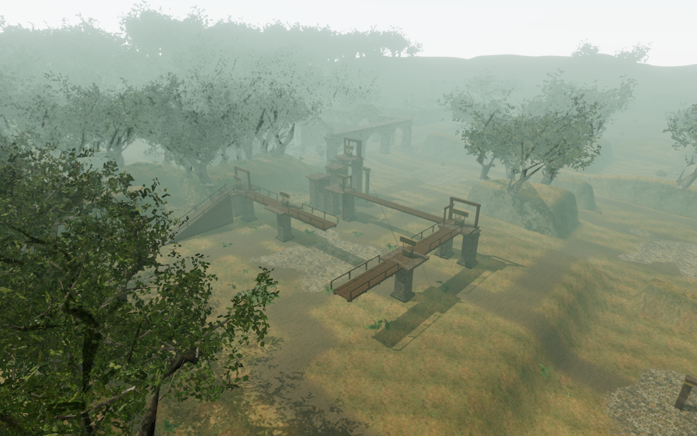
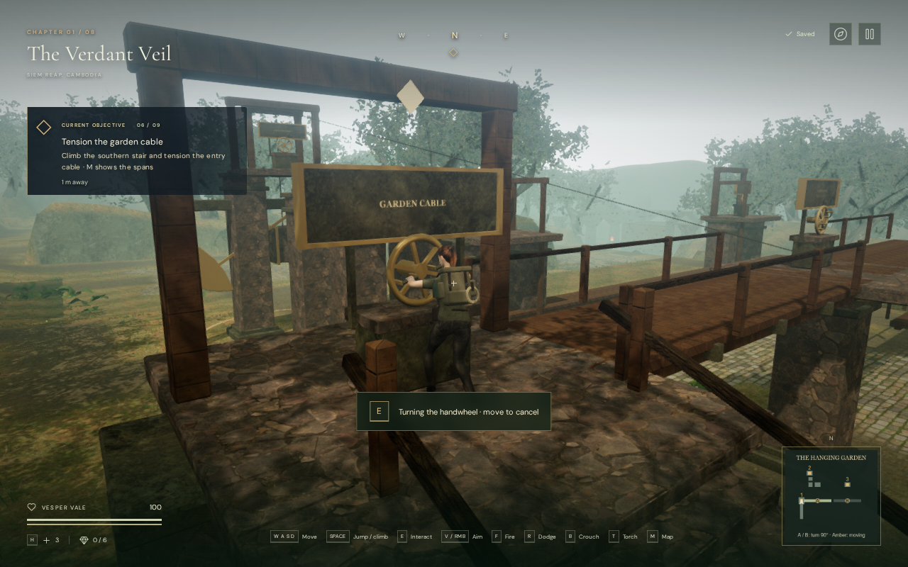
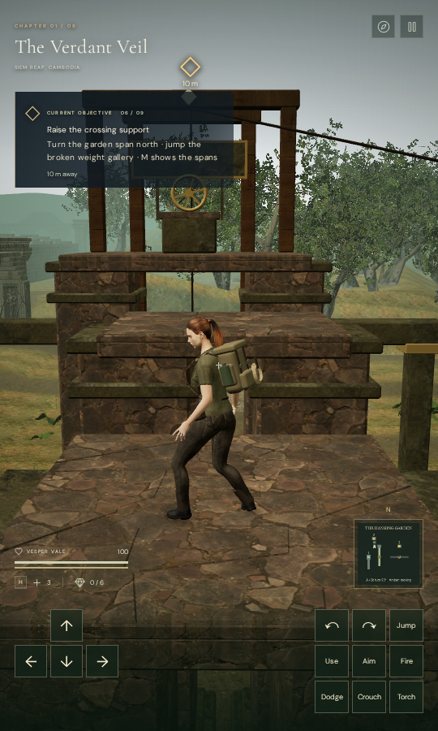

# The Hanging Garden

The sixth field mission in **The Verdant Veil** now joins its three winches
into a connected elevated route. Two rotating timber spans, a broken weight
gallery and a lifting return walk replace the three scattered interactions.

Climb the southern stair and tension the entry cable. Walk to the central
handwheel on span **A** and use **E / Use** to turn it north. Cross to the
stone gallery, then jump three broken steps to reach the counterweight winch
at 9.2 m. That winch raises span **B** four metres to the 6 m crossing height.

Return to A, turn it east–west, and jump the two-metre gap between the spans.
B's central handwheel turns its north end toward the final winch. Releasing
that winch raises the northern return walk. Cross back to the garden gallery,
recall A, then turn it east–west at its central pier and descend the entrance
stair. The existing sanctuary mechanism becomes available after the three
field actions are complete.

**M** displays the actual span orientations, broken steps, winch numbers and
player location. Amber indicates a moving structure. Landing wheels recall a
span; central wheels turn it 90 degrees. Prompts explain the next crossing and
show when a recalled span is already aligned. The route can be followed with
sound muted.

## Movement and saved progress

The spans turn over four seconds. A standing rider moves with the timber deck,
while the fixed central pier stays still. Side rails leave the pier's waiting
area clear throughout their sweep. Stone landings, piers, handwheel pedestals,
bridge undersides and rails take part in character and sight collision. The
camera retains the moving deck transforms. The southern stair uses 34 physical
risers below the character controller's step limit.

Vesper approaches the front of a wheel, reaches for its two grips, turns it to
a detent and releases. Moving away before the detent cancels the unfinished
action. A committed turn saves its destination; reloading completes that
movement and restores a supported landing. Pausing freezes the live motion.

The jungle's local-storage record keeps two span orientations and the last
fixed recovery landing. Field actions remain in their existing ordered save
records. An airborne save or a save on a moving deck chooses a fixed landing.
A missed crossing costs eight health and returns there. Older saves without
bridge data retain completed field actions; completed missions restore both
raised structures. Invalid old elevated positions recover to a clear landing.
Other chapters have no bridge state.

The scenery uses original project timber and masonry geometry, bronze bearings,
mounted instruction boards and cables that follow the raised structures.
A local terrain foundation and reserved rock-placement area keep the route
clear. It reuses the credited monastery wood, stone and bark materials and
existing original machinery synthesis; no external assets or dependencies were
added. See [asset credits](asset-credits.md).

## Sound and verification

Seven local machinery emitters sit at the two span drives, counterweight,
return drive and three field handwheels. They activate during their corresponding
motion, follow changing elevation and stop on pause. They share the existing
HRTF positioning, linear distance falloff, obstruction filtering and persisted
mix settings. The quiet jungle score requests its climbing arrangement around
the route and its winch arrangement during a handwheel action.

An offline Chromium render of the actual hoist buffer measured:

| Listener distance | Left-channel RMS before the game mix |
| --- | ---: |
| 2 m, near radius | 0.218780 |
| 15 m, falloff midpoint | 0.109390 |
| 29 m, beyond the 28 m range | 0 |

The measured midpoint is half the near amplitude. This is a signal check, not
a subjective listening assessment. The live browser also reported the local
handwheel voice during a turn, the winch/climb music tasks and no garden
machinery voices at rest or on pause.

The production build succeeds with Vite's existing large-chunk advisory.
All **566 automated tests pass**. New regressions cover ordered actions,
cancellation, paused movement, rotating rider support, fixed-pier clearance,
stair travel, obstruction, earned recovery anchors and legacy save handling.

All eleven production-browser cases pass against the release build, without a
development hook:

- Complete the entrance winch using the keyboard and reload its progress.
- Cancel an unseated turn by walking away.
- Pause during a turn and reload at the fixed entrance without completing it.
- Reload a committed span rotation at its target orientation.
- Complete the counterweight winch and reload during the support lift.
- Walk up the entrance stair using ordinary keyboard movement.
- Miss the gallery jump and recover on the earned landing at 92 health.
- Jump to the first broken gallery using simultaneous touch movement and Jump,
  with sound muted.
- Complete the last winch using touch, raise the return walk and open the map
  in a 540 × 900 portrait viewport without horizontal overflow.
- Load an older completed mission without new bridge state.
- Recover an older unsupported elevated save to the fixed entrance.

Each case compares the persisted chapter record again after reload, excluding
its last-played timestamp. The loaded bundles match `index-DhTbdH_T.js`,
`game-DRfsC8AY.js`, `three-DAmEZAsA.js` and `index-Cl7L-B9a.css`.
The assisted route and production checks reported no browser errors, warnings
or failed HTTP responses.

The overview and handwheel images are actual 1280 × 800 High captures. The
touch image uses Low at 540 × 900. Images were converted losslessly to WebP.
All three quality settings link their shaders. In the final wide view, the
whole scene submits the following work across its rendering passes:

| Quality | Draw calls | Submitted triangles |
| --- | ---: | ---: |
| High | 1,620 | 4,620,064 |
| Medium | 1,066 | 2,897,901 |
| Low | 584 | 1,315,367 |

These counts include the surrounding jungle and are not frame-rate
measurements. Changing chapters disposes all 70 tracked geometries, 15 materials
and 19 textures exactly once, clears the bridge state and removes all seven
emitters.

The continuous assisted route starts once on the ground outside the entrance,
uses ordinary movement, guardians, hazards and camera updates, completes all
three winches and returns down the stair at **100 health**. Navigation and
jump timing are supplied by the check; it is not a blind human playthrough or
a chapter-duration measurement. Its reusable movement helper is
[`verify-sun-bridge-browser.js`](../scripts/verify-sun-bridge-browser.js).

The new route adds a connected physical objective with backtracking and a
return shortcut. Approximately one-hour chapter pacing, modern AAA graphics,
subjective listening quality and broad browser/GPU coverage remain unfinished
production requirements.
