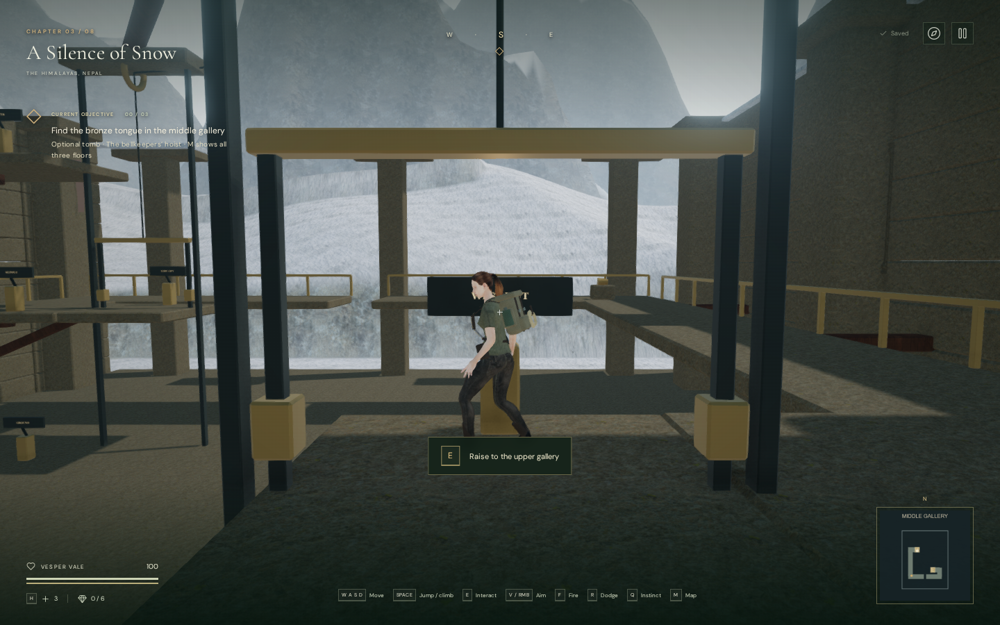
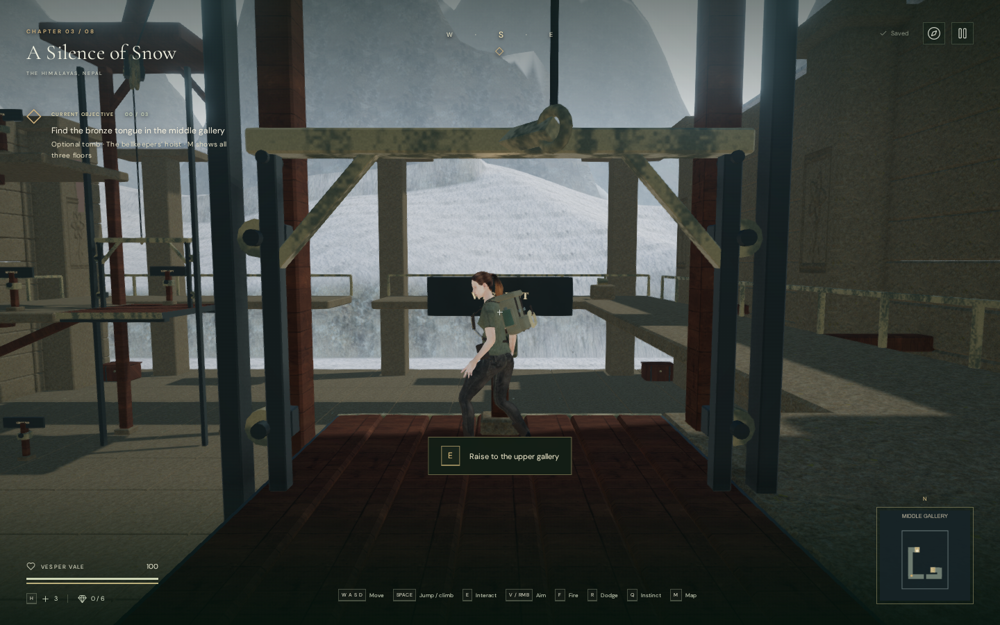
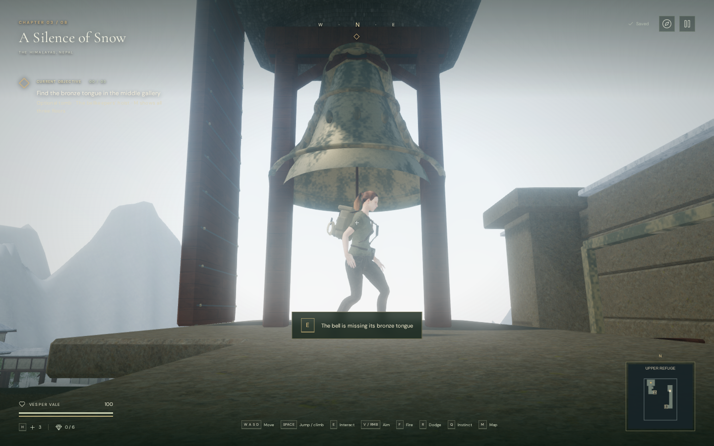

# Cargo machinery and refuge interior

The bellkeepers’ hoist now has fitted floor slabs, timber cargo decks, working
guide rollers and spoked overhead sheaves. Raised casting bands and a slate
canopy distinguish the refuge bell. Cargo chests, rolled blankets and a shelf of
ledgers give the hall and archive signs of their former use.

The following cargo-platform views use the same camera, 1440 × 900 viewport and
High setting. They are actual browser renders.

The floor has 221 separate bevelled slabs above a recessed stone bed. Narrow
joints expose the bed; the main walking height stays at 0.18 metres. Cargo decks
use seven thick planks, banded ends and riveted skids. Eight guide rollers turn
against the guide rails as the cars travel. Braced timber legs carry the overhead
headers independently of those rails.

Each fixed sheave frame holds a rotating spoked wheel with two rim cheeks and a
central cable groove. One upper cable follows the grooves and joins the two
shafts. Its straight vertical ends run from tangent points to the cars’ hanger
eyes. Cable endpoints remain attached throughout travel, while the opposite
platform motion preserves the total modeled cable length. This is a geometric
mechanism tied to the game’s lift state, not a rope-tension simulation.

Bronze now has original procedural patina and varying roughness. Timber, slate,
stone and snow use the already credited local monastery materials. The casting
bands, pivot and crown loops give the bell more detail, and its canopy provides
an architectural frame against the valley.

The wall carvings were previously embedded in their supporting piers. They now
sit on the visible inner faces. Lever posts have fitted bearings and connected
sign supports. Blanket benches, chests and the archive shelf occupy pockets
beside the walls; their solid bounds preserve the tested route through the tomb.

Small bolts, spokes, straps and furnishings batch by material. The active lever,
rotors, rollers, cable ends and removable bell tongue retain their own transforms
or visibility. Wind and drive sources use the existing audio system; the drive
emitters stay at the fixed visible sheaves, with the same motion and pause rules.

## Rendering workload

These matched views measure submitted triangles and draw calls, including active
rendering passes. They are not GPU timings or supported-device frame rates.

| View | Before: triangles / calls | After: triangles / calls |
| --- | ---: | ---: |
| Performance, loading hall | 156,308 / 76 | 188,588 / 93 |
| Performance, cargo platform | 154,418 / 68 | 186,618 / 83 |
| High, loading hall | 550,399 / 251 | 656,767 / 307 |
| High, cargo platform | 495,593 / 236 | 601,801 / 288 |

The additional geometry raises the workload. Batching the small hardware reduced
the first art revision’s extra calls while retaining the modeled parts. All four
observer positions—hall, platform, bell and archive—were checked in High and
Performance. The before/after camera positions and quaternions match exactly.
The procedural bronze shader linked in all checked views, without console
errors, warnings or failed assets.

Use [`inspect-hoist-art-browser.js`](../scripts/inspect-hoist-art-browser.js) to
reproduce the prepared observer views in a disposable development chapter.
These views set progress and positioning for inspection; they do not constitute
a playthrough.

## Playable verification

All **341 automated tests pass**, and the production build passes with the
existing Three.js chunk-size advisory. Four added art checks cover the upper
cable's joins and groove path, continuous endpoint attachment and conserved
length, retained rotor/lever/tongue transforms, guide contact, header clearance,
pause, finite geometry, floor heights and solid furnishings. The existing
complete movement and persistence checks continue to pass.

A continuous assisted browser route started on the library trail, used native
E and Space through both lifts and the middle jump, recovered the archive and
returned to the trail at 100 health. Movement directions and the solution were
supplied by the check; this does not measure unassisted chapter duration.
Portrait 390 × 844 touch Use raised a supported rider to the middle landing.

Live audio checks matched both emitters to the fixed sheaves exactly, selected
the lifting arrangement during travel and the resonance arrangement afterward,
and silenced drive voices at rest and on pause. The actual generated drive
buffer retained half amplitude at 13 metres relative to 2 metres, and silence
at 25 metres, beyond its 24-metre range. This is signal verification, not a
subjective listening assessment. A chapter change disposed all 76 inspected
geometries and 17 materials and cleared the tomb and its three emitters.
Completed development checks reported no JavaScript errors, warnings or failed
assets. An earlier browser route process closed during loading, and a concurrent
test process was terminated; separate reruns completed successfully.

The final production build passed native E interaction with interrupted and
completed lift rides. Reload restored the ground landing at 0.18 metres and the
completed middle landing at 5.78 metres. A separate prepared archive fixture
recovered its register, restored the elevated 11.38-metre position, and retained
the story in the journal after reload. Both fixtures retained 100 health. The
development hook was absent and no JavaScript errors, warnings or failed assets
were reported. These fixtures verify production interactions and persistence;
the continuous route was checked separately in development. Checked bundles:
`index-Kd-W1JPW.js`, `game-CSdNtGu4.js`, `three-ByVpHOu1.js` and
`index-n9zm2e6h.css`.

This improves the prototype’s machinery and environmental detail. The requested
modern AAA visual standard remains unmet, and the approximately one-hour chapter
target still requires content development and human pacing trials.
