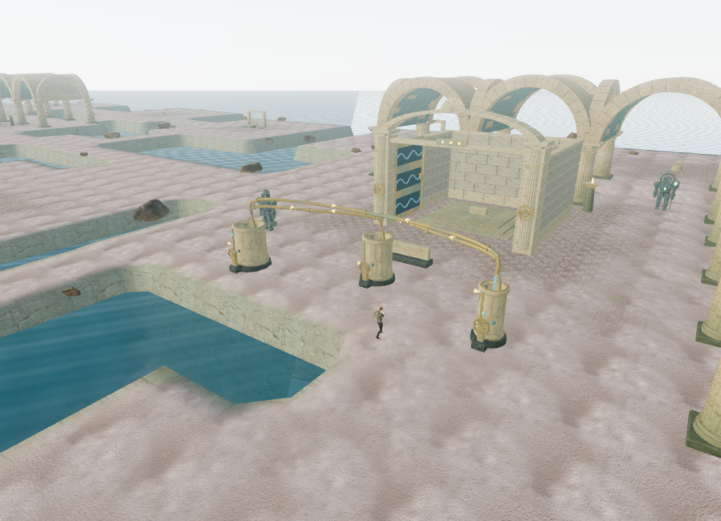
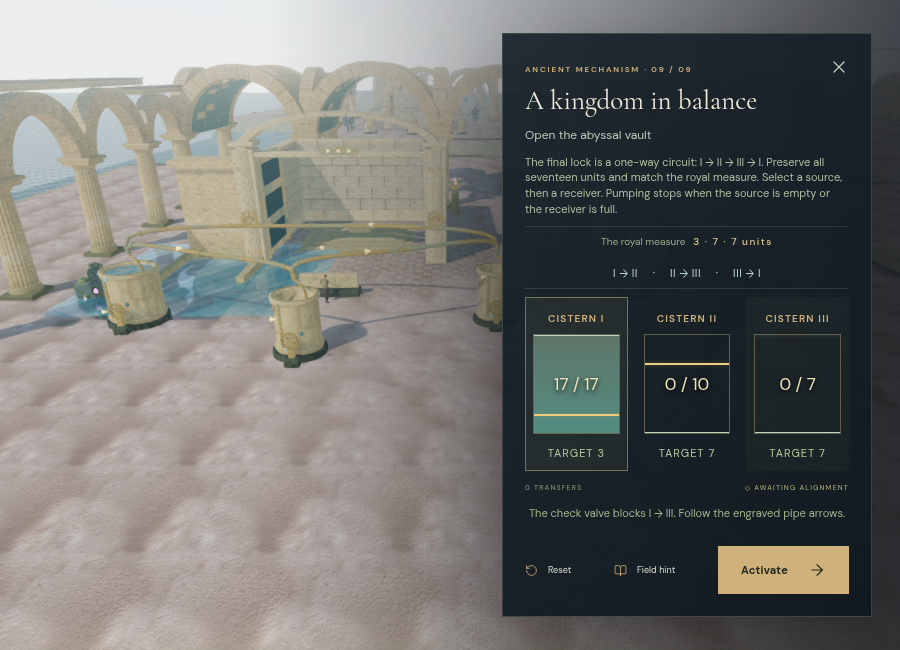
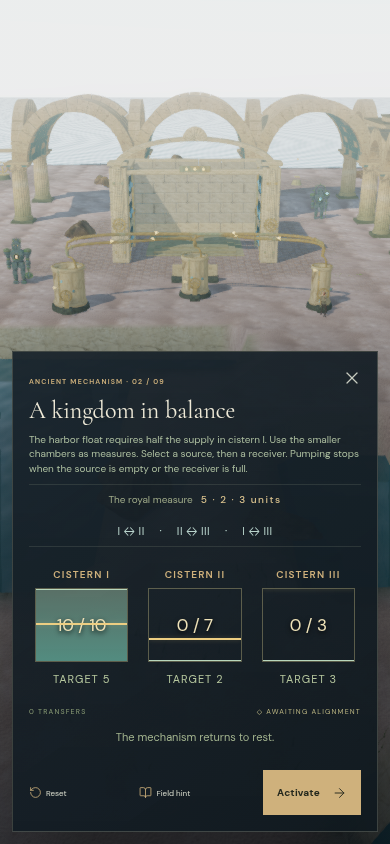
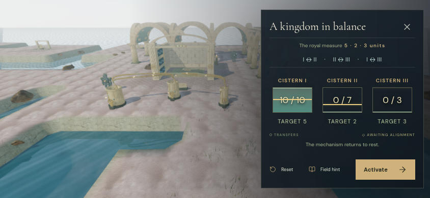

# Hydraulic courts

The Drowned Kingdom now has nine physical hydraulic circuits. Their 27 open cisterns, handwheels, overhead pipes, floats and engraved target gauges replace the repeated fixed-capacity vessel puzzle. The existing island courts, field stations, first counterweight chamber and reservoir drainage remain connected to chapter progression.

## Nine measures

Each circuit conserves its initial supply. Selecting a source and a receiver pumps water until the source is empty or the receiver is full. Early courts allow all six directions; later courts introduce check valves and finish with a one-way circulation loop. Every reachable state can still reach its target, so an unsuccessful experiment cannot permanently trap the player.

| Court | Capacities I / II / III | Target measure | Shortest solution | Pipe restrictions |
| --- | --- | --- | --- | --- |
| The shore measure | 8 / 5 / 3 | 4 / 1 / 3 | 7 transfers | All directions |
| The harbor balance | 10 / 7 / 3 | 5 / 2 / 3 | 9 transfers | All directions |
| The coral pump | 12 / 7 / 5 | 6 / 1 / 5 | 11 transfers | All directions |
| The tidekeeper’s return | 9 / 5 / 4 | 3 / 5 / 1 | 12 transfers | III → I blocked |
| The isolated intake | 14 / 9 / 5 | 8 / 1 / 5 | 20 transfers | II → I blocked |
| The arcade counterflow | 11 / 7 / 4 | 3 / 4 / 4 | 18 transfers | III → II blocked |
| The queen’s circulation | 16 / 9 / 7 | 2 / 7 / 7 | 28 transfers | I → II → III → I, plus II → I |
| The pressure reserve | 13 / 8 / 5 | 3 / 5 / 5 | 22 transfers | I → II → III → I, plus I → III |
| The abyssal lock | 17 / 10 / 7 | 3 / 7 / 7 | 30 transfers | I → II → III → I only |

These are solver lengths, not measured play durations. They establish different mechanisms and increasing solution depth; they do not establish an hour of play in this chapter.

Each court has a different shallow triangular arrangement. Its three pumps and tablet sit on clear ground beside the sanctuary. Press **E**, or **Use** on touch, at a pump to select it, then use a receiving pump. Selecting the source again cancels. Empty sources, full receivers and blocked pipes give specific feedback without charging a transfer. The tablet explains the circuit, resets its supply, opens the focused controls, or activates the pressure receiver after all three measures match.

The focused controls share the same unfinished state and water animation as the physical pumps. They show current quantities, capacities, targets, permitted routes and selection state. Field hints search from the current measure using that court's actual check valves. Controls reject overlapping commands while a transfer is visible. The mobile layouts retain both the cistern view and the controls.

## Water, movement and persistence

Cisterns use closed round, fluted or faceted bowls with thick rims and visible interiors. Their cross-sectional area scales with capacity, including a polygon correction for faceted bowls: one unit represents approximately 0.6 cubic metres in each vessel. Water levels and floating gauges rise together. A receiving nozzle produces a falling stream and expanding surface ripple; rotating wheels and brief hand poses accompany pump operation.

Transfers use a smooth interpolation that preserves the total volume throughout the animation. A valid command immediately saves its resulting integer measure, move count and selected source under `levels.tides.hydraulics`. Pausing or reloading settles that committed command to its destination and leaves the machinery silent. Completed courts restore their target measures without replaying motion. Invalid, over-capacity, noninteger or unreachable saved measures are rejected; older saves without hydraulic data begin with the full initial supply in the current court.

The small cistern surfaces are separate from the chapter's swimming reservoirs and planar-reflection selection. Bowl collision prevents walking through the tanks. Thin camera proxies follow the overhead pipe spans without filling the air beneath them. Pump hand anchors remain attached after static geometry batching. Decorative collars and signs have a shorter visibility distance than the structural bowls and pipes.

## Positional sound and music

Each cistern has a front pump source and a separate falling-water source, for **54 registered sources**. Only the sending pump, receiving pump and receiving outlet sound during a transfer. The outlet follows the middle of the visible falling stream as the water rises. Locked, restored and resting circuits are silent.

These sources share the existing **12-voice environmental budget**, HRTF panning and obstruction filtering. Pump sound fades linearly from **1.5 to 24 m**; falling water fades from **1.5 to 26 m**. The palace's quiet glass score continues at its existing restrained mix, using the valve objective arrangement during transfer and ducking for the focused puzzle.

An isolated offline Web Audio check used the actual source definitions, the same source buffer and start phase at each distance, a 0.18 output gain, and stereo RMS sampling from seconds 1–3 at 48 kHz. The pump used its runtime activity of 0.75; the outlet used activity 1.

| Source | Near RMS at 1.5 m | Midpoint distance | Midpoint RMS | Beyond outer radius |
| --- | --- | --- | --- | --- |
| Pump | 0.00372079 | 12.75 m | 0.00186039 | 0 at 25 m |
| Falling water | 0.00699270 | 13.75 m | 0.00349635 | 0 at 27 m |

Both midpoint signals are half their near-field amplitude. These are signal measurements, not subjective loudness ratings or calibrated speaker measurements. Broader listening and device evaluation remains necessary.

## Verification

Eleven hydraulic tests cover all nine finite-state circuits, reachability from every possible measure, validation of saved quantities and selections, geometry and volume, physical control clearance, hand anchors, pipe camera clearance, readiness/reach rules, conserved animation, source positions and silence, all 157 shortest-route transfers through world interaction, paused presentation without field simulation, save restoration, focused camera framing and chapter cleanup.

Actual browser checks found clear sampled positions at all **36 controls**, clear front sound paths at all **27 pumps**, and approaches to all **59 original non-guardian chapter features**. The character completed **36 assisted local routes** between tablets and pumps using the real movement physics. An initial layout placed six controls beyond narrow island edges; moving the rows inward resolved those obstructions.

Native keyboard E selected cistern I and transferred three units into III in the harbor court. Local storage immediately contained `[7, 0, 3]`, one transfer, and then a separately selected cistern III. Focused controls exercised transfer, busy rejection, reset, invalid submission and the final circuit's blocked I → III route. All nine courts completed through their physical interaction handlers and the actual tablet activation button, advancing and saving stage 9. Field prerequisites and positions were supplied by the verification script, and transfer time was stepped explicitly; this is assisted integration evidence, not a blind playthrough.

The focused controls fit 900 × 650, 390 × 844 and 844 × 390 layouts without internal or horizontal overflow. Low and High views linked their shaders. The High harbor overview submitted 708 render calls and 1,435,535 triangles across its rendering passes. The High harbor focus view submitted 996 calls and 1,975,073 triangles; the Low overview submitted 197 calls and 342,722 triangles. These counts include different quality passes and camera workloads. The browser uses ANGLE/SwiftShader software rendering, so these checks do not establish a hardware frame rate.

All **205 tests** passed in 69.41 seconds, and the production build passed. The existing large Three.js chunk advisory remains. The release includes `index-Cn3RZpH5.js`, `game-CRLC3-_O.js` and `three-DktUI9aM.js`.

The High production build restored `[7, 0, 3]`, one transfer and selected pump III. Native E cancelled and reselected that pump, and native W moved the explorer from `(359, 92.38073886745423)` to `(358.70332807872313, 92.33617687551191)`. The paused save retained the selection, field progress and 212.66130000001192 active seconds. The first E arrived before the first active frame had established a nearby target and produced no interaction; the check then used the visible pump prompt. There was no production development hook, and no loaded resource reported an HTTP error.

A subsequent production reload restored the exact position, 212.66130000001192 active seconds, stage, three restored field stations, cistern quantities, transfer counts and selected pump. The check held a required palace texture, moved focus away, then released loading so the saved expedition opened paused without accumulating more play time. The production console reported no warnings or errors. Both development and preview test saves were cleared, and both launchers were left on chapter one with High quality selected.

The requested AAA graphics and approximately one-hour chapter pacing remain open requirements. The screenshots and assisted checks above document a playable prototype improvement, not those acceptance targets.

## Files and provenance

- `src/hydraulic-rules.js` — authored measures, directed transfers, reachability, hints and save validation.
- `src/hydraulic-geometry.js` — original bowl profiles, volume scaling, engraved plaques and falling-water shader.
- `src/hydraulic-courts.js` — physical controls, water animation, collision, hand anchors, sound positions and focus camera.
- `scripts/verify-hydraulics-browser.js` — repeatable browser placement and local movement checks.
- `tests/hydraulics.test.js` — rules, scene and integration regressions.

Geometry, plaque artwork and the transfer shader were authored in this repository. The courts reuse the existing palace stone and mosaic textures, original patinated bronze material, water surface material, procedural machine texture and bundled water recording. No new third-party assets or remote runtime services were added. Sources for the reused materials and recording remain in [asset credits](asset-credits.md).
