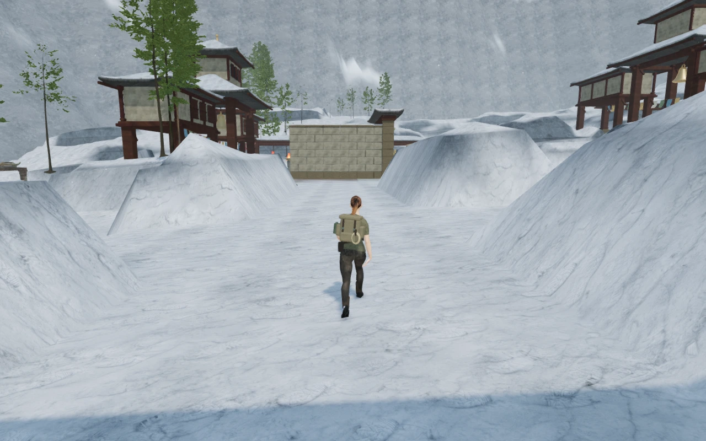
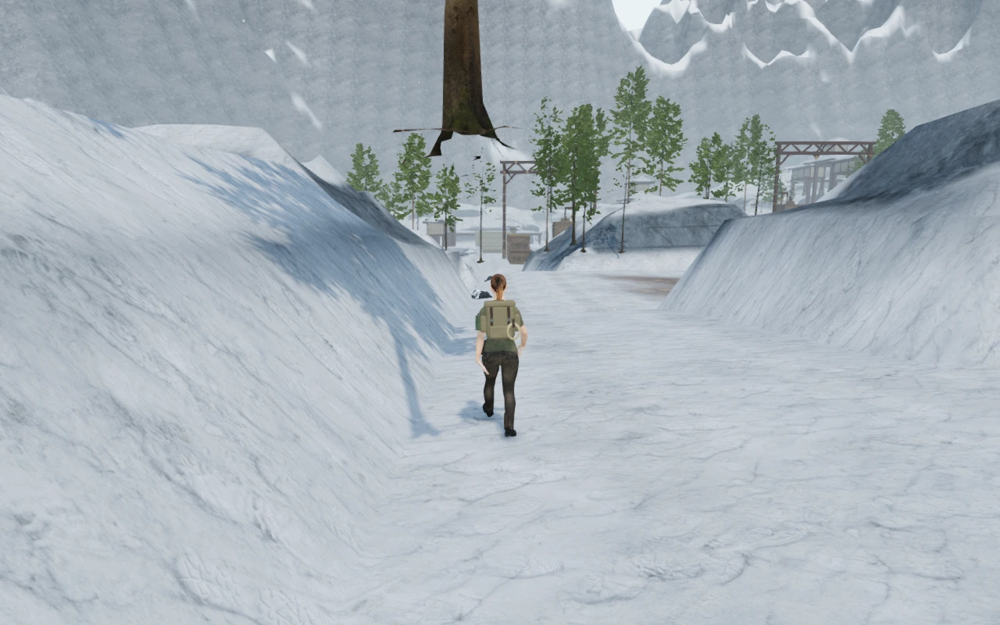
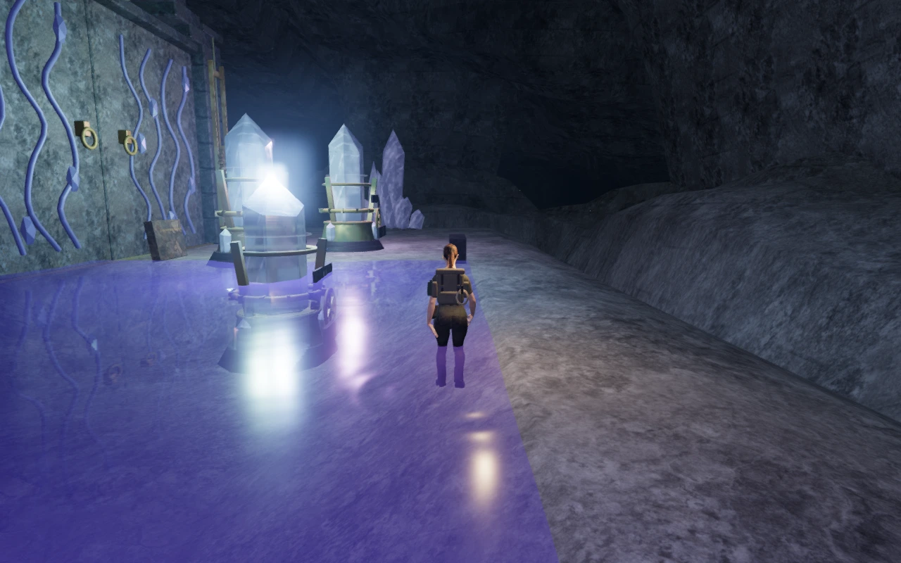

# Initial court approach and return review

The next part of the playable-world audit follows the initial route from each
chapter's arrival position to the first mechanism court and back. It uses the
ordinary character controller and follow camera, with an assisted path search
and no teleporting between route waypoints. The survey was captured at commit
`7c85f24`, before the subsequent [jungle chamber wall improvement](jungle-chambers.md).

Seven chapters complete both legs at health 100. Their **14 legs cover 2,341.6 m**
of measured character travel and **164 reviewed High captures** at 1280 × 800.
The path finder does not find a complete ground route for the sky chapter. Its
raised bridges need a traversal-aware review; this result alone does not show
that its playable route is blocked.

| Chapter | Outward travel | Return travel | Reviewed captures |
| --- | ---: | ---: | ---: |
| The Verdant Veil | 154.0 m | 154.3 m | 22 |
| Beneath the Sands | 124.1 m | 123.8 m | 18 |
| A Silence of Snow | 259.9 m | 259.1 m | 34 |
| The Drowned Kingdom | 156.5 m | 156.6 m | 22 |
| A Heart of Embers | 210.0 m | 210.8 m | 28 |
| Where Eagles Sleep | Ground search incomplete | Not attempted | 0 |
| The Night Below | 159.6 m | 161.4 m | 24 |
| The Last Meridian | 105.7 m | 105.6 m | 16 |

The route helper steps movement and camera motion at 60 Hz, updates nearby
scenery and lighting, and captures spaced points along each leg. It does not
advance enemy AI or combat. It excludes water deeper than 1.1 m from its search,
but some paths cross shallows. These are local circulation and visual checks;
they do not establish complete chapter playthroughs or human pacing. Shaders
link and the browser reports no errors or warnings.

## Observations requiring work

The temple's plain chamber walls dominated the jungle approach and prompted the
carved wall change. Plain desert and monastery chamber sides remain conspicuous,
and several other chapters have long sparse stretches between repeated
structures. These observations continue VA-05 and VA-12.

**VA-15: abrupt terrain forms.** The jungle, snow, volcanic, crystal and eclipse
approaches contain repeated steep-sided mounds with sharply defined shoulders
and broad flat faces. They often read as terrain cells rather than natural
banks or rock formations. The snow view below is one example. Improve their
shapes and transitions while rechecking the routes, structures and vegetation
that depend on those heights.

**VA-16: tree-base gap.** A close trunk appears to end in open air above the snow
route. The observation occurs with the player near `(135.65, 15.32, 74.47)` and
camera near `(129.93, 17.53, 74.35)`. Inspect the actual tree transform, its base
geometry, terrain contact and visibility transitions before deciding the cause.

The subsequent [individual fir placement repair](fir-grounding.md) resolves
VA-16. The image above preserves the original observation.

**VA-17: rectangular pool edges.** The first crystal and eclipse court views
expose conspicuous straight water-sheet boundaries against the terrain. Inspect
the full perimeter heights and basin geometry, then repair the affected shores.
This observation does not yet establish a measured floating-surface gap.

The reusable helper is
[inspect-court-routes-browser.js](../scripts/inspect-court-routes-browser.js).
Full route traces, raw captures and disposable browser state remain in ignored
local staging. The three images above are intentional public evidence. They
record unresolved findings, not completed art. This initial route survey covers
only part of the [open playable-world audit](visual-audit.md).
