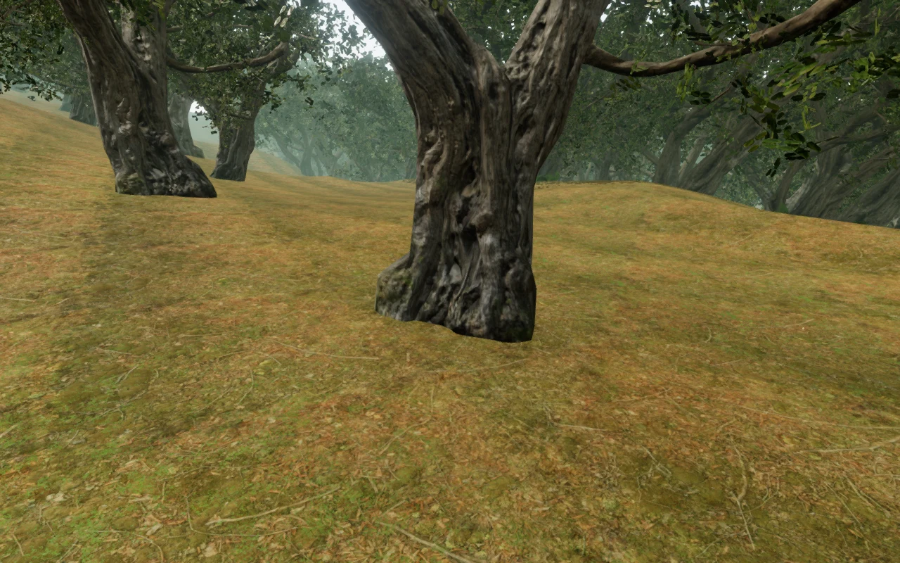
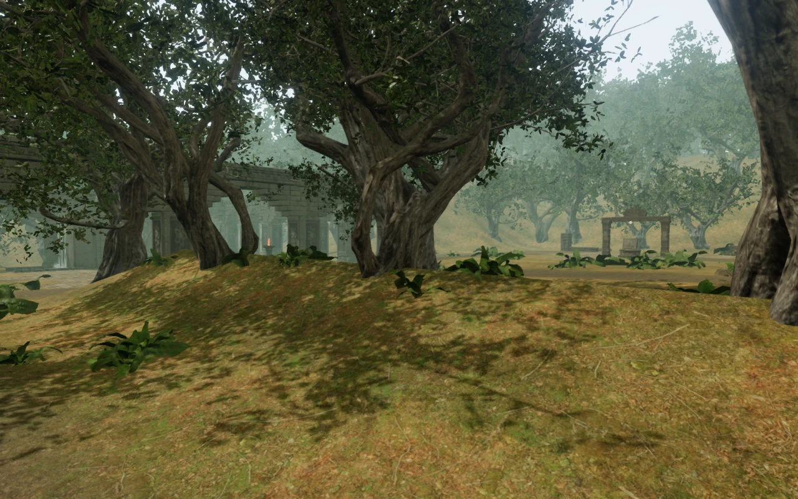

# Jungle bark follows the scanned trunk

The narrow band of horizontally stretched bark recorded in VA-24 is removed.
The previous position-only mesh reduction had collapsed texture-chart seams and
created large triangles that sampled the striped padding between bark islands.
It also removed much of the scanned root flare. The source texture images were
intact; the defect came from the reduced geometry and its texture coordinates.

The repair starts from the credited original trunks, retains their vertices,
normals and UVs, and weights normal/UV error during reduction. It locks texture
chart boundaries by vertex index. Where a proposed reduced face still crosses
atlas padding, nearby source vertices remain fixed and the reduction repeats.
Each face is checked at every covered pixel centre and at half-pixel steps along
its edges against a 1024-resolution source coverage mask, allowing one pixel for
filtering. Both species converge without a detected padding crossing.

The [earlier outer-bank capture](images/jungle-roots/outer-bank.webp) records the
visible defect. The new capture uses the same observer location with the repaired
models and their recalculated root footprints.

## Geometry and rendering cost

All three distance tiers share the same repaired trunk. Branches, leaf cards,
texture image bytes, node transforms and normalization metadata match their
previous input signatures. Existing root placement recalculates its footprint
from the delivered models and retains **752 interior and 1,046 outer trees**.

| Trunk | Original source faces | Previous near / middle / distant | Repaired faces in each tier |
| --- | ---: | ---: | ---: |
| Island Tree 01 | 34,787 | 1,912 / 672 / 304 | 9,931 |
| Island Tree 02 | 27,298 | 1,500 / 214 / 146 | 5,836 |

The six GLBs grow by **1,209,724 bytes** in total. Retaining the seams and root
shape increases vertex work, particularly in distant stands. The twelve sampled
forest views submit **1.38–3.52 million triangles at Low** and **2.63–9.89 million
at High**, including the renderer's passes. These are workload counters, not
frame-rate measurements or a consumer-hardware performance guarantee.

## Verification

- **651/651 tests pass**; production build succeeds with the existing bundle-size
  advisory. New cases cover separated UV islands, thin faces, narrow interior
  atlas gaps, invalid coordinates, indexed seam boundaries and all six delivered
  trunks. Tests also verify unchanged leaf/branch buffers, texture images,
  transforms, normalization and identical trunk geometry across tiers.
- The actual-world root inspector checks **1,085,912 lower-trunk vertices across
  4,348 tier/instance combinations**. No sample lacks support, and the highest
  sampled margin is −0.07999989 m. All interior root circles clear reserved paths.
- Twenty-four Low/High forest captures cover eight interior and four outer-bank
  locations. A further 24 isolated trunk views cover four sides of both species
  in all three tiers. All were reviewed. The isolated views use simple inspection
  lighting and are not gameplay screenshots.

- Assisted walks with the actual controller and follow camera cover **154.04 m
  outward and 154.26 m back**, arriving with health 100. All 22 route captures
  were reviewed. Native production keyboard/High and touch/Low checks add four
  walks of **6.20–18.55 m** and four reloads preserving the whole save except
  play timestamps, including camera state. Health remains 100. All six native
  captures were reviewed; there are no browser errors, warnings or camera
  adjustments, and the production game exposes no development hook.

The build is reproducible with `node scripts/rebuild-tree-bark.mjs` after the
ignored original downloads and the leaf reconstruction are available. The script
checks the original input hashes, prepares and validates all six outputs before
writing them, and updates both delivery manifests. Tests use the intentional
compressed coverage fixture in the [bark provenance](../asset-sources/tree-bark/sources.json),
so a normal clone does not need raw downloads. See the [license record](../asset-sources/tree-bark/LICENSE.md)
and [asset credits](asset-credits.md).

This fixes the recorded trunk defect and its reduction mechanism. It does not
establish full-world visual completion, playthrough duration, subjective audio
quality or AAA parity. Fixed court terraces, repeated forms and sparse areas
remain in the [visual audit](visual-audit.md).
