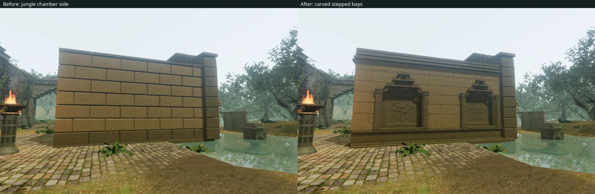
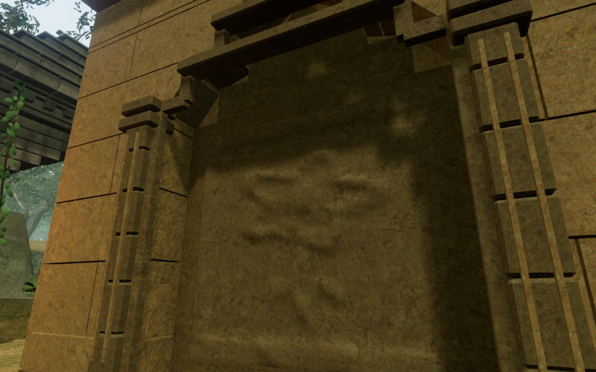

# Carved jungle gate chambers

All eight jungle gate chambers now carry the temple's stepped stone construction
around their sides and backs. Their 24 exterior faces contain 56 recessed bays
with botanical carvings, jointed pilasters, narrow mouldings and corbelled heads.
Two or three bays fit each wall, with the arrangement and carving varying by
stage and side. Smaller carved panels face into the rear of each chamber.

The approach review exposed the former plain block walls beside the much more
detailed temple piers. Matching views show the replacement:

The masonry courses follow the stepped aperture. Each carving is a closed
stone plaque: its sculpted face joins its sides and a back embedded in the wall
core. The backing seals the recess, including the joints around the surround.
The mouldings remain within the existing movement boundary. Foundations now
sample the full 1.6 m wall footprint and extend below the surrounding terrain.

The geometry uses the existing temple textures and original botanical relief
function. It batches with the gate's material groups and retains captured camera
surfaces. No new external asset, dependency or sound recording is introduced;
existing [asset attribution](asset-credits.md) remains in place.

## Verification

All **632 tests** pass, and the production build succeeds with the existing
large-chunk warning. The regional chamber regression now covers **129 walls**,
including all 24 jungle faces, for sealed recesses, retained camera depth and
**1,935 foundation samples**. The other chapter wall cases remain included.

The rendered review covers **56 views**: 24 exterior faces, eight open interiors,
three Low exterior views, three intermediate-state interiors, ten gate entrance
views spanning five opening positions, and eight close High/Low carving views.
All observers used for wall details have clear supported positions. Entrance
state views use an elevated inspection camera. All images were reviewed in
labeled sheets, with selected wall and interior views inspected at full size.
Shaders link without browser errors or warnings.

All eight restored gate thresholds and 54 sampled feature approaches remain
clear. All 16 existing gate-drive emitters retain reachable unobstructed listening
positions in their surrounding 3–7 m rings. The first counterweight chamber
completes its 14-move solution through the real movement and stone-grip code.
These are assisted geometry and interaction checks, not unassisted progression.

The final jungle approach and return also complete after the change, covering
154.0 m outward and 154.3 m back at health 100. Another 22 reviewed follow-camera
captures show the walls in their surrounding route. The route helper advances
ordinary movement without stepping enemy AI or combat.

Four native production cases exercise forward and backward movement beside the
first and last chambers: keyboard at High and portrait touch at Low. Health
remains at 100. Eight reloads preserve every normalized save field apart from
timestamps and one camera-only arrival correction. Independent geometry checks
show that the requested orbit for that case is obstructed at 4.91 m; its adjusted
heading reaches the full 5.33 m orbit. All other reload camera angles match.

The production checks confirm the final bundles, absence of the development
hook, no page overflow, and no browser errors, warnings or failed requests. The
tested JavaScript bundles are `game-BlRfwUhC.js`, `index-WKlzgHt8.js` and
`three-DQZTZ_dW.js`. Raw saves, browser profiles, logs and captures remain in
ignored local staging.

## Remaining world work

This extends the wall treatment within VA-05. The chambers still share their
underlying footprint. The [initial court route survey](initial-court-routes.md)
records sparse stretches, abrupt terrain shapes, a suspended-looking tree base
and conspicuous rectangular pool edges that need further investigation and
repair. The [playable-world audit](visual-audit.md) remains open. These checks
do not establish overall graphics completion, human chapter duration, subjective
listening quality or consumer-device performance.
