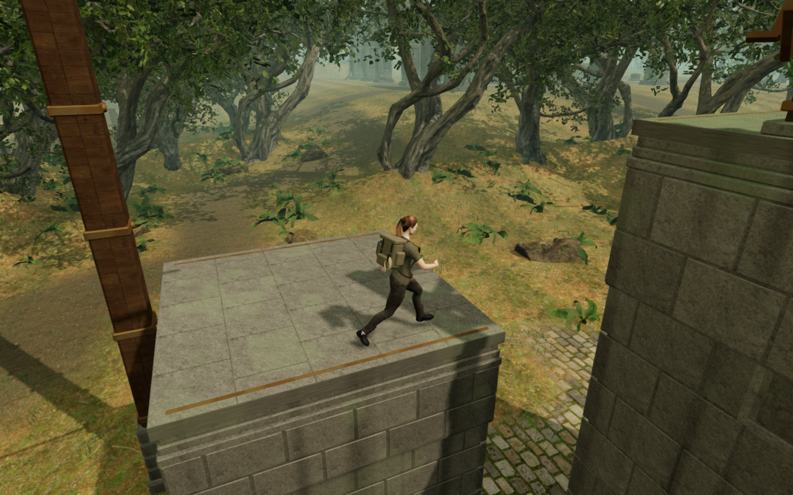
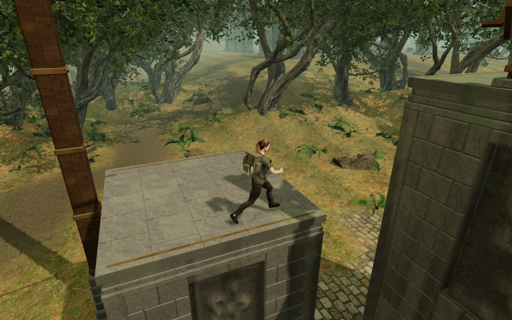
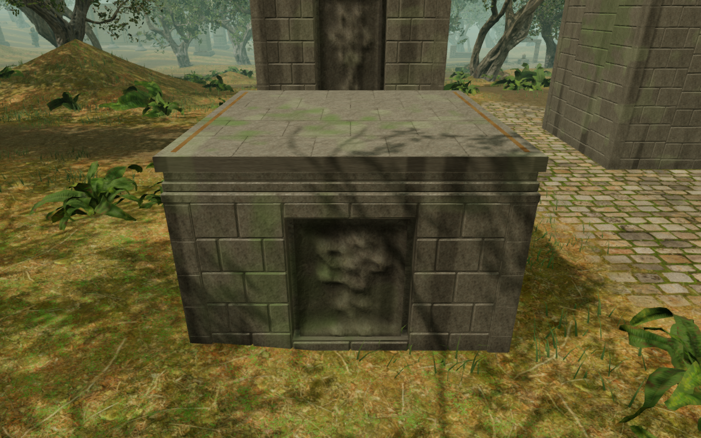

# Jungle climbing piers

The Verdant Veil's five climbing piers now carry recessed botanical reliefs
within dressed stone borders. Twenty closed panels replace the plain wall
grid and small decorative bars on their four faces. Jointed masonry wings,
corner stones and damp surface staining connect the route with the surrounding
sanctuary architecture. The reliefs have broader ridges and darker recesses so
their plant forms remain visible in canopy shade.

The facing stays inside each existing pier solid. Closed corner bearings,
wall backing and a buried full bearing bed support the surface joints and
panel edges. The complete standing roofs, coping bands, bronze landing markers,
rope mounts, terminal frames and return cable preserve their geometry, support
heights and construction seed sequence. The artwork reuses the project's
original temple carving generator and credited local stone maps; see
[asset attribution](asset-credits.md).

All 802 automated campaign checks across 122 files pass without failures,
cancellations or skips, including the sixteen climbing construction, contact,
camera and sound-source checks. The production build passes with its existing
bundle-size advisory. The fixed/detail geometry uses 154,524 vertices, and the
complete course uses 176,914 vertices within its existing 180,000-vertex limit.
Hidden corner faces are omitted where the continuous bearing already closes
the joint.

The browser construction observer checks all five piers through 2,205 roof
rays, 605 underside rays and 180 backing rays across the twenty panels. Every
sample meets stone. The largest roof difference is 5.000 mm at a recessed
paving joint; the highest sampled underside is 210.000 mm below queried ground.
The sampled panel surfaces sit 123.627–242.767 mm behind the outer pier face.
All twenty-one High construction views and two Low views are reviewed.

The complete assisted jungle loop retains health 100 and full camera opacity
through 4,308 updates of walking approach, mantles, jump, rope crossing, summit,
animated return cable and ground return. All 57 final captures are reviewed.
Their recorded movement, chosen look angles, camera positions and traversal
states match the preceding construction exactly; draw counts and submitted
triangles change with the new artwork. The completed-expedition fixture uses
one supported starting placement and does not advance enemy AI or combat.
The wider baseline survey also completes both desert climbing loops; all 174
jungle/desert approach, crossing and return captures are reviewed. Desert pier
repetition and broader landscape composition remain open.

Both keyboard/High and portrait touch/Low production cases climb the first
2.8 m roof, crouch and look on it, then descend to ground through native input.
Health, progress and explored cells remain intact through complete-store
reloads. The keyboard departure save changes its camera heading by 15 degrees
on first arrival. An independent replay shows the saved ray shortened to
5.143 m and the selected orbit retaining its full 5.372 m arm at a legal player
position. The subsequent complete store remains stable apart from chapter
timestamps. The touch case retains its saved view. Loaded bundles
match the final build, with no development hook, browser errors, warnings,
failed resources or horizontal overflow. All fourteen native captures are
reviewed.

The lossless summit images use matching captured poses; the last image is a
separate construction observer. The basic five-pier layout still repeats.
Broader campaign visual coverage, discovery and court composition, subjective
sound and music review, and browser/device acceptance remain open. Positioned
hoist sources and the quiet climbing arrangement retain their existing
movement and distance behavior.
