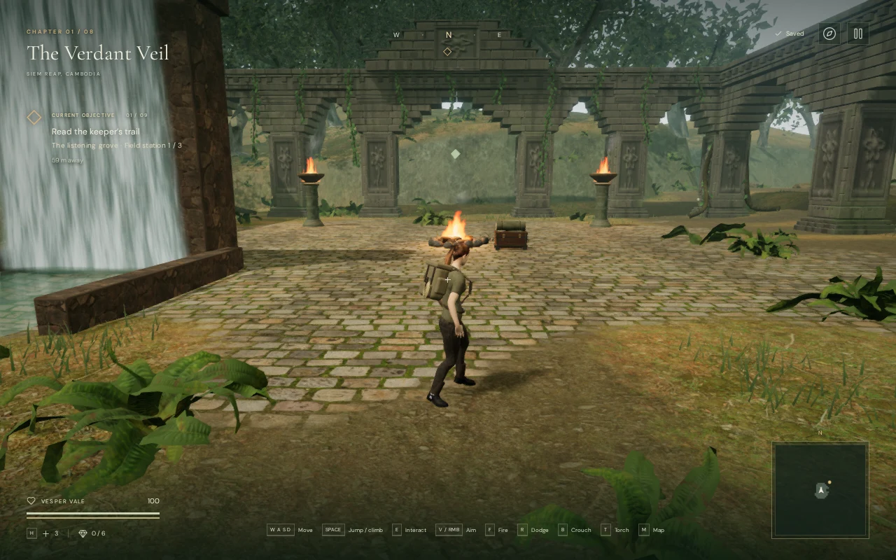
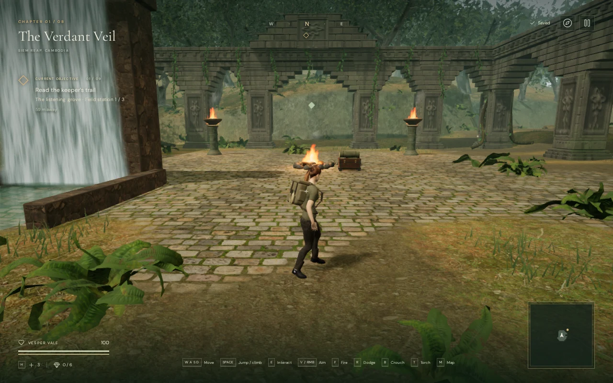
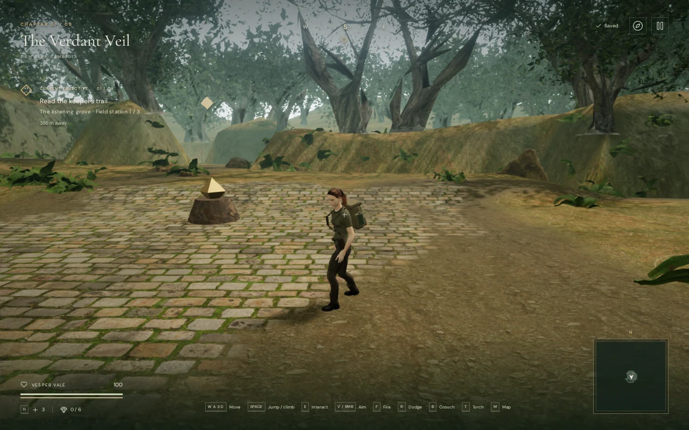
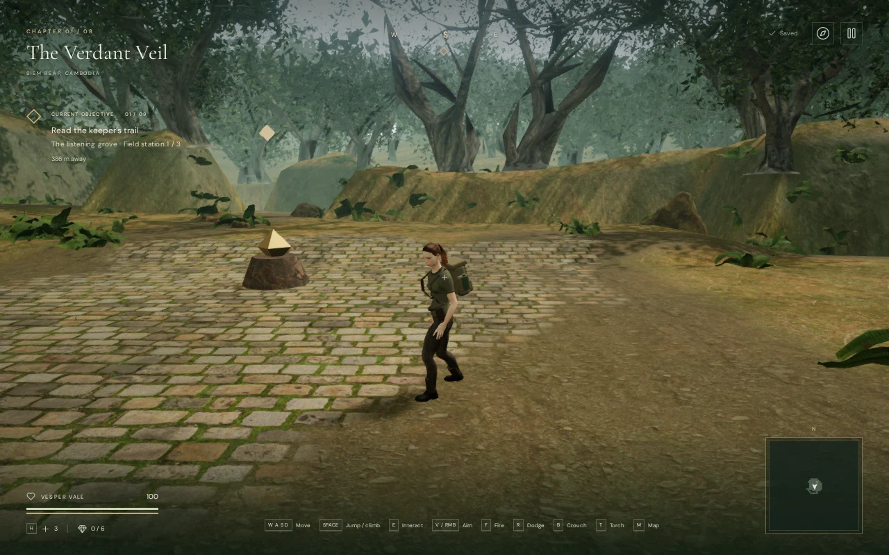

# Forest beyond the jungle boundary

The Verdant Veil previously ended at the edge of its terrain mesh. Views through some northern ruins exposed empty sky behind the last grassy hills. The chapter now has an outer bank and 1,048 additional trees, giving these sightlines a wooded background.

The bank meets every existing terrain-edge vertex and extends 140 metres outward. Its four sections share their corner vertices, reuse the jungle ground material, and roll into low wooded hills. Tree roots sit 20 centimetres below the actual rendered triangles; sampling only the analytic height would leave gaps above the wider outer rows.

All additional trunks stand 9–99 metres outside the map. The original 783 woodland placements, playable terrain heights, route grid, objectives and sound landmarks are preserved. This scenery does not extend the playable level or add campaign duration.

## Matching views

These High-quality browser comparisons use the same scene, camera and animation state. The earlier appearance is reconstructed by hiding only the added bank and trees. A temporary capture style hides the unrelated toast.

Camp, before:



Camp, after:



Southern clearing, before:



Southern clearing, after:



The trees reuse the credited Island Tree 01 and Island Tree 02 meshes and textures. Their existing distant approximations remain visible, including simplified leaf shapes. This is an environment-composition improvement; the requested AAA visual standard remains unmet.

## Rendering cost

The bank adds 21,472 triangles across four meshes. Trees use 178 spatial patches, shared source geometry and the existing wind/dither system. High uses the middle tree mesh within 55 metres and the distant mesh out to 275 metres. Balanced uses 38/255 metres; Performance uses the distant mesh out to 235 metres. The normal 300 ms transitions and 3 metre hysteresis apply. Outer trees receive lighting but do not cast directional shadows or enter the contact-occlusion pass.

At 1280 × 800 and pixel ratio 1, the matching views submitted the following whole-scene work, including rendering passes:

| View | Quality | Triangles before → after | Draw calls before → after |
| --- | --- | ---: | ---: |
| Northern ruin | High | 1,908,269 → 2,289,657 | 385 → 469 |
| Camp | High | 3,297,958 → 4,132,386 | 749 → 923 |
| Southern clearing | High | 1,748,003 → 2,264,917 | 509 → 604 |
| Northern ruin | Performance | 454,674 → 826,420 | 91 → 173 |
| Camp | Performance | 604,660 → 1,016,506 | 147 → 233 |
| Southern clearing | Performance | 449,452 → 908,013 | 150 → 243 |

The browser identified ANGLE Vulkan on an AMD Radeon 780M. These are submission counts, not GPU timings or a supported frame-rate claim. The extra background substantially increases work in some views; texture compression, improved distant foliage and broader device profiling remain open.

## Verification

Three new tests check deterministic planting beyond the map, finite geometry, upward-facing triangles, all four terrain seams and corners, and every root's support on the actual mesh. The existing habitat and instance-distance tests also passed: 11 focused checks in total.

Twelve controlled before/after views linked shaders in High and Performance. Moving the observer started 21 transitions; all settled after the fade interval. A prepared 6.58 metre crouched crossing passed with a moving patrol at 100 health, and all 42 route searches for the jungle's 14 guardians completed. All nine bird emitters matched their visible perches; the three waterfalls remained present and the score selected exploration mode. Audio assets, source ranges, attenuation and score code are unchanged.

All seven subsequent chapters rendered with no jungle fringe state. The 3,208 watched bank geometries, instance buffers, patch geometries and depth materials each emitted exactly one disposal event on the first chapter change. The browser reported no console warnings, errors or failed assets.

All 453 tests passed in the final full-suite run (130.6 seconds), and the production build passed with the existing large-chunk advisory. An older chapter-switch test fixture needed the new jungle terrain/material setup; its targeted checks and the full rerun passed after that correction.

The release build accepted native keyboard crouch/movement over 0.99 metres and muted two-finger movement/crouch over 1.56 metres at a 540 × 900 portrait viewport. Both cases retained 100 health and restored the complete save exactly except for the `lastPlayed` timestamp. The production development hook was absent; the loaded bundle names matched the final build. No console warnings, errors, failed assets or portrait overflow were reported. These short local checks and assisted routes do not establish blind human pacing, encounter balance, subjective sound quality or supported-device frame rate.

Development diagnostics, with an expedition loaded:

```js
(await import('/scripts/inspect-jungle-fringe-browser.js')).inspectJungleFringe(__vesper.game)
```

The helper also exposes paired hide/restore functions for controlled comparisons. It is excluded from the production bundle. Temporary captures, profiles and exported progress stay in ignored `local/staging/`.
