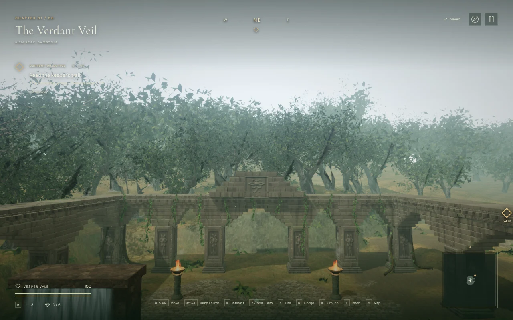
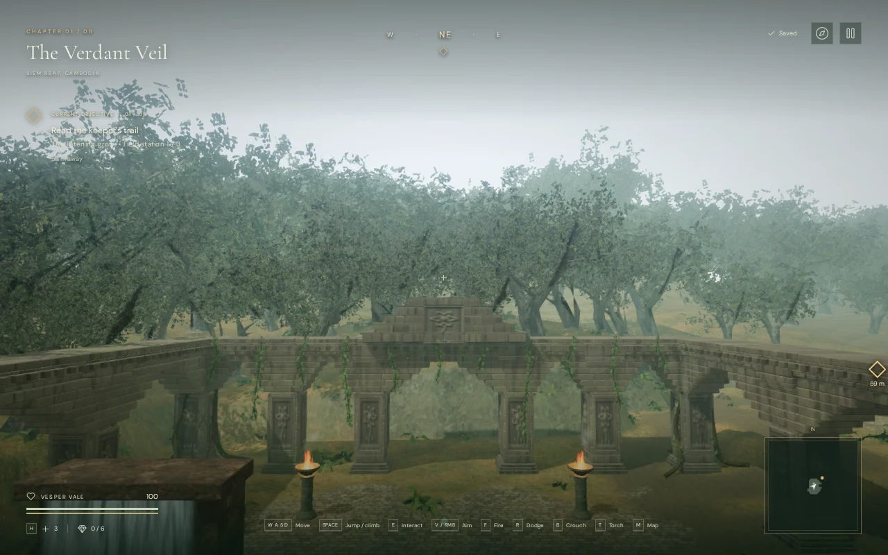
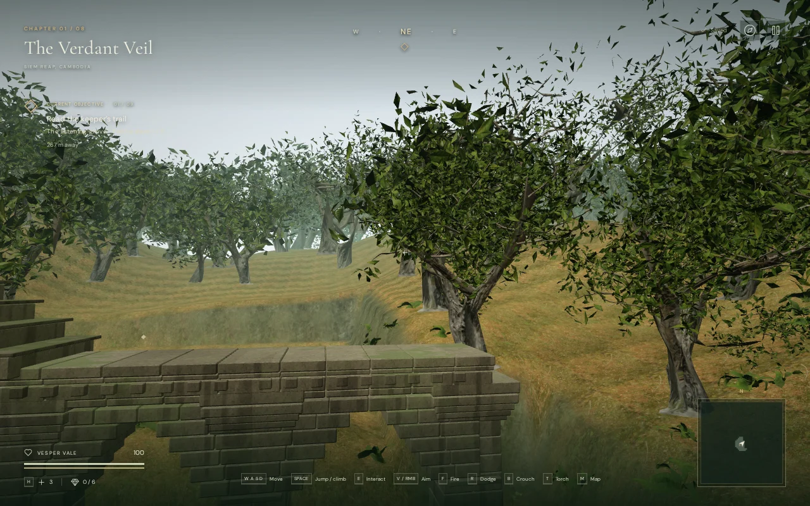
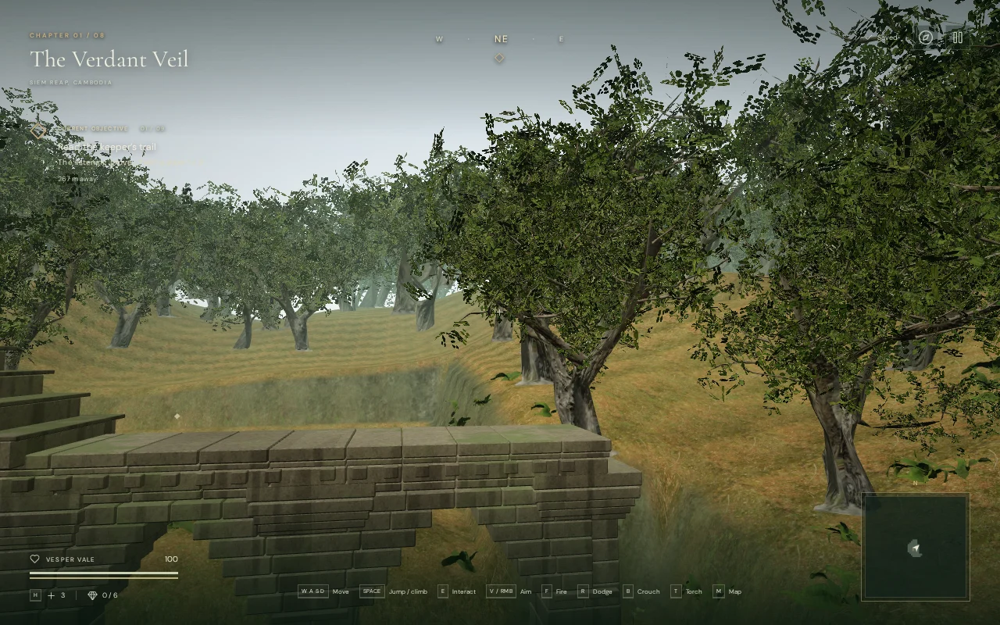

# Jungle leaf silhouettes

The jungle's simplified trees previously showed triangular and diamond-shaped
leaf fragments against the sky. Their JPEG color maps had no coverage channel,
and the old fitted diamonds clipped the original leaf outlines. The six tree
meshes now use full rectangular cards fitted to each source leaf's UV plane,
with Poly Haven's original leaf mask supplying the silhouette.

The middle and distant tiers sample fewer leaves and enlarge their cards to
retain canopy coverage. Those larger cards now contain irregular clusters of
smaller leaves. At jungle load, a GPU bake creates color/coverage, normal and
roughness atlases for each of these two tiers. All trees share these six
textures. Wind, lighting and shadows then use ordinary texture sampling each
frame. Near trees use the original leaf texture and shared mask directly.

## Matching views

The following captures use the same player position, elevated diagnostic
camera, animation time, viewport and quality setting before and after the
change. An unrelated toast is hidden for both. They show the actual browser
renderer; they are not concept art or a frame-rate benchmark.

High quality, canopy before:



High quality, canopy after:



Performance quality, outer bank before:



Performance quality, outer bank after:



These cards remain an approximation: repeated clusters, flat leaf surfaces and
simplified distant branches are still visible. The requested AAA graphics
standard remains unmet.

## Geometry and cost

The rebuild preserves the existing trunk/branch attributes and indices, texture
image bytes and node transforms. Stored normalization bounds retain each tree's
world size and origin. A browser comparison confirmed identical instance
matrices for all 1,831 trees across 450 interior and outer patches.

| Tree | Tier | Triangles before | Triangles after |
| --- | --- | ---: | ---: |
| Island Tree 01 | Near | 114,941 | 114,941 |
| Island Tree 01 | Middle | 15,646 | 15,646 |
| Island Tree 01 | Distant | 3,075 | 3,075 |
| Island Tree 02 | Near | 56,896 | 77,148 |
| Island Tree 02 | Middle | 8,564 | 10,293 |
| Island Tree 02 | Distant | 1,724 | 2,016 |

Tree 02's previous tiers included many single-triangle fragments. Reconstructing
whole cards from the original source raises its geometry count. The six GLBs
grow from 47,089,284 to 53,707,504 bytes, including per-card UV bounds. The shared
mask adds 57,438 bytes. The six 1024-square half-float atlases reserve about
64 MiB of GPU texture storage including mipmaps, plus a temporary 8 MiB bake
target. This is a material memory cost, especially on smaller devices.

A local active-scene GPU comparison used headless Chromium, ANGLE Vulkan on an
AMD Radeon 780M, a 1280 × 800 viewport and pixel ratio 1. The previous assets and
loader were retained only in ignored staging. Each quality used alternating
before/after/after/before samples, each with 1.5 seconds of warmup followed by
4 seconds of measurement. Both sets of foliage occupied the same scene with
identical tree placements; only the selected set rendered.

| Quality | Previous mean GPU time, two runs | Current mean GPU time, two runs |
| --- | ---: | ---: |
| High | 25.63 / 25.58 ms | 28.19 / 28.03 ms |
| Performance | 13.97 / 14.02 ms | 15.16 / 15.18 ms |

The average increase is about 9.8% in High and 8.4% in Performance. An earlier
version generated clusters in each foliage fragment shader and was substantially
more expensive; baking removes that repeated work. The final measurements had
no disjoint or unfinished GPU queries. Whole-frame intervals remained variable
under the shared host's workload: roughly 65–90 ms in High and 37–56 ms in
Performance. These local results do not establish a supported device frame rate.
The bake's startup cost and memory use need broader device profiling.

## Verification

Asset checks cover the fitted plane and front-face winding, complete UV bounds,
normalization metadata, finite geometry, all delivery hashes and the original
mask hash. Both species and every tier must retain the same eight atlas regions
and identical leaf color, normal and roughness inputs for the shared bake.

A browser probe uses the actual wind and distance-fade callbacks to compare
color and depth silhouettes at full, 40% and complementary 60% coverage for
all three tiers. All nine comparisons had zero differing pixels. The 1,172 leaf
patch meshes share one mask and six baked textures, and each shadow material
uses its visible material's coverage inputs. On chapter change, the six atlas
textures, six framebuffer targets and mask each emitted exactly one disposal
event; their WebGL allocations were released. All seven other chapters rendered.

All 42 jungle guardian route searches completed. A prepared crouched crossing
finished at 100 health with linked shaders. The nine bird emitters still matched
their visible perches, three waterfalls were present, and the score selected
exploration mode. These checks do not assess subjective listening quality.
The diagnostic pixel reads emitted four driver warnings about GPU readback
stalls; there were no application errors or failed assets.

All 456 tests passed in the final full-suite run (166.5 seconds). The production
build passed in 3.41 seconds with the existing large-chunk advisory.

The release build accepted native keyboard crouch/movement over 1.26 metres
and muted two-finger movement/crouch over 1.61 metres at a 540 × 900 portrait
viewport. Both cases retained 100 health and restored the complete local save
exactly except for its `lastPlayed` timestamp. The production development hook
was absent and loaded bundle names matched the final build. These release
checks reported no console errors, warnings, failed assets or portrait overflow.
They are short functional checks, not full human playthroughs.

## Rebuilding and diagnostics

Runtime assets are checked in; playing a clone does not require conversion.
After obtaining the credited raw tree sources using the existing asset pipeline,
the final leaf rebuild is:

```sh
python3 scripts/download-tree-leaves.py
node scripts/rebuild-tree-leaves.mjs
```

Run the leaf rebuild after `optimize-tree.mjs` and
`build-vegetation-lods.mjs` when regenerating the entire tree pipeline. It replaces
only the leaf geometry and records the final hashes. Raw downloads stay ignored;
[the source manifest](../asset-sources/tree-leaves/sources.json) and
[license record](../asset-sources/tree-leaves/LICENSE.md) are retained.

With a loaded development jungle, the public verification helper is:

```js
(await import('/scripts/inspect-leaf-cards-browser.js')).inspectLeafCards(__vesper.game)
```

This synchronous pixel-read probe temporarily stalls rendering; it is for
verification and is excluded from the production bundle. Temporary captures,
profiles, benchmark fixtures and exported saves stay in ignored `local/staging/`.
Human campaign pacing, subjective audio review and broader browser/device
coverage remain open alongside the graphics work.
