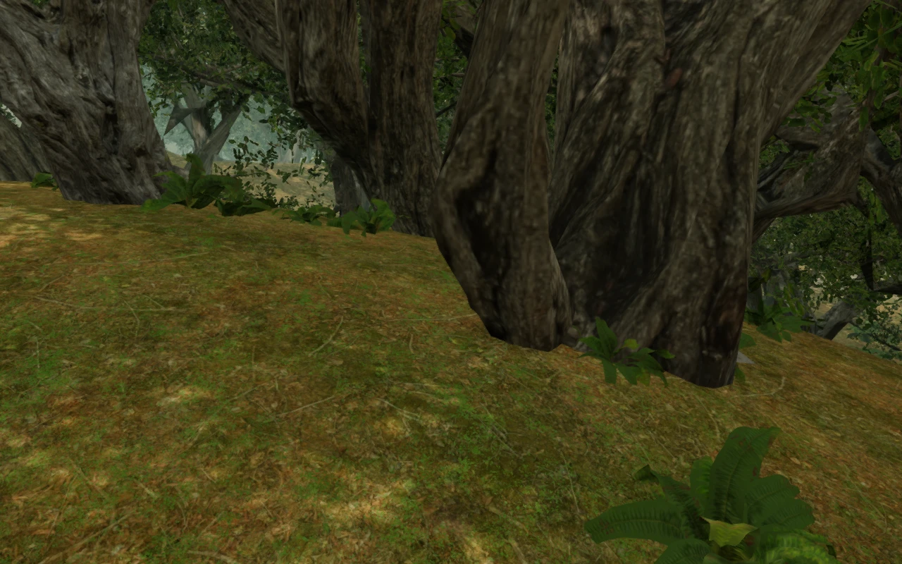
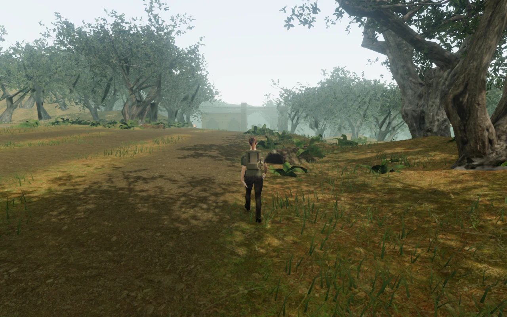

# Jungle trunks seated on their full footprint

The jungle tree bases now meet the soil across the lower trunk instead of
being placed from a single canopy-centred point. This resolves the exposed
root margins recorded in VA-19. The second tree scan had its trunk several
metres from that old origin, so even an accurate centre-height query could
leave its base above a nearby slope or place it across a path.

The placement pass retains each model's delivered scale and moves its origin
to the centre of the lower trunk. It combines root vertices and edge samples
from all three distance tiers, excluding the separate branch and leaf meshes.
The resulting footprint sits 8 cm below the lowest supporting surface, including
the distinction between walking-height interpolation and rendered triangles.

Trees first try their authored layout anchor, then fixed candidates 2 m and 4 m
away. The complete root circle clears walking-cell corners and reserved work
areas. Locations with excessive height variation are rejected instead of hiding
the trunk in a cliff. The final world retains **752 of 753 interior trees** and
**1,046 of 1,048 outer trees**. Placement is deterministic across reloads and
quality settings.

The outer forest uses the same root fitting against its actual bank triangles.
Its sampler locates the appropriate bank strip and tests the local triangles,
including shared edges, so it can service full footprints without scanning all
four bank meshes for every point.

## Verification

- **647/647 tests pass**, including four new delivered-asset and placement tests.
  These cover both trunk origins, the combined distance-tier footprints,
  deterministic placement, retained density, walking-cell corners, ledge
  rejection and more than 150,000 interior root contacts. Outer-bank checks
  compare more than 2,000 footprint queries with independent mesh raycasts and
  cover every bank seam and corner.
- The production build passes, retaining the existing bundle-size advisory.
- The [browser inspector](../scripts/inspect-jungle-roots-browser.js) checks
  **68,397 actual lower-trunk vertices across 4,348 tier/instance combinations**.
  No sample lacks ground; the highest sampled margin is −0.07999991 m.
  All planted interior root circles clear the reserved spaces.
- Twenty-four Low/High captures cover eight interior banks and four outer-bank
  locations. Three obstructed observer positions were recaptured from clear
  angles. The final 24 views were reviewed, together with 22 route captures.
- Assisted walks with the actual controller and follow camera cover **154.04 m
  outward and 154.26 m back**, arriving with health 100. Native production
  keyboard/High and touch/Low checks add four walks of **7.08–18.26 m** and
  **four reloads**. Complete saves match except play timestamps, including the
  saved camera; health remains 100. All six production captures were reviewed.
- Production checks load the exact built assets, expose no development hook,
  and report no browser errors or warnings. A spatial-audio check confirms that
  the jungle bird voice loads and runs; its configured distance gains decrease
  across the three sampled listening positions. This is a graph/attenuation
  check, not a subjective listening assessment.

These checks use disposable progress and assisted views. They establish the
tested placement, circulation and persistence behavior, not a complete chapter
playthrough or consumer-device performance. The existing models, textures,
recordings, score and [asset attribution](asset-credits.md) are retained.

## Remaining art review

The [outer-bank close view](images/jungle-roots/outer-bank.webp) shows a narrow
strip of horizontally stretched bark beside the main trunk on `island_tree_01`.
The subsequent [bark repair](jungle-bark.md) resolves VA-24 by preserving the
original trunk UV chart boundaries and root shape through reduction. Court terraces,
repeated court forms and sparse surroundings also remain in the
[world audit](visual-audit.md).
