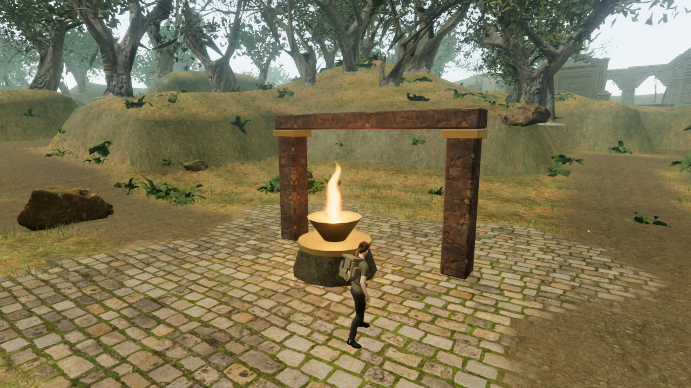
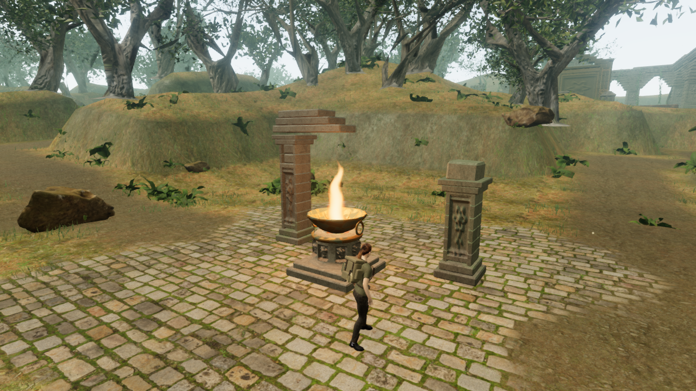
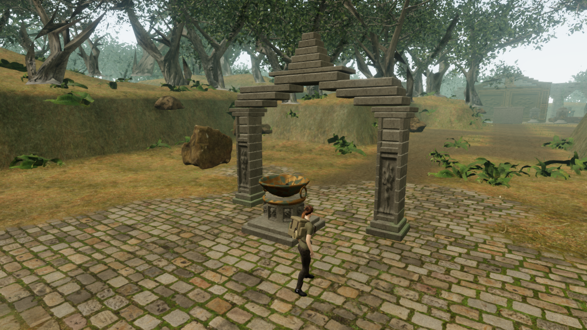

# Carved shrines along the flame relay

The five jungle relay stations now have original stonework and bronze fire bowls.
They replace the repeated cylindrical pedestal, solid cone and rectangular frame.
The root shrine and raincourt have opposite damaged crowns, the sanctuary has a
corbelled arch, the outer brazier has paired stepped caps, and the inner beacon
has a taller central spire. These silhouettes help distinguish stops along the
existing two flame routes.

Before, at the root shrine:

After, with the same camera, chapter lighting and flame state:

The inner beacon before ignition:

## Materials and physical interaction

Chamfered blocks, separate moulded courses and recessed botanical carvings reuse
our original temple geometry and the credited temple material maps. Small carvings
use fewer subdivisions than the large sanctuary reliefs. Their backing sits behind
the carved surface so recessed details remain visible. The bronze has fluting,
raised ribs, a rolled lip and hanging rings; procedural patina changes its colour,
roughness and metalness. The bowl's continuous cross section includes the inner
floor and wall, leaving its centre open. Charred wood sits above a bed of coals.

Coals glow and a small cloud of rising sparks appears when the existing field
completion state lights the fire. Nearby sparks use one draw per lit station and
stop beyond 40 metres. The flame uses the existing shared shader and four-light
budget. No additional lights or recordings are loaded. No new save fields or
mission requirements were introduced.

Pedestals and columns now block movement. Camera collision includes the whole
column shaft and broad crown stones, while the path beneath each crown remains
open. Existing arrival recovery moves an older save out of newly solid stone.
The carried torch still supplies each beacon, and a restored beacon can relight
it from the surrounding approaches.

The original positioned fire recording remains at the visible flame. Its existing
falloff and music arrangement are retained. New solid columns participate in the
existing sound obstruction filter.

## Verification

- All **314 tests passed**. New checks inspect the open bowl with rays, verify
  solid shafts and relighting approaches, recover a save inside each pedestal,
  and check that visual updates do not modify field progress.
- Both assisted torch chains reached and lit all five braziers at 100 health.
  The first chain started at `camp-1`, the inner chain at `camp-2`. Earlier
  progress was supplied by fixtures; these are movement/interaction checks,
  not a continuous unassisted campaign or a pacing measurement.
- In the actual jungle world, all 20 cardinal approaches at 2.2 metres were
  clear and reached the correct fire. All 15 inspected solid centres blocked
  movement. All five prepared saves inside the pedestal recovered to clear
  ground. The five sound-source positions matched their flames exactly.
- The live fire voice was unblocked at 2.228 metres and obstructed behind a
  column at 6.187 metres. Clearing that station's completion state removed its
  voice. These are mix-state checks, not subjective listening-quality evidence.
- All five cold and burning High views and five cold and burning Performance
  views rendered. All inspected shader programs linked; no JavaScript errors,
  warnings or failed asset responses occurred in the completed checks.
- Each station contains six meshes, including its flame and objective marker,
  versus five previously, plus one points object for sparks. Static pieces are
  merged by material. Station meshes contain 17,062–17,854 triangles, up from
  710. These workload counts do not establish a frame-rate target or broader
  device performance.
- Changing to the desert disposed all 25 inspected shrine geometries and 21
  materials (including the shared temple material) exactly once. The next
  chapter contained no jungle shrine references.
- Native production T/E input lit a torch and beacon. Reload retained the torch,
  beacon progress, chapter state and settings; putting the torch out preserved
  the beacon, and native T relit it there. Health remained 93 in the isolated
  fixture. The development inspection hook was absent.

The production build passed with the existing Three.js chunk-size advisory.
Checked bundles: `index-CPHETchX.css`, `index-DTGB76rU.js`, `game-Cu3iTkSM.js`
and `three-DSdd5dJ3.js`. Reusable development checks are in
[`inspect-jungle-shrines-browser.js`](../scripts/inspect-jungle-shrines-browser.js)
and [`verify-torch-browser.js`](../scripts/verify-torch-browser.js); use disposable
progress with the animation loop stopped.

These are prototype environment improvements. Modern AAA graphics remain unmet,
and approximately one hour per chapter still needs full human playtesting.
