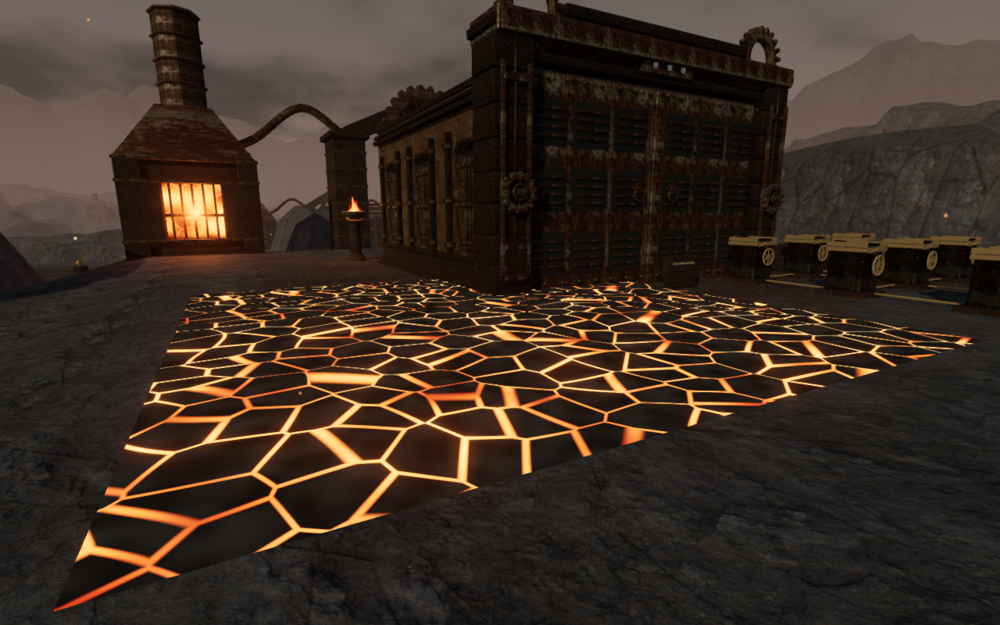
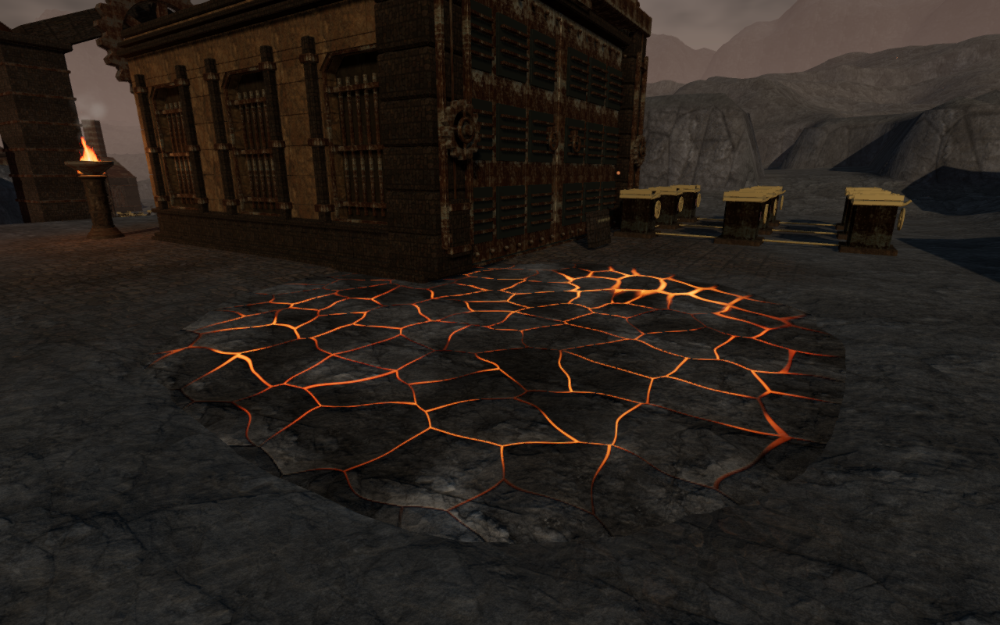
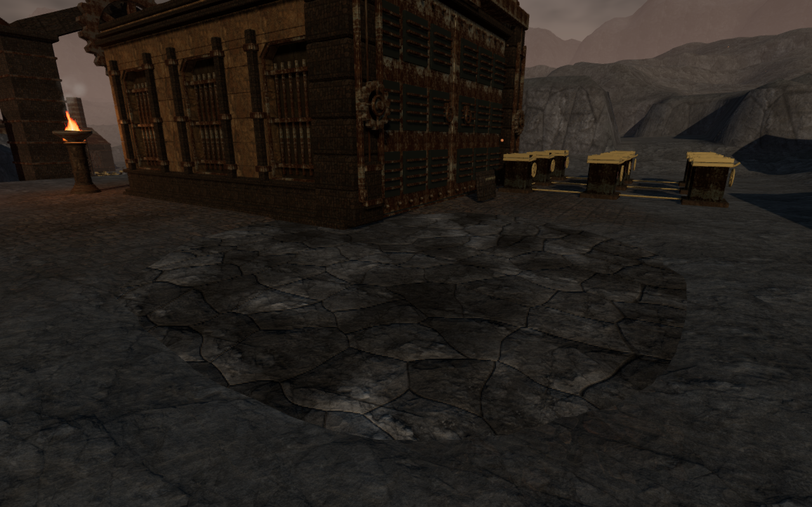
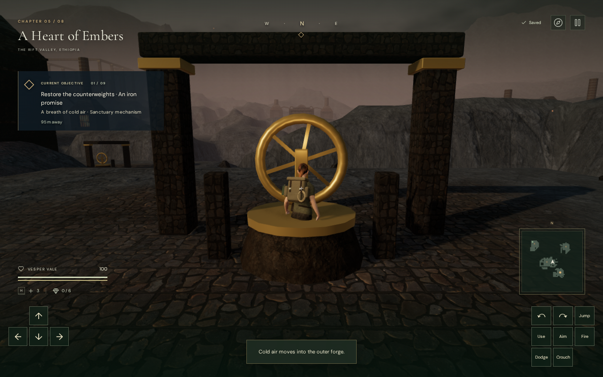

# Slag pools in the volcanic forecourts

The four pools in **A Heart of Embers** now occupy shallow, irregular basins.
Their dark basalt crust carries broken molten seams at a consistent world
scale. The pools meet the surrounding ground and retain their cooling behavior.

The earlier surface stood 12 cm above a flat terrace, exposing every sampled
point along its rectangular border:

The revised surface sits within the ground, with textured slag plates and
glow that varies across the pool:

Cooling leaves a solid, non-emitting crust:

The comparison views use different inspection stances. They illustrate the
construction and material change rather than a pixel-aligned comparison.

## Surface and gameplay

The terrain excavation reaches 42 cm below the original terrace. Its surface
sits 8 cm below that terrace, leaving about 34 cm of lava depth at each center.
The shore profile varies by stage; its sloping edge joins the existing ground.
The render mesh extends a full terrain cell beyond the original footprint so
its outer boundary remains buried. Field foundations and thermal working pads
retain their original elevation.

The new material reuses the existing credited forge-rock material set for its
color and surface normals, and derives roughness from the local heat. All four
pools share the texture objects, with independent
heat and time uniforms. Procedural deformation breaks up the seams, while
depth reduces their glow near the shore. Fine shading detail fades with its
screen footprint. The fireboxes keep their existing furnace material.

Damage and guardian avoidance now sample the exposed lava surface. The old
fixed seven-meter square could damage the explorer on dry ground after the
shoreline changed. Dry corners are now safe; exposed hot lava still deals
nine damage per hit. Cooling restores solid support at the crust's height,
including on reload, so the explorer's feet do not sink into the buried bed.
The three pools associated with valve circuits cool when their field work is
complete. The fourth retains its original hot state after the gear delivery.

## Verification

All **615 tests** and the production build pass. The new
[shoreline regressions](../tests/lava-shores.test.js) check **1,296 perimeter
positions** against both the terrain triangles and the movement heightfield.
They verify distinct irregular shores, **1,134 samples across 126 field and
thermal working locations**, hot/dry/solid footing, and restored cooling state.

The actual browser world's **110 local thermal route legs** arrive. Checks
retain access to 110 controls/tablets, 54 objective/discovery approaches and
all eight restored gate thresholds. All 204 sampled thermal sound paths and
102 handle attachments pass. Direct player updates at the four pool centers
take nine damage while hot and retain full health on their dry corners.
The three cooled pools support the player's feet at their visible surface.

The final visual review covers 20 surface views (hot, cold, Low, close and
later-time states) and 18 front/rear views of the nine volcanic courts. These
are assisted observer views with disposable progress. Nearby guardians caused
some initial close views to be obscured; the final observer search rejects
stances beside them. Sixteen native movement captures supplement this review.
Guardians remain at the margins of some close views.

Eight production cases use keyboard/High and portrait-touch/Low to move across
hot lava, along a dry edge and on cooled crust, and to operate the final
cooling valve. These use prepared saves with defeated encounters. Hot movement
loses health as expected; the dry, cold and valve cases retain 100 health.
All **16 reload comparisons** preserve complete normalized saves apart from
`lastPlayed` timestamps. The browser loads the current production assets,
has no development handle or horizontal overflow, and reports no console
errors or warnings. These are local movement and interaction cases, not an
unassisted campaign playthrough.

The four pool emitters follow their new surface heights. Each has reachable,
unobstructed listening positions at approximately 8, 12 and 20 meters, with
decreasing computed distance gain. Cooled pools silence their emitter; the
remaining hot pool stays active. Existing adaptive music remains in place.
This checks sound behavior and access, not subjective listening quality.

## Cost and remaining scope

The four surface grids total 9,248 triangles, up from 6,272. There are still
four surface meshes; the texture maps are shared between pools. A fixed
1280×800 court view compared the old and new materials on the same final
geometry in before/after/after/before order. On the test browser's Radeon 780M
Vulkan renderer, mean rendering GPU time changed from 17.19 to 17.45 ms on
High, and from 9.54 to 9.98 ms on Low. All eight samples had valid GPU queries
without disjoint events. This isolates a material cost in one view; it does
not establish campaign frame rates or support across consumer devices. The
build retains its existing large-chunk advisory.

This addresses the exposed volcanic pool boundaries and their surface
treatment. Sparse surrounding ground, repeated court composition and the
broader [playable-world visual audit](visual-audit.md) remain open.

The native cooling-valve check also exposed an existing field-station defect:
walking forward can put the explorer inside the generic pedestal. This is
tracked as VA-11 for the field-station pass. The screenshot below records that
remaining defect rather than presenting the station as finished.

The geometry and shader changes are original project code. The existing
forge-rock asset attribution is preserved in [asset credits](asset-credits.md).
Documentation images are actual browser captures converted losslessly to WebP.
