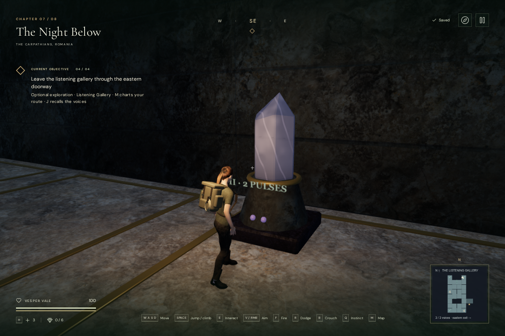
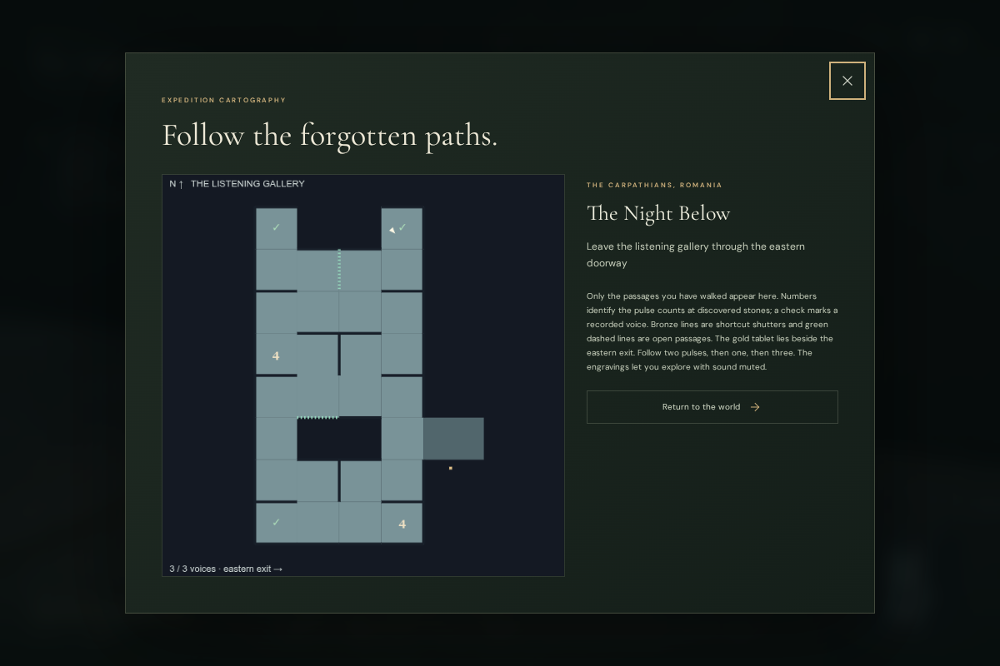

# The Listening Gallery

An optional exploration route now branches west from the entry camp in **The
Night Below**. Its 32 chambers form a connected labyrinth with loops, five crystal
voices, false echoes, two shortcut shutters, and three fragments of Elara's
expedition. The eastern doorway remains the way back to camp.

Read the entrance tablet, then follow **two pulses, one pulse, and three pulses**.
Press **E / Use** beside the matching stone to record its memory. Four-pulse stones
carry fractured echoes; choosing one does not erase discoveries or cost health.
Return the three fragments to the entrance tablet to join the final record,
*Someone waited here*. The chapter's main resonance sequence remains independently
playable.

Each stone both flashes its count and carries an engraved numeral. These clues
permit exploration with sound muted and do not require precise input timing.
The map, opened with **M**, charts chambers as you enter them and labels pulse
counts only at visited stones. Bronze lines mark closed shortcut shutters; green
dashes mark opened passages. **J** keeps the instructions and each recovered
fragment, including the next clue.

The first two memories raise physical shutters over additional passages. Saved
fragment counts restore those shutters at their completed height. Character
collision and sound obstruction follow the panel's elevation during movement;
the camera index follows its moving parent. Pausing freezes the opening and
silences its machinery source. Old positions that become occupied by the new masonry use the existing safe-arrival
search.

## Sound and presentation

Five crystal emitters play original, countable four-second phrases. Their mono
Web Audio buffers contain one through four short harmonic pulses followed by
silence. Audio and light envelopes use the same phrase clock, including when a
voice enters the audible range. Recorded voices become quiet and dim. Walls
muffle nearby voices through the existing obstruction filter. The seven added
emitters—five stones and two shutters—share the existing twelve-voice limit.

Crystal sources use HRTF panning and linear attenuation from 1.5 to 24 metres.
The crystal chapter's existing score omits its melody for the gallery's listening
objective, retaining sparse pads and bass. The persisted music, ambience, effects,
master and mute settings continue to apply. Pulse counts remain available as
text in the world, the interaction prompt, the map and the journal.

The gallery uses original masonry, paving, inset bronze lines, refractive quartz,
engraved plaques, and local lighting beneath the existing continuous cavern
roof. Existing cavern and stone materials supply its surface detail. Nearby
mineral clusters and decorative rock scans reserve its footprint. No external
assets, recordings, packages or services were added.

## Verification

The five new automated tests cover the connected layout, every passage in both
directions through character physics, walls and shortcuts, ordered and incorrect
interactions, repeat input, partial save normalization, cross-chapter isolation,
paused machinery, moving camera surfaces, occupied-save recovery, cavern
headroom, and the four audible phrase counts. They also check silent loop
boundaries and the listening score's instrument selection.

The current browser route used native held movement and E, with supplied camera
headings and stepped simulation. It walked from the entry camp through a false
echo, all three memories, the return tablet and back to camp in **72 movement
segments**, ending at **100 health**. All six interaction approaches were clear.
The built gallery contains **20,022 triangles in 32 meshes**, excluding lights
and the rest of the chapter. These are geometry counts, not device frame rates.

The full suite passed **409 tests**. All **17 affected tests** passed again after
the final sound-origin and occupied-arrival refinements. The production build
passes with the existing large-bundle advisory. An additional regression check
ensures each crystal mount leaves its own listening approach unobstructed; a
wall between chambers still triggers the obstruction path.

The actual browser voices measured effective gains of **0.4 at 1.5 m** and
**0.2 at 12.75 m**. At 25 m the source was retired. All five physical listening
approaches were clear, and an intervening eastern wall blocked the sampled path.
These are source diagnostics before the overall mix, not captured loudness or
subjective listening scores. The map and portrait journal fit the tested desktop
and 540 × 900 layouts. A chapter change released all **70 inspected graphics
resources** once and removed the gallery and its sound references.

Four final High-quality production cases passed native interaction and exact
whole-save reload comparisons, excluding the expected last-played timestamps:

| Saved state | Native action | Restored result |
| --- | --- | --- |
| No memories, beside the two-pulse stone | E | First fragment, unchanged main chapter progress |
| One memory, beside the one-pulse stone, muted | E | Second fragment and saved charted chambers |
| Three memories, beside the tablet, muted at 540 × 900 | Touch Use | Joined record and completion state |
| Old position inside the eastern wall | Move, then pause | Clear recovered arrival and newly walked position |

All ended at 100 health. No development hook, failed assets, console errors or
warnings were present. The final bundles were `index-COz9E0Tk.js`,
`game-CaY-oNEr.js`, `three-CJb2rOZj.js` and `index-DYq9hjRy.css`.

Browser captures are inspection views; the assisted route does not
measure ordinary human exploration, puzzle difficulty or playthrough duration.
This addition does not establish one-hour chapter pacing or AAA graphics.
Subjective listening, broader hardware/browser testing and further content and
artwork remain required.

The High-quality view below uses a browser inspection camera. The map image
shows the passages charted by the assisted route, including its unexplored cells.

