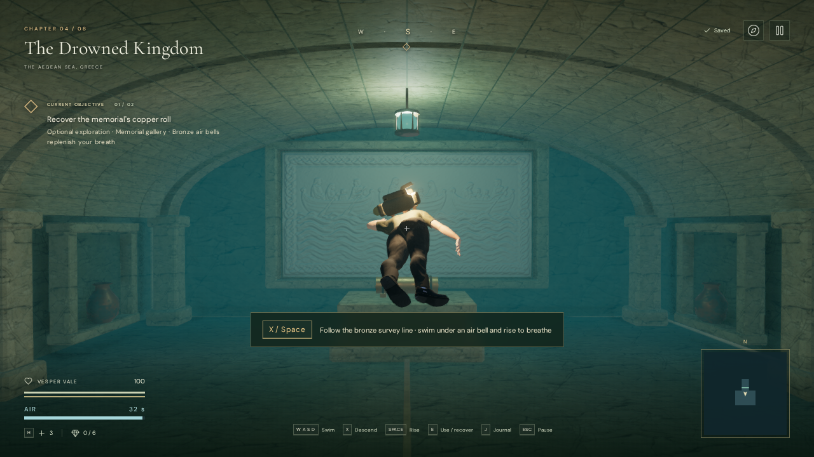
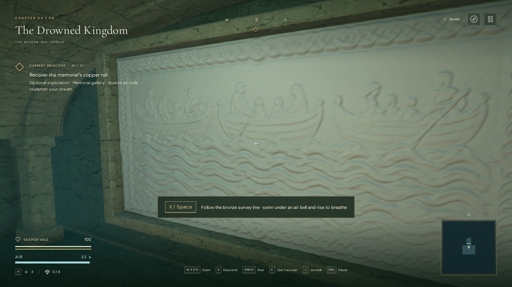

# Submerged memorial art

The Drowned Kingdom's optional memorial chamber now has a shallow barrel vault,
three transverse stone ribs, recessed side offerings, a stepped altar and a
suspended phosphor-glass lamp. A framed carving shows families in evacuation
boats above wave bands, connecting the room to the recovered copper roll's
account of ordinary people escaping the flood.



The room still occupies the existing fourteen-by-ten-metre flooded volume.
Individual vault sectors, piers, frames, offerings, altar and lamp have collision;
the central swimming route and the roll's approach remain clear. Recessed mortar
closes the gaps behind the vault stones. The lamp hangs below the vault and uses
the room's existing single point-light allocation.

## Carving and asset provenance

The built-in image generation tool produced the original 1774 × 887 grayscale
artwork. Its [exact final prompt](art-prompts.md#memorial-relief) is retained.
`asset-sources/memorial/sources.json` records source and delivery hashes. The
original PNG remains in the ignored source directory in the development checkout.

The optional conversion command is:

```sh
node scripts/build-memorial-relief.mjs asset-sources/memorial/evacuation-relief-generated.png
```

`public/assets/memorial/evacuation-relief.glb` is the checked-in playable delivery
asset. It contains a 6.6 × 3.3 metre face with 74,305 vertices and 147,456 triangles.
The converter samples smoothed grayscale luminance as shallow displacement;
this is an artistic interpretation of generated shading, not calibrated scan
geometry. A closed masonry backing and surrounding frame cover the face's edges.

The runtime material uses a quiet stone color and the existing credited palace
stone normal and roughness maps. Strong marble color veins are omitted on the
carving to keep the figures readable. Geometry receives the chamber lighting.
The vault, offerings, frame, altar and lamp are original code-authored assets.
No new sound files were introduced in this pass.



The relief loads through the chapter's asset-loading batch. A chapter identity
check disposes a late result if the player has already left; ordinary chapter
teardown disposes the installed geometry and material. Saves need no migration.

## Verification

- 307 automated tests passed, including the full swimming route and a new
  raycast-based check at 21 positions beneath the visible vault. The latter checks
  collision near the stone surface, clear water below it, the lamp and the roll's
  approach.
- Assisted GPU-browser route checks recovered the roll and returned to the surface
  at both the original water level and after 1.8 metres of drainage, with 100 health
  and all nine gallery volumes visited. During those checks, 133 enclosed views
  culled the exterior and 29 retained it; visibility and the shadow renderer were
  restored after every sampled draw.
- The rendered relief loads successfully. Chapter transition checks dispose all
  30 tracked gallery/sea geometries, ten materials and six unique textures; gallery
  sources and voices are removed. The checked views had linked shaders and no
  browser errors, warnings or failed asset requests.

- The final production build accepted native descent/swimming and wheel use,
  saved the opened gates, and reloaded at the second air bell with matching
  chapter state and 93 health. The new GLB loaded; map and recovered-record
  journal checks passed. The development hook was absent. The build succeeded
  with the existing Three.js chunk-size advisory.

These checks establish assisted route completion and the stated rendering
behavior. They do not establish one-hour human pacing, AAA graphics or performance
across consumer devices.

## Frame measurements

An isolated Chromium 148 / ANGLE Vulkan browser on a Radeon 780M rendered the
High-quality memorial view at 1280 × 720 and pixel ratio 1. With the test/build
jobs finished, a 6.5-second sample measured a 21.2 ms median frame interval
(25.0 ms p95) and 9.75 ms median GPU render time. A subsequent instrumented
4.5-second sample measured 19.4 ms median frame interval and 9.75 ms median
GPU time. Both submitted 353 draws and approximately 1.165 million triangles
across the enabled passes per frame.

Hiding only the relief in the same instrumented view reduced GPU median time
to 9.01 ms and submitted triangles to approximately 0.723 million; mean GPU
time fell by 0.89 ms. Mean frame intervals were 19.51 ms visible and 19.30 ms
hidden. All timer samples completed, with no disjoint events or skipped queries.
These short measurements describe this view and device; they are not a 60 fps
guarantee.

Verified production bundles: `index-CIFJSKoB.js`, `game-DorPTrjK.js`,
`three-BvzwOCtv.js` and `index-BdgvWVky.css`.
