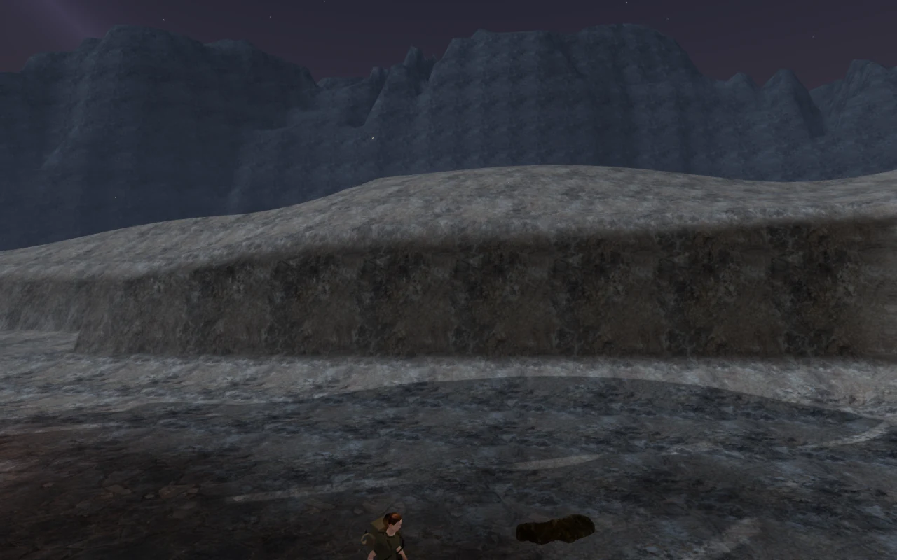
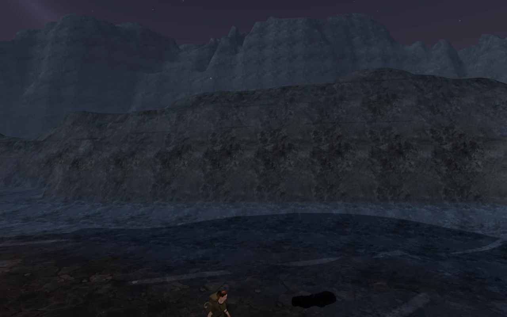
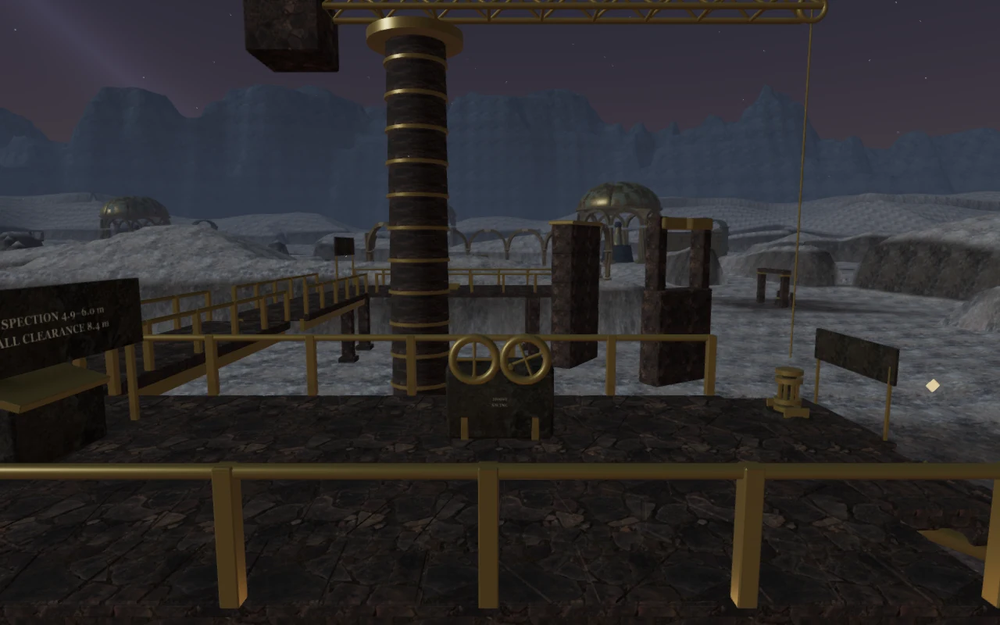
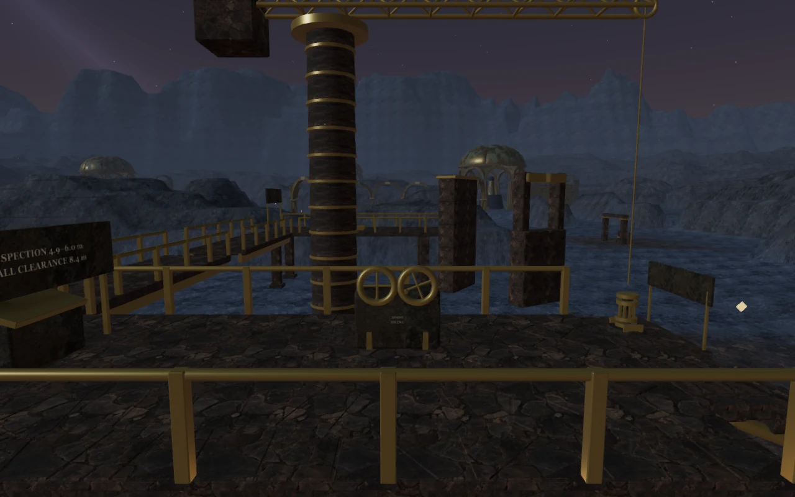
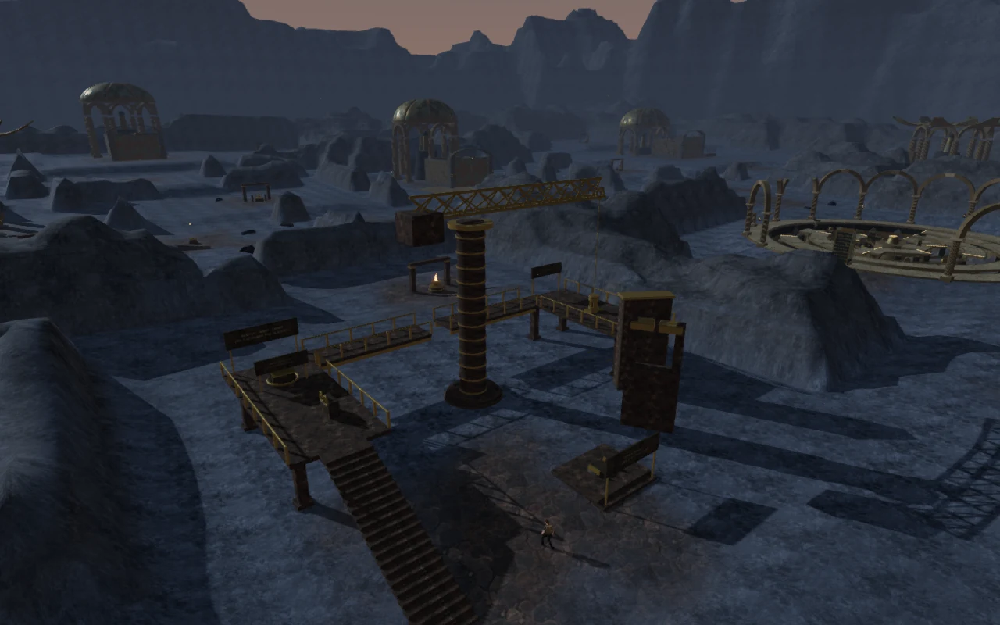

# Rock banks of the Last Meridian

The final chapter's nearby banks now have uneven crests, broader toes and
tilted rock shelves. Darker exposed rock and a subtler dust surface replace
the pale, cloudy coating that previously made the landscape look snowy.
Cross joints and interrupted bedding seams give the faces more structure;
their fine detail fades with screen footprint to limit distant aliasing.

| Previous eastern bank | Revised eastern bank |
| --- | --- |
|  |  |

The terrain keeps its existing **81 chunks and 119,072 triangles**. This pass
changes heights and shading without adding terrain triangles or textures.
An interpolated exposure attribute keeps the new shelf material off the
mechanical courts and fades paving out of the enclosing rock.

Loose scanned stones receive a matching desaturated material. Each material
is cloned from its source, so the same scans retain their original appearance
in other chapters. Their existing placement checks still reject unsupported
slopes and keep working areas clear.

| Previous crane-gallery view | Revised crane-gallery view |
| --- | --- |
|  |  |

## Preserving playable ground

Walking cells are 7 m wide, and the terrain samples are 1.75 m apart. All cell
boundaries therefore fall on sample vertices. The new profile changes only
vertices strictly outside the closed walking cells; bilinear heights within
those cells remain exactly equal to the previous profile, including their edges.

Additional protected areas cover the crane foundation, the Cartographer's
Orrery, pool margins and all nine observatory domes. The dome protection includes
their outlying column footings, which sample ground beyond the room centers.
The browser comparison confirms unchanged water definitions, objective
positions, obstacle data, walking grid and distant escarpment geometry.

Across the 245 × 245 profile, **23,085 vertices** change height. The largest
change is approximately **8.90 m**, outside the protected areas. The tests also
check reproducibility, finite geometry, matching positions and normals along
chunk seams, and preservation of the original scan materials.

## Measured cost

Five matched 1280 × 800 High views retain their previous render counts:

| View | Calls | Submitted triangles |
| --- | ---: | ---: |
| Crane bank | 891 | 1,031,735 |
| Eastern bank | 219 | 494,435 |
| Southern cut | 179 | 410,155 |
| Western court | 353 | 698,389 |
| Orrery edge | 590 | 989,869 |

The exposure attribute adds **256,036 bytes** (about 0.244 MiB) to the terrain's
vertex buffers. The copied height and exposure arrays add **480,200 bytes**
(about 0.458 MiB) of profile data on the CPU; vertex arrays also remain in CPU
memory. These figures exclude renderer and JavaScript object overhead.

An alternating comparison on **AMD Radeon 780M / RADV Vulkan** swapped the
archived terrain shader and original-height geometry against the revised
terrain at the same crane-gallery camera. It used old/new/new/old order for
each quality setting, 1.3 s settling and 4.2 s sampling per run, with no disjoint
timer queries. Each value below averages two runs.

| Quality | Previous terrain GPU render time | Revised terrain GPU render time | Difference |
| --- | ---: | ---: | ---: |
| High | 13.466 ms | 12.710 ms | −0.756 ms |
| Low | 6.674 ms | 5.836 ms | −0.838 ms |

The comparison includes both terrain shape and shader changes. Revised loose
stone materials and placements are held fixed in both cases, so their change
is outside this timing comparison. Calls and submitted triangles remain equal
between the paired runs. The lower GPU time is specific to this view and device;
it does not establish a general performance improvement or frame-rate guarantee.

## Verification

- **530 automated tests pass**, using `node --test --test-concurrency=2 tests/*.test.js`.
  The new checks exercise walking-cell edges and interiors, observatory
  footings, pool margins, crane and orrery foundations, terrain seams and
  material ownership.
- The assisted continuous crane route passes at full health through loading,
  the west stair, both cargo clearances, the upper jump, installation and the
  return to the nearby cache. It uses normal movement, hazard and camera updates
  after a seeded entrance; this is not a blind human playthrough.
- All **115 placed stones** pass **4,362 underside probes** against both visible
  triangles and bilinear ground. Their footprints remain outside reserved
  working areas. Three existing stones settle a few millimeters lower; one
  candidate is newly rejected and another is accepted, retaining the total.
- Fourteen orrery arch passages remain clear for movement and camera rays.
  All fourteen blocked column positions recover to the supported west entrance.
- High, Medium, Low and the completed chapter's dawn state render successfully.
  Leaving the chapter disposes all **91 terrain resources** exactly once:
  81 geometries, one material and nine textures. Crane and escarpment cleanup
  also pass.
- The crane's positioned machinery and wind voices, lifting score selection,
  pause behavior and cleanup pass. Three offline audio checks produce half the
  near-source RMS at the attenuation midpoint and silence beyond maximum range.
  These establish behavior, not subjective soundscape quality.
- Seven fresh production cases pass with the development API absent: keyboard
  clearance rejection, interrupted crane reload, seating, upper walkway jump,
  muted portrait touch operation, installation and recovery of an older
  completed save. Every case preserves progress after reload.
- The production files checked are `index-BjWHPBxD.js`, `index-DYq9hjRy.css`,
  `three-Di8J68Pj.js` and `game-BZkbh90t.js`. Browser runs report no console
  errors, warnings or failed resource requests. The build passes with the
  existing advisory about chunks larger than 500 kB.

This uses original project geometry and shading with the existing credited
**Rock Boulder Dry** maps and loose-rock scans. No external artwork, textures,
recordings or dependencies were added. The images are captures of the running
game, converted to WebP for this document.

Modern AAA graphics, approximately one-hour chapter pacing, subjective audio
quality and broad device coverage remain open production requirements.
