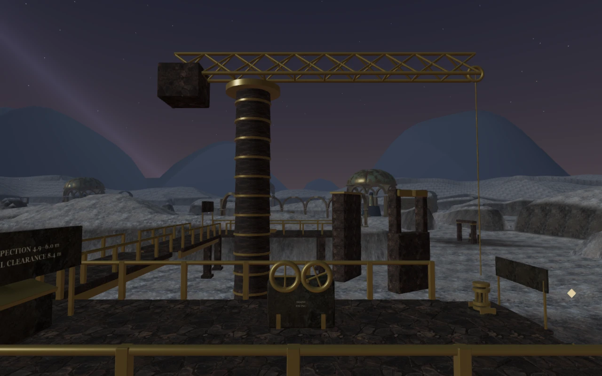
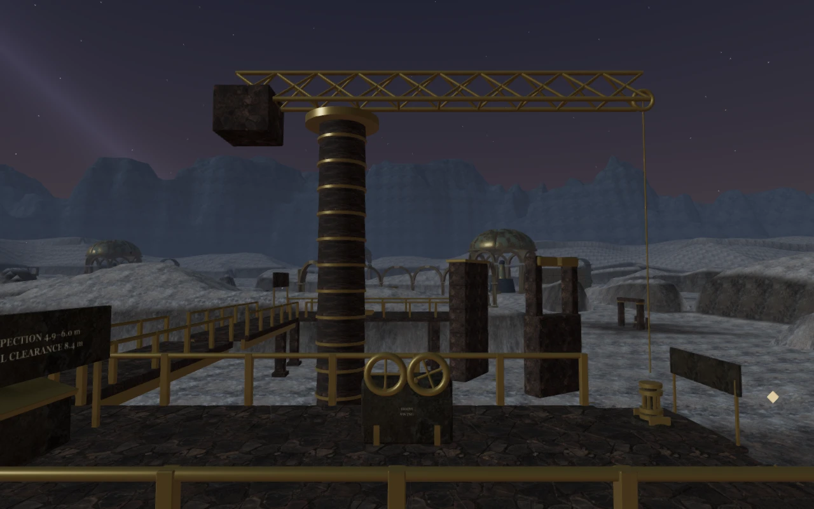
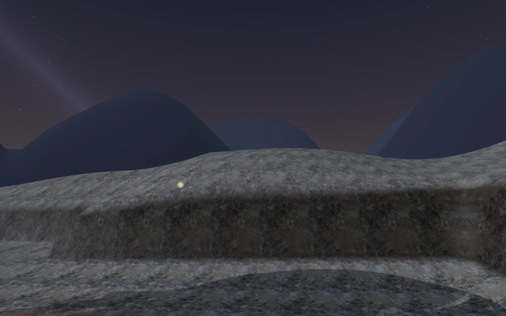
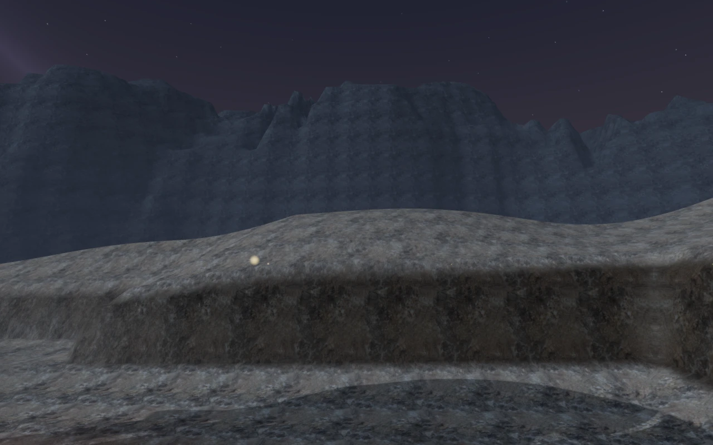
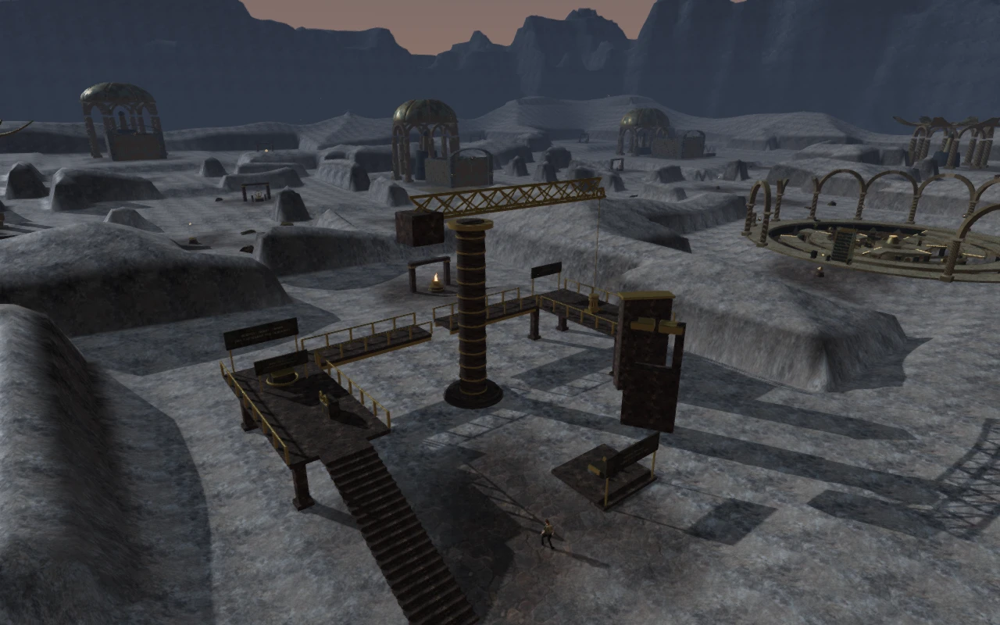

# The meridian escarpment

The distant terrain in **The Last Meridian** now forms a continuous ring of
weathered rock shelves, cut slopes and uneven crests around the observatory.
It replaces two untextured mountain layers whose coarse repeating profiles
produced conspicuous triangular silhouettes.

| Previous crane-gallery view | Revised crane-gallery view |
| --- | --- |
|  |  |

The heightfield samples broad faults and smaller gullies in Cartesian space,
so their shapes cross the radial mesh instead of following its spokes. Stepped
beds interrupt the slopes, while broader shelves form the upper silhouette.
Its inner radius lies beyond every corner of the playable square.

Rock color and normal maps now project along three world axes at a consistent
scale. Broad weathering, narrow mineral bands and height-sensitive distance haze
vary the surface. The thin bands fade with their screen footprint. These are
original geometry and shader changes using the existing credited **Rock Boulder
Dry** maps; no external art, textures or dependencies are added.

| Previous eastern outlook | Revised eastern outlook |
| --- | --- |
|  |  |

## Depth and gameplay

The eclipse sky draws before the escarpment. Its overlapping slopes then occupy
an independent depth interval, which is cleared before the playable world
renders. This retains the full distant silhouette with the existing 450 m
camera range. The shader also preserves the near-plane clipping used by oblique
reflection cameras.

Four reference views match a conventional 1,600 m camera exactly. Twelve
foreground probes at 3, 225 and 449 m remain visible. The four oblique-clipping
comparisons differ only at a few rasterized edge samples: at most three color
channels differ by more than one level, out of 491,520 channels per view.
The reusable [browser verifier](../scripts/verify-meridian-browser.js) shares
these checks with the volcanic caldera verifier.

The sampled playable terrain, water definitions, objective positions and
obstacle data match the previous build. The escarpment has no movement collider
and does not enter the contact-shadow pass or cast directional shadows.

## Measured cost

The new mesh has **41,665 vertices and 81,920 triangles**, compared with
3,542 vertices and 6,400 triangles across the two old ranges. Its vertex/index
arrays occupy **1,824,800 bytes**, an increase of **1,701,392 bytes** (about
1.62 MiB), before renderer overhead. Source arrays also remain in CPU memory.
Sampled heights range from −18 m to approximately 134.8 m. The inner radius is
320.25 m and the outer apron extends for another 250 m.

The alternating comparison used the same stationary crane-gallery camera at
1280 × 800 on Chromium with **AMD Radeon 780M / RADV Vulkan**. Each setting had
two old-range and two new-range runs, alternating old/new/new/old, with 4.2 s
of samples after a 1.3 s settling interval. Timer queries reported no disjoint
samples. Means below average the two runs for each version.

| Quality | Previous GPU render time | Revised GPU render time | Added time |
| --- | ---: | ---: | ---: |
| High | 12.075 ms | 12.791 ms | 0.716 ms |
| Low | 5.713 ms | 6.531 ms | 0.817 ms |

High uses three fewer render calls in this view because the two old ranges also
participated in the contact pass. Low uses one fewer call. The measurements are
bounded comparisons on this device and view, not a general frame-rate guarantee.

## Verification

- **527 automated tests pass.** The new tests check reproducible geometry,
  finite attributes, valid indices, upward normals, seam continuity, distance
  from the playable square, rendering order and preservation of shared textures.
- An assisted continuous crane route passes through the normal movement,
  hazard and camera updates after one seeded entrance. It climbs the gallery,
  operates both drives, crosses the upper gap, installs the spindle and returns
  to the nearby treasure.
- High, Medium and Low views render successfully. The completed chapter's
  dawn state also renders with the new terrain. Leaving the chapter disposes
  its geometry and material exactly once and removes the escarpment object.
- The crane's positional voices, distance falloff and pause/cleanup behavior
  still pass. This environment update adds no sound sources or music changes.
- Seven checks in the production build pass with the development API absent:
  keyboard clearance rejection, interrupted crane reload, seating, the upper
  walkway jump, muted portrait touch operation, installation and recovery of
  an older completed save. All comparisons preserve saved progress after reload.
- The checked build files are `index-Daq6J387.js`, `index-DYq9hjRy.css`,
  `three-Di8J68Pj.js` and `game-CX3V8DYh.js`. Browser runs report no console
  errors, warnings or failed resource requests. The build retains Vite's
  advisory about chunks larger than 500 kB.

Modern AAA graphics, approximately one-hour chapter pacing, subjective audio
quality and broad device support remain open production requirements.
