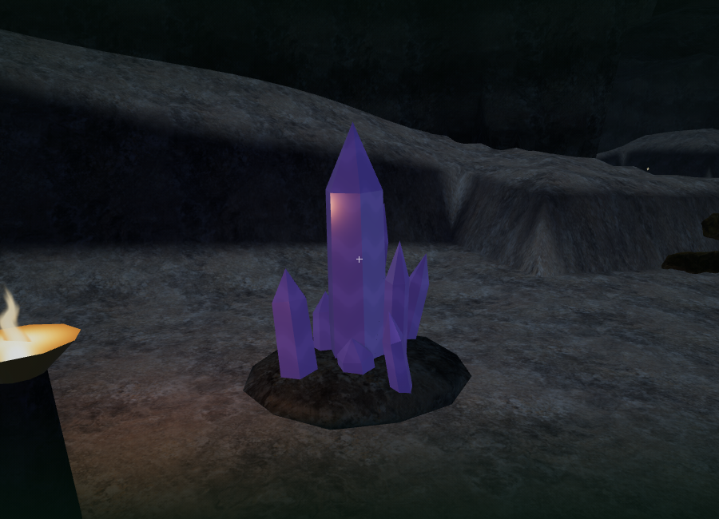
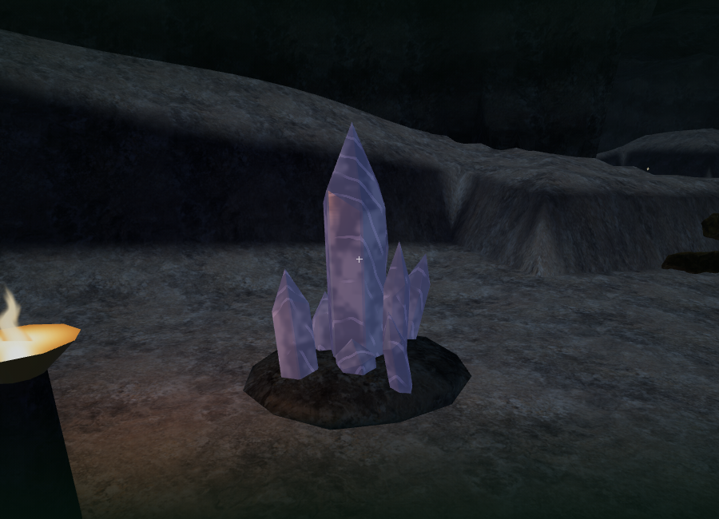
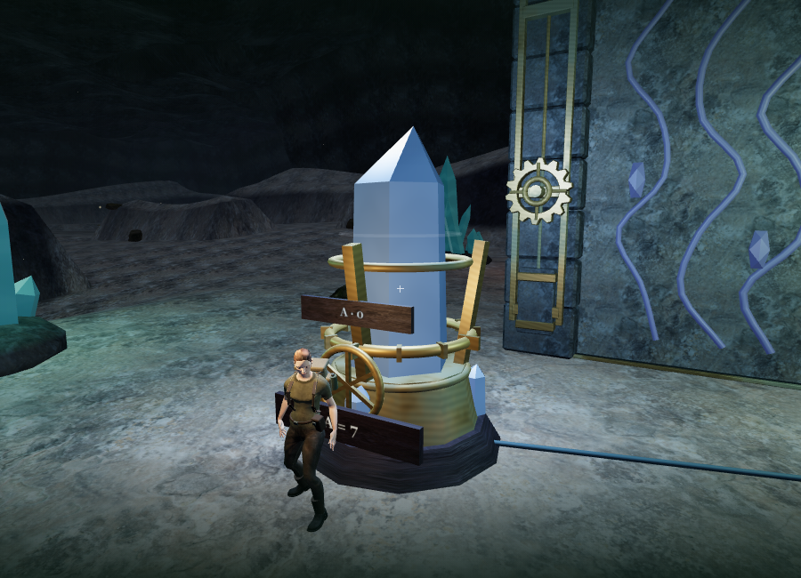
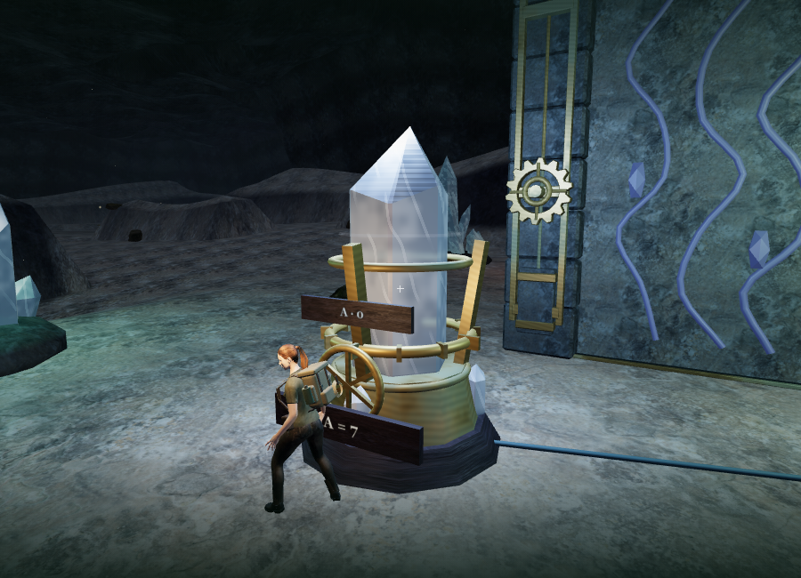
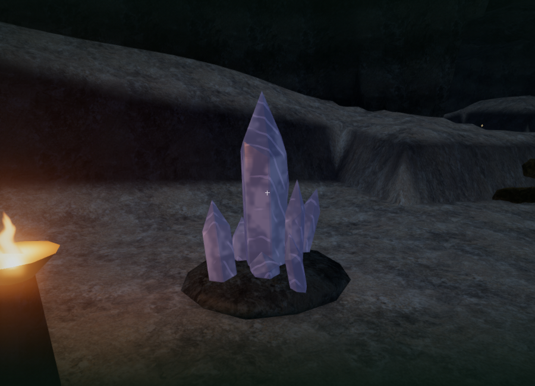
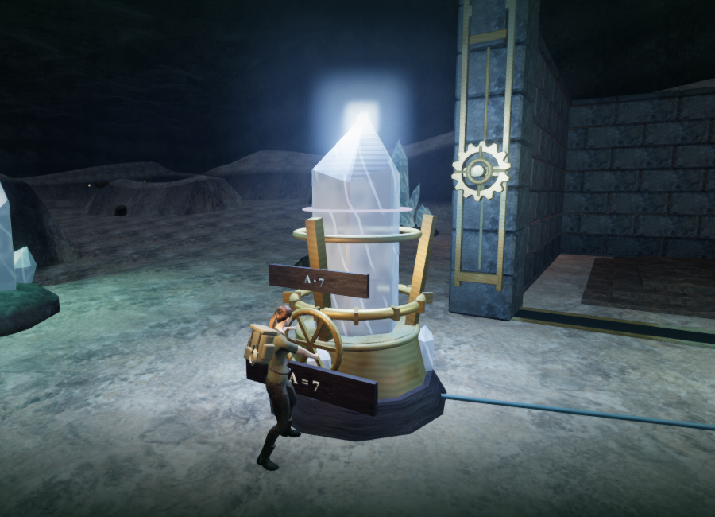

# Quartz formations and tuning crystals

Natural mineral formations and mounted tuning crystals now share a more detailed quartz shape and optical material. Each solid has six broad shaft faces, narrow corner facets, a beveled base, an uneven shoulder and an offset termination. The geometry has 96 triangles per crystal and stays inside the original radius and height envelope. Main shaft faces remain planar; variation is deterministic.

The full chapter contains 456 quartz pieces: 324 in natural formations and 132 in the tuning apparatus. Together they use 43,776 triangles in 141 mesh geometries, with 42 materials carrying the individual restoration values.

Each crystal carries its own surface coordinates, seed, radius and height as geometry attributes. These survive the rotations and translations used when combining static clusters. Cloudy inclusions, broken fracture bands and fine growth striations therefore remain attached to individual crystals. Etching changes the normal response, while inclusion density and the darker base vary roughness and transmission. Fine patterns fade with pixel derivatives to reduce distant aliasing.

The nonmetallic physical material adds light transmission, colored attenuation and clearcoat. Transmission thickness follows each crystal's radius, including small crystals combined with a larger central shaft. The shared renderer uses half-resolution transmission captures in Performance/Balanced modes and three-quarter resolution in High. Translucent crystals are excluded from the opaque normal override used for contact shading.

Saved resonance values still drive the same glow uniforms, nearby light slots and positional hum. Tuning controls retain their individual comparison tones and reference tones. This pass introduces no new art downloads, recordings or music; the geometry and shading are original project code in `src/mineral-art.js`.

## Rendered comparison

The repeatable 900 × 650 viewpoints are in `scripts/inspect-minerals-browser.js`. These are assisted art-review cameras at a fixed scene time.

The previous natural formation and the finished Performance view:

The previous tuning crystal and the finished Performance view:

The natural formation in High quality, followed by an aligned tuning crystal:

| Performance camera | Previous calls / triangles | Finished calls / triangles |
| --- | ---: | ---: |
| Natural cluster | 45 / 88,482 | 86 / 178,690 |
| Tuning crystal | 89 / 120,204 | 164 / 241,202 |

The High formation view submitted 769 calls and 913,443 triangles. All observed shaders linked. These are whole-scene ANGLE/SwiftShader workloads, including additional transmission and reflection rendering. The Low transmission target was 450 × 325. High used a three-quarter-size main target and a separate 384 × 384 water-reflection transmission target. Transmission adds substantial rendering work; these measurements do not establish hardware frame rates.

## Verification

Geometry tests verify reproducible, closed, outward-facing solids inside the original collision envelope. Batching tests rotate and translate crystals before checking their retained surface coordinates and thickness attributes. Lifecycle tests exercise shared transmission targets across two camera draws, unique disposal and cleared sampler references. Contact-pass tests confirm that visible transmissive crystals are excluded and restored without making initially hidden crystals visible.

All 267 tests passed. The four new art and lifecycle tests passed again after the final etch-depth adjustment. The production build passed with the existing large Three.js chunk advisory.

The complete browser scene retained all 54 sampled feature approaches, 41 tuning controls and 41 local physics routes. All 36 natural mineral sound fronts and all 66 tuning-tone fronts remained clear. These use assisted positioning and scripted movement; they do not establish human playthrough duration or unassisted difficulty.

Seven native E presses tuned the first crystal in array 1 from mark 0 to its target mark 7, saving each turn. Its material restoration uniform rose from 0.28 to 1 and emissive intensity from 0.35 to 0.8. The voice and reference rates both reached 1.05, and reference activity fell to zero. The live crystal/tuning mix selected ten voices from 160 registered sources, within the twelve-loop limit. The unobstructed local voice at 0.602 m had gain 0.14, while another at 7.427 m had gain 0.08109, consistent with the existing 1.2–16 m linear fade. Several more distant source paths were marked obstructed. The persisted mix remained music/ambience/effects 32/80/75.

The final High production build accepted native E and S from an assisted test position. A paused reload restored the exact position `(350.2996467473672, 69.81455427058641, height 0)`, 190.3115 recorded active seconds, stage 1, all three seeded field actions, health 100, counterweight state and the new resonance record `{ values: [1, 0, 0], moves: 1, last: 0 }`. Mix and graphics settings matched exactly. No asset requests failed, the production console reported no warnings or errors, and the development hook was absent. The software-rendered input check moved only 0.3 m and does not establish sustained responsiveness or supported hardware performance.

Switching to the desert chapter disposed all 141 crystal geometries, 42 materials and both transmission targets. The recorded sampler references were cleared, and no old mineral geometry, material, sound-source object or voice remained. The desert had no mineral materials or transmission targets and its observed shaders linked. The development console reported no warnings or errors. Test-created saves were cleared on both origins and both launchers returned to High quality.

## Limits

Transmission samples the rendered scene; it does not simulate internal fracture volumes, multiple refractions through overlapping crystals or caustics. The formations remain procedural, and the surrounding cave retains its existing heightfield vault and rock beds. Software-rendered workloads do not establish supported consumer-GPU frame rates. Modern AAA visual quality, broader listening evaluation and approximately one-hour chapter pacing remain open requirements in [production status](production-status.md).
