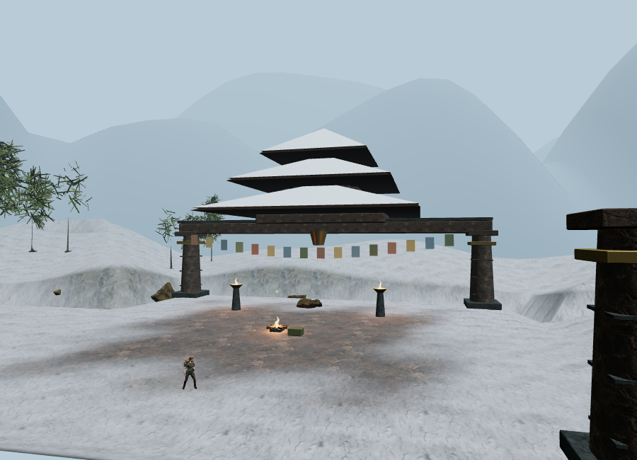
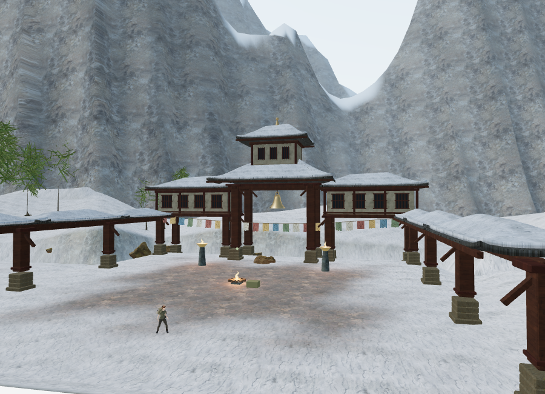
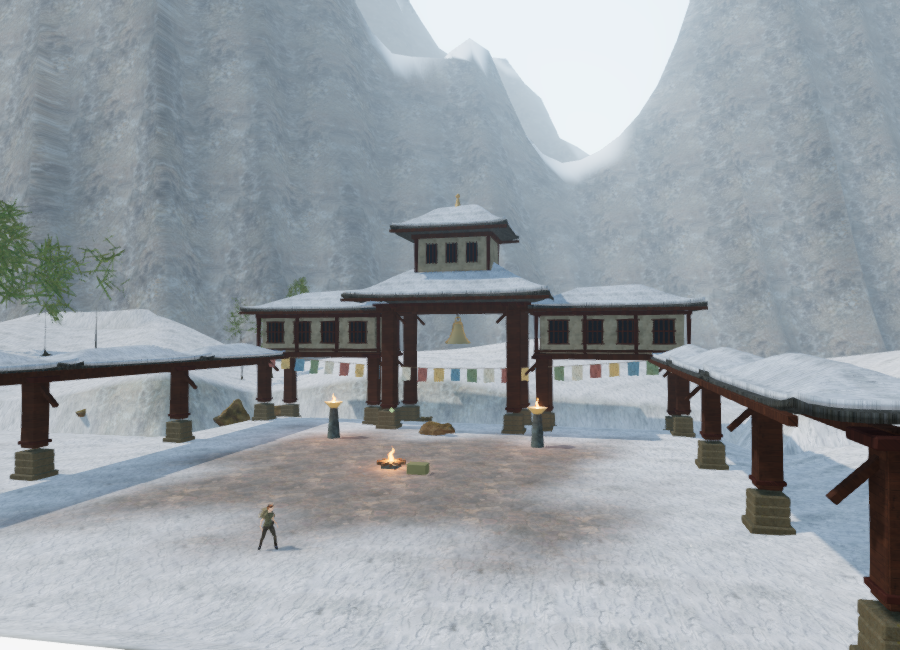
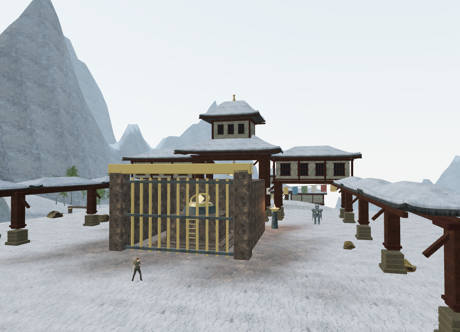

# Snow monastery art pass

The Himalayan chapter now has nine supported timber monastery courts: central bell pavilions, whitewashed upper halls, window latticework, covered side galleries, and varied damaged roofs. These are original procedural buildings for the fictional game setting, not a reconstruction of a particular monastery.

Ground-level routes pass beneath the upper rooms. Grounded stone footings and timber posts use explicit navigation bounds; separate height-aware camera surfaces block the upper walls and roofs. Batching keeps static structure to roughly seven materials per court, while window detail has a shorter range. The final court has a taller roof crest, and the damaged middle court omits its upper loft. The former floating cones and flat flags are removed.

## Materials and environment

Nine unmodified maps total **15,584,337 bytes**:

- [Wood Planks by Amal Kumar](https://polyhaven.com/a/wood_planks): 2K color, OpenGL normal, and roughness.
- [White Plaster 02 by Rob Tuytel](https://polyhaven.com/a/white_plaster_02): 2K color, OpenGL normal, and roughness.
- [Roof Slates 02 by Rob Tuytel](https://polyhaven.com/a/roof_slates_02): 1K color, OpenGL normal, and roughness.

All are [CC0 assets from Poly Haven](https://polyhaven.com/license), bundled locally. `python3 scripts/download-monastery-materials.py` reproduces the downloads. Original service metadata and source URLs, byte counts, and SHA-256 values are retained in `asset-sources/monastery-materials/`; the delivered files match all nine hashes. Existing local stone, rock, and snow maps are reused.

Hipped roofs have raised eaves, a visible slate shell, and an irregular, separately modeled snow layer. Damaged corners remove both slate and snow. The higher density snow mesh keeps its own sealed skirt. Timber texture coordinates follow each beam's long axis.

Two angular mountain ranges replace the rounded horizon hills. Their ridged surfaces use triplanar rock color and snow deposition guided by elevation and slope. Together they contain 46,080 triangles. The range seams share both position and normals, and both begin outside the playable map. These are background geometry; collision terrain is unchanged.

A cooler daylight sky, matching sun direction, and reflected ground fill light the chapter. A one-time 128-pixel cube-face capture supplies filtered environment lighting, including the bronze bells. Snow sky and range state are cleared on chapter changes.

## Cloth and sound

Each court has 25 faded cloth banners on a sagging cord, with original geometric motifs and ragged hems. The top edge stays attached; deformation increases toward the free edge. The visible material and its custom shadow material share the same time uniform, deformation, and hem cutout. Bounds include the full wind displacement, preventing moving cloth from being culled too early. The cord and flags retain their live scene references after static geometry batching.

The court's existing positional wind emitter now sits beside the banner line. All nine actual scene sources match the authored placement. No extra decorative bell loop was added over the chapter's listening puzzles. The existing snow score uses its quiet 46 BPM bell arrangement; objective variations and puzzle ducking remain in place, with default music 32, ambience 80, effects 75, and master 45.

A browser source check, with obstruction disabled to isolate distance, recorded effective wind gains of 0.700 at 2 m, 0.608 at 12 m, 0.344 at 35 m, and 0.0115 at 64 m. At 66 m the voice retired. The actual PannerNode used HRTF with a linear distance model, 4 m reference distance, and 65 m maximum distance. These are source gain/position checks, not a perceptual listening assessment.

## Rendered comparison

The Performance images use the same 900 × 650 viewport and camera. They include the architecture, sky, materials, and mountain changes together.






These are actual browser renders with the HUD hidden for review. The environment is improved but still does not meet the requested modern AAA standard.

## Verification and limits

The full automated suite passes **131 tests**. Seven new tests cover sealed/wound slate and snow geometry, matching damage openings, nine distinct court plans and feature margins, grounded built-world navigation and overhead camera clearance, cloth anchoring and deformation bounds, mountain seams/placement/budget, and delivered asset hashes. The production build passes with the existing Three.js chunk-size advisory.

The finished snow world has **957 camera surfaces**, including the existing gameplay structures. Structure remains when distant window, flag, and bell detail is hidden. Cameras can move beneath the upper halls while stopping at their elevated walls; player movement stops at the grounded posts.

The matching Performance view increased from **136,358 triangles / 75 calls** to **220,030 / 75**. The High-quality view submitted **1,259,750 triangles / 455 calls**, including rendering passes. Every active WebGL program linked successfully with an empty log. Two High frames at different wind times showed moving banners; shader setup and geometry tests separately verify shared visible/shadow motion and fixed top edges.

Browser diagnostics found a clear sampled standing/approach position for all **54 non-guardian features**. Climbing stations check entry and summit positions; raised bell mechanisms check their authored plinth height. A ground-only first probe flagged seven raised mechanisms and was corrected after inspecting the existing climbable plinths. These checks do not prove complete routes through every gate or encounter.

After snow, both desert and jungle chapters prepared with no asset errors, zero monastery patches, cleared cloth time and wind-source state, and no retained alpine meshes. Their expected sky/environment states were restored. Development browser checks reported no console warnings or errors.

The production High build loaded all nine maps with HTTP 200 and expected byte counts, exposed no development hook, and opened the snow briefing at zero play time. Native keyboard input changed the saved position from `(84, 56, height 0)` to `(84.07849136117126, 55.99586887572783, height 0)`; pause recorded **6.6115 active seconds**. Reloading with a held material request, then letting preparation finish after another tab gained focus, opened paused and restored both values exactly. This short movement check does not demonstrate sustained control responsiveness: software rendering allowed little simulated travel. Production console checks reported no warnings or errors. Test saves were cleared in both development and preview, restoring High quality.

An initial production observation used an incorrect modal selector and waited until its automation deadline despite the briefing having loaded. A separate DOM inspection confirmed the prepared briefing; the subsequent normal-control save/reload checks completed. This was an observation-script issue, not an application load failure.

Reproduce the assisted review in a prepared development snow chapter:

```js
const review = await import('/scripts/verify-monastery-art-browser.js');
review.inspectMonastery(__vesper.game);
// Changes only the review observer/camera and animation time; do not save this pose.
review.monasteryView(__vesper.game, 0);
```

Browser work used Chromium ANGLE/SwiftShader software rendering. Submitted geometry is not a supported-GPU frame rate. Full-duration chapter playtests, broader device coverage, further environment/character work, and modern AAA visual quality remain open.
