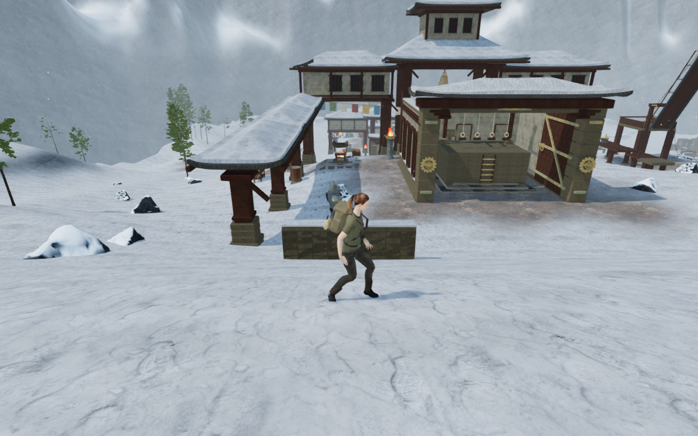
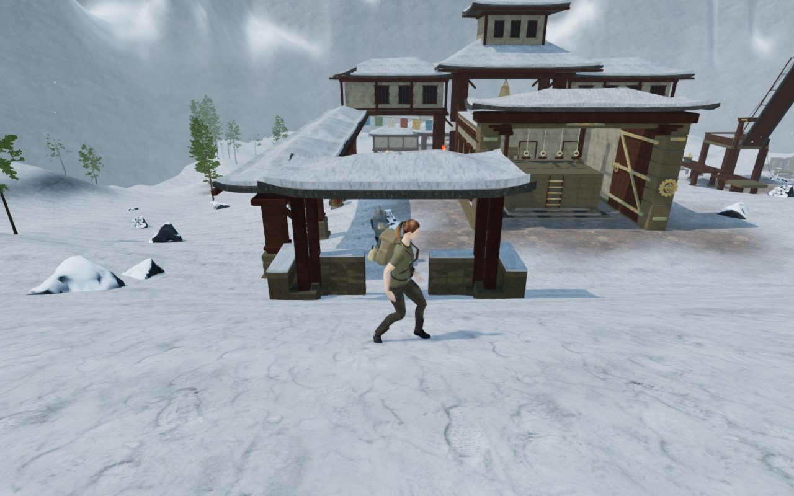
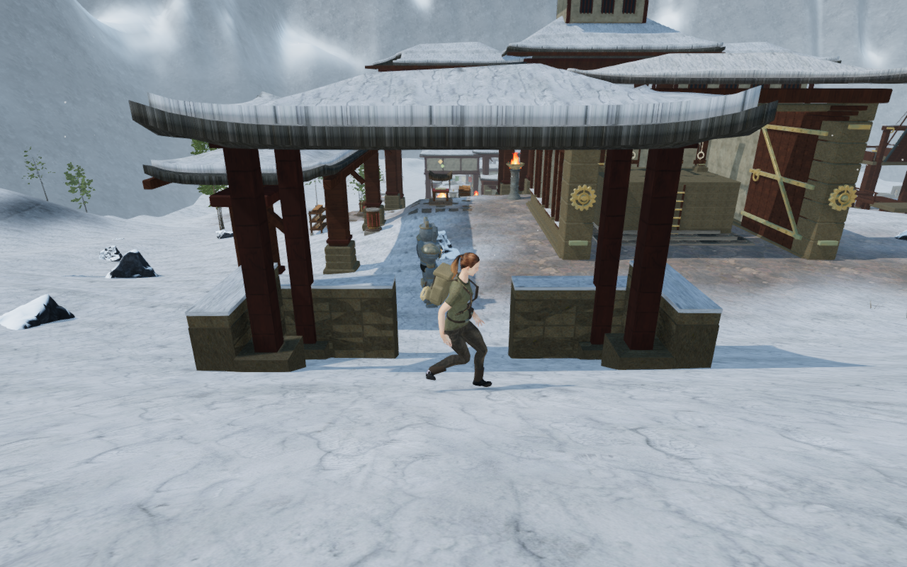
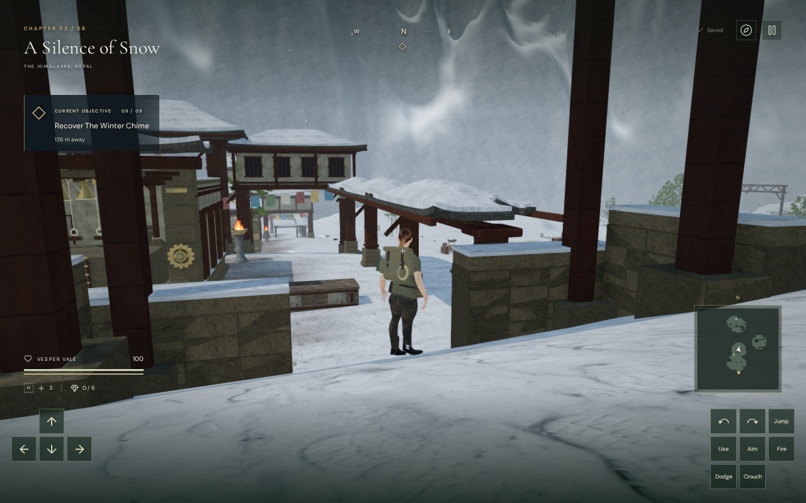

# Joined snow gardens and roofed galleries

The monastery foregrounds now form wider, joined enclosures. Their placement
checks reserve against the existing world before
building the gardens, so a previously built return wall no longer causes its
neighbor to be omitted. Working areas, discoveries, gates, climbing routes,
the frozen stair and the bell hoist retain their reservations.

The delivered scene has **75 wall segments, seven reliquaries and four timber
galleries**. The openings are 2.6 metres wide, and wider side spacing leaves
room to circulate around the shrines. Roofed resting and processional spaces
add another scale of construction beneath the main monastery buildings. The
galleries have individually buried stone feet, fitted posts and beams, closed
slate roofs and matching snow shells; one style retains an intentionally damaged
corner. Reserved areas omit two of the six authored gallery candidates.

| Preceding garden walls | Joined enclosure and timber gallery |
| --- | --- |
|  |  |

The shared monastery roof generator also repairs a material defect visible in
these closer views. Its vertical faces reused the top's planar UV coordinates,
collapsing their texture patches to lines and stretching the normal map into
stripes. Separate side corners now carry horizontal/vertical UVs and outward
hard normals. This repairs the shared roofs on main buildings, sanctuary gates,
field structures, the lift and discovery props as well as the new galleries.
Their shapes, cutouts, triangle winding and physical surfaces remain unchanged.

| Collapsed texture coordinates on the roof edges | Revised slate and snow edges |
| --- | --- |
|  |  |

All four close roof comparisons retain identical recorded player, camera and
elapsed-time values. The shared geometry regression verifies closed surfaces
across exact delivered positions, positive volume, noncollapsed side UV patches
and outward side normals. Across 144 combinations of dimensions, rise, damage,
snow and seed, all 298,056 triangles retain the preceding generator's delivered
vertex positions exactly. Separate side vertices increase the indexed source vertex
count; material batching already expands triangle corners, so this adds no
triangles to the delivered roof surfaces.

All eight chapter grids and existing objective data remain identical to the
preceding garden milestone. The 18 annexes retain their cells, and all 58,081
Snow terrain-grid heights match exactly. Only the garden authoring metadata and
construction change; no save field, runtime asset, dependency or sound emitter
is added.
The construction reuses the credited monastery maps and original roof code.

The [loaded-scene inspector](../scripts/inspect-monastery-gardens-browser.js)
checks actual terrain and batched mesh buffers independently of their collision
kernels. All 1,444 footing probes retain at least 20.49 cm of burial. All 1,125
cap probes and 36 roof probes agree with physical support within 0.002 mm.
All 150 exposed-face entry rays and 36 gallery headroom probes pass, as do the
recessed niches and finite space above the bronze finials. Wall-cap probes limit
their height so an overhead gallery roof is not mistaken for the cap below it.
The additions contain 1,668 source pieces and 77,928 source triangles.

High, Medium and Low render finite HDR values with linked shaders and no GL
errors. Low's direct draw is checked independently because it bypasses bloom.
The revised reservations produce 5,702 winter plants; all 615,816 root probes
pass, with the highest root 12.48 mm below terrain. On chapter change, all 58
tracked garden geometry/material resources and 1,891 winter-cover resources
dispose exactly once, and both chapter states clear.

All 18 areas pass assisted inner-area, foreground and return routes through the
normal movement controller and follow camera: **54 legs, 927.616 metres and
13,500 updates**. This includes entering all four galleries and circulating
beside the shrines. The inspection search uses a 0.7-metre grid to fit the narrow
side paths; movement still uses the production controller at 60 Hz. Progress is
opened and combat is disabled for this geometry survey.

The main ground circuit reaches early, middle and final courts and returns
with full health: **1,007.623 metres, 14,930 updates, 127 batches and 47 reviewed
captures**. All recorded views have finite HDR, linked shaders, legal grounded
positions and no GL errors. A normal mantle onto the sixth court's gallery roof
finishes legally and grounded at full health. After settling, its root matches
the controller's body-footprint support exactly. The assisted step-down returns
to clear soil over 7.195 metres and 83 updates without damage. Its two rendered
views and four final matched architecture witnesses are reviewed.

On the sloped roof, the root is higher than a single centre ray because the
movement disk also contacts the uphill surface. A centre-only comparison is
not a body-support check. The settled landing uses the same support footprint
as ordinary movement. No generic mantle or controller code changes are needed.

All 96 focused regressions pass, including the shared roof's sanctuary,
field-structure and discovery consumers, the garden construction, finite solids,
snow cover, stair, lift and camera checks. The production build passes with the
existing large-chunk advisory. Its final application bundles are
`index-Dd5vsncW.js` and `game-D7-HkJ3Y.js`, alongside the unchanged Three.js and
CSS bundles. Fresh native keyboard/High (1280 × 800) and CDP touch/Low (540 × 900)
checks pass movement, crouch, jump, landing, map display and two complete-store
reloads per case. Both layouts remain within the viewport, and the release has
no development hook. The earned wall-cap save restores its 0.911-metre height;
keyboard movement returns to soil with health 100 and an exact full-store
reload apart from play timestamps. The earned roof save restores its
4.508-metre height, and native movement steps down to soil with full health and
an exact reload. The synthetic ground fixture walks out through a gallery's
wide opening, also with full health. Roof and gallery fixtures have opened
progress and defeated guards to isolate construction from combat.

The gallery's first reload changes yaw by 15 degrees through the existing
arrival camera. Every other store field remains exact apart from play timestamps,
and the second reload preserves the complete store and corrected view exactly.
This location check continues separately after the original all-cases script's
camera-equality assertion; previously passed fresh-input, wall-cap and roof
cases retain their results against unchanged application source and bundles.
An independent check against the final loaded terrain and camera surfaces
reproduces the exact chosen yaw and pitch: the preceding view's 4.313-metre
arm is blocked, while the corrected view retains the full 5.330-metre arm.
No camera-controller change is required.

An older occupied save recovers from the final reliquary footprint to nearby
soil, 2.25 metres away. Health, inventory, objective/discovery/field records,
the other chapter, preferences and creation time remain unchanged. Previous
exploration is retained, and the recovered complete store reloads exactly apart
from play timestamps. Final production checks load the expected four bundles
with no application or HTTP errors or application warnings.

All 24 final native captures are reviewed in aspect-preserving sheets, with
selected play views also inspected at full resolution. Six public lossless
WebP witnesses retain their source dimensions and decoded RGBA bytes. The
following production view shows the opened-progress gallery fixture; the
[portrait touch/Low landing](images/monastery-enclosures/touch.webp) records the
fresh-input case.

Verification uses the shared nine-of-sixteen CPU affinity set, lower priority,
serial expensive checks, at most two test workers and one browser. All
verification browsers, workers and temporary servers are released. The final
host check finds no live verification processes and neither test port
listening. Publication excludes private saves, profiles, staging, installed
dependencies and generated build files; asset attribution remains intact.

The comparison of garden generations reconstructs the preceding architecture
in the current environment, with the same terrain, scans, foliage, lighting,
controller and camera. It is not a full replay of the previous source scene.
The earlier 36 entrance comparisons precede the roof-UV repair; final witnesses
and route views include that repair.

Large courts and repeated main installations still need broader composition
review. Whole-body contacts, subjective listening and device review remain
open. These surveys do not establish a human objective playthrough or AAA
graphics.
