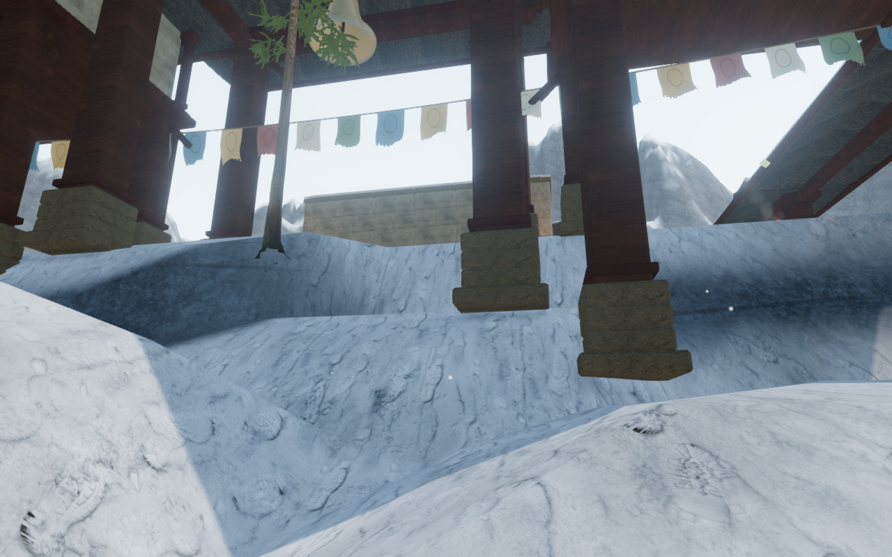
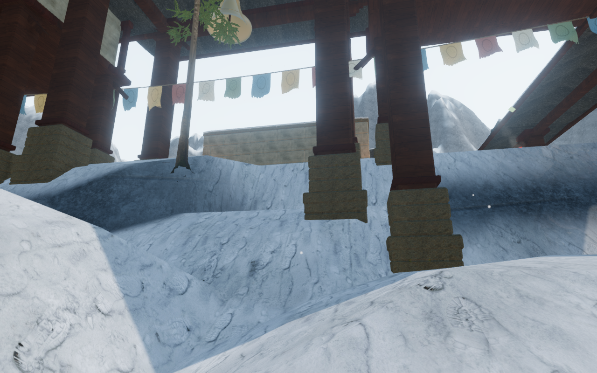
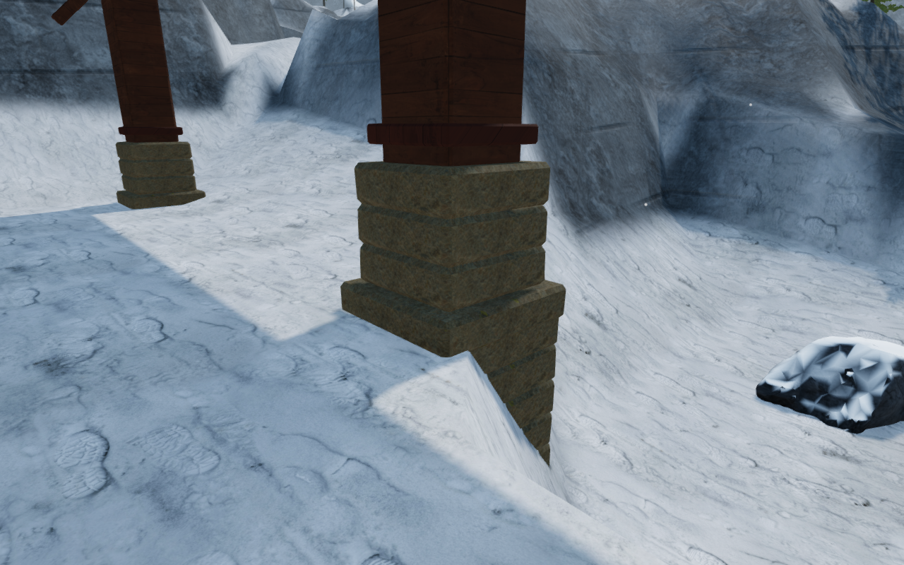

# Monastery foundations on sloping ground

The snow chapter's stone column bases now extend into the terrain beneath their
full footprints. The court survey found 48 of the 147 bases with more than
10 cm of clearance over part of the ground below them. The largest measured
gap was 1.58 m. Previously, each base used only its center's ground elevation.

The correction adds chipped stone courses beneath affected bases, with recessed
solid backing across the joints. It samples the terrain grid cells touched by
each footprint and buries the bottom below their lowest vertex. This also
covers the slopes of the rendered triangles between vertices. The camera's
collision surface extends down with the new stonework. The foundation remains
inside the existing base footprint and uses its existing stone material.

## Comparison

These are actual 1280 × 800 High game renders. The first two use the same
observer position behind court 6, before and after the correction. The third
shows the foundation on the downhill side of that court's most affected post.
The WebP conversions retain the source pixels losslessly.

## Verification

The full automated suite passes **597 tests**. The new checks build all nine
monastery courts and cast horizontal rays through the formerly exposed spaces
against the merged stone meshes. They also check camera collision beside the
extended foundations. The production build passes, with the existing advisory
about large JavaScript chunks.

All 18 front/rear snow-court views were recaptured. Three close angles of the
worst affected support were also rendered on High, Balanced and Performance.
The quality inspection samples the actual rendered terrain at 81 positions
beneath that post: the new foundation bottom remains at least 0.759 m below
those samples. All nine close views link their shaders without browser errors
or warnings. These are assisted static inspections, not completed routes.

The production build accepted a 3.00 m keyboard sprint beside court 6 and a
1.42 m portrait touch movement/crouch sequence, both at 100 health. The touch
case used muted Performance mode at 540 × 900 without horizontal overflow.
Both cases restored the saved state exactly after reload, apart from the
last-played timestamp. The browser loaded the current build's JS/CSS files,
exposed no development hook, and reported no console warnings, errors or failed
asset requests. These short input checks used disposable saves positioned at
the court; they do not establish complete route coverage or subjective audio
quality.

This resolves the monastery footing issue recorded as VA-01 in the
[playable-world visual audit](visual-audit.md). That audit remains open: other
observed construction and composition issues, court interiors, connecting
routes, field stations, optional areas and moving mechanisms still need work.
This milestone does not establish whole-world visual completion or a consumer
hardware frame-rate target.
