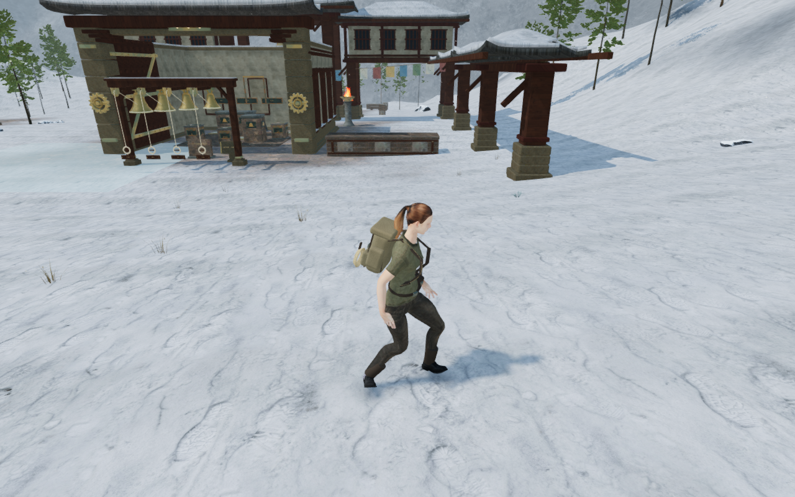
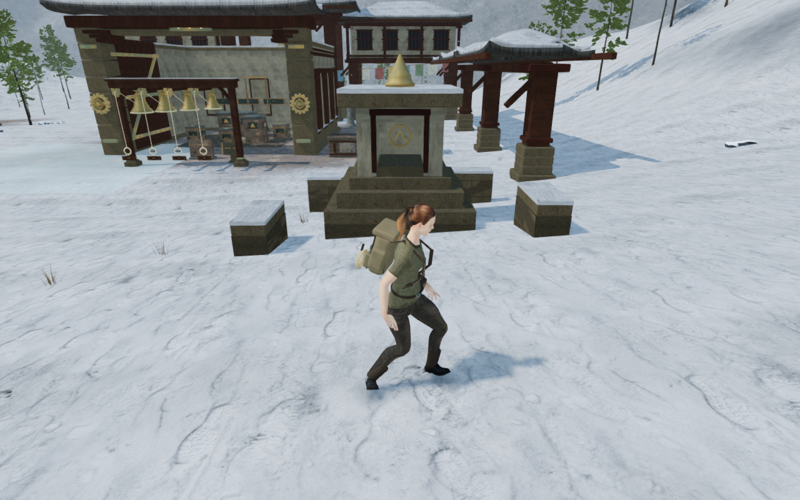
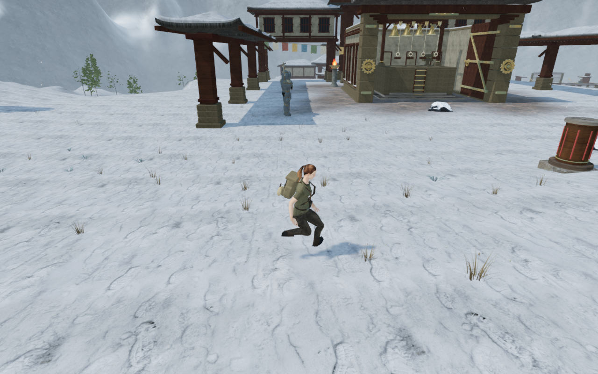
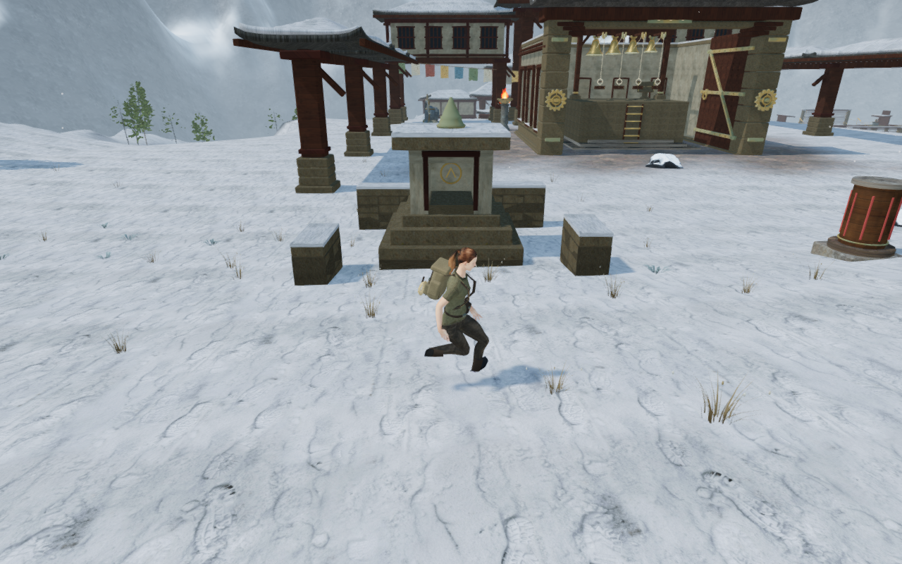
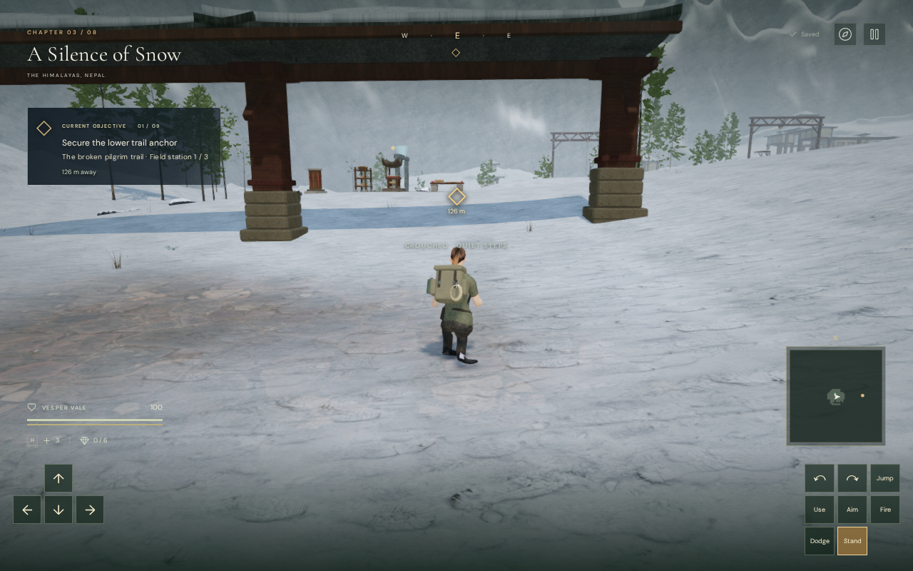
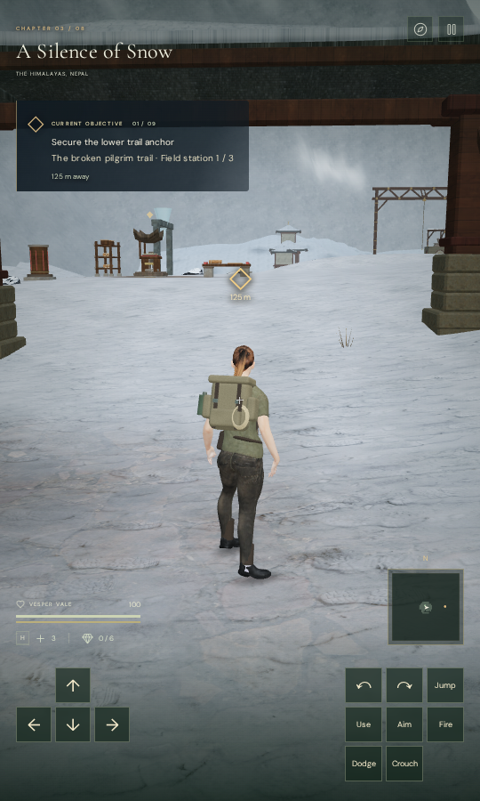

# Walkable monastery gardens

**A Silence of Snow** gains connected foreground spaces beside all nine main
courts. Eighteen authored left/right plans vary low processional walls, broken
enclosures, resting terraces and stepped reliquaries. The delivered scene has
51 wall segments and seven shrines; reservations omit pieces that would crowd
working areas, discoveries, gates, the frozen stair or the cargo lift.

| Same scene with garden meshes hidden | Garden meshes visible |
| --- | --- |
|  |  |

Stone courses sit against recessed backing. Flat coping and thin snow caps
provide real standing surfaces. Reliquaries have stepped bases, whitewash
cheeks, a closed back and lintel around an actual recessed niche, painted timber
and a turned bronze finial. The bronze uses the project's existing patinated
material. The construction reuses the credited monastery stone, plaster, wood
and snow textures; it adds no external asset or dependency.

The map opens 60 additional connected walking cells. Map authoring runs after
the existing objectives and consumes no random values. Rooms, features,
enemies, paths, field sites, spawn, stair and lift metadata retain their previous
values. Across 47,450 sampled positions in previously open cells, movement
heights are identical. The other seven chapter maps are unchanged. The newly
open ground changes nearby terrain edges, foliage and scan placement, so the
hidden/visible comparison above uses the current scene in both images.

Physical pieces retain exact CPU triangle kernels before the render geometry
is combined by material. Body collision, point support and physical rays use
those finite surfaces. Camera captures also survive batching. Niches retain
their empty interiors; tapered crowns do not create solid columns above them.
Footings sample all touched terrain-grid vertices and extend below the lowest
one rather than resting at a single centre height.

The [loaded-scene inspector](../scripts/inspect-monastery-gardens-browser.js)
checks actual terrain and batched mesh buffers. All 940 footing probes are
buried by at least 20.96 cm. All 765 cap probes agree with physical support to
within 0.00181 mm, and 102 near-surface entry rays match the triangle kernels.
Recessed niche voids, backs, cheeks and the space above each finial also pass.
The delivered additions contain 1,068 source pieces and 46,136 source triangles.
These are construction counts rather than hardware frame-rate measurements.

| Fixed High entrance observer | Calls hidden / visible | Submitted triangles hidden / visible |
| --- | ---: | ---: |
| First court, left | 533 / 554 | 1,517,170 / 1,537,126 |
| Bell court, right | 950 / 971 | 1,851,028 / 1,868,548 |
| Sixth court, left | 1,654 / 1,699 | 3,060,852 / 3,110,592 |
| Final court, left | 1,919 / 1,977 | 3,410,527 / 3,463,283 |

These whole-scene counts include shadow and postprocessing submissions at the
recorded static cameras. Hidden captures retain the same physical surfaces and
camera state; they measure the meshes' visible contribution.

High, Medium and Low render finite HDR values with linked shaders and no GL
errors. Low's direct draw is measured separately because it bypasses bloom.
The map change produces 5,710 winter plants; all 616,680 independent root probes
pass, with the highest root 12.48 mm below terrain. All 53 tracked garden
geometry/material resources and 1,891 winter-cover resources dispose exactly
once on chapter change. Both states clear in the next chapter.

All 18 areas pass assisted approach-and-return walking through the normal
movement controller and follow camera: 36 legs, 905.221 m and 13,116 updates.
Each room's survey starts at a legal main-court position. All 36 arrival/return
captures and 36 matched hidden/visible entrance captures are reviewed. Opened
progress and disabled combat make this a geometry survey, rather than an
objective playthrough. A normal mantle onto a garden snow cap finishes legally,
grounded and at full health. The main ground circuit reaches early, middle and final courts and returns
to the entrance: 1,006.983 m, 14,920 controller updates, 126 batches and 47
reviewed captures. The expanded map permits a shorter return than the preceding
1.044-km survey; this is a new route, not an exact replay. All recorded views
retain finite HDR, linked shaders, no GL errors, legal grounded positions and
full health, with no application errors or other console warnings.

All 73 focused regressions pass across map authoring, gardens, winter cover,
snow geology, finite station solids, monastery construction, the frozen stair,
bell hoist and camera behavior. The production build passes with Vite's existing
large-chunk advisory. Its final application bundles are `index-C1Afpqtl.js`
and `game-DxbaZrF6.js`, alongside the unchanged Three.js and CSS bundles.
Native production keyboard/High at 1280 × 800 and actual CDP touch/Low at
540 × 900 pass movement, crouch, jump, landing, map access and two whole-store
reload comparisons per case. The built page has no development hook or
horizontal overflow, and the landed player retains full health and zero
height above ground.

The earned garden-cap save restores its exact position and 0.9106-m height
above terrain. Native sideways input steps down, travels 7.64 m at full health
and preserves the complete grounded store through another reload. Forward
input reaches ground but falls short of the survey's two-metre travel threshold;
the sideways route is the verified exit.

An older occupied fixture at `(71, 350)` recovers onto clear ground at
`(73.25, 350)`. Objectives, inventory, its valid earned checkpoint, prior
exploration, settings, creation date and the other chapter remain intact.
The recovered whole store reloads exactly apart from the existing play timestamp.
A missing checkpoint retains the game's existing entrance initialization; the
preservation fixture supplies a valid checkpoint. This needs no save schema or
migration change.

All 17 native captures are reviewed. The complete survey has 140 reviewed
captures across comparisons, walking routes, quality settings, the assisted
cap landing and native checks. There are no application errors, failed HTTP
assets or other console warnings. Driver ReadPixels diagnostics are recorded
separately. The native page's bundle names match the final build.

The six public WebPs preserve every source RGBA byte and original dimension.
Verification uses the shared nine-of-sixteen CPU budget, at most two test
workers and one browser, with expensive checks run serially and staging kept
inside the ignored workspace folder. Temporary servers, browsers and workers
are closed; the host process and port check finds none remaining.

| Same final-court foreground with meshes hidden | Foreground with meshes visible |
| --- | --- |
|  |  |

| Native keyboard / crouch | Native portrait touch / landed |
| --- | --- |
|  |  |

This adds local foreground interest and spaces to explore. Large court
composition, repeated main installations, broader campaign contacts, subjective
listening and device review remain open. This milestone does not establish AAA
graphics or a full human objective playthrough.
