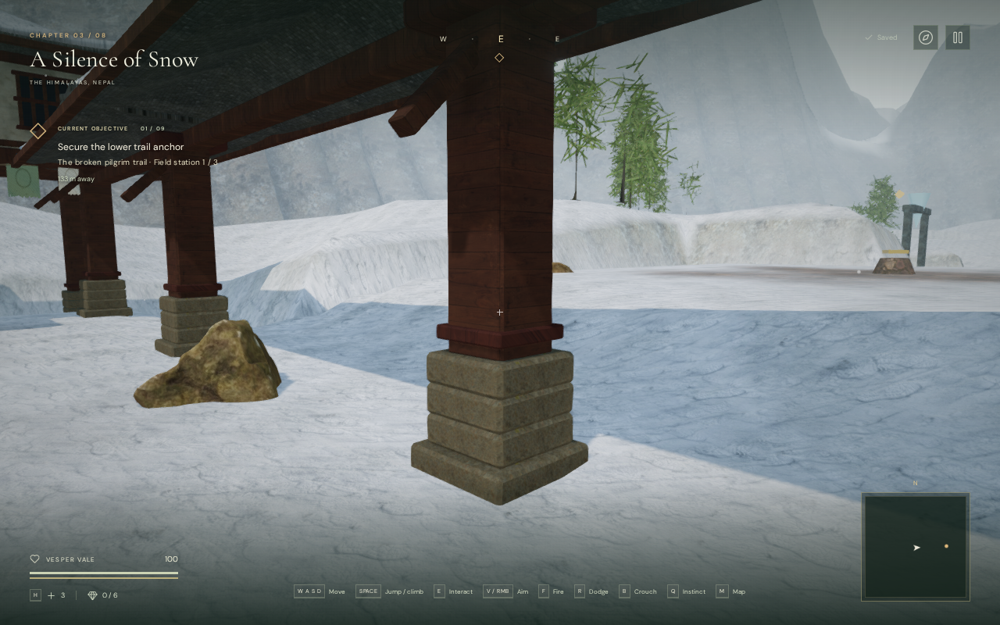

# Monastery column joints

The mountain chapter's 147 timber columns now meet their stone bases across all
nine courts. Previously, each shaft began 20 cm above its pedestal, leaving a
visible strip of daylight beneath the gallery and pavilion supports.

The shafts extend 24 cm downward, seating slightly inside the chipped stone
faces. Their lower painted collars follow that extension, and their upper ends
keep the existing beam joints. This adjusts the original procedural geometry
in `src/monastery-architecture.js` and reuses the
[credited monastery materials](asset-credits.md#environment-scans-and-pbr-materials).

## Browser comparison

Both images use the same 1280 × 800 High view, observer position and animation
time in the actual game. The published WebPs preserve the captures' RGBA pixels
exactly.

## Verification

Vertical rays sampled nine points across each of the 147 joints in the built,
batched browser world. All **1,323 samples** originally found gaps between
18.96 and 20.92 cm. After the correction, every sample found the timber seated
3.08–5.04 cm inside the stone. The small overlap accommodates the irregular
faces rather than relying on two perfectly flat surfaces meeting.

Six matched views — a court and a close joint on High, Balanced and Performance
— retained identical draw-call and submitted-triangle counts. The High close
view reports 368 calls and 980,783 triangles across its rendering passes;
Performance reports 82 calls and 230,916 triangles. These counts are not a
frame-rate benchmark.

The before/after world snapshots retain identical movement obstacles and all
72 sound-source positions, with 1,296 camera surfaces in each. Browser checks
found a sampled approach for all 54 non-guardian features, clear access to all
40 bell controls, and clear sound paths from each control to its bell. All nine
wind sources remain aligned with their banners. Forty assisted walking legs
around the eight bell racks completed using the movement physics with field
gates opened for review.

The 19 focused monastery/bell tests pass. The full suite passes **478 tests**
in 157.83 seconds, and the release build passes in 4.55 seconds with its existing
large-chunk advisory. The corrected development captures report no browser
errors, warnings or failed asset requests, and their active shaders link.

The production chapter accepted native keyboard sprinting over 3.00 m and a
portrait two-finger movement/crouch sequence over 1.36 m, both at full health.
The portrait check used muted Performance mode at 540 × 900 and found no
horizontal page overflow. After pausing and reloading, each case restored the
saved state exactly apart from its last-played timestamp. The release exposed
no development hook, loaded the current build's four JS/CSS files, and reported
no console errors, warnings or failed asset requests.

This is a structural visual correction. Full-duration blind chapter playtests,
broader browser/device coverage, subjective sound and music review, and the
requested modern AAA graphics standard remain open.
