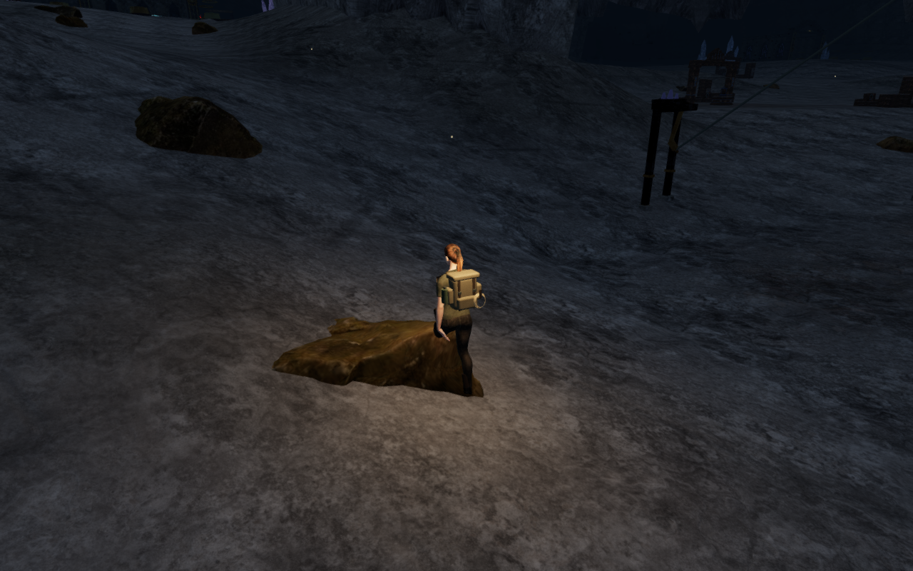
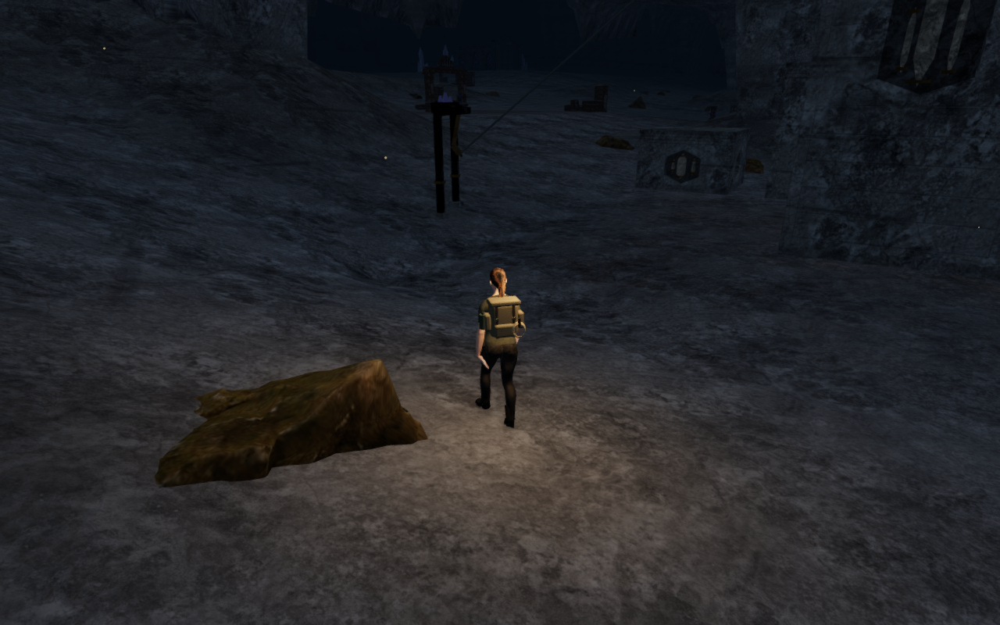
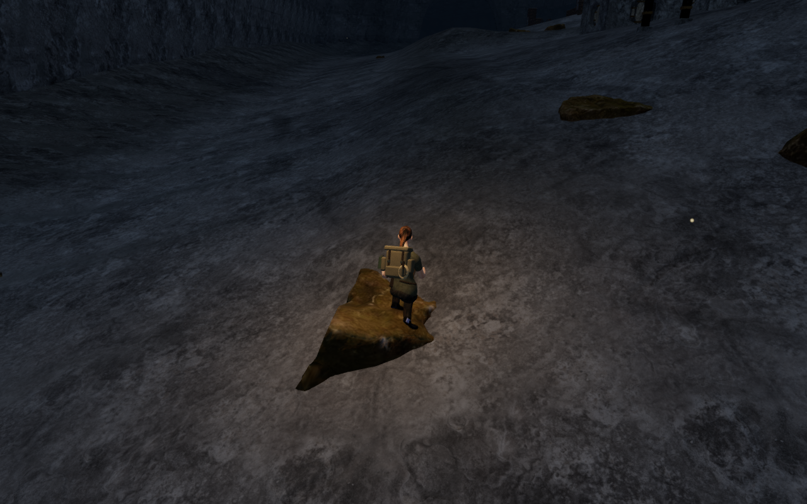
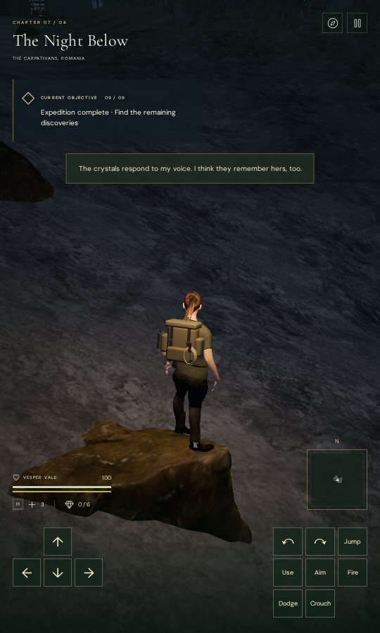

# Scanned-rock contact

An ordinary approach to a crystal climbing course let the explorer
walk into a scanned rock. The controller accepted the position while the
delivered animated body intersected the stone: 1,637 of 48,095 vertex records
lay more than 15 mm inside it, with the deepest boot record 298.312 mm inside
the actual surface.

Scattered rocks now participate in movement, footing, camera clearance,
sight, sound occlusion and shot cover. Shallow surfaces within the existing
45 cm step window support walking; higher sides block it. Jumping can land
on the stone, and saved positions retain that earned support after the
asynchronous models load. The original rock placements and artwork remain.

The following images show the reproduced overlap and a later ordinary
walking passage beside the retained stone. The controller takes a different
path after the repair, so these are different body and camera poses.
Both are actual game captures, converted losslessly to WebP.

## Surface queries and movement

`src/nature-rock-solids.js` builds a world index from the delivered rock and
gravel triangle geometry and the immutable authored instance transforms.
The index stays independent of visible LOD buffers, including when those
buffers repack nearby instances or hide distant ones. Shared position and
index attributes reuse one triangle kernel even when the render patches
have separate geometry wrappers. The actual crystal world has 330 placements
and six shared kernels; no additional GPU meshes or materials are created.

Root support queries use the highest triangle surface over a 55 cm horizontal
disk. The calculation includes triangle vertices, edge/circle intersections
and the surface's uphill extremum, avoiding gaps between a few sampled rays.
Point queries supply the existing boot IK with the surface under each foot.
The movement query clips triangles to the body's vertical extent, checks
their projected distance to that disk, and includes a solid-interior check.
Grounded steps and airborne landings retain their existing rise windows.

The camera lens uses a smaller clearance disk. Sight and shots instead use
raw triangle intersections without the body margin. The existing positional
audio callback uses that sight query for its occlusion filter. The existing
distance falloff and quiet chapter/objective scores retain their settings;
this change supplies rock obstruction to their world queries.

## Actual body contact

The independent browser observer reads the delivered animated body vertices,
checks inside/outside against the actual rendered rock triangles, and measures
the nearest surface distance. It does not infer clearance from the new
controller's collision shape. Its negative control reproduces the old legal
intersection at crystal `field-6-0` approach 4.

Seven radial approaches have legal ground starts near the retained stone.
Walking and crouched observations across those approaches produce 28 poses
and 1,346,660 delivered vertex records. None lies more than 15 mm inside the
stone, and every observed controller position is legal. The eighth radial
direction has no legal ground start and is explicitly skipped. All 28 final
captures are reviewed. This is local contact evidence, not a clearance audit
of every rock and animation throughout the campaign.

## Continuous routes

All 21 authored climbing courses complete their ordinary approach, successive
mantles, jump gap, moving-rope crossing, summit, unlocked return cable and
ground walk back with the new rock queries. The observer checks the complete
authored course-ID set across all eight chapters.

| Chapter | Courses | Camera updates | Reviewed captures | Minimum camera arm |
| --- | ---: | ---: | ---: | ---: |
| Jungle | 1 | 4,316 | 57 | 4.489 m |
| Desert | 2 | 9,002 | 117 | 2.313 m |
| Mountain | 4 | 6,571 | 109 | 3.211 m |
| Coast | 2 | 7,338 | 99 | 2.644 m |
| Volcano | 1 | 1,392 | 24 | 3.958 m |
| Cloud city | 5 | 7,758 | 131 | 2.313 m |
| Crystal cave | 4 | 9,741 | 143 | 2.550 m |
| Observatory | 2 | 5,008 | 74 | 2.805 m |

Across 51,126 updates the explorer retains health 100 and full camera opacity,
with no fades. All 754 route captures are reviewed. These runs use completed
expedition fixtures, controller-driven movement and removed enemies. They
verify traversability with the new obstruction queries; they do not establish
a human campaign playthrough, combat balance or consumer-device performance.

The loops and body-contact observations use the final shared-kernel code.
A subsequent arrival-only correction prevents a saved ground position from
being lowered to a buried rock surface. The final full suite and production
checks below run after that correction; the walking loops are not repeated
for that save-only guard.

## Production controls and saves

Rock models arrive after the synchronous chapter restoration. Before loading
releases, the owned asset batch now checks the restored position against their
final surfaces. An old position inside the stone moves to nearby supported
footing, preserving the chosen look direction and campaign progress. A saved
position already on top of the stone retains its earned elevation. Buried
scan surfaces cannot lower an otherwise valid arrival below the soil.

Four production-browser cases cover the reproduced occupied position and an
earned rock-top position, each with keyboard/High and portrait touch/Low
controls. Both occupied arrivals move 0.75 m horizontally to clear footing.
Both supported arrivals retain their original coordinates and 0.620231 m
height above the underlying terrain. Native crouch, look and walking work;
the supported cases also jump and land back on the rock. Health stays 100.

Complete stored progress survives the initial arrival and repeated reloads,
apart from timestamps and the intended position correction. Manual look and
subsequent movement persist through another pair of reloads. No case needs a
camera-angle correction. All eighteen native captures are reviewed, with no
browser warnings/errors, failed assets, horizontal overflow or development
hook. Loaded JavaScript and CSS match the final production build.

## Verification and remaining scope

Seven new regression tests cover the six delivered scans under rotation,
scale and desert squash; 1,764 independent vertical support/ray comparisons;
the exact disk extremum; the recorded overlap and older-save recovery;
stepping, stopping, landing and saved elevation; camera/sight/shot queries;
real LOD kernel sharing and buffer disposal; and the buried-surface arrival.
The final full campaign suite passes all 810 tests. The final production
build passes with the existing large-bundle advisory.

Verification uses the shared CPU budget helper on nine of sixteen available
CPUs, within the owner's 60% limit, with at most two test workers and one
browser. Browsers, preview servers, image workers and test workers are stopped
after their final checks. Private fixtures, browser profiles, full captures,
logs and helper scripts stay under the ignored workspace staging directory.
The four published images preserve the source captures' dimensions and
decoded RGBA pixels.

Broader body/terrain contact, scattered-rock placement, repetitive layouts,
sparse cave and observatory areas, landscape composition, listening quality
and real-device acceptance remain under review. The remaining observatory
piers still need regional artwork. There is no minimum chapter duration,
and this milestone makes no commercial AAA quality claim.
