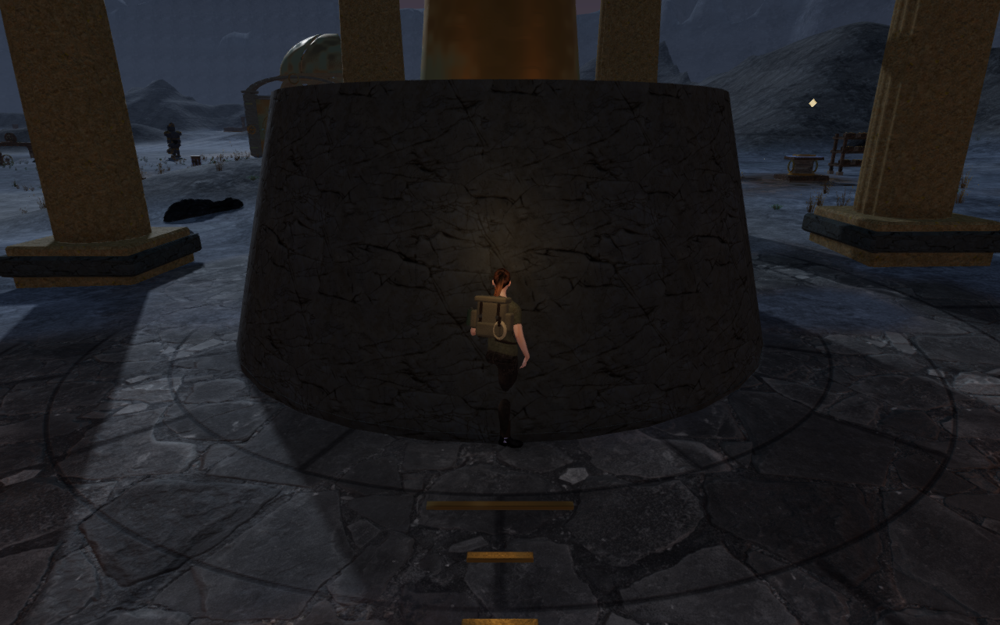
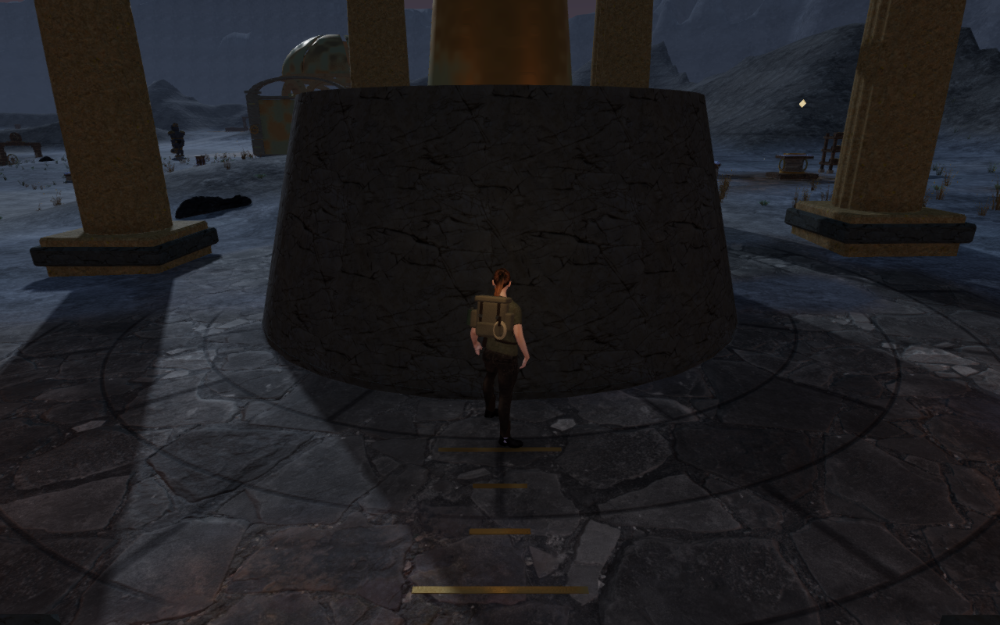
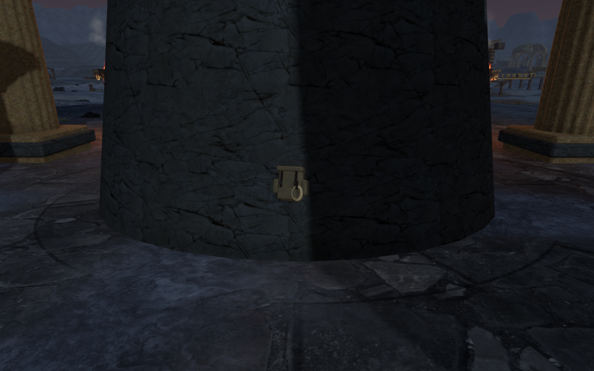
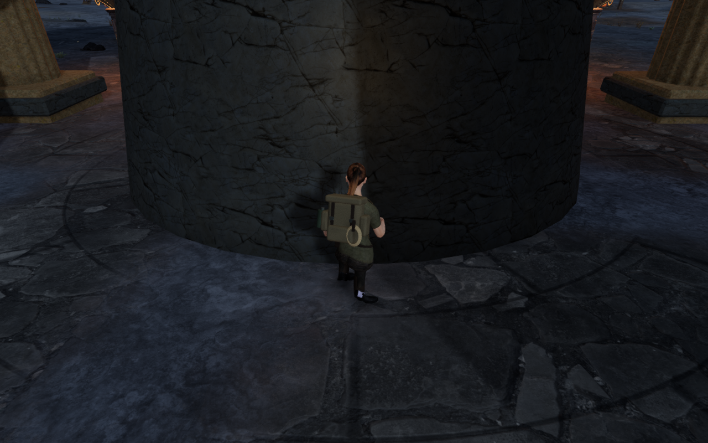
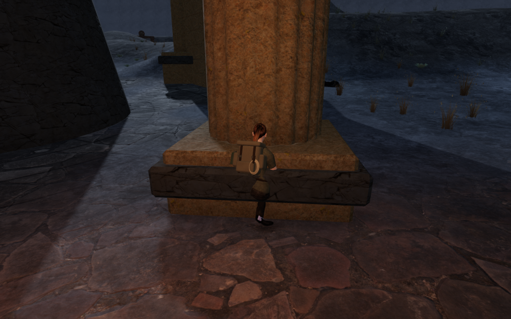
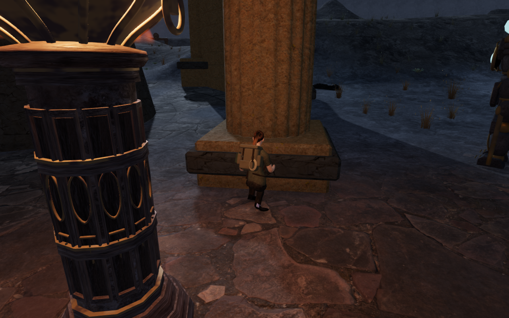

# Observatory body clearance

Normal ground movement could place the explorer inside the Last Meridian's
pedestals and column bases. The delivered-mesh observer reproduced 639,598
body records deeper than 15 mm inside pedestals, reaching 671.968 mm, and
357,314 inside column construction, reaching 420.290 mm. These were legal
controller approaches with the real standing and crouched character.

The repair uses the existing closed masonry triangles as finite CPU collision
surfaces, with a 0.70 m body disk. Pedestal taper, footing joints, column flutes,
chipped base blocks and trim remain in the world. Sight, sound-occlusion and
projectile rays use the same triangles without the movement margin. Broad
bounds only select candidates. The shared triangle kernel is extracted from
the scanned-rock implementation; its query methods are preserved, and the
rock facade retains authored transforms, shared kernels and support identity.

The first corrected pass found 144 remaining records reaching 20.183 mm in
raised bronze floor graduations. All 198 marks are now seated into the paving:
their vertices follow the terrain, most of the metal stays below it, and a few
millimetres of the top remain visible.

## Delivered geometry and contact

The new regression matches 429,024 collision vertex records to all 374 actual
batched closed masonry parts and compares 14,212 independent surface rays.
It also checks 8,316 top/bottom rays at all 198 closed inlays. Isolated
terrain-and-masonry physics tests cover 120 legal approaches and an older
position that needs recovery.

The final browser check samples eight pedestal directions and four directions
at two columns in each of four courts. It completes 122 standing/crouched
poses, with full opacity and linked shaders. None of the 5,867,590 delivered
body records penetrates the observed construction beyond the 15 mm threshold.
Three column directions have no legal ground start and are explicitly skipped;
they are not counted as clear approaches.

The observer preserves original closed-piece ownership through batching and
reads the actual delivered buffers. It checks 6,026 closed parts separately,
avoiding cancellation where backing and facing overlap. Controller bounds do
not supply the penetration result. All 6,026 temporary observer geometries
emit matching disposal events; their proxies are not added to the rendered
world. Browser errors, warnings and asset failures are absent.

All 64,416 sole samples find actual terrain or masonry triangles. The minimum
height per foot ranges from −0.280 to 28.444 mm. These are sampled animated
outsoles; the check does not require every vertex of a tilted boot to lie on a
single plane.

The comparisons repeat the same controller approach and pose. New stopping
positions also move the follow camera; these are not fixed-camera observers.
All 122 final body captures are reviewed. Foreground guardians and braziers
obscure some side views, limiting what those images demonstrate; the independent
vertex check still covers their poses. The six published images are actual
game captures converted losslessly to WebP, preserving dimensions and decoded
RGBA pixels.

## Routes, sound and saves

All 30 sampled court routes complete 16,105 physics updates. All 22 mechanical
and harmonic source fronts retain clear listening lines. Existing
distance-sensitive emitters and the quiet chapter/objective scores remain in
use. These surface and ray checks do not establish subjective listening quality.

Both complete Meridian climbing loops pass the approach, mantles, jump gap,
moving rope, summit, return cable and ground walk back. Across 5,008 camera
updates, health stays at 100 and opacity stays at one. Every one of the 74
recorded movement, camera/look, height, traversal and field-progress states
matches the preceding enclosure milestone.

Production keyboard/High at 1280 × 800 and portrait touch/Low at 540 × 900 both
pass native strafing approaches, sustained collision, crouching and reloads.
An older saved ground position allowed by the former generic box recovers
1.50 m away without granting progress. Repeated reloads preserve the complete
stored state. Valid outside positions and their chosen side view survive
arrival unchanged, and the complete store survives two further reloads beside
the pedestal. Health stays at 100 and saved ground height stays at zero.

These cases use a clear side view. An initial fixture with an obstructed
forward heading required the existing arrival-camera recovery. Production
assets match the built bundle, no development game hook is present, and
browser error/warning reports and horizontal-overflow checks are clear.

## Validation and remaining scope

All 97 selected tests pass, including all 21 climbing paths across eight
chapters, camera behavior, saves, projectile cover, scanned-rock contact and
orbit mechanisms. The production build succeeds with the existing large-chunk
warning. This does not claim a new full campaign test-suite run.

All 74 final route and ten production captures are reviewed, alongside the
three reproduced baseline body witnesses. Costly checks run sequentially on
the shared nine-of-sixteen CPU set, with at most two test workers and one
browser. Browsers, test workers, build workers and development/preview servers
are stopped. A host process inspection confirms no remaining verification
workloads.

This is sampled ground contact evidence. Raised wall caps, other movement and
animation phases, wider landscape/placement/layout coverage and subjective
listening/device evaluation remain open. It does not establish AAA graphics,
consumer hardware performance or a timed human playthrough. There is no
minimum chapter duration in the current acceptance target.
