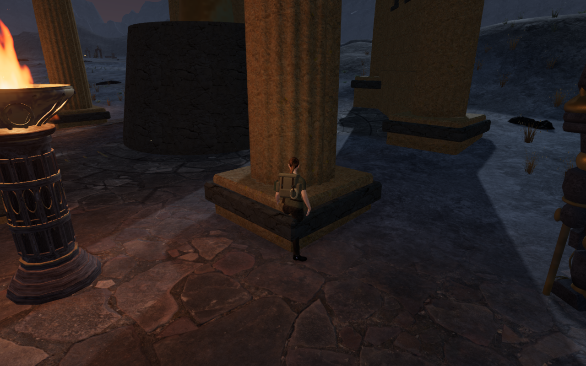
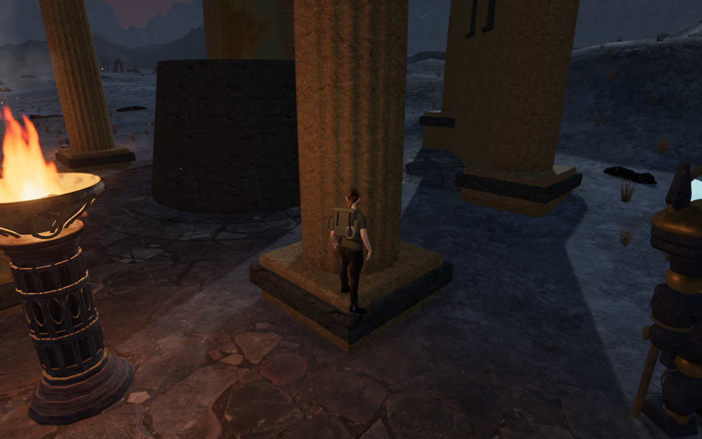
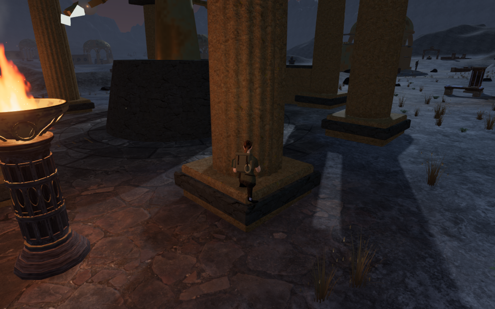
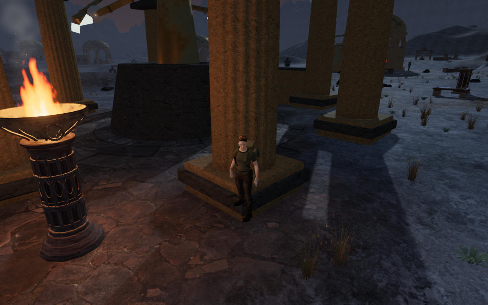
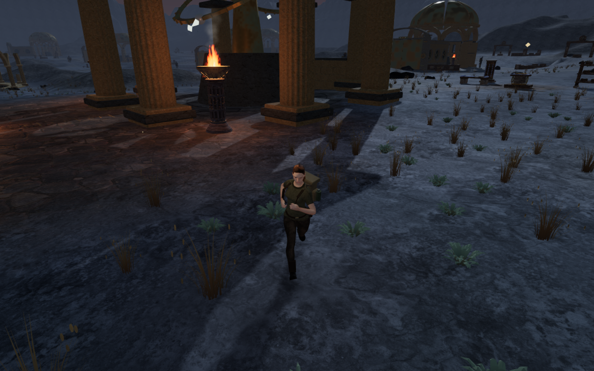

# Observatory cap landings

An ordinary jump from clear ground could reach a Last Meridian column corner
and then fall through its rendered stone base. The browser reproduced 3,350
body vertex records more than 15 mm inside the cap at a settled frame, reaching
292.966 mm. One boot was about 880 mm below the actual top. This was normal
controller movement from a legal ground start, not an airborne placement.

The finite masonry triangles now provide support as well as collision.
Movement and save restoration query the whole body footprint; point queries
for boots and contacts retain the actual surface beneath that point. The
support footprint uses the station's 0.70 m collision margin. Retaining the
smaller rock footprint caught all 32 sampled backward departures on the bevel:
the feet dropped before the body could clear the edge.

The first standing repair exposed another problem. Crouching at these corners
could lower the visual pelvis toward the bevel and bend a knee through the
cap. Across 29 crouched cases, 1,491 body records exceeded the 15 mm threshold,
reaching 74.001 mm. Visual footing now treats drops over 12 cm as unsupported
when the body stands on a finite triangle station. This keeps the knee above
the cap without changing the capsule, earned height or stored position.

## Geometry and movement evidence

The final browser audit uses four diagonal starts at two columns in each of
four courts. All 32 starts are legal in the full world; 26 reach the specified
corner target, and six stop short against nearby construction. All 32 still
land on the actual base, remain legal when standing and crouching, and return
to soil through ordinary backward movement. There are no skipped starts.

The observer checks six phases per trial: two jump frames, the settled landing,
a crouched pose, a descending frame and the returned ground stance. None of
9,234,240 delivered body records in these 192 sampled poses penetrates the
observed construction beyond 15 mm. It independently preserves original closed
piece ownership through batching and checks the actual delivered buffers.
All 2,067 observed closed pieces emit matching temporary-geometry disposal
events. Controller bounds do not supply this penetration result.

All 101,376 sampled sole points find real terrain or masonry. In each settled
standing/crouched pose, at least one foot reaches within 14.441 mm of a surface.
The other foot can extend beyond the cap over the lower ground; these cases do
not claim that both feet are planted. The smallest sole clearance in settled
and ground-return poses is −0.737 mm. The measured landing heights span
0.798–0.901 m above the surrounding terrain.

All 30 local court routes complete 16,105 physics updates, and all 22 mechanical
and harmonic source fronts retain clear listening lines. The existing spatial
soundscape and quiet adaptive scores remain in use; these ray checks do not
establish subjective listening quality.

## Regression and release checks

All 123 selected tests pass. Five new regressions cover point support against
independent rays on rotated chipped stone, 32 normal corner jumps and a
missing-support control, earned-height reloads and old-position recovery,
32 departures to soil, and 192,380 delivered character records through a
crouch transition. The latter uses independent ray parity and a deliberately
buried control point. The earlier masonry provenance regression still matches
all 374 kernels to 429,024 delivered records and 14,212 surface rays.

Both complete Meridian climbing loops pass the approach, mantle, gap, moving
rope, summit, return cable and ground walk back. Across 5,008 camera updates,
health remains 100 and opacity remains one. All 74 recorded movement, camera,
look, elevation, traversal and field-progress states exactly match the preceding
body-clearance milestone.

Production keyboard/High at 1280 × 800 and portrait touch/Low at 540 × 900 both
pass native Forward/Jump input, crouching and backward departures. The touch
case holds the two controls together for the gesture. The earned heights are
0.900 and 0.901 m. The complete stored state, earned elevation and chosen view
survive two reloads. An older saved soil position beneath the cap recovers
1.50 m away, retains progress and survives two more reloads. Health stays 100.
Departure checks let the real-time fall settle before reading the saved height.
Built asset names match the production bundle, the development game hook is
absent, and browser error/warning and horizontal-overflow checks are clear.

All 192 final body poses, 74 route captures and twelve production views are
reviewed in contact sheets, with the six published comparisons and native
standing/crouched witnesses also reviewed at their full size. Foreground
braziers and guardians obscure some angles; the independent vertex checks
supply contact evidence at those poses. The six published WebPs preserve the
source dimensions and every decoded RGBA pixel.

Costly checks run sequentially on the shared nine-of-sixteen CPU set, with at
most two test workers and one browser. All browsers, test/build/conversion
workers and development/preview servers are stopped. A host process inspection
confirms no remaining verification workloads.

The production build succeeds with the existing large-chunk warning. This
milestone does not claim a new full campaign test-suite run. Broader raised
wall caps, other movement/animation phases, landscape and layout composition,
subjective listening and consumer-device evaluation remain open. There is no
minimum chapter duration in the current acceptance target, and these checks
do not establish commercial AAA graphics or a timed human playthrough.
