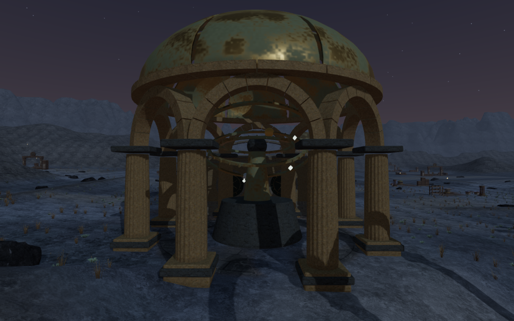
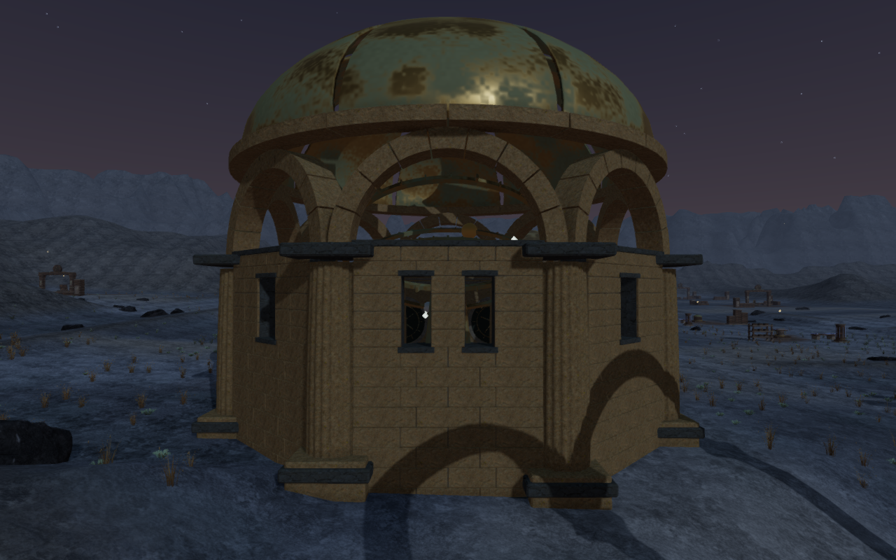
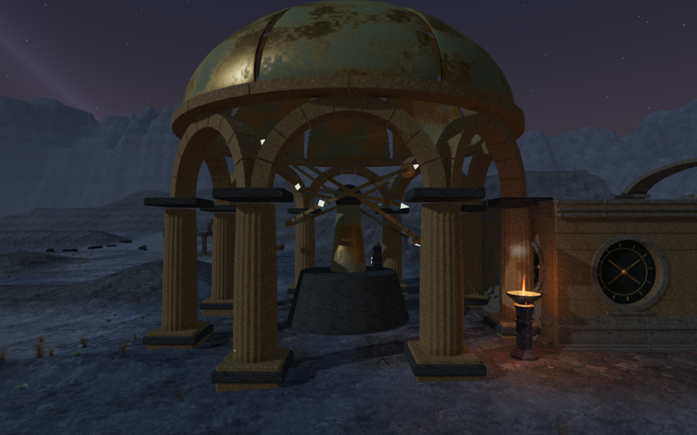
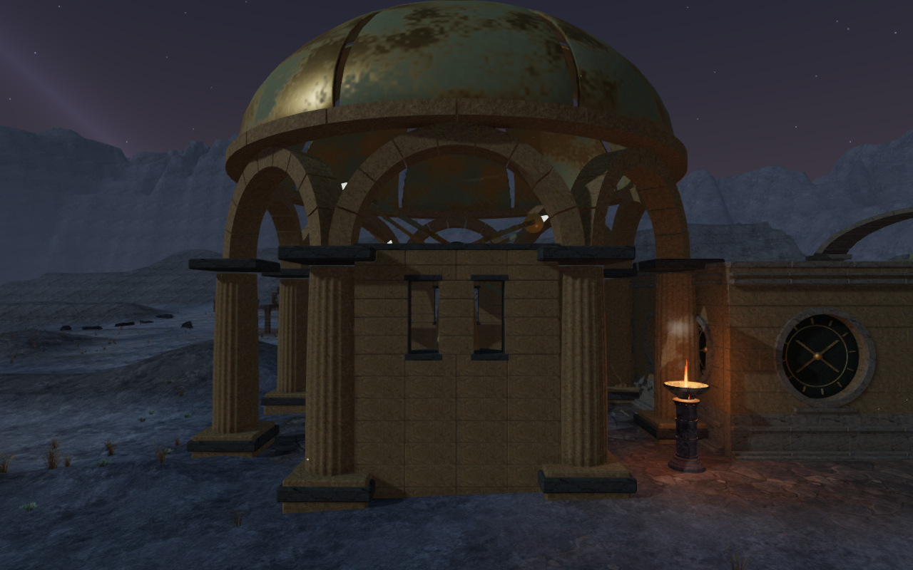
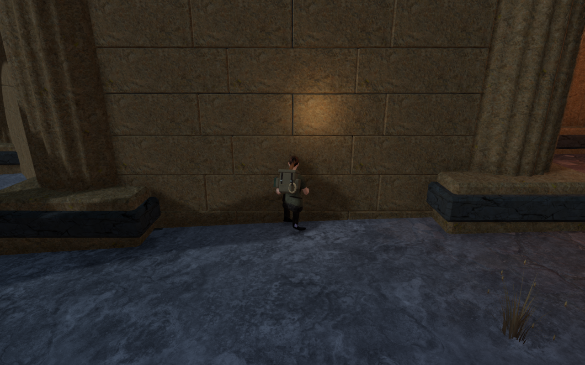
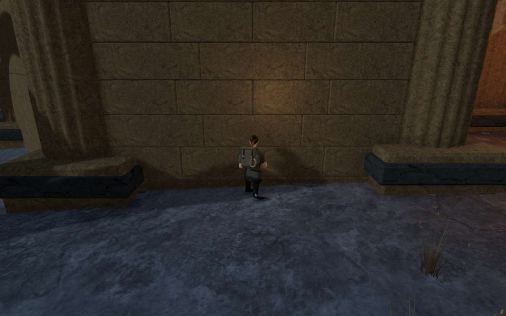
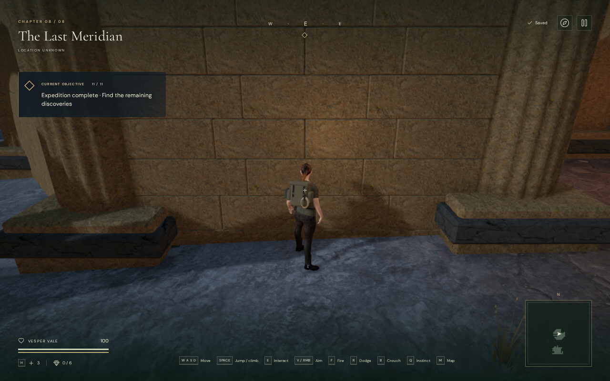
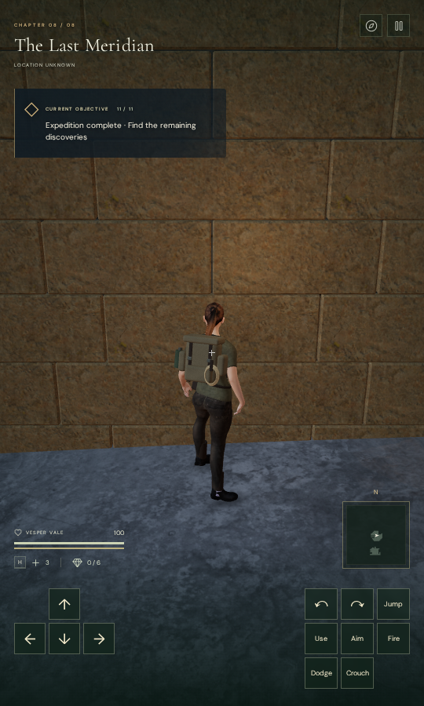

# Observatory enclosures

The Last Meridian's eleven domes now have distinct enclosure plans. Rear
cloisters, paired side chambers, galleries, open courts and stepped wall
remnants give the buildings different masses and routes through their perimeter.
The three forward bays remain open at every dome, preserving the broad approach
from its control court. This changes the room footprints within the existing
domes; broader map layouts and the repeated climbing arrangement remain open.

The construction comparisons use exactly the same camera eye, target and High
quality. They are actual game captures converted losslessly to WebP, preserving
dimensions and decoded RGBA pixels. Animated sky and flame phases can differ.

## Construction and movement

The original geometry in `src/observatory-enclosures.js` adds 33 wall bays
and 36 real clerestory openings across eleven distinct plans. Continuous closed
backing sits behind fitted stone on both faces; mortar recesses retain that
backing. Stone sills, headers, bed courses and caps have closed construction.
The beds extend into the terrain across their complete rotated footprints.
Existing domes, instruments, terrain triangles and puzzle rules are retained.

The walls use finite oriented solids for movement, footing, camera clearance,
sight and sound queries. Ray queries follow the rotated physical box without
the movement margin. Independent tests compare those queries with rendered
Three.js boxes, including empty corners of their enclosing axis-aligned bounds.
Other tests check all forward lanes, full buried beds, body-height masonry rays
and real ray openings through the slots. Existing station callers retain their
previous behavior.

All 55 baseline and 55 final construction captures are reviewed: four High
faces and one Low front at each dome. Each before/final pair has the same
observer and quality, and all final shader programs link. The final browser
warning/error reports are empty. The baseline observer imported a second
Three.js instance and reported a helper warning after its complete capture
set; that private import was corrected before subsequent checks.

Existing control-court construction obscures twenty fixed front views per set, so
those images do not establish the full entrance appearance. The fixed rear
observer at the ninth dome lies beyond the terrain mesh and exposes its boundary in both versions. These construction observers are not
all legal gameplay positions; appearance there still needs a gameplay review.

## Delivered body clearance

The initial movement margin allowed the actual explorer's standing toes to
intersect a new wall by up to 26.070 mm, and crouched clothing by 131.147 mm.
A measurement of the delivered pose places its crouched clothing about
0.631 m ahead of the player root. The new walls now use a 0.70 m body margin.

The independent contact observer partitions the actual rendered buffers into
2,959 individually closed pieces: 117 backing boxes and 2,842 dressed stones,
with 379,356 expanded vertex records. Every welded edge has two owners. It
queries each closed piece separately, avoiding false cancellation where
backing and facing intersect. Logical collision bounds only prune searches;
they do not supply the body-clearance result.

All 32 walking and crouched poses on both faces of eight selected walls are
reviewed, with no skipped approaches. Sustained controller movement stops the
explorer with full opacity. Across 1,539,040 delivered body vertex records,
none is embedded more than the 15 mm test threshold. All 16,896 sole samples
find actual delivered terrain or masonry triangles. The minimum sole height
per foot ranges from 2.051 to 30.628 mm above those surfaces. These sampled
ground approaches do not establish body contact at every old column,
pedestal, raised wall cap or other object in the campaign.

The body comparisons below repeat the same authored wall approach and pose.
The camera follows the player, so its final eye changes with the new stopping
position; these are not fixed-camera construction comparisons.

## Routes, audio and saves

All 30 sampled local court routes complete. The 22 sound-source fronts retain
clear listening lines. Existing distance-sensitive mechanical and harmonic
emitters and the quiet chapter score are unchanged. This geometry check does
not establish subjective listening quality.

Both complete climbing loops repeat the ground approach, mantles, jump gap,
moving rope, summit, return cable and ground walk back.

| Course | Camera updates | Reviewed captures | Minimum camera arm |
| --- | ---: | ---: | ---: |
| `field-3-0` | 3,394 | 47 | 2.805 m |
| `field-3-2` | 1,614 | 27 | 4.480 m |

All 74 final route captures are reviewed. Across 5,008 updates the explorer
retains health 100 and full opacity. Every recorded player/camera position,
look angle, height, grounded state, rope/cable state and field progress matches
the preceding grounds milestone. These controller-assisted checks use
completed-expedition fixtures with enemies removed; they do not establish
encounter balance or a full campaign playthrough.

Native keyboard/High at 1280 × 800 and portrait touch/Low at 540 × 900 pass on
the production build. Each older save inside a new wall recovers 1.50 m to
clear ground, retains other progress and remains stable through two
reloads. A separate valid outside stance retains the full state on arrival;
sustained native walking stops at the wall, and crouching retains health 100
and ground support. The complete localStorage store survives two
more reloads apart from timestamps, with an idempotent second reload.

All ten native captures are reviewed. There are no browser warnings/errors,
failed assets, horizontal overflow or development hook. Loaded JavaScript/CSS
assets match the final production build.

## Verification limits and resources

The full 820-test campaign suite passes before the final change from a 0.40 m
to 0.70 m margin on the new walls. All 34 focused enclosure, observatory,
station-solid, aiming and groundcover checks pass afterward on the final
source. The final production build passes with its existing large-bundle
advisory. These checks do not replace independent geometry/contact review of
every object in the campaign.

The older climbing-sheave regression read construction records after the
camera-surface rebuild cleared them, so its pass did not establish sheave
clearance. The subsequent [cable geometry verification](cable-clearance.md)
corrects that observer and independently checks all 21 delivered cable paths.
Wider geometry and body-contact acceptance remain open.

Verification uses a shared nine-of-sixteen CPU set and lower scheduling
priority, below the owner's 60% limit, with at most two test workers and one
browser. The final development browser briefly overlaps the last campaign
checks after host inspection confirms that limit and ample memory; subsequent
expensive checks run in sequence. All temporary workers, browsers and
development/preview servers are stopped after their last check. Private
fixtures, raw captures, staging, dependencies and build output remain excluded.
No external assets, recordings or dependencies were added; existing material
attribution is preserved.

Broader architecture and repeated map layouts, landscape composition,
worldwide body contact and object placement, later continuous chapter routes,
listening quality and real-device acceptance remain open. There is no minimum
chapter duration, and this milestone makes no commercial AAA claim.
