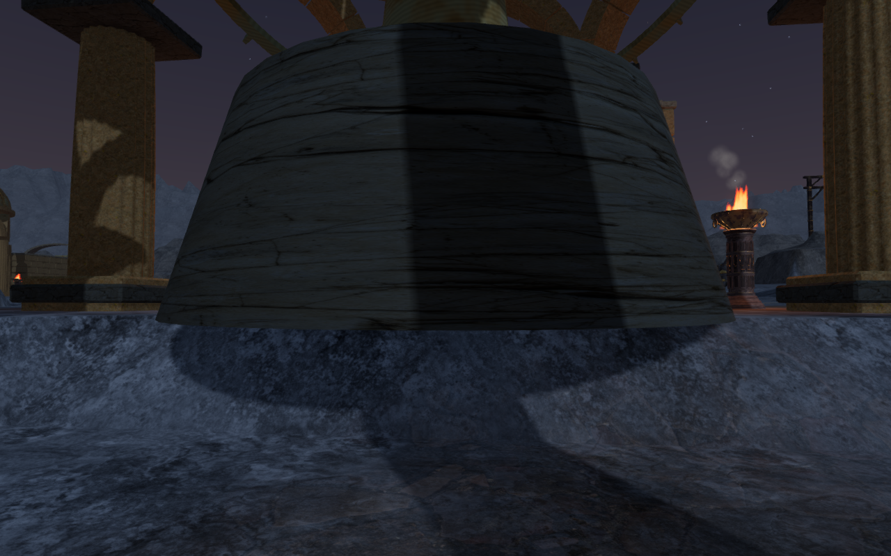
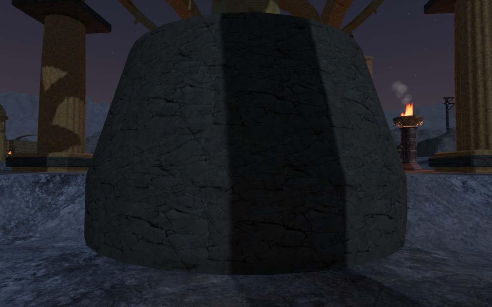
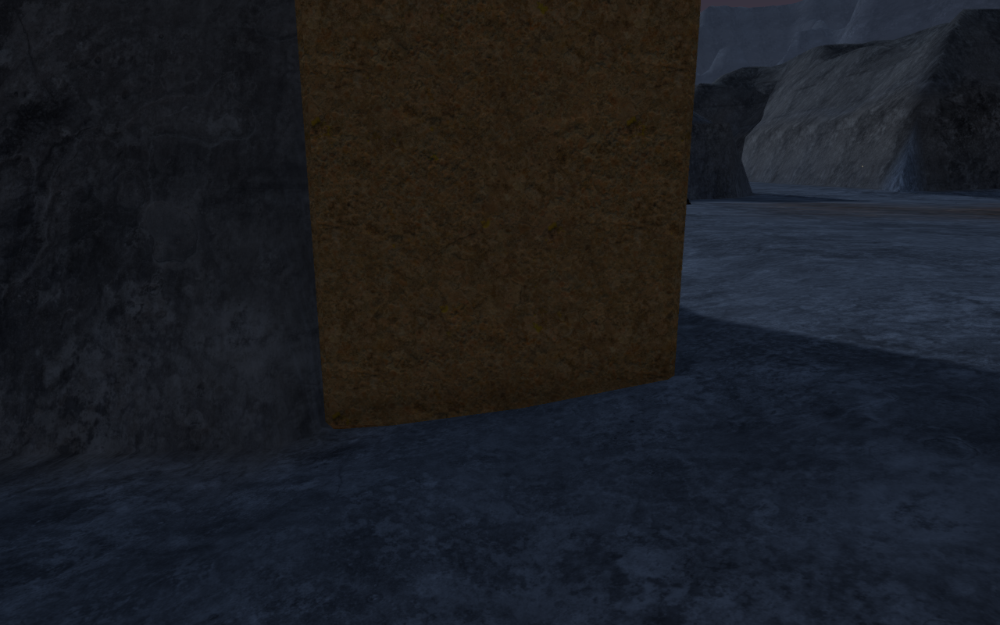
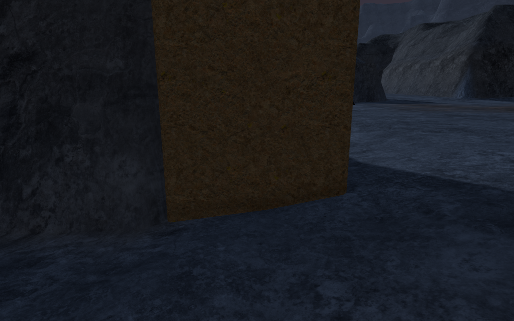

# Observatory stonework meets the ground

The Last Meridian's eleven central pedestals now have continuous stone footing
courses beneath their original plinths. Their bottoms follow the lowest terrain
grid vertices around the full footprint, with 20 cm of burial. The 88 column
bases use the same conservative terrain bound. Their cap and instrument heights
remain fixed, and camera obstruction includes the extended stonework.

The pedestal material now wraps at a consistent stone scale. Previously, one
texture repeat stretched around the entire circumference. Separate cap vertices
keep the new footings' normals and texture coordinates from smearing onto the
side faces. The repair uses the existing local stone maps and materials.

## Comparison and measurements

The original central pedestal bases used only their center's terrain height.
Across eleven circular footprints, three had sampled gaps greater than 10 cm;
the largest was 1.31 m in the fourth court. The separate 88-column investigation
found no gaps greater than 10 cm, but its largest sampled gap was 1.7 cm. The old
column calculation used nine height samples that could miss lower parts of the
rendered triangles.

These are actual game captures from matching cameras. Their WebP conversions
preserve the decoded source pixels losslessly.

The updated browser measurement casts rays against the rendered terrain at
17,688 points across all 99 footprints. Every point has terrain coverage; the
least measured burial is 20 cm. The circular samples include the actual
32-sided perimeter and inner rings. Column samples cover an 11-by-11 grid.
The construction bound also includes the surrounding terrain-cell vertices, so
it covers the triangles between the inspection points.

## Verification

The geometry regression test checks all 99 footings after architecture batching,
casts horizontal rays through the previously exposed pedestal gaps, and verifies
camera obstruction through the extended bases. Its fixture uses the real game
terrain method. All 608 automated tests passed in 193.16 seconds.

Fifty-six updated renders were reviewed: ten close views in each of the three
graphics settings, four additional views with the fourth dome partly or fully
open, and front/rear views of all eleven courts. Every shader linked without
browser errors or warnings.

All 31 local court routes with valid endpoints completed through the existing
[assisted movement helper](../scripts/verify-observatory-browser.js). Two candidate
routes have endpoints inside rock banks and are excluded by that helper. All 63
sampled feature approaches and 22 exterior observatory sound paths remained
clear. These checks do not establish full chapter navigation or a new listening
assessment; sound positions, falloff rules and music arrangements are unchanged.

The production build passed in 4.24 seconds with its existing bundle-size
advisory. Four production cases exercised keyboard sprinting and portrait
two-finger movement/crouching beside the fourth court's pedestal and an entrance
column. They traveled 0.55–4.56 m and retained 100 health. Portrait cases used
Performance graphics with audio muted. All used the current built assets without
a development hook, horizontal overflow, failed requests, browser errors or
warnings. Their four gameplay captures were reviewed.

Three cases reloaded the entire normalized save exactly apart from timestamps.
The longer pedestal walk put the saved camera behind an obstruction; the existing
[arrival-camera correction](arrival-camera.md) rotated it 15 degrees. A separate
assisted check at that exact saved position measured 3.92 m of clearance at the
requested angle and 5.33 m at the corrected one. Every other saved field remained
unchanged. A second paused reload was exact in all four cases, including the
camera angles. These are short local movement and persistence checks.

This repairs the foundation issue tracked as VA-07 in the
[playable-world visual audit](visual-audit.md). Broader architectural composition,
route coverage and the other recorded findings remain open. These local checks
do not establish a consumer-hardware frame rate or commercial AAA graphics.
