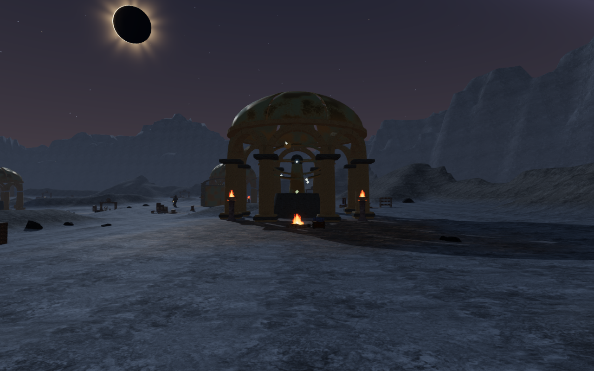
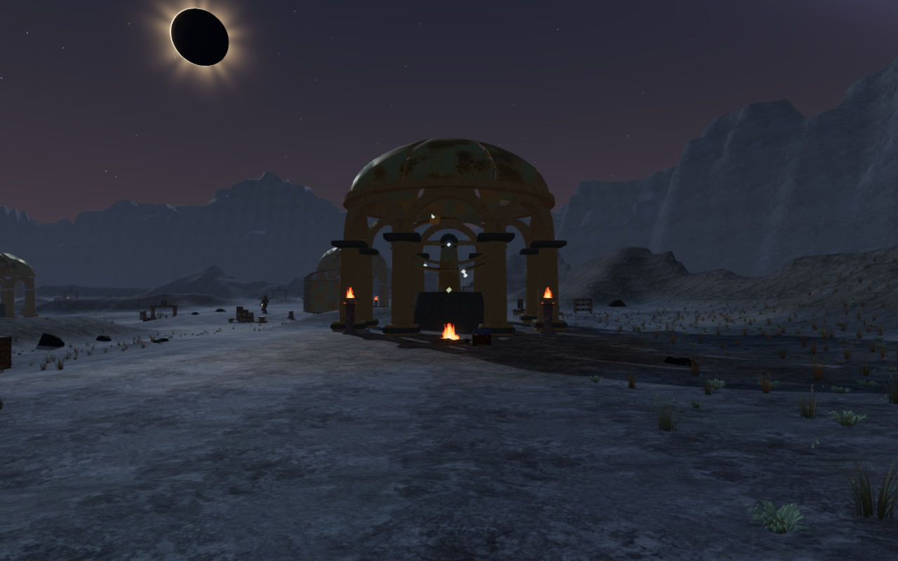
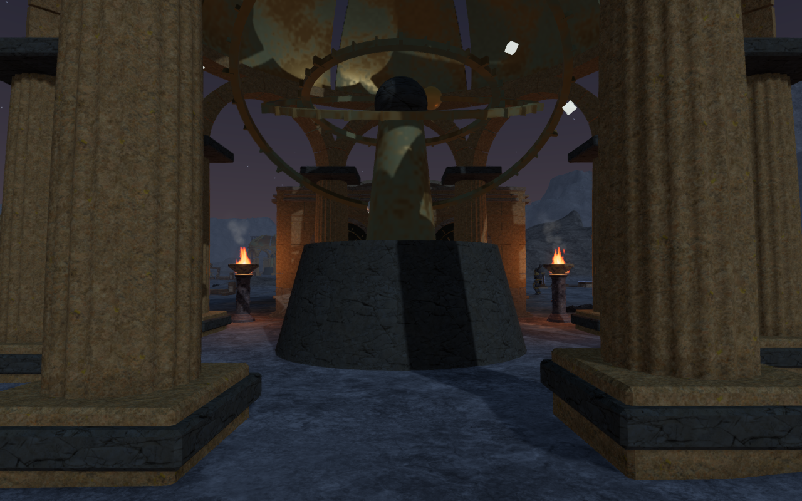
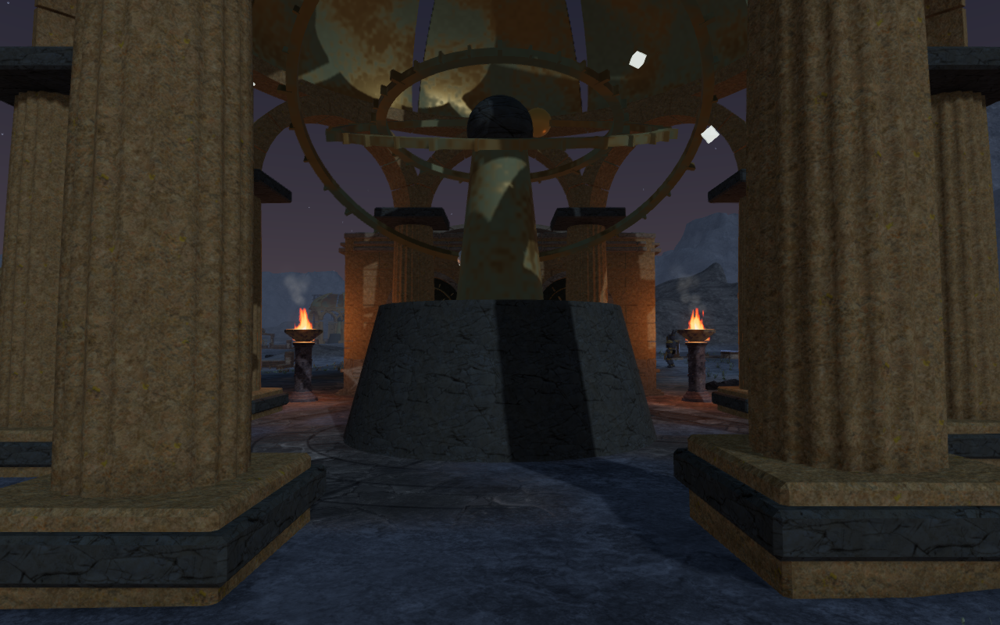
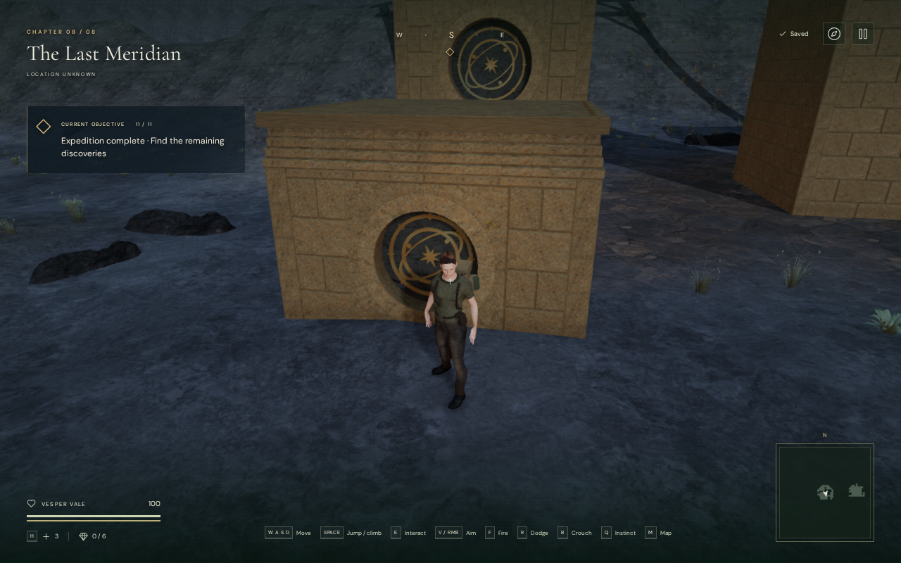
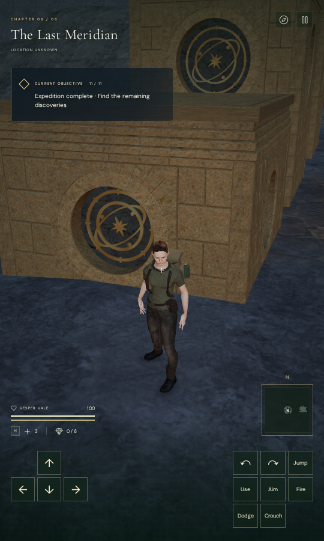

# Observatory grounds

The Last Meridian now has patches of silver bunchgrass, dry flowering stems
and low broad-leaf cushions beside its routes. Muted mineral and oxide washes
break up the ground texture, and weathered radial paving connects the eleven
observatory domes to the surrounding soil. Trails, working spaces and climbing
approaches retain their reserved ground.

These changes improve the chapter's sparse surroundings. The repeated dome
architecture and five-pier climbing arrangement still need composition work.

The comparisons below use exactly the same camera eye, target and High quality.
They are actual game captures converted losslessly to WebP, preserving their
dimensions and decoded RGBA pixels. Animated sky and flame phases can differ.

The second observer looks through an arcade toward its dome floor.

## Planting and paving

`src/meridian-groundcover.js` adapts the project's original folded alpine leaves
into three observatory forms. Coherent habitat patches, deterministic scale,
rotation and tint produce 15,056 plants: 6,506 silver bunchgrasses, 5,271 dry
stems and 3,279 low cushions. The delivered chapter has 448 spatial chunks.
Each chunk has three detail tiers with complementary fades and shorter ranges
on Low quality. Distant inactive chunks skip packing updates. These counts
describe geometry placement, not frame-rate measurements.

Reservations account for plant reach around trails, full climbing-course
projections, machinery, discovery settings and standing positions, dome
interiors, water and actual scanned-rock bounds. Both gate leaves' complete
motion area remains reserved even when open. Candidate randomness is consumed
before reservations, so progress and gate changes retain the same layout.
Leaves move slightly in the wind, while their buried roots remain still.

The terrain shader centers the new paving on the actual dome positions, 17 m
behind the older court markers. Those markers alone contributed little paving
at dome centers. The new mask supplies the dome paving directly, blending its
eroded edge into the soil. Three variants use eight, twelve or sixteen radial
sectors, alternating joints and 1.20, 1.37 or 1.54 m courses. Small joint relief
changes the shading normal; terrain triangles and walking heights are unchanged.
The chapter's existing cliff surface still takes precedence on exposed shelves.

## Contact and cleanup

Independent browser rays test the actual plant root vertex records against
the delivered terrain triangles. All 3,676,068 records find ground, with no
floating roots. The highest root is 14.449 mm below the surface and the deepest
is 329.531 mm below it on a slope. Fresh and completed-expedition plant matrices
match exactly. Quality changes also retain authored plant positions.

All 63 sampled non-guardian feature positions pass the controller's movement
query at their supported elevation. A separate rendered-floor ray has a maximum
absolute height difference of 5.029 mm. The check uses the supported height of
raised mechanism pads, including their 0.515 m elevation. These are sampled
controller-footing checks; they do not establish full avatar-body clearance
through every object or a complete campaign route.

All 22 observatory sound-source fronts retain unobstructed listening lines.
The existing distance-sensitive emitters and quiet chapter score are unchanged.
The new soft leaves do not add collision or sound obstruction. This check does
not establish subjective listening quality.

Changing to the flooded chapter retires all 1,344 groundcover instances,
1,344 geometries and 1,345 materials, including depth materials and hidden
detail tiers. Disposal events match the captured resource sets, and the
groundcover reference clears. No groundcover from this chapter remains active.

All 22 baseline and 22 final court views are reviewed. Final shader programs
link, and browser warning/error reports are empty. The court observers cover
front and rear views at all eleven domes; some rear observers sit inside the
arcade and cannot establish the entire external silhouette.

## Traversal and persistence

Both complete climbing loops repeat the ground approach, successive mantles,
jump gap, moving rope, summit, return cable and ground walk back.

| Course | Camera updates | Reviewed captures | Minimum camera arm |
| --- | ---: | ---: | ---: |
| `field-3-0` | 3,394 | 47 | 2.805 m |
| `field-3-2` | 1,614 | 27 | 4.480 m |

All 74 final route captures are reviewed. Across 5,008 updates the explorer
retains health 100 and full opacity. Every recorded player/camera position,
look angle, supported height, grounded state, rope/cable state and field progress
matches the preceding observatory-pier milestone. These controller-assisted
checks use completed-expedition fixtures with enemies removed; they do not
establish encounter balance or a full campaign playthrough.

Native keyboard/High at 1280 × 800 and portrait touch/Low at 540 × 900 pass on
the production build. Both climb to the first 2.8 m roof, save and reload,
crouch, stand, change the camera heading, descend to ground and reload twice.
The complete localStorage store remains stable apart from timestamps, including
the chosen view; neither case needs an arrival correction, and the second
reload is idempotent. All fourteen native captures are reviewed. There are no
failed assets, browser warnings/errors, horizontal overflow or development hook.
The loaded JavaScript/CSS assets match the final production build.

## Verification limits

All 24 focused groundcover, meadow, geology, instance-LOD and observatory checks
pass on the final source. The production build passes with its existing
large-bundle advisory. The campaign suite now contains 817 tests; this milestone
does not claim a full 817-test run. Earlier campaign results retain the scope
documented at their publication time.

Verification uses nine of sixteen available CPUs, below the owner's 60% limit,
with at most two test workers and one browser. Expensive checks run in sequence.
All temporary workers, browsers and development/preview servers are stopped
after their last check. Private fixtures, raw captures, staging and installed
dependencies remain excluded. No external assets, recordings or dependencies
were added; the existing material attribution is preserved.

Repeated architecture and layouts, broader landscape composition, worldwide
body contact and object placement, later continuous chapter routes, listening
quality and real-device acceptance remain open. There is no minimum chapter
duration, and this milestone makes no commercial AAA claim.
