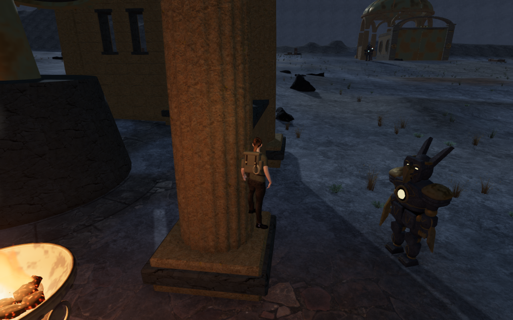
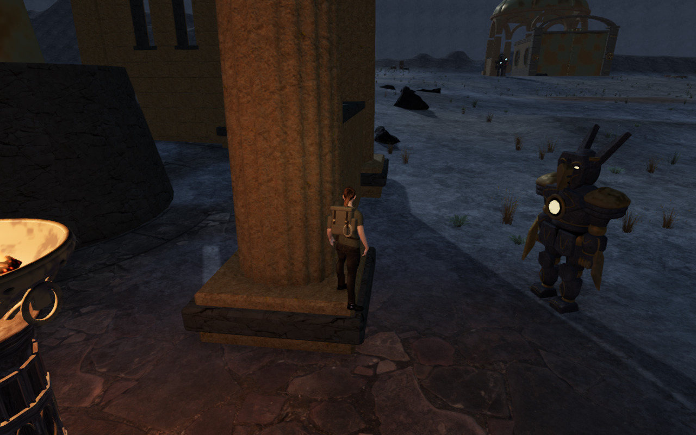
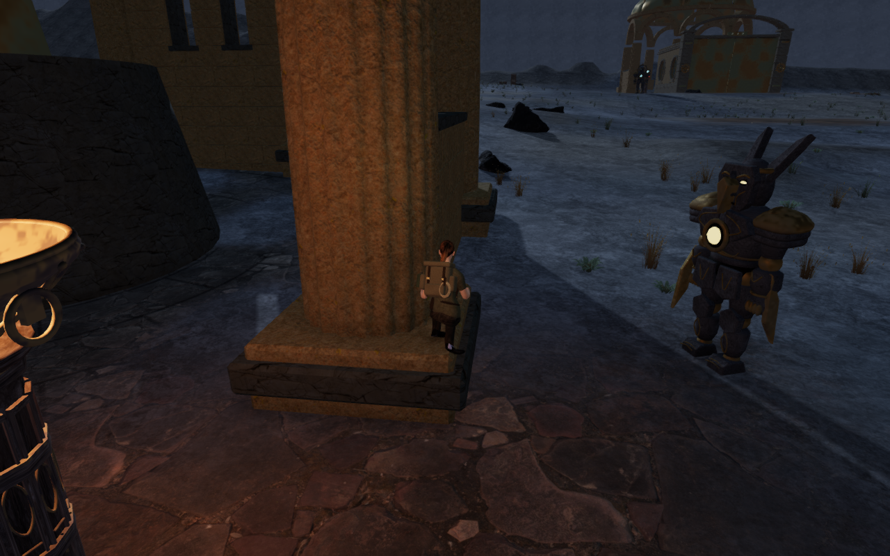
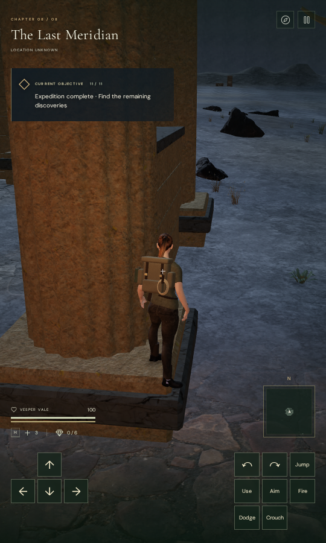
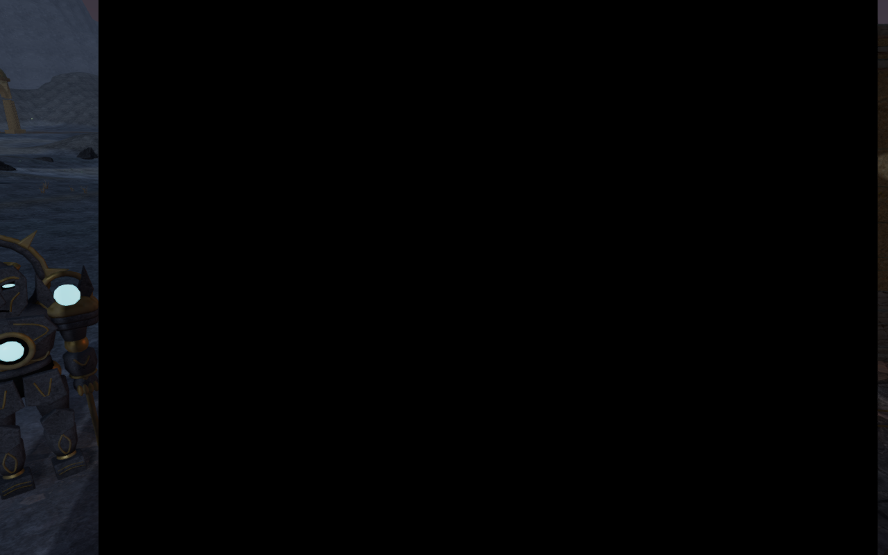
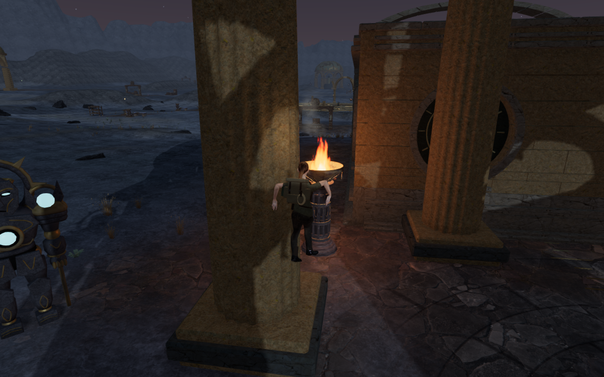

# Observatory shaft footing

After an ordinary jump reached a Last Meridian column base, a second jump
toward the nearby low wall could leave the explorer standing in empty space.
The body support disk touched the tapered shaft above the visible boots and
mistook that steep face for a floor. The reproduced settled pose placed the
boots 1.083 m and 1.269 m above the actual stone beneath them, despite passing
the body collision check.

Masonry body support now accepts upward faces with a world-space vertical
normal component of at least 0.65, about a 49.5 degree maximum slope. The
calculation handles upright rotation and unequal horizontal/vertical scaling.
Exact point probes still report the rendered surface, and the default scanned
rock queries retain their existing behavior. Real column caps remain usable.

Removing the artificial foothold exposed a second issue: the widening shaft
could enter the body during a vertical drop even though the horizontal move
was clear. A bounded lateral clearance search now resolves new vertical
contacts with field station construction. It also handles upward contact with
projecting caps. If a broad ceiling has no nearby clear edge, it stops the
upward motion. Neither response creates a floor on the shaft.

## Measured contact and movement

The original controller route starts on legal soil, jumps onto the base, then
jumps toward the low wall. The corrected final stance is 0.866 m above terrain
on the actual column base. Its closest boot clearance is 13.374 mm, and the
final horizontal correction is about 7 mm. These are normal jumps, without
placing the character in the air.

The wider browser audit repeats four diagonal approaches at two columns in
four courts. All 32 starts are legal; 26 reach the requested first corner and
six stop short against nearby construction. All 32 second jumps land on real
column bases, remain legal when standing and crouching, and leave the bases
through backward movement. The long departure ends on soil in 31 cases and
on an actual supported scanned rock in one case.

None of 9,234,240 delivered body vertex records in the 192 sampled poses
penetrates the observed closed masonry beyond 15 mm. The observer retains
original piece ownership through material batching and examines the actual
delivered buffers. All 2,068 temporary closed pieces emit matching disposal
events. These measurements cover the observed construction; they are not a
claim about every object or unsampled animation frame.

The 101,376 sole samples find terrain or masonry. In each settled first-cap,
second-cap and crouched pose, at least one foot comes within 14.134 mm of a
surface. The other boot can extend over lower ground. The departure that ends
on a rock is validated by its actual rock support and reviewed render, rather
than by treating the surrounding soil as its floor.

Two previously illegal airborne body margins at an overhead cap are clear in
the final controller samples. The corresponding delivered body vertices had
already been outside the masonry; this correction concerns the larger movement
margin. New regression tests also exercise an enclosed ceiling and preserve
its ordinary return to ground.

All 30 local court routes complete 16,105 physics updates. All 22 mechanical
and harmonic source fronts retain clear listening lines. The existing spatial
soundscape and quiet adaptive scores remain in use; these ray checks do not
establish subjective listening quality.

The supplemental rock-support capture exited on its blanket console-warning
assertion because the screenshot driver emitted four “GPU stall due to
ReadPixels” diagnostics. A subsequent review validates its support, body,
linkage and disposal data and verifies identical recorded positions, sole
clearances and body results against the preceding court capture. Those driver
diagnostics are retained; the report does not present that command as a clean
warning-free run.

## Regression and release evidence

All 833 selected checks pass across the 129 test files in 17 serial batches.
A source digest verifies that every batch used the same application and test
sources. The sole exclusion is the unchanged 63-view summit-camera geometry
replay; an unqualified full-suite pass is not claimed. Wind-roof, body/mantle,
movement and save checks are included. Four new regressions cover phantom
tapered-side floors, scaled world slopes, upward edge/enclosed ceiling contact,
and the ordinary two-jump column route with the runtime terrain method.

Both complete Meridian climbing loops finish the approach, mantle, gap,
moving rope, summit, return cable and ground walk back. Health remains 100,
and opacity remains one across 5,008 camera updates. All 74 recorded movement,
camera, look, elevation, traversal and field-progress states exactly match
the preceding cap-landing milestone. The capture command exits on the same
blanket warning assertion after retaining four ReadPixels driver diagnostics;
an independent report review validates both loop bodies and all state matches.

Production keyboard/High at 1280 × 800 and portrait touch/Low at 540 × 900
resume the earned first-jump fixture and pass native Forward/Jump input for
the second jump, crouching and backward departure to soil. The touch gesture
holds both controls together. Both earned final heights are about 0.866 m.
The complete stored state, earned elevation and chosen view survive two
reloads. An older unsupported shaft save at 1.940 m above terrain recovers
1.50 m away on clear soil, retains progress and survives two more reloads.
Health stays 100. Built asset names match the production bundle, the
development game hook is absent, and horizontal overflow and application
error checks are clear. Both devices retain three ReadPixels capture
diagnostics, with no other console warnings.

All 192 final body poses, 74 route captures and twelve production views are
reviewed in contact sheets. The published footing comparisons and native
standing/crouched witnesses are also reviewed at full size. All six published
WebPs preserve their source dimensions and every decoded RGBA pixel.

The review also finds a new unresolved rendering issue: two supplemental
body captures and eight climbing-loop captures contain large rectangular
black regions. A preceding capture at the same court controller position
shows the scene normally; recorded positions, sole clearances and body
results match. The native keyboard/High and touch/Low views do not show these
regions. The cause is unverified, and ReadPixels diagnostics alone do not
identify it: they also appear in healthy native views. VA-74 remains open,
and this report does not claim a clean rendering audit.

The subsequent [finite-shading repair](shader-bloom-finiteness.md) isolates
invalid flame-shader inputs and clears these recorded cases with bloom
retained. That report includes the matching-position reproduction, actual
GPU controls and the additional distant sailcloth repair; the paragraph above
records the unresolved state at this shaft-footing milestone.

Costly checks run sequentially within the shared nine-of-sixteen CPU set,
with at most two test workers and one browser. All browsers, test/build/conversion
workers and development/preview servers are stopped. Both temporary ports
are closed, and a host process inspection confirms no remaining verification
workloads.

The production build succeeds with the existing large-chunk warning.

Broader raised wall tops, other movement and animation phases, repeated
layouts, landscape composition, subjective listening and consumer-device
evaluation remain open. The sampled column-zero and column-seven second
jumps peaked below the low wall top; this does not establish whether other
approaches can reach it. There is no minimum chapter duration in the current
acceptance target. This milestone does not establish commercial AAA graphics
or a timed human playthrough.
