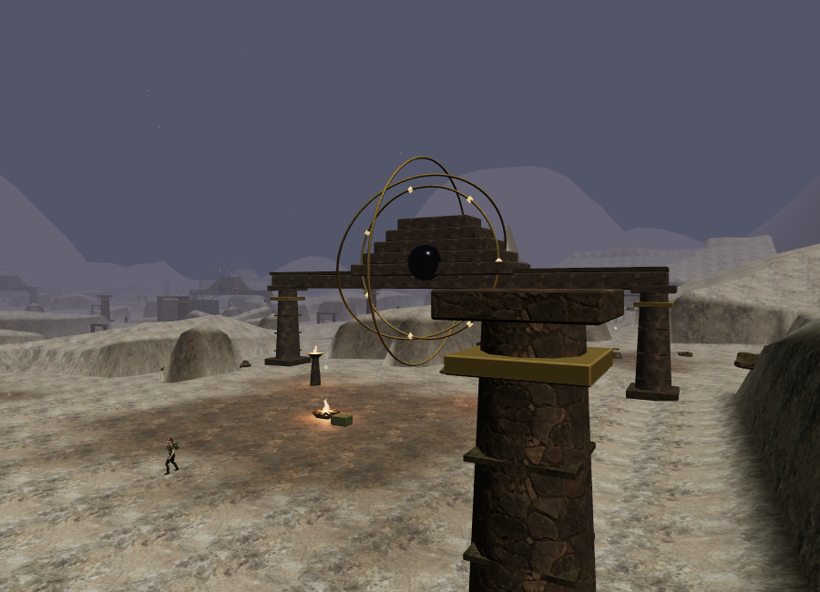
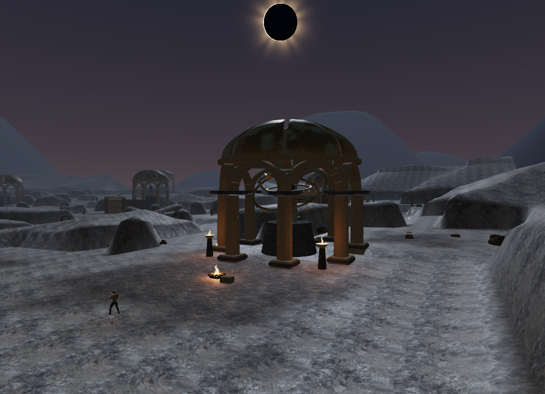
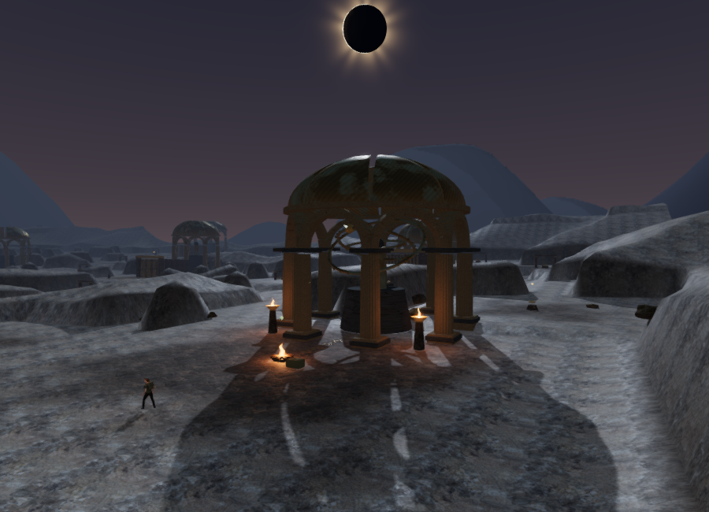
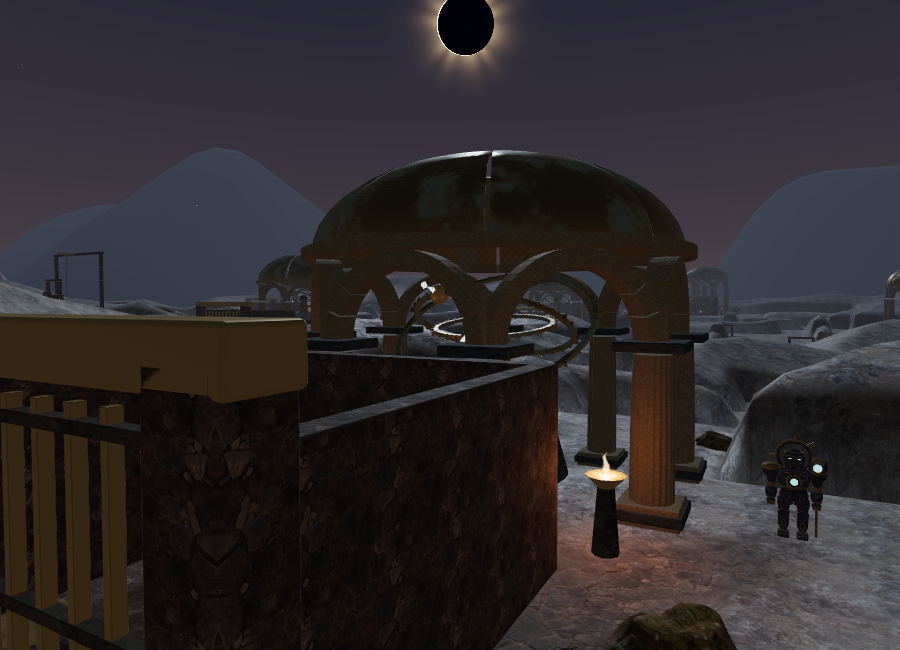
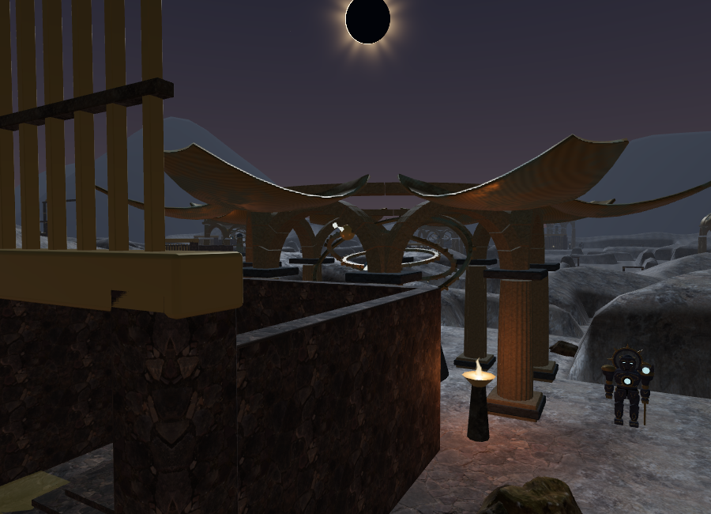
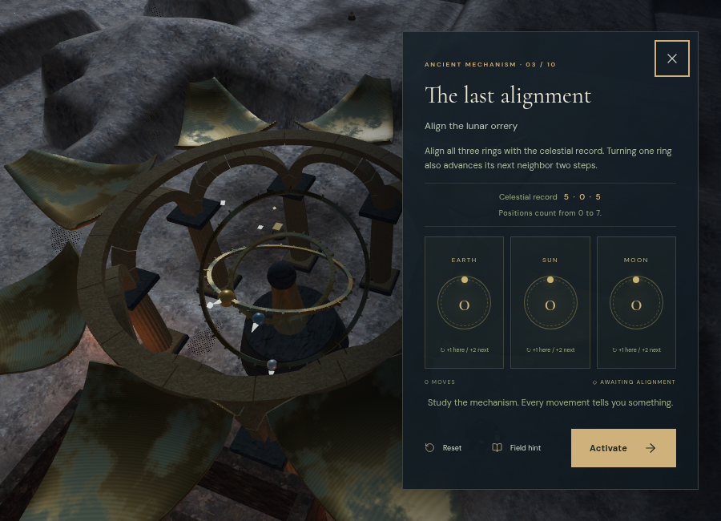
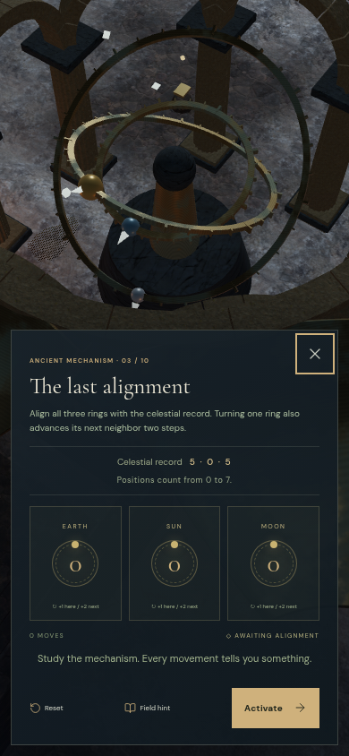
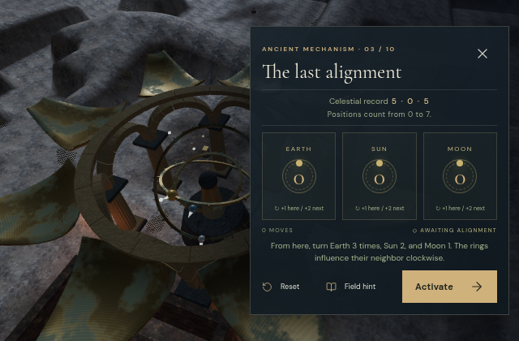
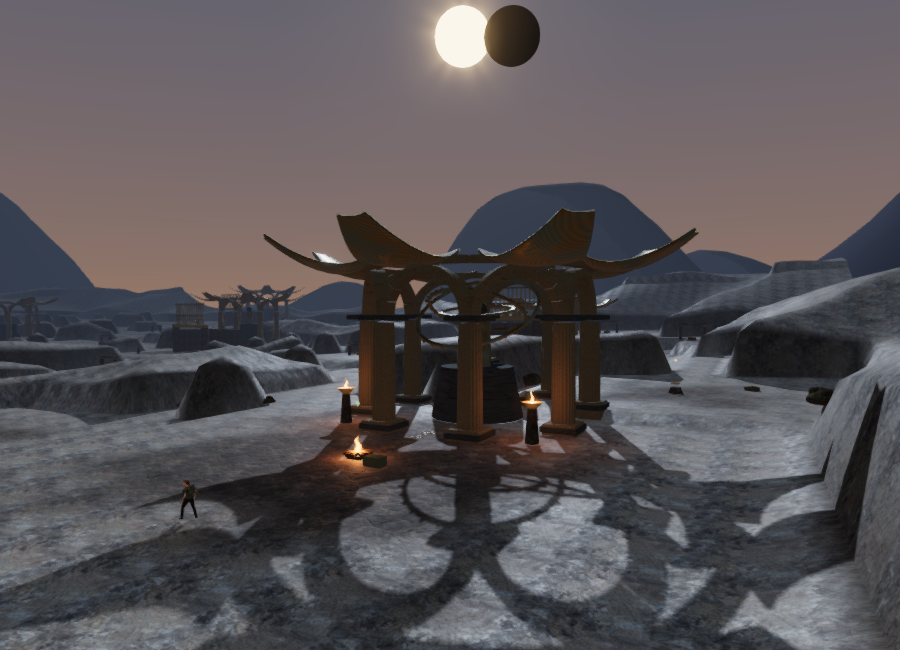

# The Last Meridian: orbital instruments and opening domes

The final chapter now has **eleven stone observatories**, replacing the generic piers, pyramid roofs, and floating ring landmarks. Their arcades stand on eight fluted columns with terrain-seated foundations. Individual arch stones carry a segmented cornice. There are **86 curved bronze dome panels**, including two damaged roofs, and **33 graduated orbital rings**. The geometry is original project code and reuses the existing local stone materials; no external asset download was needed.

The bronze shells have outer and inner surfaces and sealed cut edges. They hinge outward from the cornice to expose an actual opening above the instrument. Ring bands have individual captured collision segments, leaving the spaces inside the hoops clear. Moving panel and ring parents retain their transforms in the camera surface index. In total, the chapter has **987 captured camera surfaces** in addition to terrain and movement obstacles.

The visible sky includes sparse stars, a faint galactic band, an eclipsed disk, and a slowly changing corona. Its reflection capture lights the metalwork, with cool ambient light and warm local torches. The saved chapter-completion state reveals the sun and shifts the sky toward dawn. This is a stylized original shader, not an astronomical simulation.

A later [foundation repair](observatory-foundations.md) measures and closes gaps
beneath the eleven pedestals and 88 column bases, and corrects the pedestal stone
mapping. Its comparison images and checks record the updated terrain contact.

## Field work and the physical puzzle

Each site's opening and harmonic activity follow its sector's three field actions. The lunar sector starts fully closed; its three shutter stations open it in thirds. Other sectors leave a small initial aperture and open further as their survey, transport, fire, winch, or resonance work is completed. The entrance and first mechanism court share the first sector's restoration state. Earlier completed sectors restore correctly from the main stage in an older save, even when its field list is empty.

Development-assisted calls through the interaction handler completed all three lunar shutter stations. After four simulated seconds per action, the dome's opening value reached **0.333084**, **0.666418**, and **0.999751**. Its harmonic activity reached **0.346667**, **0.513333**, and **0.68**. Reloading retained all three field actions, stage 2, the prior solved alignment, and a fully open lunar dome.

The instrument's Earth, Sun, and Moon rings use the same values and celestial target as the control panel. Turning a ring advances it one position and its neighbor two positions around an eight-position cycle. The planets and pointer tips move with those rings; fixed markers retain their target positions. A focused camera looks through the open dome while the controls occupy the right side of a desktop screen or the lower part of a portrait screen.

Each move and reset saves an independent `alignments[stage]` record in the existing `vesper-expedition-v1` local-storage save. The record contains three positions and a move count. Save normalization rejects malformed positions, out-of-range stages, and invalid arrays; other chapters ignore this field. Reopening or reloading restores an unfinished alignment without altering its deterministic target.

Instrument animation runs for a bounded interval while the panel is open. Player physics, enemies, and active expedition time stay paused; slow frames settle the instrument onto its correct final pose before rendering becomes idle again. Closing the panel restores the follow camera. Resizing a paused game now requests a redraw, fixing a blank canvas found during the compact-layout check.

Browser controls verified a first Earth turn produced **[1, 2, 0]**, moved the two matching world rings, and saved the same values while player position and time remained unchanged. Reset saved **[0, 0, 0]**. A Moon turn saved **[2, 0, 1]**, survived reload, and was rejected by Activate. From that partial state, the real buttons completed target **[5, 6, 4]** in 13 total moves; Activate advanced the saved stage from 1 to 2. Setup used development positioning and sector progress, so this is an assisted integration check rather than an ordinary chapter playthrough.

## Positional sound and music

Every observatory has a machinery source and a harmonic source, for **22 added emitters** within the existing shared **12-voice** budget. They sit just outside the instrument pedestal on its approach side. All 22 sampled exterior listening positions had clear sight paths; intervening terrain and structures can still obstruct other approaches.

Gear activity rises during dome or ring movement and returns to a quiet idle. Harmonic activity follows field restoration and reaches its full value after the sector is solved. These sources use HRTF panning, linear distance attenuation, smoothing, and the existing obstruction filter. Machinery fades over **3–32 m**; harmony fades over **3–36 m**.

The chapter retains its original, sparse **50 BPM choir arrangement**, longer music reverb, objective-specific voicing, and puzzle/reading ducking. Default persisted music/ambience/effects controls remain **32/80/75**, with master volume 45. Its soundscape and instruments use local Web Audio synthesis and bundled assets; no streaming soundtrack is required.

With the browser AudioContext running, isolated sources reported these effective gains. Activity was fixed at 1 and occlusion disabled to isolate distance. These are voice diagnostics before the overall mix, not recorded loudness measurements.

| Source | Distance | Effective gain |
| --- | --- | --- |
| Machinery | 2 m | 0.220000 |
| Machinery | 12 m | 0.151724 |
| Machinery | 24 m | 0.060690 |
| Machinery | 31 m | 0.007586 |
| Machinery | 33 m | Retired |
| Harmony | 2 m | 0.200000 |
| Harmony | 12 m | 0.145455 |
| Harmony | 24 m | 0.072727 |
| Harmony | 35 m | 0.006061 |
| Harmony | 37 m | Retired |

Both inspected panners reported HRTF and the configured linear model. Broader subjective listening and device mix evaluation remain necessary.

## Actual browser views and rendering work

These are browser screenshots with the main HUD hidden. The first three use the same 900 × 650 camera. The dome pair uses a closer view of the lunar site; focused puzzle shots retain the real controls.











The selected Performance view changed from **394,744 triangles / 241 calls** to **420,044 / 309**. High submitted **1,407,435 triangles / 922 calls** across its passes. Moving instruments and small capital details hide beyond 105 m and return within 95 m; the architectural silhouette and supporting movement collision remain. The selected focused instrument stays visible regardless of its distance to the player. These workload measurements are not supported hardware frame rates, and the new architecture increases rendering cost.

## Verification and remaining limits

All **166 automated tests** pass, including eight new observatory tests covering closed shell topology and winding, an unobstructed oculus, bounded partial saves, continued solvability of all ten mechanisms, restored shutters and targets, moving camera surfaces, ring-hole clearance, bounded paused animation, emitter placement and response, focused cameras, detail visibility, and chapter cleanup. The release build passes with the existing Three.js chunk-size advisory.

Browser checks found clear sampled approaches to all **63 non-guardian features**, including the elevated mechanism positions and climbing entrances. All **31 local court routes with clear endpoints** completed through the character physics at carrying speed. Two candidate endpoints were in rock banks and were excluded. These local, assisted routes do not establish all chapter navigation, encounter balance, or pacing.

Low and High shader programs linked without warnings or errors. Loading the flooded palace cleared every observatory, emitter, and focused-camera reference, restored its daylight sky and 2.7 sunlight intensity, and selected its water audio theme without asset errors.

The final High production build opened the chapter briefing at zero play time with no development hook. All six reused observatory stone maps loaded with HTTP 200. Native keyboard movement changed the saved position from `(385, 224, height 0)` to `(384.98786583674, 224.07887206118974, height 0)`; pause recorded **3.3360999999642376 active seconds**. Reloading with a required texture held until focus moved to another tab restored that exact position and time while paused. The tested entry bundle was `index-DBT8LeRY.js`. Both development and production consoles were clear, and test saves were removed from both origins with High quality restored.

Chromium used ANGLE/SwiftShader software rendering. The keyboard check travelled only a short distance and does not demonstrate sustained responsiveness on consumer hardware. Repeated procedural forms, simple distant terrain, adapted character art, and the current lighting remain below modern AAA quality. Approximately one-hour chapter pacing still lacks blind human playthrough evidence. The original production goal remains open.

Development review helper:

```js
const review = await import('/scripts/verify-observatory-browser.js');
review.inspectObservatory(__vesper.game);
review.inspectObservatoryRoutes(__vesper.game); // assisted movement; no save
review.observatoryView(__vesper.game); // moves the review observer and camera
```
