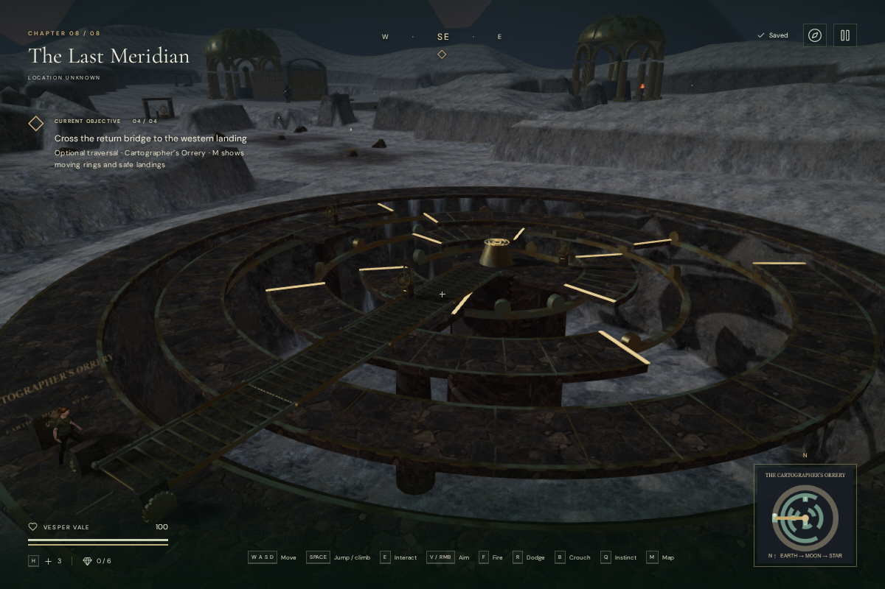
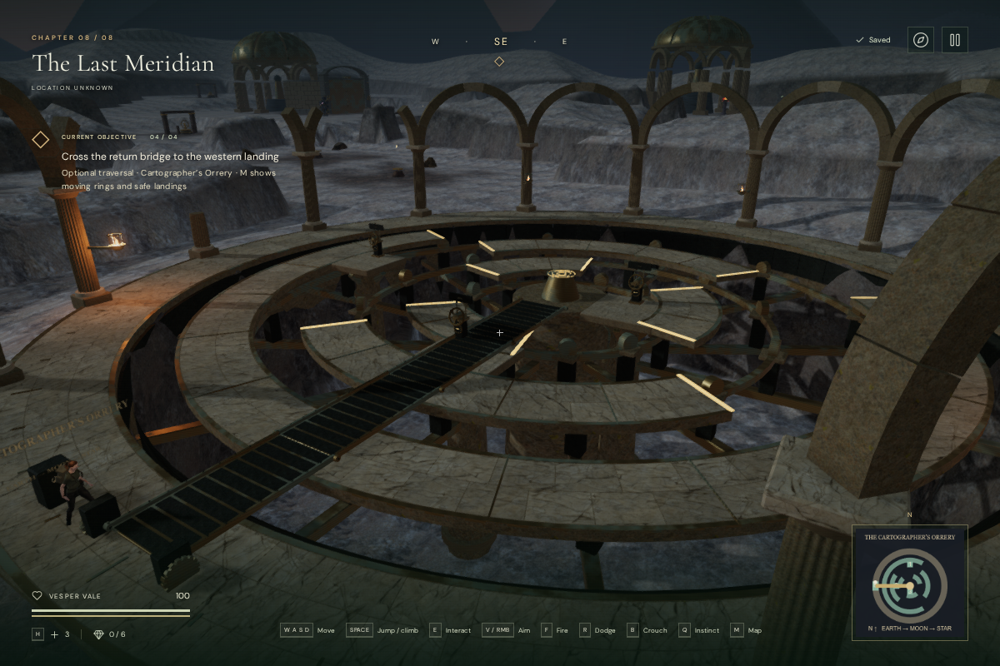
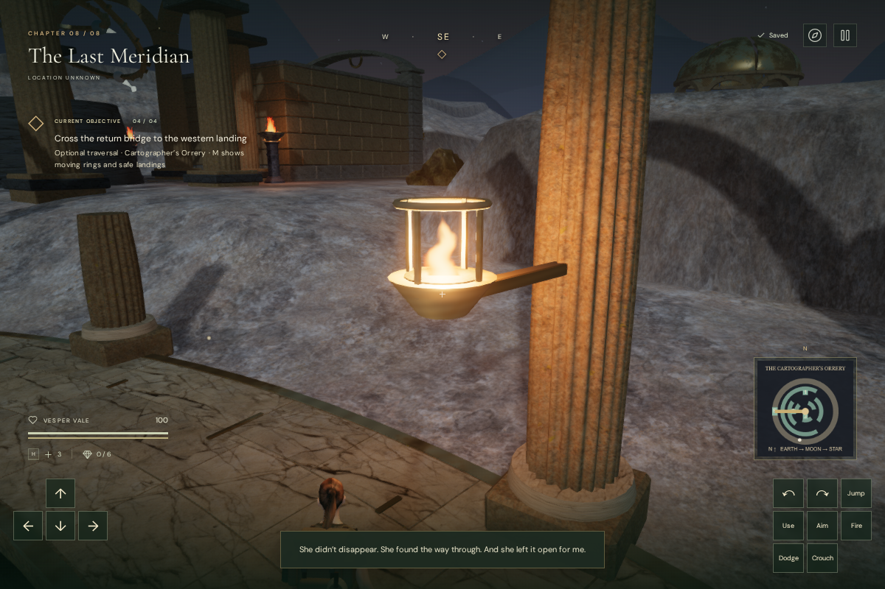

# The orrery court

The Cartographer’s Orrery in **The Last Meridian** now has a surrounding stone
arcade, fitted paving, a masonry well and structural supports beneath its moving
crowns. Pale stone makes the crown edges and gaps more distinct from the dark
ground below. The western break in the arcade frames the tablet and return bridge.

Fourteen fluted columns support complete and broken arches. Individual closed
arch stones preserve the openings in the camera collision index. The columns
have movement collision; imported positions overlapping them recover at the
last safe orrery landing. That check includes body overlap just outside the
court radius while retaining valid arrivals on surrounding clear ground.

Small joints and per-block tint distinguish the paving courses. The ring marks
are spaced farther apart, and each bearing landing has a pale cap. Radial metal
girders, track brackets and pier collars sit beneath the existing decks. The
ring speeds, traversable arcs, gaps, controls and folding bridge retain their
previous layout and behavior.

Four caged oil lamps hang from the colonnade. Their flames use the shared
animated fire shader and four nearest-light slots; this pass adds no permanent
point-light budget. Each has one quiet fire emitter at its visible flame,
using the existing local recording, HRTF panning, linear falloff and obstruction
filter. A dedicated registration prevents the generic flame loop from adding
a second, louder emitter. The existing final-chapter/objective score and
persisted mix controls continue to apply.

The stone materials share the already credited **Worn Rock Natural 01** and
**Marble Rock 02** maps with the other observatories. Material clones change the
court tint and normal strength without modifying the surrounding buildings.
The new geometry and color variation are original project work; no external
model, image, recording or dependency was added. See [asset credits](asset-credits.md).

## Verification

All **422 automated tests passed** with two workers. The affected tests cover
column obstruction, clear arch and western approaches, lamp placement and
single-source registration, the shared fire/light system and old-arrival
recovery. Existing checks retain crown jumps, moving riders, bearing actions,
hand occupancy, folded bridge collision, deployment and the supported return.

The continuous browser route completed all three animated bearings, chart
recovery, deployment and return in **48 movement segments at 100 health**.
It used native movement, Jump and Use with supplied headings and stepped
simulation. Nine turning frames retained 108 hand-surface checks; the nearest
region clearances remained between −0.000461 and +0.002469 m, with no inspected
vertex penetrating a grip by more than 2 mm. These are assisted checks, not
an ordinary human playthrough or a pacing measurement.

Both High and Performance comparison views rendered with linked shaders and
clear control positions. The complete orrery contains **83,484 triangles in
59 meshes**, compared with 36,188 in 52 before this pass. Static artwork batches
by material; the moving crowns retain their separate parents. These geometry
counts do not establish consumer-GPU frame rates. All 63 existing chapter
features and 207 main-path obstacles matched the baseline exactly.

Live browser checks found clear openings in all thirteen arch bays, collision
and safe arrival recovery at all fourteen columns, and four unobstructed lamp
listening approaches. Each lamp had exactly one coincident emitter. An isolated
lamp voice used HRTF/linear panning with gain **0.05 at 1.5 m**, **0.025 at
7.75 m**, and no voice at 15 m. These values precede the overall mix and do not
measure perceived loudness. Pause retained flame time and light state. Changing
chapters released all **87 inspected graphics resources** exactly once and
removed court materials, flames and sound references. Development checks
reported no failed assets or console warnings/errors.

The production build passes with the existing large-chunk advisory. Its assets
are `index-y10ZMCYR.js`, `game-D4CG9rX0.js`, `three-CJb2rOZj.js` and
`index-DYq9hjRy.css`. Five High-quality production cases passed native input
and exact whole-save reload comparisons, excluding last-played timestamps:

| Starting save | Native action and retained result |
| --- | --- |
| Interrupted Earth turn | E completes the first calibration; reload retains its supported stance |
| One calibration at the lunar bearing, muted at 540 × 900 | Touch Use completes the second calibration; reload retains it |
| Three calibrations beside the central chart | E recovers the chart; reload restores the settled bridge |
| Older position inside the folded bridge | Arrival recovers at the tablet, which accepts E |
| Older body overlap outside a new column | Arrival recovers at the tablet, which accepts E |

All five retained 100 health and unchanged main objective progress. The
production build exposed no development hook and reported no failed assets
or console warnings/errors.

This is an environment-art milestone. The surrounding terrain, character and
remaining scenery still need production work. Automated traversal does not
establish one-hour chapter pacing, and these images do not establish AAA
graphics. Subjective listening and broader browser/GPU testing remain open.
