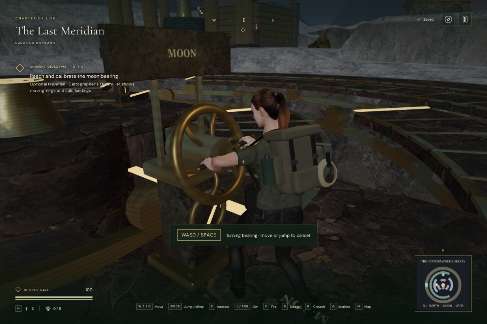
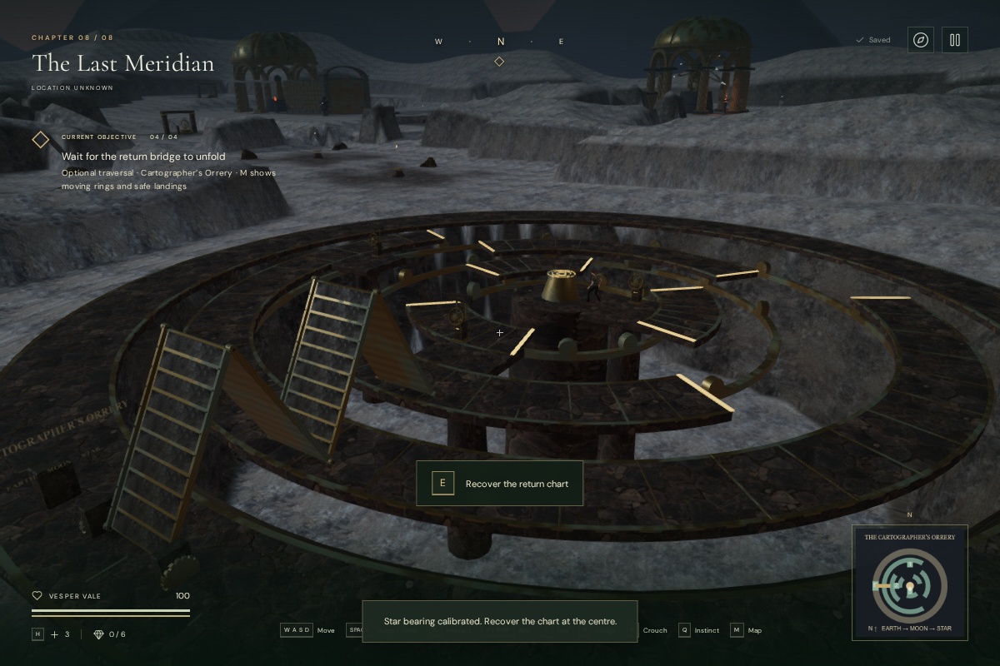

# Operating the cartographers’ instruments

The three bearings in **The Last Meridian** now have physical instruments and a
two-hand action. Stand west of a bearing and press **E / Use**. Vesper steps into
position, reaches for its grips, turns the wheel a quarter turn and releases it.
The calibration saves when the wheel reaches its stop, stopping that crown and
starting the next one. A completed wheel retains its turned position on reload.

Movement or Jump cancels an unfinished turn immediately. Moving after the stop
preserves the calibration. Repeated Use does not queue another action. Aiming,
firing, crouching and torch handling cannot take over the occupied hands. The
action takes about 1.85 seconds from its standing pose, plus alignment time for
a more distant approach. Alignment checks the path for body clearance and fixed
landing support. Pausing freezes the operation and its machinery sound.

The bearing pedestals have tilted wheels, cylindrical hand grips, rounded spokes,
spindles, gauges, raised inscriptions and bolts. The lunar instrument sits to the
north of its landing’s centre lane so the return crossing remains clear. All
three retain supported operating stances on their original landings.

## Folding return bridge

The bridge is now visible before recovery as four upright leaves at the western
bank. Read the tablet on their north side, then go around that side to jump onto
the outer ring. The tablet and journal explain the three-bearing route and how
to cancel an operation.

Recovering the central chart releases the bridge. After closing the chart, its
four connected leaves unfold over six seconds into a twenty-metre crossing.
Hinges stay connected throughout the movement, and the plates remain above the
ring crowns. The bridge has tread panels, side ribs, hinge pins and fixed toothed
bearings. The map follows its projected reach, and the objective asks the player
to wait until the leaves settle. The crossing is blocked during deployment.

Character obstruction follows the folded panels, and their thin plates remain
in the moving camera index. Once flat, the bridge becomes a supported walking
surface. Pausing freezes its hinges and sound. A saved recovered chart restores
the bridge fully deployed; the transient opening animation does not delay a
reload. Unfinished bearing actions restore the last saved calibration. Older
positions occupied by the folded bridge recover beside the relocated tablet.

## Sound

Each bearing has a mechanical emitter beside its grips, active only during the
turn. The bridge has another emitter following its advancing end. They reuse the
existing machine synthesis, HRTF panning, obstruction filter, twelve-voice limit
and final chapter’s quiet machinery score arrangement. No external model,
texture, recording, music file or dependency was added.

Live browser diagnostics measured bearing gains of **0.021 at 1.5 m** and
**0.0105 at 6.75 m**, with retirement beyond its 12 m range. Bridge gains were
**0.048 at 2 m** and **0.024 at 17 m**, with retirement beyond its 32 m range.
All three bearing listening approaches were clear. These values describe the
sources before the overall mix; they do not establish playback loudness or
subjective sound quality.

## Verification and remaining work

All **419 automated tests passed**, including the fifteen focused orrery and
camera checks. The production build passes with the existing large-bundle
advisory. The final assets are `index-Fw6Nk0Go.js`, `game-CFAL1ggv.js`,
`three-CJb2rOZj.js` and `index-DYq9hjRy.css`.

The affected checks cover cancellation before and after commitment, pause,
repeated Use, competing hand actions, supported stances, blocked rear approaches,
partial/completed restoration, folded collision, camera clearance, connected
hinges, the deployment corridor and the full supported return walk. The original
orrery tests still cover crown jumps, riders, calibration order, falls and terrain.

The browser route used native movement, Jump and Use with supplied headings and
stepped simulation. It completed the entrance, all three animated calibrations,
central chart, deployment and return to the tablet in **48 movement segments at
100 health**. This is not an ordinary human playthrough or a duration measurement.
The complete orrery now contains **36,188 triangles in 52 meshes**, up from
21,370 in 24. These are geometry counts, not consumer-device performance results.

Nine turning frames across all three bearings supplied **108 independent hand
surface measurements** against the visible grips. The nearest region clearances
ranged from **−0.000461 to +0.002469 m**; no inspected hand vertex penetrated a
grip by more than 2 mm. Native keyboard checks covered pause, repeat input and
cancellation before/after commitment. Portrait touch input both cancelled and
completed a lunar turn. The opening map fit 540 × 900. Changing chapter released
all **78 inspected graphics resources** once and removed the orrery’s references.
The development checks reported no failed assets or console warnings/errors.

Four High-quality production cases passed native input and exact whole-save
reload comparisons, excluding last-played timestamps:

| Starting save | Native action | Restored result |
| --- | --- | --- |
| Interrupted Earth bearing turn | E, complete the turn, pause | First calibration and supported stance |
| One calibration at the lunar instrument, muted at 540 × 900 | Touch Use, complete the turn, pause | Second calibration and supported stance |
| Three calibrations beside the central chart | E, recover the chart, reload while reading | Recovered record and settled bridge |
| Older position inside the folded bridge | E after arrival recovery | Clear tablet approach and retained progress |

All retained 100 health and unchanged main objective progress. The production
build exposed no development hook and reported no failed assets or console
warnings/errors.

Further character transitions, machinery detailing, surrounding scenery,
subjective listening and broader device/browser testing remain production work.
This milestone does not establish AAA graphics or one-hour chapter pacing.
