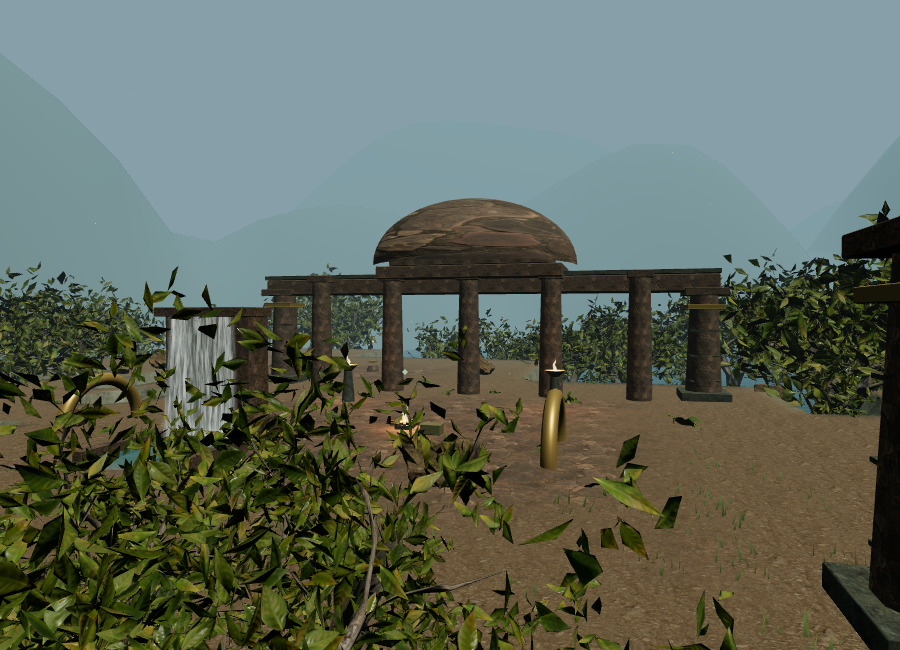
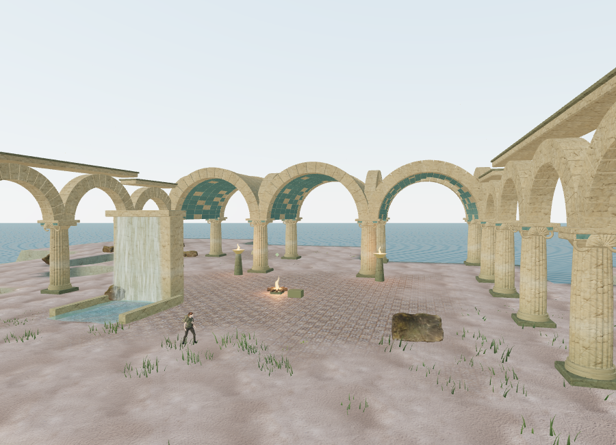
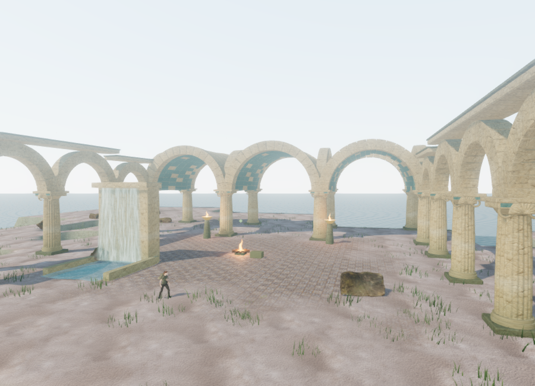
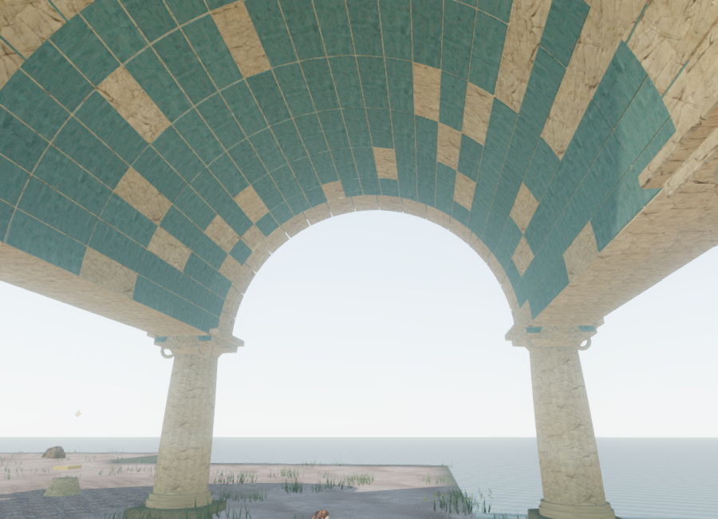
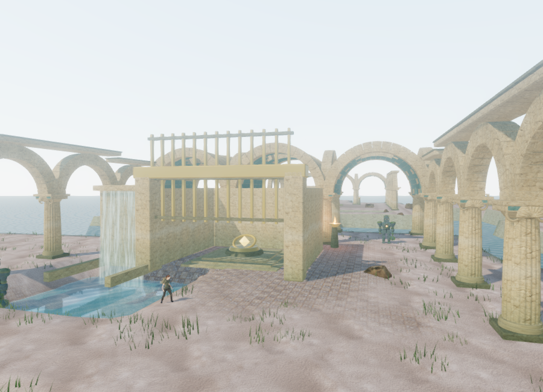

# Flooded palace art pass

The Drowned Kingdom now has ten open, vaulted stone courts. Fluted columns, moulded capitals with scrolls and shell reliefs, blue-plastered barrel vaults, varied broken roof sections, and side arcades replace the former generic piers and floating dome. This is original architecture for the game's fictional Aegean kingdom, not a reconstruction of a specific archaeological site.

## Geometry, materials, and light

The round arches use individual closed annular stones. Column shafts have twenty shallow flutes, taper, and slight entasis. Supported longitudinal arches carry the edges of the barrel vaults. Court plans vary the side galleries, roof breaks, and final sanctuary's spring height. Static structure batches into three material draws per court, with 34,992–55,632 structural triangles in the reviewed build. Capital scrolls, shells, and blue bands have a shorter detail range.

Roof masonry closes its mortar joints behind the narrower plaster patches. This prevents thin sky leaks while preserving the deliberate roof breaks. Adjacent angular sectors share camera bounds only when they have the same surviving depth pattern. The palace kit uses 1,490 camera surfaces; the actual chapter has 1,899 including gameplay structures. Cameras pass below the arches, stop at their crowns and grounded columns, and can pass through the broken skylights.

Nine unmodified 2K maps total **24,476,296 bytes**:

- [Marble Rock 02 by Amal Kumar](https://polyhaven.com/a/marble_rock_02): weathered architectural stone.
- [Blue Plaster Weathered by Amal Kumar](https://polyhaven.com/a/blue_plaster_weathered): surviving vault finish.
- [Marble Mosaic Tiles by Amal Kumar](https://polyhaven.com/a/marble_mosaic_tiles): court paving.

Each includes color, OpenGL normal, and roughness maps, under [Poly Haven's CC0 license](https://polyhaven.com/license). They are served locally. `python3 scripts/download-palace-materials.py` reproduces the downloads and records original metadata, source URLs, byte counts, and SHA-256 values under `asset-sources/palace-materials/`. All nine delivery files match those hashes.

Stone shaders add irregular darkening near the historical waterline and a pale salt band. Palace materials with per-block color variation are separate clones of the gameplay materials. An early browser render caught black waterfall masonry when a shared material expected vertex colors that those props did not have; isolation fixes that regression and is covered by the built-world test.

Sand, mosaic paving, and pale stone cliffs replace the jungle-like ground treatment. A coastal daylight sky has matching sun direction, warmer ground fill, and a filtered 128-pixel cube-face environment capture. The old ring of rounded background hills is removed, opening views onto the sea. High quality retains the existing single nearby water-reflection capture.

## Coastal planting and sound landmarks

The former chapter placed 430 broadleaf trees outside the walkable grid. Inspection found **all 430 roots below the sea surface**, between approximately -7.86 m and -3.72 m, while sea level is -2.3 m. This produced dense branches emerging from the water. The exposed-island art now uses shoreline scrub, with no broadleaf forest or fern carpet.

A placement filter confines scrub and rocks to sufficiently high ground, keeps objective pads and reservoir banks clear, and avoids the new palace supports. The reviewed chapter retains 620 shrub placements. Other chapters retain their existing woodland behavior: the transition check restored 115 snow trees and 827 jungle trees.

Each of the ten birds now has a visible stone bracket on the rebuilt architecture. Its model and positional audio emitter use the same coordinates. Browser rays found support at every bird's feet, within 0.001 mm of the recorded bracket surface. The existing quiet water score, objective arrangements, attenuation, occlusion, and separate mix sliders remain active.

An assisted hydraulic check completed the third court's field state in memory. The reservoir dropped from 0.8550875735 m to -0.9449124265 m, exactly 1.8 m. Its waterfall impact followed the surface, and its audio emitter dropped from 2.7050875735 m to 0.9050875735 m. High quality selected that reservoir for reflection without shader errors. The temporary field state was restored after review. This checks visual/audio response, not completion through ordinary puzzle controls.

## Rendered comparison

Performance views use the same 900 × 650 viewport, observer location, and camera:







These are actual browser renders with the HUD hidden. Real-time art remains below the requested modern AAA standard.

## Verification and limits

The suite passes **137 tests**. Six new tests cover closed and wound vault/column solids, ten distinct plans and objective margins, built-world water-bank/camera clearance and bird support, roof-joint backing and surviving skylights, shell relief depth, coastal planting, and source-file hashes. Material isolation, detail culling, and chapter-state cleanup are also checked. The production build passes with the existing Three.js chunk-size advisory.

Browser diagnostics found clear sampled approaches for all **59 non-guardian features**, including entry and summit positions for the two elevated field stations. They do not prove full routes through every locked gate or encounter. Existing swimming terrain and reservoir geometry are unchanged; unit tests separately check that the new columns keep the water banks clear.

The selected Performance view changed from **417,915 triangles / 129 calls** to **234,630 / 92**, approximately 44% fewer submitted triangles. The selected High view submitted **2,040,823 triangles / 899 calls**, including its rendering passes and sea reflection. Detail transitions can change those counts. All active programs linked with empty logs. These are selected workload observations, not hardware frame-rate benchmarks.

Snow and jungle prepared after the palace with no asset-batch errors, zero palace patches/perches, their expected sky/environment states, and their own woodland restored. Development console checks reported no warnings or errors.

The production High build loaded all nine new material maps with HTTP 200 and expected byte counts, opened the briefing at zero play time, and exposed no development hook. Native keyboard input changed the saved position from `(70, 84, height 0)` to `(70.07084864052156, 83.9595150625591, height 0)`; pause recorded **6.301100000023841 active seconds**. Reloading with a held stone-map request, then finishing preparation after another tab gained focus, opened paused and restored both values exactly. This short input check produced little simulated travel under software rendering, so it does not demonstrate sustained control responsiveness. Production checks reported no console warnings or errors. Development and preview test saves were cleared afterward, restoring the default High setting.

Reproduce a development review in a prepared water chapter:

```js
const review = await import('/scripts/verify-palace-art-browser.js');
review.inspectPalace(__vesper.game);
// Changes the review observer/camera without saving that pose.
review.palaceView(__vesper.game, 0);
```

Browser verification used Chromium ANGLE/SwiftShader software rendering. Full-length chapter playtests, supported-device performance, further environment and character art, and modern AAA visual quality remain open. No hour-long pacing claim is based on these assisted checks.
