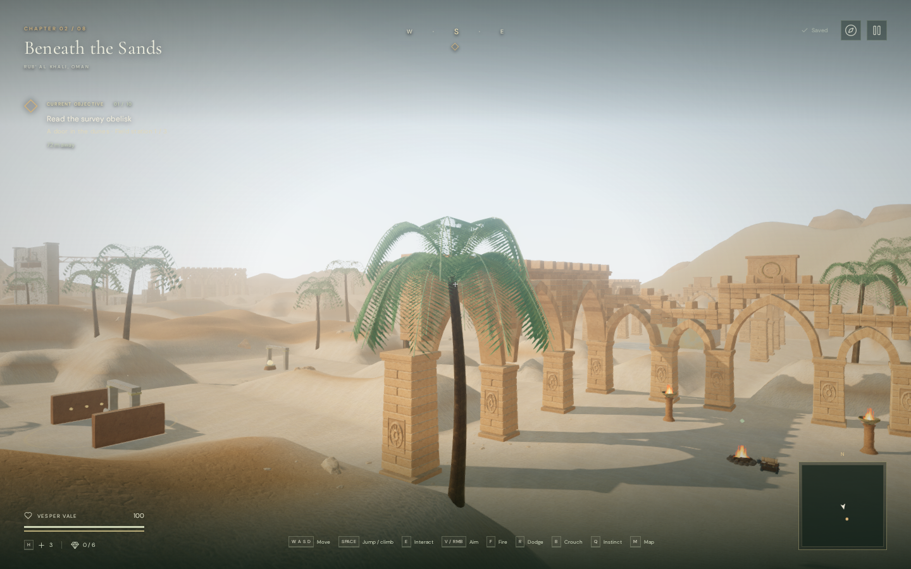
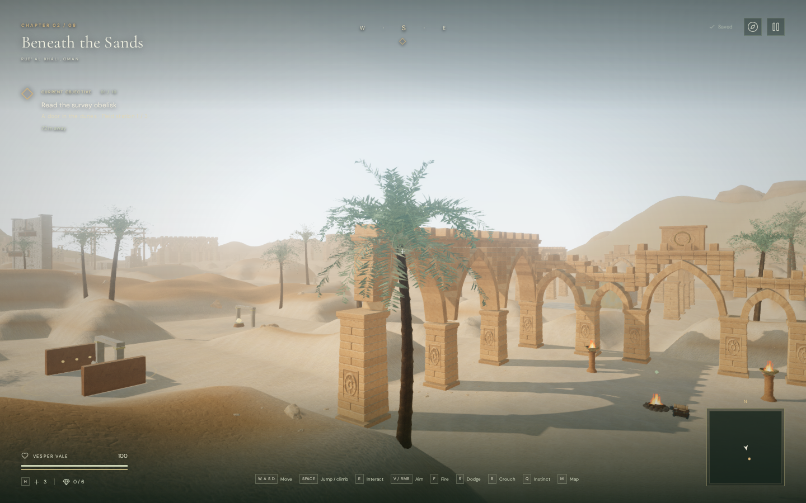
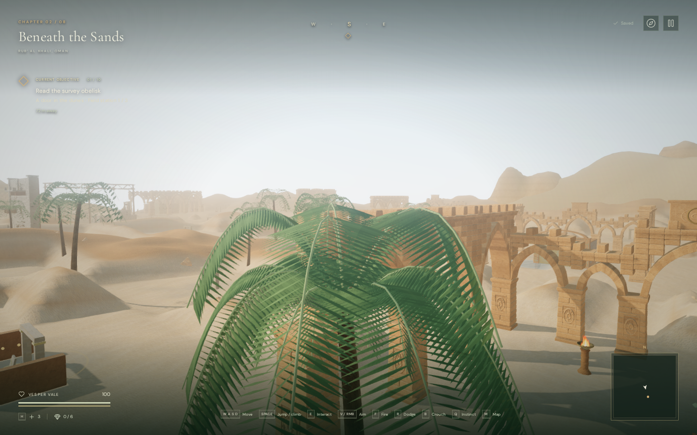
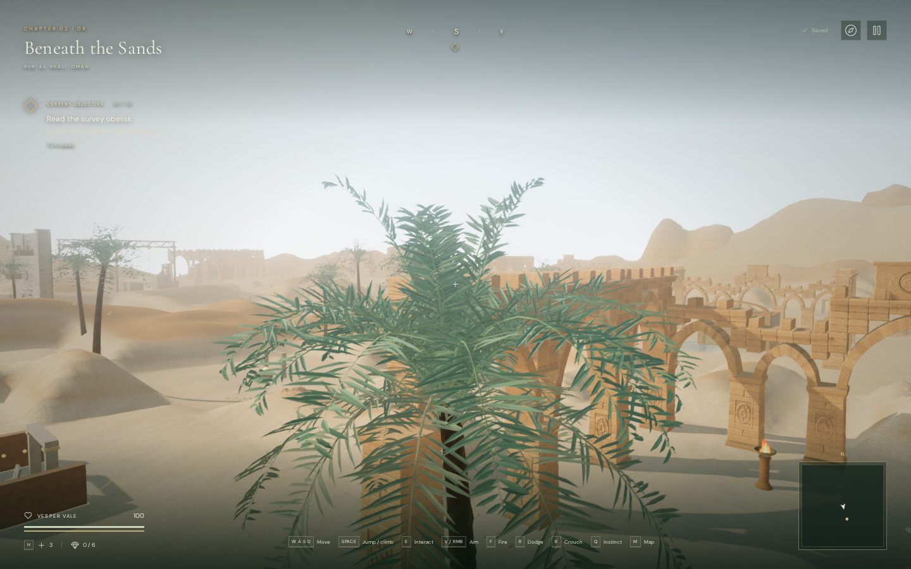

# Desert palm crowns

The desert palms now have 32 fronds with upright young growth, varied mature
branches and a lower group of weathered leaves. Narrow, folded leaflets leave
each stem at different angles. Tapered stems, restrained color variation and
raised old leaf scars on the trunk replace the previous flat, evenly spaced
comb shapes and smooth stems. The original 70 placements remain in place.

The crown design uses the angled, V-folded leaflet arrangement described in
[Patti J. Anderson's date-palm identification reference](https://idtools.org/palm_id/index.cfm?entityID=3227&packageID=1109).
The meshes and colors are original procedural artwork. Reference photographs
were inspected but are not bundled or published. The models adapt the plant's
proportions and leaf coverage for this game; they are not botanical scans.

## Comparison views

These are matching 1440 × 900 High-quality development-browser views with the
same camera, observer and chapter time. The before images use published commit
`3a7ea0d`; the revised images use the new crown, stem and wind code. The camera
positions are assisted art-review fixtures, not normal player movement. WebP
images preserve the original capture pixels without retouching.

| Full crown, before | Full crown, revised |
| --- | --- |
|  |  |

| Closer view, before | Closer view, revised |
| --- | --- |
|  |  |

## Wind and detail

Wind displacement now tapers to zero at each frond's base, with a small separate
movement at leaflet tips. Visible leaves and depth-shadow materials use the
same vertex deformation, clock and detail-coverage rules. Bounding volumes
include the maximum displacement, preventing wind from carrying a visible leaf
beyond its culling bounds. Normals follow the folded rest geometry; the shader
does not recompute them as the fronds sway.

The same seeded crown and leaflet attachments drive all three detail tiers.
Lower tiers retain a subset of the leaves with wider coverage, so lowering
detail does not relocate their attachment points. Distance ranges, horizontal
selection, 300 ms coverage transitions, hysteresis and range culling are retained.

| Detail tier | Previous triangles per palm | Revised triangles per palm |
| --- | ---: | ---: |
| Near | 10,384 | 28,992 |
| Middle | 5,928 | 8,512 |
| Far | 3,136 | 2,880 |

Each tier still uses two instanced meshes per crown variant. There are three
variants and no added draw groups or texture downloads. The existing bark maps
retain their [asset attribution](asset-credits.md). The additional near geometry
and per-vertex motion data increase processing and memory costs; this is not a
performance-neutral replacement.

## Route and rendering checks

The before/after browser world records match exactly for all 70 palm placements,
284 obstacles, 59 feature foundation heights, five reservoir base levels and
155 sound-source positions. All 59 feature approaches remain clear, as do the
surveyors' 37 handholds and 37 checked connections.

All six Low/High views linked their shaders with no console warnings/errors or
failed assets. The measured rendered workloads were:

| View | Quality | Previous triangles / calls | Revised triangles / calls |
| --- | --- | ---: | ---: |
| Crown | Low | 916,530 / 385 | 916,042 / 385 |
| Close | Low | 901,580 / 362 | 901,092 / 362 |
| Court | Low | 646,414 / 243 | 645,414 / 243 |
| Crown | High | 2,396,547 / 933 | 2,468,787 / 933 |
| Close | High | 2,318,945 / 878 | 2,391,185 / 878 |
| Court | High | 1,858,307 / 647 | 1,938,299 / 647 |

These counts include the scene's rendering passes and are not FPS measurements.

A separate fixed-courtyard benchmark used Chromium/ANGLE Vulkan on an AMD
Radeon 780M at 1280 × 800, pixel ratio 1. Each quality ran four four-second
samples in before/after/after/before order after warm-up, with the same camera,
observer and placements. Both versions were loaded; only the selected palm
meshes rendered. Weighted GPU render means were:

| Quality | Previous | Revised | Change | GPU samples, previous / revised |
| --- | ---: | ---: | ---: | ---: |
| High | 15.784 ms | 15.859 ms | +0.5% | 200 / 257 |
| Low | 8.708 ms | 8.853 ms | +1.7% | 399 / 371 |

No GPU disjoint events or browser warnings/errors occurred. Individual Low
revised sample means ranged from 8.707 to 8.984 ms, so these small differences
should be read with the observed variability. They do not establish equivalent
performance, device support or a frame-rate guarantee. CPU/frame intervals also
varied, and the benchmark updates both sets of detail states.

All 467 automated tests and the production build passed. New checks cover
nondegenerate folded blades and tapered stems, unchanged leaflet attachments
across tiers, matching color/shadow wind bindings and displacement bounds.
Existing placement, tier-transition and protected-route tests also pass.

In the release build, native keyboard sprinting covered 4.377 metres and a
muted portrait two-finger move/crouch covered 1.138 metres. Both ended at 100
health and retained exact saved data on reload, excluding the last-played
timestamp. There was no development hook, horizontal overflow, failed asset or
console warning/error; loaded JS/CSS filenames matched the new build.

The registered bird voice retained linear falloff with a 3-metre reference
distance and 48-metre range: diagnostic gains were 0.79333 at 6 metres and
0.17227 at an occluded 24 metres, with release at 55 metres. These source-state
checks do not measure rendered loudness or listening quality. Changing chapters
released all 101 inspected palm/terrain/horizon geometries, 23 materials including
palm shadow materials, and 12 textures. Palm references cleared and the water
chapter's sound scene loaded.

The game still has simplified procedural scenery, repeated plant variants and
visible detail transitions. AAA graphics remain unmet; human chapter pacing,
subjective listening and broader device/browser coverage remain open.
