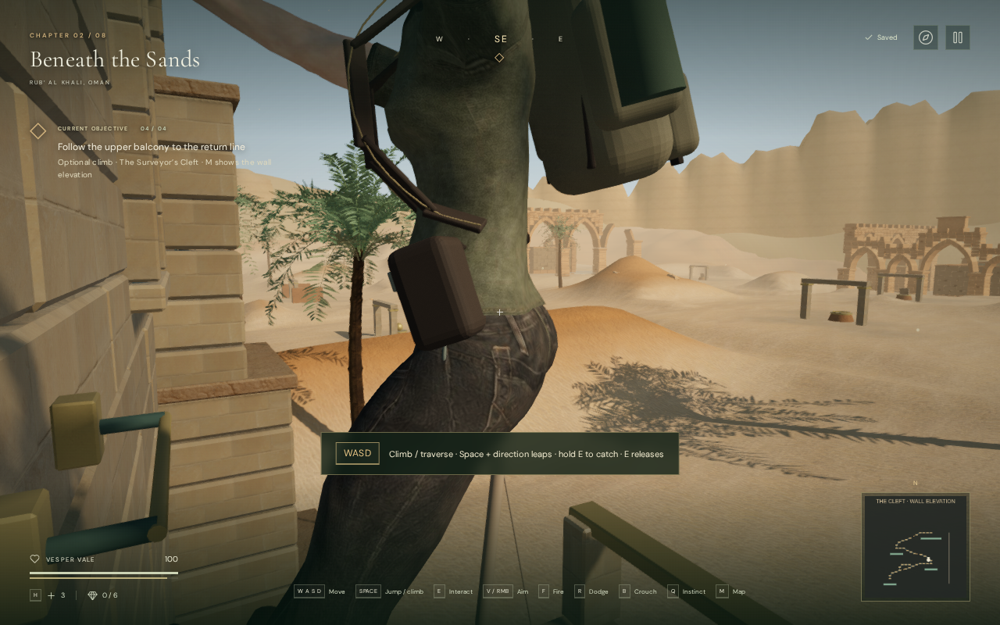
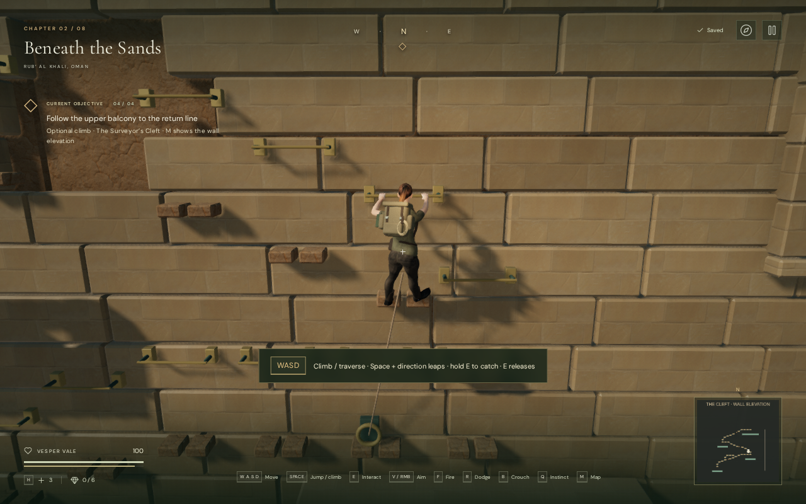
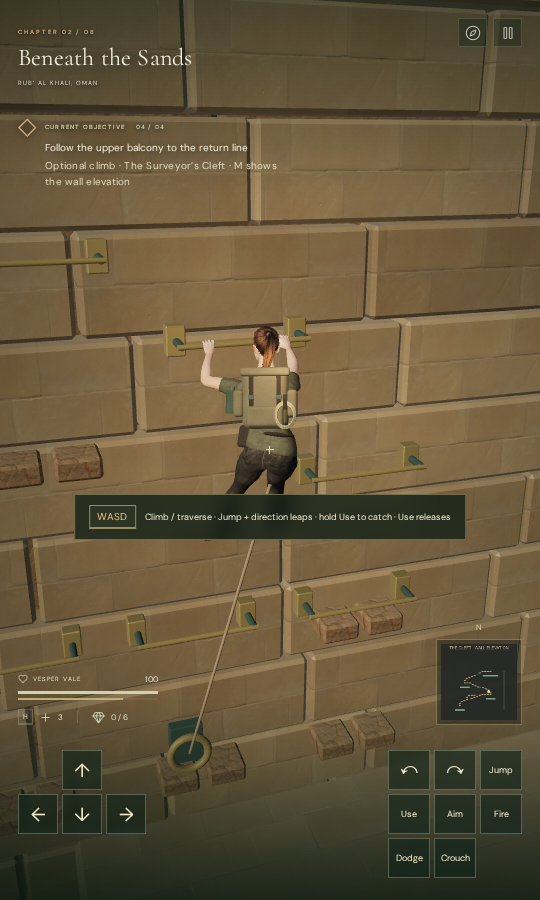

# Quarry climbing camera

Taking a handhold or the return line now frames the open face of the quarry.
Mouse, touch and keyboard look can inspect nearby holds within that face;
stepping onto a terrace restores the full orbit. The camera continues to use
the existing collision sweep and spring movement. The climbing guide explains
the change, and movement directions still follow the wall.

Previously, a restored terrace kept the chapter-entry heading. That pointed
the camera behind the masonry, retracting its arm to about 0.97 metres and
filling the view with the explorer's torso. The same native-input reproduction
now keeps it about 5.33 metres away, showing the climber and nearby route.

## Before and after

These are actual 1280 × 800 High-quality development-browser screenshots,
including the HUD and vignette. Both begin with the same prepared six-metre
terrace save and use native E/W events with manually stepped 60 Hz simulation.
Both reach handhold 14 at the same player position and 100 health. The before
version is `d9ab156`; the revised view uses the normal following camera.
Lossless WebP conversion preserves every decoded capture pixel.

| Before | Revised |
| --- | --- |
|  |  |

The arm measured 0.970964 → 5.325786 metres at the captured point. This is a
specific camera-clearance measurement, not a performance or visual-quality
score. Changing the view also changes the visible world; it is not a matching
render-cost comparison.

## Look controls and transitions

When a climb or return-line ride begins, the camera faces the wall with a
modest elevation. The same bounds remain through transfers and belay recovery.
Horizontal look stays within about 49 degrees on either side, and elevation
is limited to avoid low views into the terrace railings. Mouse movement,
touch dragging and Z/C/I/K use their existing controls within that arc.
The camera does not recenter every frame, so chosen look angles persist while
climbing. Each new grip after a rest frames the wall again.

Native Z/C/I/K checks reached both horizontal and vertical limits and reversed
normally. A 540 × 900 portrait touch drag changed the view while hanging at
100 health, with a 5.36-metre arm. Leaving the grip and changing to the jungle
restored unrestricted look.

The browser checked 1,295 posed views across all 37 handholds against the real
terrain and masonry. Each kept the grip and feet inside the portrait frame and
had an unobstructed camera segment. The shortest arm was 2.827 metres beside
an upper terrace railing. The camera can still retract around that geometry;
it does not promise a fixed distance for every view.

## Route and regression checks

The assisted route completed 34 transfers, all three upper terraces, survey
record recovery and the return descent at 100 health. It used native keyboard
events and manually stepped simulation, updating the actual following camera
every physics step. Across 74 sampled hanging frames, the shortest arm was
5.311 metres and no camera segment was blocked. This does not establish a
blind human playthrough or chapter duration.

Two new integration checks cover entry framing, retained look input, free
terrace orbit, regripping, return-line framing and save isolation; and 2,849
angle cases against the built quarry. The latter check collision clearance and
that both grip and feet fit in the frame, including oblique railing views.
The focused camera, quarry and aiming run passed all 26 tests. No final
browser check reported errors, warnings or failed assets.

The full regression suite passed all 478 tests in 203.1 seconds, including
existing campaign, aiming, movement, persistence, audio and rendering checks.
Source formatting passed. The production build passed in 4.68 seconds with
the existing large-chunk advisory.

In the High-quality release browser, native E/W input climbed from a prepared
six-metre terrace and reduced stamina to 94.09%. The capture showed the full
climber and nearby handholds. Pausing mid-climb and reloading restored x=209,
z=219.2, height=6, with the recovered survey record retained and readable in the
journal. Health stayed at 100. Loaded JS/CSS names matched the current build,
the development hook was absent, and all three sand textures matched their
recorded byte counts and SHA-256 hashes. No browser errors, warnings or failed
assets were reported.

Separate release cases travelled 4.552 metres with keyboard sprinting and
1.049 metres with portrait two-finger movement/crouching. Both stayed at
100 health and retained their full local saves on reload except the play
timestamp. The touch case retained its muted setting and fit the viewport.
Both loaded the current release bundles without a development hook, browser
errors, warnings or failed assets.

## Scope

The helper stores only transient camera state on the current quarry object.
No save format, route geometry, collision bound, sound-source position, audio
asset, texture, render target or dependency changed. Existing camera collision
and smoothing remain responsible for clearance; there is no new scene query
or render pass. No CPU/GPU performance improvement is claimed.

The fix is specific to the Surveyor's Cleft. Broader camera coverage, AAA
real-time graphics, blind hour-per-chapter pacing and subjective music/sound
review remain open. See the [climbing guide](surveyors-cleft.md) and
[production status](production-status.md).
