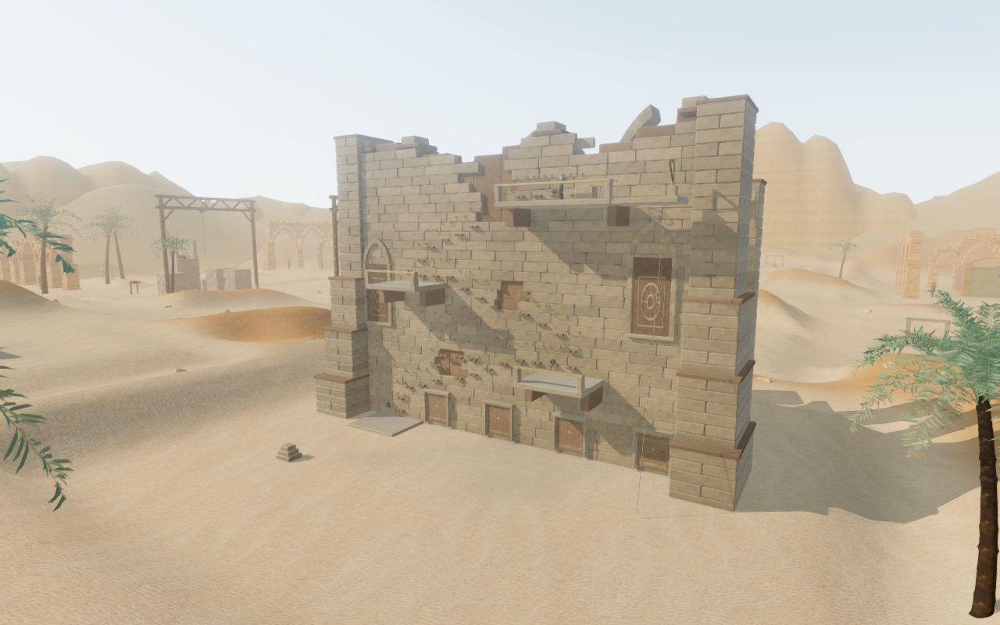

# Quarry rendering

The ruined survey house now draws its depth before shading its sandstone. This
lets the GPU reject hidden stone fragments before doing their textured shading.
The building's geometry, textures, lighting and shadows remain unchanged.
The change is limited to the quarry's static opaque masonry.

The depth draw writes no color, casts no shadow, is excluded from the contact
normal pass and adds no ray-picking hits. Its two meshes reference the existing
geometry buffers and share one lightweight material. It adds two draw calls
and 48,830 submitted triangles to each inspected view, but saves more expensive
shading work in the measured quarry overview. Extra submissions alone are not
a reliable measure of rendering time.

## Pixel comparison

Fifteen matching canvas comparisons—five cameras on each of Low, Balanced and
High—found **zero differing RGBA values** with the depth draw disabled and
enabled. The cameras covered the overview, front, rear court, upper terrace and
close handhold view. Each rendered canvas was 1280 × 800 at pixel ratio 1, with
fixed chapter time and actor pose. All shaders linked without browser errors,
warnings or missing assets. The High comparison also exercised the normal pass;
the depth meshes remained excluded and their visibility restored correctly.

This image is the actual game canvas, without the surrounding HTML HUD or CSS
vignette. Its lossless WebP conversion preserves every decoded capture pixel.
The pixel comparisons cover these views on this browser and GPU; they are not
proof of all camera positions or devices.

## GPU measurement

An independent Radeon 780M run used a fixed quarry overview at 1280 × 800,
pixel ratio 1. Each quality used four-second disabled/enabled/enabled/disabled
samples with the actual game loop. Both variants retained the current survey
house, terrain, lighting and shadow settings. The new depth draw was the only
rendering toggle.

| Quality | Mean GPU time before | Mean GPU time revised | Change |
| --- | ---: | ---: | ---: |
| High | 17.521 ms | 14.540 ms | −17.0% |
| Low | 9.465 ms | 6.866 ms | −27.5% |

Values average the two sample means per variant. Mean frame intervals were
31.91 → 25.54 ms in High and 18.36 → 17.38 ms in Low. Scheduling and sample
variation prevent extrapolating these into a device-wide FPS guarantee. All
eight samples used valid hardware GPU queries, with zero disjoint events and
no browser errors or warnings.

A second disabled/enabled/enabled/disabled run looked toward the quarry from
the first court. Its High GPU mean was 16.597 → 16.351 ms (−1.5%); Low was
8.425 → 8.425 ms (+0.002%). These small differences do not establish a distant
view improvement. All eight distant samples had valid hardware queries, zero
disjoint events and no browser errors or warnings.

This targets the cost of shaded surfaces hidden by other masonry. Other views
and GPUs can have a different balance between the extra depth work and avoided
shading; broader performance coverage remains open. These paired comparisons
use the current building throughout. Their absolute timings cannot be directly
combined with the earlier survey house art benchmark to claim that its full
added cost has been recovered.

## Verification and scope

All 476 automated tests passed in 178.3 seconds, including the new depth
regression and existing campaign, traversal, persistence, rendering, terrain,
audio and asset checks. The release build passed in 3.75 seconds with the
existing large-chunk advisory. Source formatting passed.

The new regression checks exact geometry sharing and transformed alignment,
depth/color settings, shadow exclusion, unchanged ray intersections, and the
normal pass's hide/restore behavior. Existing quarry movement and recovery
checks still apply. No controller, collision bounds, save format, audio asset,
texture file or dependency changed. The depth meshes share existing buffers;
there is no new texture or geometry-buffer download. Additional renderer
bookkeeping and GPU resource overhead were not measured.

The assisted browser route completed 34 transfers, all three upper terraces,
survey-record recovery and the return descent at 100 health. It used native
keyboard events with manually stepped simulation. A separate rear-court walk
covered 9.6 metres at full health.

The quarry draft's diagnostic gain remained 0.0336 at 3 metres and 0.021 at
12 metres, both unoccluded. It was culled at the quiet-voice threshold at
24 metres and absent at 32 metres, beyond its 27-metre range. Climbing selected
the traversal arrangement; resting selected the quieter survey arrangement.
These are source-state checks, not measured rendered loudness or listening
results. Changing chapters released all nine inspected geometries and six
materials, including the shared depth material, detached the structure and
cleared climbing state.

In the release browser, native E/W input climbed from a prepared upper-terrace
save and reduced stamina to 94.08%. Pausing mid-climb and reloading restored
the supported position at x=209, z=219.2, height=6, with the recovered survey
record retained and readable in the journal. Health remained 100. Loaded
JS/CSS filenames matched the current build, the development hook was absent,
and all three sand textures matched their recorded bytes and SHA-256 hashes.
No browser error, warning or failed asset was reported.

Separate release cases travelled 4.279 metres with keyboard sprinting and
1.110 metres with portrait two-finger movement/crouching. Both finished at
100 health and retained the full local save after reload, apart from the play
timestamp. The touch case retained its muted setting and stayed within the
viewport. Both used the current release build without a development hook or
browser errors, warnings or failed assets.

See the [survey house art notes](cleft-masonry.md) for the building and its earlier
rendering cost, and the [climbing guide](surveyors-cleft.md) for controls and
saved recovery. AAA visual quality, blind human chapter duration, subjective
listening and broad browser/device coverage remain incomplete.
