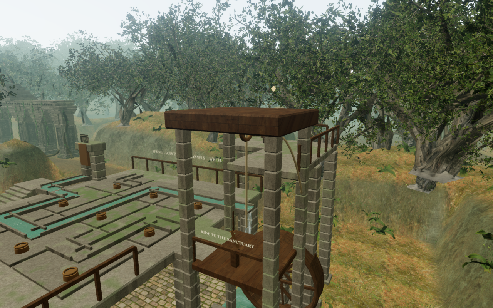
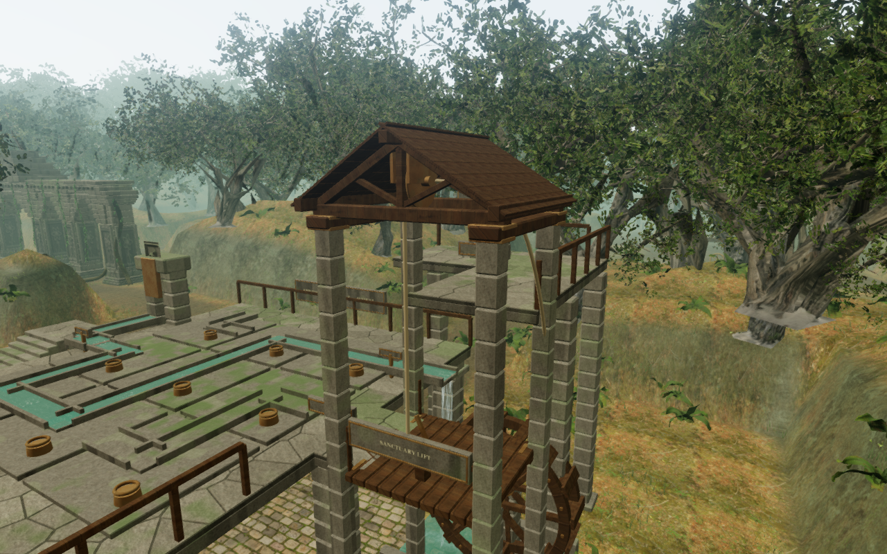
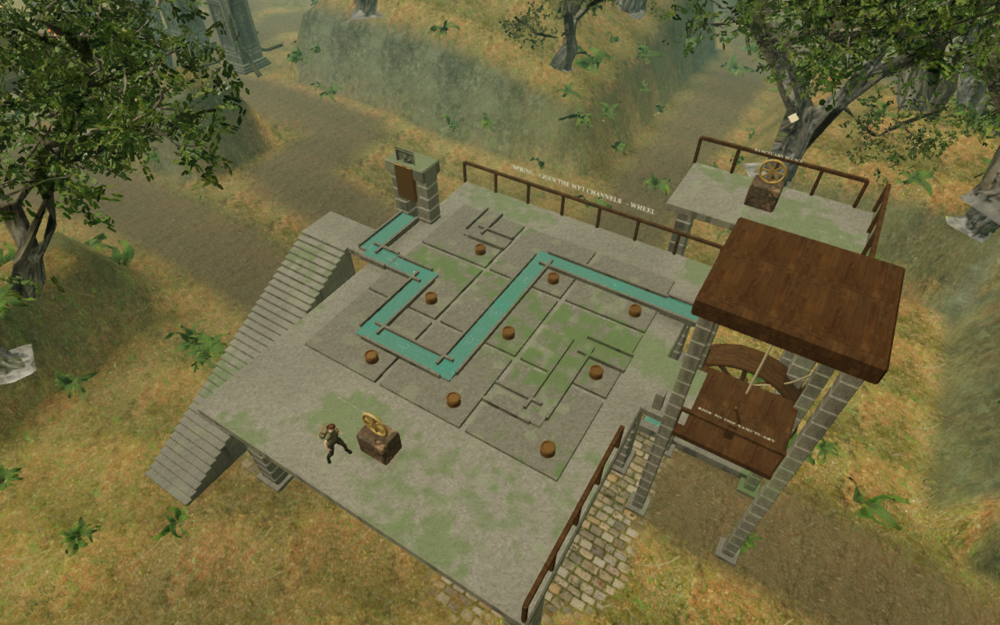
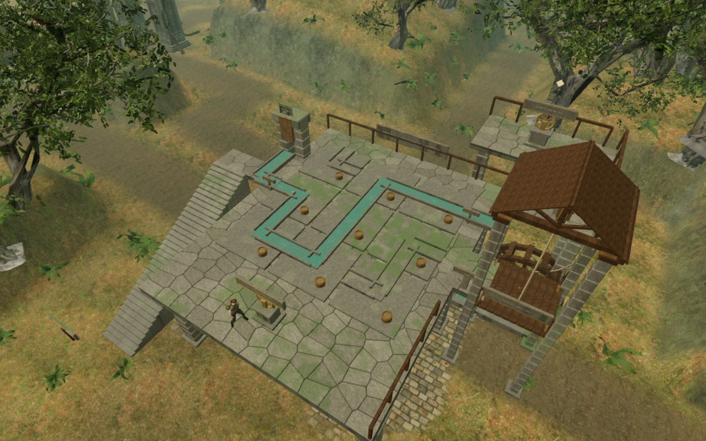

# Rain garden construction

The [rain garden](rain-garden.md) now uses fitted stone paving, an open timber
lift shelter, jointed waterwheel rims and mounted inscriptions. The large wooden
roof slab and smooth cargo platform have been replaced by trusses, overlapping
shingles, floor planks and bolted straps.

| Previous shelter | Current shelter |
| --- | --- |
|  |  |

The roof has two king-post trusses, longitudinal plates and 126 overlapping
wooden shingles. Bronze bearing plates attach its pulley to the front truss.
The grooved wheel rotates with platform travel, and the vertical cable meets
a bracket behind the front rail. This removes the former cable through the
middle of the passenger area. The positioned hoist sound now follows that
visible bearing location.

Fitted paving meets the existing deck heights; its joints have solid bedding.
Coursed beams and corbels support the terrace underside and have matching
collision. The cargo platform has ten boards, transverse supports and corner
straps. The waterwheel has segmented rims, radial spokes, hubs, visible bolts
and sixteen open buckets. Its falling feed now reaches the impact pool instead
of ending above it.

| Previous terrace | Current terrace |
| --- | --- |
|  |  |

Carved valve plinths support the handwheels. Framed inscriptions attach to their
posts, rails and controls; channel numbers lie on the stone pads. Their lettering
responds to the scene lighting. The puzzle sequence, stair and landing heights,
channel orientations and lift-stop persistence retain their existing behavior.

These are matched 1280 × 800 High browser captures of the powered garden.
The documentation WebPs preserve their captured pixels losslessly. The comparisons
show real-time game artwork.

## Verification

All **507 tests pass** in 81.12 seconds; the production build passes in 3.71
seconds with the existing large-chunk advisory. Three added regressions cover
775 paving contacts and closed joints, passenger headroom and attached rigging
through the lift journey, and the falling water's inlet/impact endpoints.

The final release passes native keyboard and muted 540 × 900 Performance touch
rides, upper-sluice approaches and completion at 100 health. Reloads retain the
complete saved state apart from the last-played timestamp. These checks use
prepared approach saves. The production page exposes no development hook and
loads the exact current build assets. It reports no console errors, warnings,
failed asset requests or portrait page overflow. Desktop and portrait lift
captures were visually inspected.

The continuous assisted route releases the spring, solves its supplied channel
arrangement through native E input, opens the receiver, rides to the sanctuary
sluice and returns down the lift and stair at 100 health. Traps, projectiles and
enemies remain live. Directions and the solution come from the helper; this
does not measure blind human play time.

The source activity and score still follow water release, lift motion and pause.
Distance-only buffer renders halve RMS at each linear falloff midpoint and are
silent beyond the range of all three garden emitters. A chapter transition
releases all 169 inspected garden-root geometries and 23 materials, clears its
runtime state and removes its three sound sources. These inspections do not
establish subjective music or soundscape quality.

| View | Draw calls, before → after | Triangles, before → after |
| --- | ---: | ---: |
| Overview · High | 888 → 940 | 2,542,800 → 2,617,968 |
| Overview · Performance | 387 → 414 | 1,030,198 → 1,071,118 |
| Shelter · High | 1,341 → 1,377 | 3,115,425 → 3,186,537 |
| Shelter · Performance | 611 → 629 | 1,301,427 → 1,336,983 |

These counts include all rendering passes and the surrounding world. The art
adds geometry and draw calls; no frame-rate or broad device-performance claim
is based on these counts. High, Balanced and Performance shader checks pass.

This is original project geometry using the existing fitted-stone generator,
credited temple/timber materials and local audio. No runtime texture assets, external assets
or dependencies were added. See [asset attribution](asset-credits.md).

The broader campaign still needs more authored spaces, character and environment
polish, blind pacing tests, listening review and wider device coverage. Modern
AAA graphics are not achieved, and approximately one hour per chapter remains
unverified.
