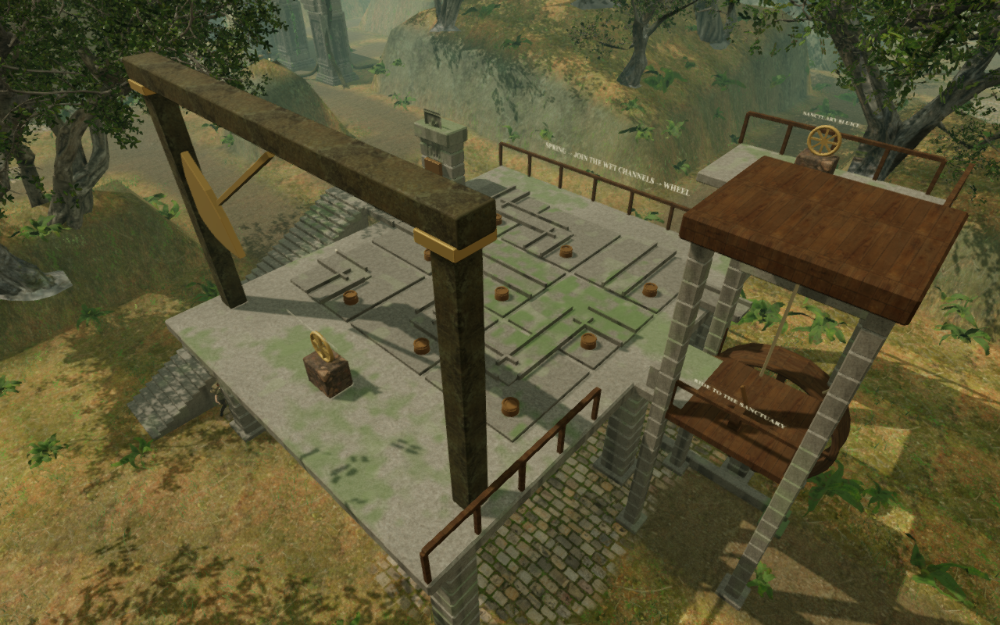
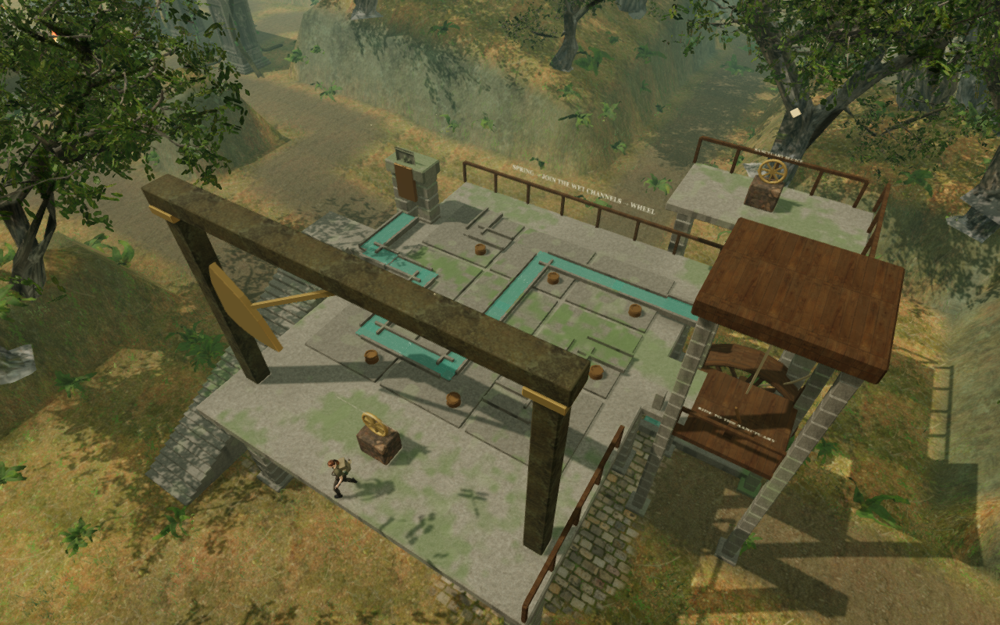

# The rain garden

The third field mission in **The Verdant Veil** now restores a connected
irrigation terrace. Its three scattered valve stations become a spring release,
a channel receiver and an upper sanctuary sluice in the existing garden clearing.
Nine turnable channel stones and a water-powered cargo lift join those actions
into one route.

Release the spring with **E / Use**, then climb the 36-step west stair. On the
5.6-metre terrace, use each numbered control to turn its channel a quarter turn.
Follow the water entering the middle row from the west. Join the wet channel ends
to the outlet on the east side of the northern row. Straight and elbow pieces
must meet at both open ends; a disconnected or turning piece stops the flow.

When water reaches the outlet, use the garden-channel handwheel on the southern
edge. The channels lock, the waterfall starts and its wheel powers the cargo
lift. Board from the eastern loading ledge and use the lever to ride to the
nine-metre sanctuary walk. Turn the upper sluice with **E / Use** to finish the
field sequence and return to the chapter's carved-drum puzzle. Both landings can
call the lift, and the same lift and stair provide a route back down.

These are actual 1280 × 800 High browser renders. The images use different
camera positions to show the overall structure and the channel connections.
The documentation WebPs preserve their source capture pixels losslessly.

## Structure and behavior

Coursed stone supports an open undercroft, the west stair, irrigation terrace
and upper gallery. Channel stones have recessed beds, raised edges and distinct
dry and wet states. The spring headwall, connecting troughs, falling sheet,
impact water, timber paddles, shaft, rope drive and cargo platform show the
sequence's cause and effect. Rails have posts, and the lift's front rail moves
with its collision and camera bounds. The existing blade trap now sits on the
terrace at its receiver's elevation and stops when that control is restored.

This is a channel-connectivity puzzle with animated flow and a powered lift.
It does not simulate fluid volume or pressure. Shallow water in the mechanism
is visual; it does not introduce a new swimming reservoir.

Each 0.36-second channel turn saves when it reaches its next orientation.
The 3.3-second lift journey carries a standing passenger. Pausing freezes the
mechanism and its flow clock. Reloading during a
turn restores its last seated orientation; reloading while riding restores the
passenger and platform to the last completed landing.

Once the mission is complete, valid channel arrangements and either lift stop
remain saved. Lowering the lift for the return journey therefore stays lowered
after reload. Older completed saves without garden state receive a connected
channel route and the upper lift stop. The chapter retains its three original
field IDs and independent local-storage progress.

## Verification and sound

All **504 automated tests pass** in 83.74 seconds. Five new tests cover reciprocal
channel connections, interrupted turns, normalization and older progress,
the complete stair/lift/return route, 45 rendered footing contacts and the moving
lift rail. The production build passes in 3.86 seconds with the existing
large-chunk advisory.

A continuous assisted browser route released the spring, walked to all six
channels needed for its supplied solution, turned them through native E input,
opened the receiver, rode the lift, used the upper sluice and returned down the
stair at **100 health**. Traps, projectiles and enemies continued updating. The
helper supplies directions and the solution; this does not measure blind human
playthrough time. The reusable development helper is
[`verify-rain-garden-browser.js`](../scripts/verify-rain-garden-browser.js).

Two water emitters sit at the spring feed and wheel's impact pool; a hoist emitter
sits just outside the upper pulley. They use the existing local waterfall
recording and original machinery synthesis with HRTF positioning, linear distance
falloff, obstruction filtering and saved mix controls. The spring, wheel and
hoist voices follow release, restored flow and lift motion respectively. All
three were present during the checked ride and absent on pause. At rest the
hoist voice stops while the water continues. The jungle score selects its
lifting arrangement during the journey and returns to the current task afterward.

Distance-only renders measured the water recording's RMS at 0.143335 near each
emitter and 0.071667 at its falloff midpoint. The spring uses a 2–28 m range and
was silent at 29 m; the wheel uses 2–32 m and was silent at 33 m. Machinery RMS
was 0.219431 at 2 m, 0.109716 at 13.5 m and zero at 26 m, beyond its 25 m range.
These measurements verify amplitude behavior, not subjective audio quality.

Seven High, Balanced and Performance views linked all active shaders. The
checked restored High overview submitted 4,201,445 triangles and 1,181 calls
across its rendering passes; Performance submitted 1,053,632 triangles and
393 calls. These include the surrounding forest and are not frame-rate results
or matched measurements of this change's cost. Changing chapters disposed all
152 inspected garden-root geometries and 23 materials, cleared its runtime state
and removed all three emitters. The development checks reported no console
errors, warnings or failed asset requests.

Eight production saved-state checks pass: interrupted and completed channel
turns, interrupted and completed lift journeys, keyboard and muted 540 × 900
Performance touch rides and upper-sluice approaches, a lowered lift after mission
completion with an unused channel orientation preserved, and an older completed
save without garden state. The checked rides and approaches end at 100 health.
Reloads preserve the complete saved state apart from the last-played timestamp.
These use prepared approach saves; the continuous route was checked separately.

The release exposes no development inspection hook, loads the current build's
four JS/CSS files, and reports no console errors, warnings, failed asset requests
or portrait page overflow. Desktop channel and upper-sluice captures were
visually inspected. Both landing calls also passed an isolated check through
the actual interaction and movement code with an empty lift.

The geometry, channel rules, signs and mechanism are original project work.
They reuse [credited local materials and audio](asset-credits.md); no external
assets or dependencies were added.

This adds a spatial puzzle and traversal sequence to the main route. The broader
campaign still needs blind pacing tests, subjective listening review and broader
browser/device coverage. Approximately one hour per chapter remains unverified,
and the requested modern AAA graphics standard is not met.
