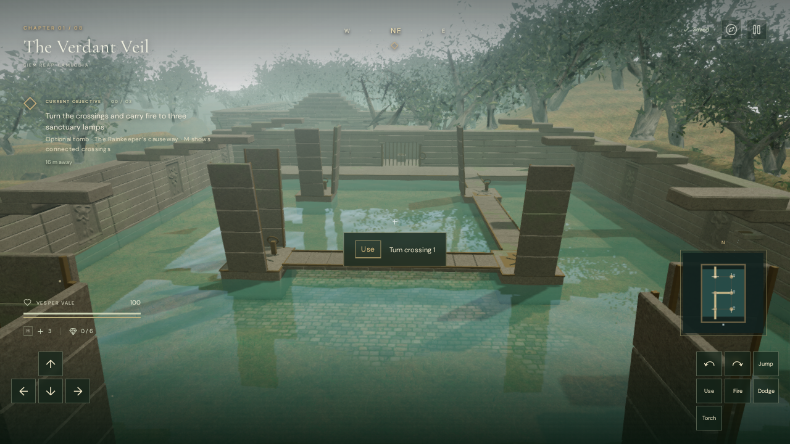
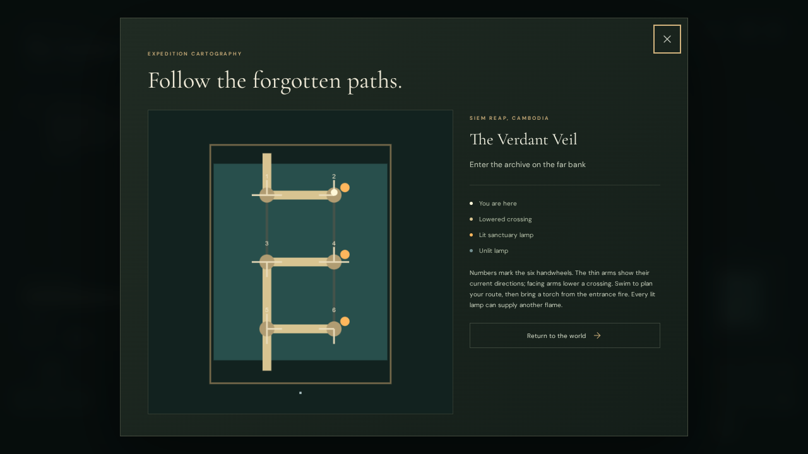
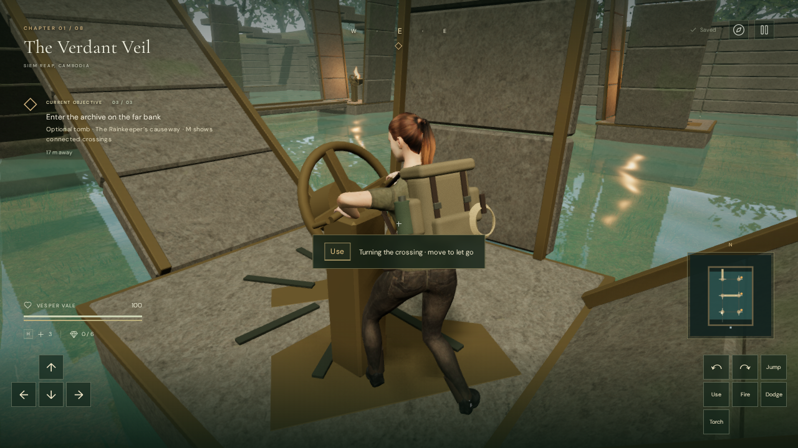

# The Rainkeeper's causeway

A flooded side tomb now stands south of the entrance camp in The Verdant Veil.
It adds a spatial crossing puzzle and a recoverable story about the sanctuary's
former role as shelter. It is optional and does not advance the main sun gates.

Six fixed platforms have handwheels and bronze channels. Press **E / Use** to turn
a platform's channels clockwise. Vesper approaches the two grips, turns the
ratchet, opens her fingers and lets go. Moving away before the quarter-turn
finishes cancels it; a completed turn stays saved. Facing channels on adjacent
platforms lower paired stone bridge leaves. The platforms remain fixed while their channels turn,
so a player can safely consider another move.

Swim to other platforms while planning the route. Approach a platform corner and
press **Space / Jump toward it** to climb out. Return to the entrance fire and
press **T / Torch**, then carry its flame over connected dry crossings. **E / Use**
lights each of the three sanctuary lamps. Swimming and actions requiring both
hands put the carried torch out; each burning lamp can supply another flame.

All three lamps release a grille that retracts beneath the far bank. Recover the
keeper's record inside and read it again in the field journal. The entrance
tablet explains the puzzle; the local **M** map shows the handwheel numbers,
channel directions and connected crossings.

## World, persistence and sound

The hall has a retained pool, twelve entrance steps, fitted stone courses,
recessed wall reliefs, broken roof ribs, bronze lamps and an enclosed archive.
Raised crossing leaves block movement and participate in camera collision;
lowered leaves support walking above the water. Swimmers beneath an open bridge
remain in the pool. The visible rain drain and falling drops locate the drip sound.

The added map cells are carved after the original seeded campaign features.
Existing feature IDs, answers and positions remain stable. The side tomb occupies
previously wooded ground and does not overlap an original feature or room. The
forest regression now measures the canopy within 50 metres of camp to include
the expanded clearing's banks; trunk and objective-clearance checks remain.

The jungle save stores six quarter turns, the three lit-lamp IDs, discovery and
record recovery. Lamp and record interactions save immediately; a wheel saves
when its quarter-turn locks into place. An interrupted reach or partial turn is
transient. Reload settles the saved wheel positions, restores burning lamps and opens a completed archive. Malformed
values are normalized; other chapters do not acquire this tomb's state. Its
record is separate from the campaign's 96 journal pages.

Four positioned fire emitters follow their visible lamps. The six handwheels and
the archive drive have local machinery sources that stop at rest and on pause.
The existing jungle score continues with the brazier objective state. These
sources share the existing HRTF positioning, linear falloff, obstruction filter,
mix settings and voice budget. No additional music or field recording is loaded.

## Reaching and turning the handwheels

Each wheel now has a supported shaft, ratchet housing, spokes and two 38 mm
hand grips. E / Use begins a short approach on the platform, a grasp, a
quarter-turn and release. The wheel returns after the fingers lift clear; its
ratchet keeps the crossing at the new orientation. The action puts a carried
torch out to free both hands. Movement or a jump releases it immediately.

The approach samples collision and floor support and stays within walking
speed. A blocked approach cannot pull the explorer through the solid pedestal.
The arms reach along a direct path; fingers close after reaching the grips and
open before the hands lift away. Bone lengths and scales remain unchanged.
The existing jungle score selects its lifting arrangement during the action,
and the machinery voice follows turning/returning motion and pause state.

The handwheel update passed all **321 tests** and the production build. Checks
include all six supported stances, four successive turns per wheel, cancellation
before and after the completed turn, paused angles/time, and persistence of only
completed turns. The delivered character mesh was sampled through 63 action
frames: the largest measured surface intersection with a grip was 1.23 mm,
within the 2 mm test tolerance; during the held turn each measured hand region
came within 2.47 mm of the handle. These are geometry measurements, not a claim
of physically exact hand simulation.

A new continuous assisted browser run reached every handwheel by swimming and
climbing, configured the crossings, carried fire to the lamps, recovered the
archive and returned at 100 health. Native keyboard cancellation, pause/resume,
completed-turn release and portrait touch Use passed. High/Performance hand
views rendered with linked shaders. The live audio state changed from lifting
back to the brazier arrangement; the wheel voice stopped at rest and on pause.
Changing to the desert disposed all 154 inspected geometries and 12 materials
and removed the tomb's emitters.

Production checks retained a cancelled turn as unfinished after reload, then
saved and restored a completed turn. They also retained partial lamp progress,
relighting, the final lamp, the recovered record and its journal entry. Health
remained 93 in these isolated position fixtures, and the development hook was
absent. Completed browser checks reported no errors, warnings or failed assets.
The checked update bundles are `index-DC6gDxy5.js`, `game-BwBmLBH0.js`,
`index-CPHETchX.css` and `three-DSdd5dJ3.js`. The final guide correction was
checked with native E on `index-P4QPo6Dc.js` and `game-Dcas5GGi.js`; its production
build also passes with the existing Three.js chunk-size advisory.

## Initial tomb verification

- All **318 automated tests passed**. The final entrance/archive details also
  passed the seven focused tomb and habitat tests. Checks search all 4,096 turn
  configurations, exercise real interactions and character support, validate
  save normalization, and retain the blocked grille until all lamps are lit.
- A continuous assisted browser run started at the original chapter spawn,
  walked up the entrance stairs, swam to and mantled all six platforms, and used
  native Space/E input to configure the handwheels. It then recovered onto the
  entrance bank, used native T to light a torch, walked the connected route to
  all three lamps, recovered the archive record with native E and returned to
  the entrance. Health remained 100, and the dry route never lost its flame.
  Movement directions and the solution were supplied by the check; this is not
  a blind playthrough or a pacing measurement.
- Both existing jungle torch chains were checked using their established
  prepared sector progress and assisted movement. All five relay fires lit at
  full health.
- Production fixtures exercised native E/T input, unfinished-turn reload,
  partial lamp progress and relighting, the final lamp, archive recovery and
  the recovered journal entry after reload. Health remained 93. These isolated
  fixtures place the player at interactions; continuous movement was checked in
  the development world. The production inspection hook was absent.
- The four fire-source positions matched their visible flames exactly. Live
  machinery voices appeared during motion and disappeared at rest; pause froze
  the wheel angle and silenced its activity. An offline HRTF render of the actual
  lamp recording measured half amplitude at 12 metres compared with 2 metres,
  and zero beyond the 22-metre range. This verifies signal behavior, not subjective
  soundscape quality.
- Twelve prepared High/Performance views rendered with linked shader programs.
  Portrait touch Use turned a handwheel and Torch relit from a burning lamp.
  The local map rendered with its instructions. Changing to the desert disposed
  the inspected tomb geometries/materials and removed its source references.
  Completed browser checks reported no JavaScript errors, console warnings or
  failed asset responses.

The initial tomb production build passed with the existing Three.js chunk-size
advisory. Its checked bundles were `index-Bv_qlZkI.js`, `game-C5fhhFMh.js`,
`index-CPHETchX.css` and `three-DSdd5dJ3.js`. Reusable development helpers are
[`verify-fire-vault-browser.js`](../scripts/verify-fire-vault-browser.js) and
[`inspect-fire-vault-browser.js`](../scripts/inspect-fire-vault-browser.js).
Use disposable progress and stop the animation loop before running them.

This is additional prototype gameplay. Modern AAA visual quality remains unmet;
approximately one hour per chapter and the subjective music/sound mix still need
human playtesting and listening review. The assisted checks do not establish a
hardware frame-rate target.
