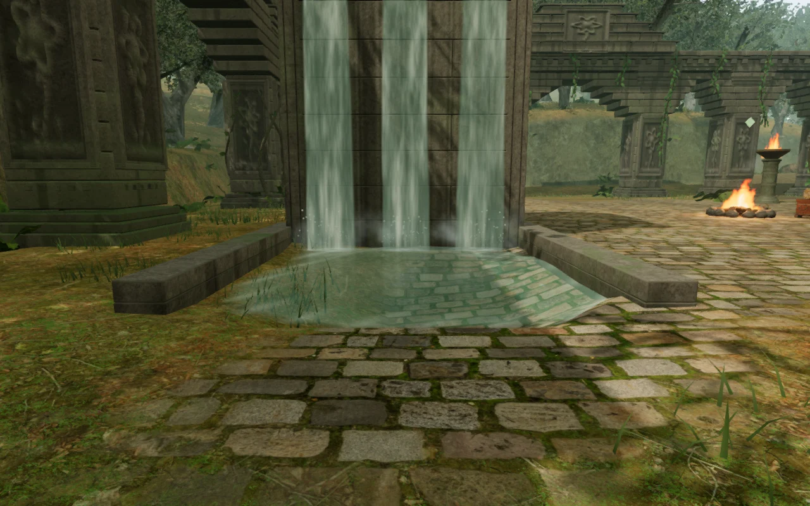
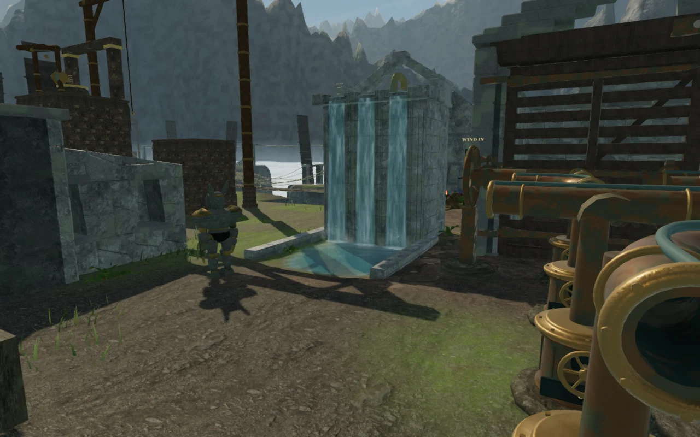
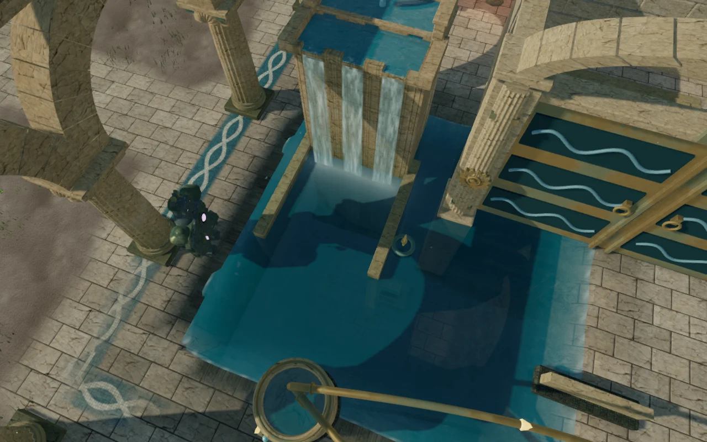
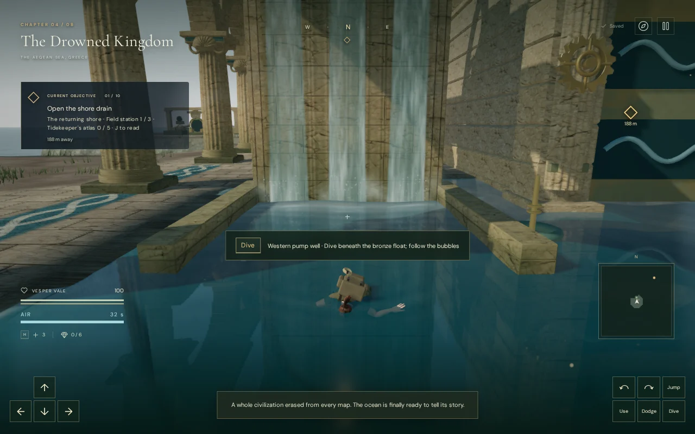

# Receiving-pool shorelines

The jungle, palace and cloud-city cascades now flow into pools whose water meets
the surrounding ground. Water surfaces no longer stop at a mesh boundary while
the adjacent ground is still submerged. The cloud city's occupied wind courts
retain their three dedicated waterfall basins without the broad reservoirs that
previously left disconnected strips of shallow water around the controls.

## Construction

The terrain uses a 1.75 m grid. Its interpolation extends an excavated basin
past the analytic excavation boundary; the old water plane stopped at that
boundary. Jungle and palace water also sat 12 cm above the surrounding terrace,
so merely smoothing the pool corners would not close the edge.

The excavation dimensions and depth remain separate from the surface bounds.
Water extends one terrain cell beyond the excavation on each side and sits
18 cm below the jungle and mountain terrace datum, or 8 cm below palace
terraces. The coastal offset also keeps the lowest fully drained well above
the sea. Receiving water meets the sloping bank before reaching the mesh
border, with clearance for the animated wave crests.
The same depth query governs shallow wading and swimming. Coastal wells retain
their shared waterfall surfaces and 1.8 m drainage; the lock and other authored
interior pools keep their own flood levels. The cascade masonry follows the
updated base datum, and its footings remain buried.

The five generic reservoirs in the cloud city overlapped protected mechanism
pads. Their residual shallow strips are removed; all three supplied cascades
have dedicated excavated receiving basins. Wind controls, elevated crossings,
objectives and the chapter score retain their existing behavior.

The jungle entrance's paved receiving bank:

The cloud-city mechanism court after replacing the reservoir overlap with a
dedicated receiving basin:

The palace retains deep reservoirs and submerged supporting masonry:

The [previous cascade milestone](supplied-cascades.md) records the earlier
receiving-area defect and construction of the supplied headers. Those earlier
views use different camera framing; these are inspection views, not a matched
pixel comparison.

## Verification

- All 610 automated tests and the production build pass. The first full run
  caught a coastal well whose fully drained level would have fallen below the
  sea; the final coastal offset preserves that constraint. The palace bank
  clearance test now uses excavation dimensions instead of the water mesh's
  invisible dry margin.
- The new [shoreline regression test](../tests/receiving-shores.test.js) checks
  6,060 perimeter samples across 15 rendered receiving waters and reservoirs.
  Both the movement height and the rendered triangle height exceed the water
  surface by more than 6 cm at every sample, including space for wave crests.
  All nine cascades have receiving depth, and all five coastal wells retain
  1.8 m drainage, water above sea level and over 2.5 m depth at their centers.
- Reviewed captures cover 87 assisted views: 27 cascade approaches and overhead
  views; 30 Low, completed-state, flow and underwater views; 27 views of the
  other reservoirs and former wind-court puddles; and three further drained-well
  views. Some overview cameras have foreground masonry or foliage; the multiple
  views and terrain measurements provide complementary coverage.
- All 54 local movement legs arrive, including 11 involving swimming. Checks
  retain 50 cipher approaches, 36 hydraulic approaches and 119 wind approaches,
  plus 36 coastal and 119 wind-court route legs. All 3,267 sampled waterfall
  footing points remain buried by at least 18 cm.
- Actual offline HRTF playback of the same waterfall buffer and phase gives RMS
  amplitudes of 0.025171755 at 6 m, 0.012585878 at 38 m and zero at 71 m.
  All nine waterfall sound paths remain clear from their front approaches.
  Falling curtains, impact spray and emitters follow the live reservoir level;
  the existing quiet chapter/objective music and saved mix controls remain.

Eight production cases use native keyboard or portrait touch input, followed
by a save and reload after each movement leg. Six enter and leave the three
chapter entrance pools on High/Low graphics; two additional post-combat fixtures
exercise swimming in a deep palace well and arrival on a formerly flooded
cloud-city pad. The old pad location had about 65 cm of water above its terrain;
it now resumes on dry ground at the saved horizontal position.

All 16 reload comparisons preserve the complete normalized save apart from
timestamps. Health stays at 100. The swimming case verifies the live swimming
controls before reloading; swimming saves use height zero and restore against
the live waterline. Portrait touch cases are muted and have no horizontal
overflow. The pages load the current production assets, expose no development
game handle and report no browser errors, warnings or failed requests.

The image captures and route checks use assisted development placements. The
production cases exercise short input sequences from prepared saves. They do
not establish a complete human playthrough, consumer-device performance or
subjective audio quality. VA-03's receiving-area defect is addressed in these
views; repeated court composition and broader playable-world coverage remain
open in the [visual audit](visual-audit.md).

## Assets

This change is original hydrology code and uses the existing credited terrain,
stone, waterfall audio and chapter music. No external asset or dependency was
added. The documentation images are browser captures converted to WebP.
See [asset credits](asset-credits.md).
