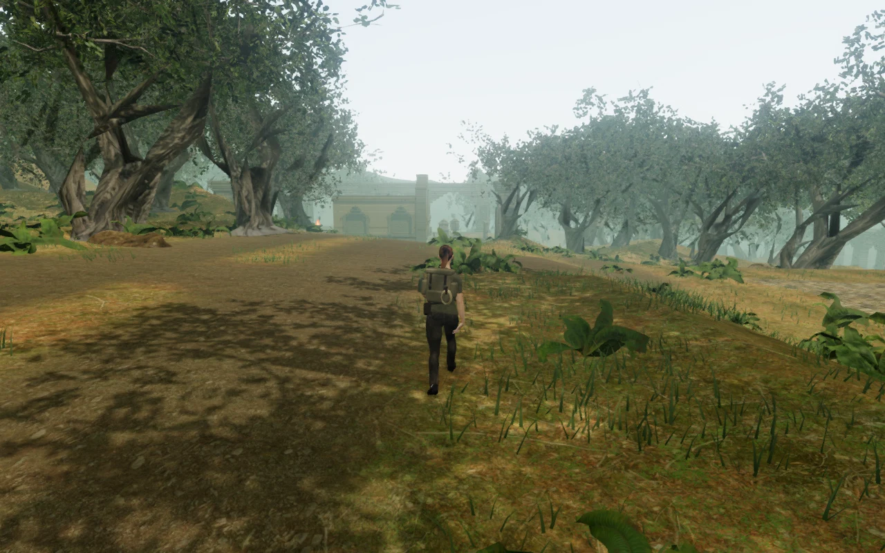
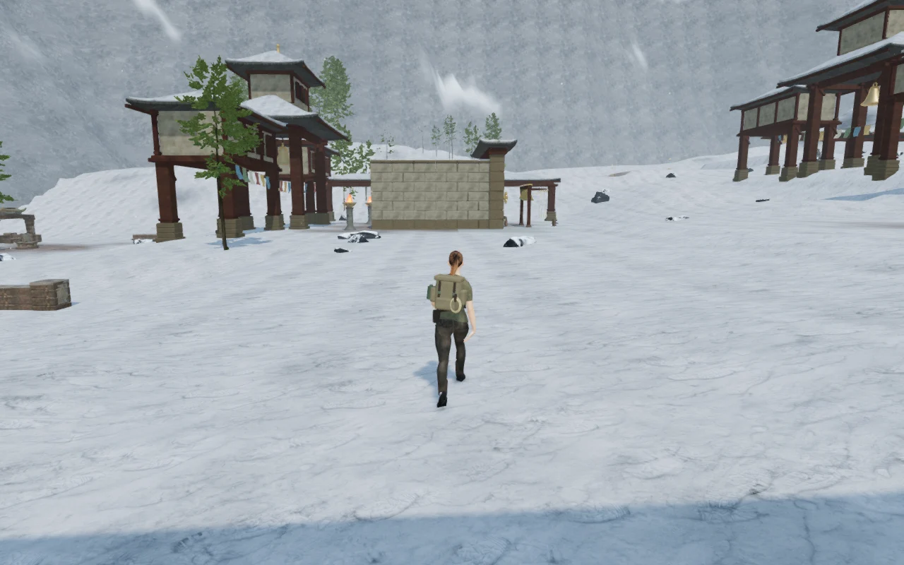
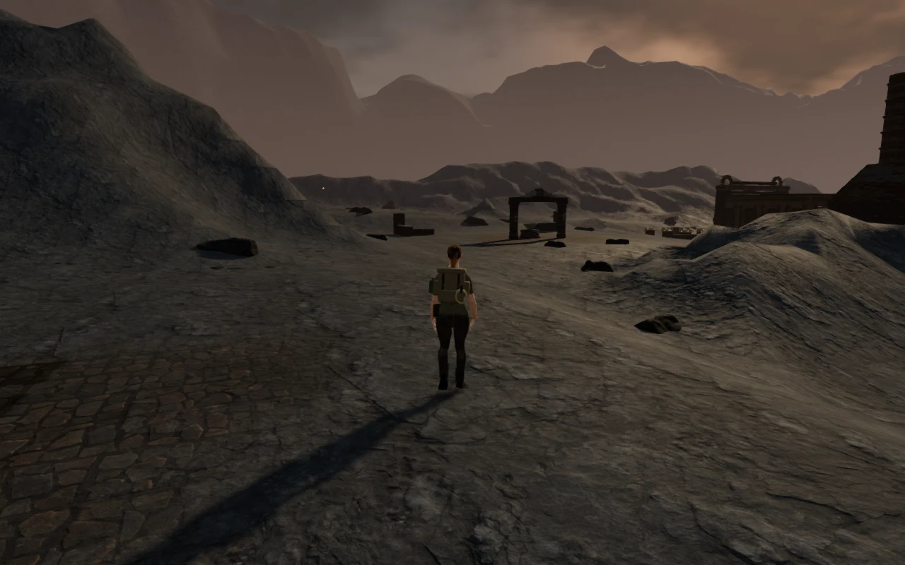
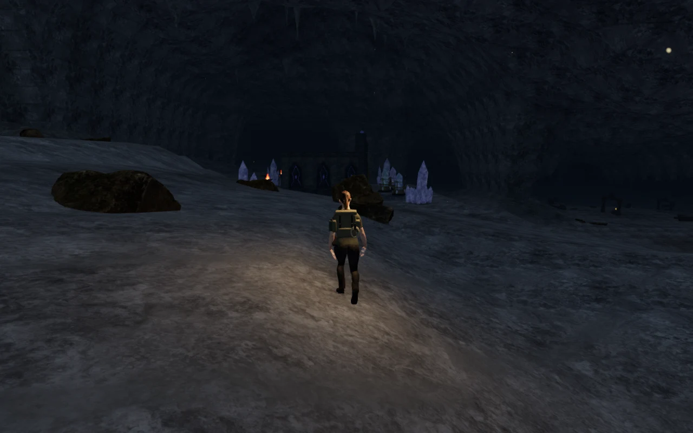
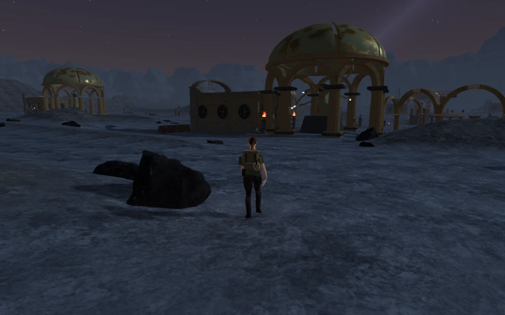

# Broad regional terrain banks

The jungle, snow, volcanic, crystal and eclipse landscapes now rise gradually
beside their paths. Their old shared bank rule added most of its height in the
first few metres, producing repeated steep mounds and flat shoulders in the
[initial route survey](initial-court-routes.md). The new banks have wider aprons
and uneven crests. Snow, cavern and meridian rock treatments use broader slopes
and three masked smoothing passes where neighbouring ridges meet.

This improves VA-15, while **the terrain and world-composition audit remains
open**. The subsequent [court terrain pass](court-terrain.md) grades overlapping
pads while retaining working floors and basins; one protected discovery-pad
overlap near snow court 7 still shows a sharp bank. Sparse surroundings and
repeated station footprints also need further work. The tree-root margins below
were repaired in the later [jungle root pass](jungle-roots.md).

## Terrain and save footing

The comparison against `6911d07` changed 127,308 terrain vertices outside the
walking grid across the five affected chapters. All **172,803 walking vertices**
in those chapters remain exactly equal to the baseline. Cell boundaries align
with the terrain samples, preserving the complete interpolated walking surface,
not just room centres. That pass retained baseline walking digests. The later
[court terrain pass](court-terrain.md) intentionally changes walking terrain at
the terrace joins and replaces those digests with working-core regressions.
All water-site records remain identical, and the desert, coastal and sky height
fields are unchanged.

The following measurements use terrain gradients at vertices within 5.25 m
outside a walking cell. They describe the path-bank transition; they are not
maximum slopes or a judgement of visual quality throughout the map.

| Chapter | 95th-percentile slope before / after, m rise per m | Samples |
| --- | ---: | ---: |
| Verdant Veil | 1.896 / 0.496 | 9,458 |
| Silence of Snow | 1.377 / 0.477 | 10,099 |
| Heart of Embers | 1.920 / 0.773 | 10,340 |
| Night Below | 1.511 / 0.566 | 10,998 |
| Last Meridian | 1.736 / 0.554 | 9,216 |

The chapter-specific geological masks still protect working foundations and
water margins. Structures and vegetation use the regenerated terrain when they
are built. The broader snow shoulders accept 279 individually seated firs,
compared with 269 on the old terrain.

## Dependent camera repair

The cavern roof follows the terrain. Lowering its banks exposed a fixed-height
portrait inspection camera above the roof at one resonance array. The inspection
eye now fits beneath the actual roof with at least 40 cm clearance across a
70 cm square footprint. The existing tests also check that every array's node
centres remain visible in desktop, portrait and landscape formats.

All eight arrays were captured in three browser formats: 1280×800, 390×844 and
844×390. These 24 reviewed views retain the array layout and clear the roof.
The [portrait view of array 5](images/regional-banks/portrait-array.webp) still
clips part of the outermost crystal at the right edge; fitting the complete
object silhouettes was recorded as VA-20 and is repaired in the subsequent
[array-framing pass](resonance-framing.md).

## Verification

- **643/643 automated tests pass**, including the five new bank regressions,
  geological boundaries, supported structures, traversal, audio, saves and the
  revised inspection-camera check. The production build passes.
- Ten assisted approach/return legs cover **1,779.9 m and 26,916 movement
  frames**, with 122 reviewed High captures. Each leg reaches its destination
  using the normal character controller and follow camera. Enemy AI and combat
  are not stepped in these route checks.
- Front/rear observer captures cover all **47 main courts** in the affected
  chapters: 94 High views and five additional Low views. These 99 images and the
  24 inspection-camera views were reviewed alongside the route captures.
- **35,107 terrain rays** check 37 jungle pier foundations, 54 ruin-root rings,
  72 monastery foundations, 99 observatory foundations and nine regional pool
  borders. All sampled bottoms remain below the rendered terrain. Pool borders
  retain at least 8.36 cm burial.
- **170,922 additional rays** check the lower roots of all 279 snow firs. Every
  checked root remains at least 8 cm below the rendered snow, with no missing
  terrain or walking-cell intrusion.
- **222 local control routes, 191 control approaches, 279 feature approaches
  and 42 open gate thresholds** pass. All 84 gate sound sources have at least
  one reachable listening stance with a clear sound path. Fixed five-metre
  forward probes are also recorded, but some fall behind existing walls.
- Reachable stances at horizontal radii of 8, 12 and 20 m produce decreasing
  distance gains for a bird, ridge wind, fire, cavern drip and meridian pool
  source. Each produces a loaded, nonzero Web Audio voice at its near stance.
  The bird is filtered by its intervening structure; the far drip/pool stances
  are also obstructed. These checks verify positioning and playback, not a
  subjective assessment of the mix or music.

Ten production cases cover keyboard/High desktop and touch/Low portrait input
in each affected chapter. All twenty movement legs retain health 100. After each
leg, a reload preserves the complete saved data except its play timestamp;
there are no camera corrections in this set. Thirty arrival/movement captures
were reviewed. Browser errors and warnings are empty, and each case loads the
current build's four JavaScript/CSS assets. These fixtures suppress enemy combat
to isolate movement and persistence.

The reusable helpers are [court routes](../scripts/inspect-court-routes-browser.js),
[court views](../scripts/inspect-world-courts-browser.js),
[bank supports](../scripts/inspect-bank-supports-browser.js) and
[fir grounding](../scripts/inspect-fir-grounding-browser.js). Raw captures,
profiles and exported verification saves remain in the ignored local staging
folder. Runtime assets and their attribution are unchanged.

## Remaining observations

The broader bank slopes expose the distinction between the landscape and the
fixed flat court pads.
[Rear views of snow courts 5–7](images/regional-banks/snow-terrace.webp) and front
views of crystal courts 2 and 6 recorded abrupt terrace cuts. The subsequent
[court terrain pass](court-terrain.md) repairs the shared joins and documents
movement, foundation and save checks. A protected discovery-pad overlap beside
snow court 7 remains open under VA-15.

Jungle route views also show exposed margins on the scanned tree bases. A
screening measurement of the lower trunk vertices finds a margin more than
20 cm above the rendered ground on 374 of 753 tree instances. The corresponding
baseline measurement found 476. This is a candidate list for individual root
inspection, not a claim that every candidate is visible from a walking route.
The [near-route tree](images/regional-banks/jungle-root-margin.webp) at
approximately (101.67, 66.01) has a sampled lower margin 1.09 m above the ground.
VA-19 recorded this placement issue. The subsequent [jungle root repair](jungle-roots.md)
seats a common footprint across all tree detail tiers and verifies the resulting
contacts, route views and native movement.
