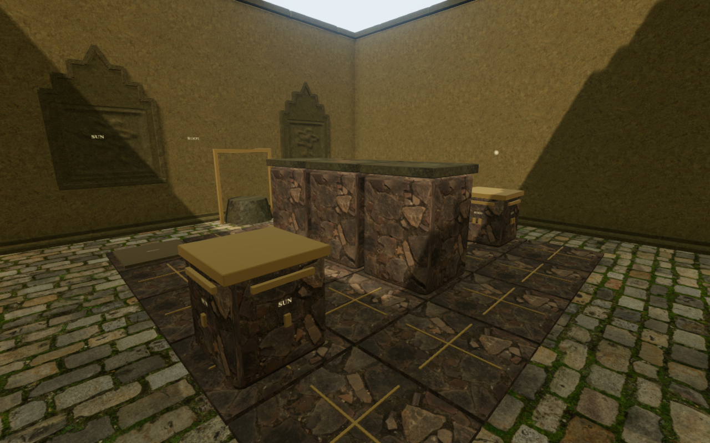
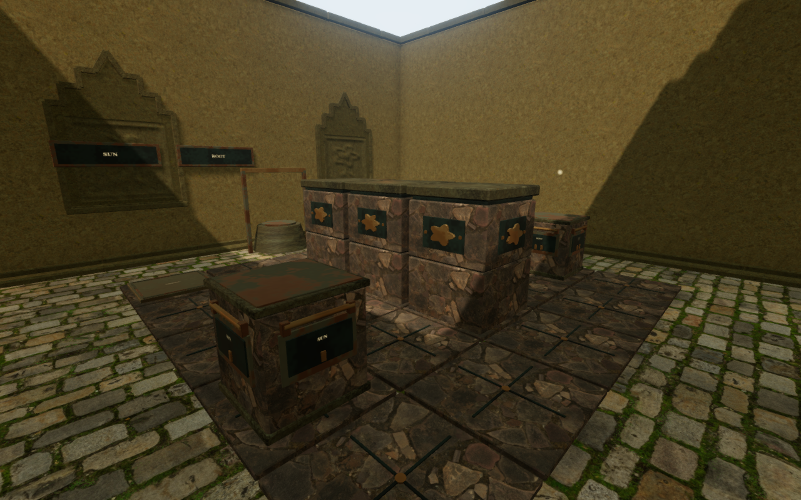
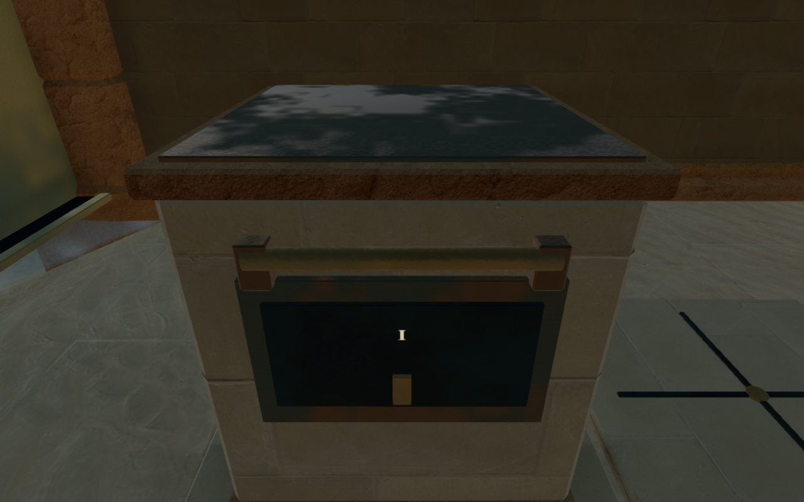
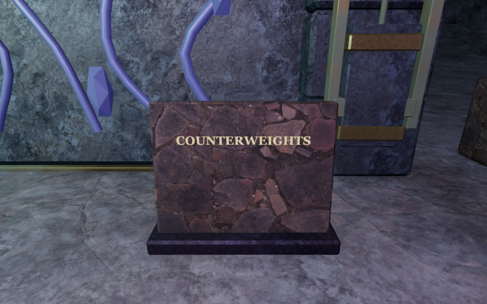

# Regional counterweight chambers

The later [working-camera repair](counterweight-camera.md) addresses the hidden
explorer in accepted grips and slides recorded during this milestone. Its notes
retain the separate cloud aisle walking-view finding beside its wall and folded door.

The seven counterweight chambers outside the cloud citadel now have fitted
stone courses, weathered metal caps, mounted grip rails and backed labels.
Their fixed pillars carry regional seals: jungle flowers, solar rays, monastery
bells, coastal shells, forge flames, crystal facets and eclipse stars. Chapter
masonry maps and weathering follow the surrounding architecture.

This pair uses the same assigned jungle observer, camera target, initial stone
positions and High quality. The views inspect the actual chapter world; they
are not evidence of earning the opening field work.

The [existing cloud construction](sky-counterweights.md) now shares its builder
with the other chapters in `src/counterweight-art.js`. Its geometry, tablet
location and regional materials are retained. Moving stones batch their solid
fittings into five materials while keeping their four labels attached. Receiver
frames and lettering follow a pressure plate as it depresses. Small pillars,
moving stones and inscriptions supply explicit camera bounds.

Inscription lettering follows its stone slab's tilt. The seven new bases sample
their ground footprint, extend below its lowest sampled height and carry the
slab above its highest sample. Their finite walking solids follow that raised
slab height. The crystal tablet moves five metres into the right aisle, clearing
the tall central resonator that blocked its previous frontal reading position.
The other tablet locations retain their delivered values.

The five-by-five board, 1.6 m spacing, authored wall and stone cells, eight
receiver rules, movable footprints, hand targets and settled-move saves are
retained. Existing saved chamber states continue to drive the new models.

## Verification

All **25 targeted tests pass**: twelve counterweight specifications and thirteen
camera specifications. The expanded art regressions check every chapter's label
backing before and after pressure depression, movable geometry bounds, finite
patina attributes, camera bounds following stone translation and clear reset
positions. A new uneven-ground regression checks the raised slab's collision
height. The existing checks solve all eight boards through walking, gripping
and swept stone movement. The production build and changed JavaScript formatting
pass, with the existing large-chunk advisory. The complete campaign suite was
not rerun for this art change.

All **108 baseline and 110 updated High/Low inspection captures** are reviewed.
The baseline's two missing frontal crystal inscription views were blocked by
the resonator; all updated observers are clear. Recorded shaders link and the
completed galleries report no browser errors or console warnings.

The [browser integration helper](../scripts/verify-counterweights-browser.js)
opens the first field gate using assigned progress, then walks around the solid
inscription and through every stone move using actual terrain and collision.
Its local approach now uses swept route planning: the previous straight
inspection walk crossed the slab, and trial detours met a jungle entrance pier
and a cloud wind duct. This changes inspection steering, not player movement.
The completed solutions require:

| Chapter | Settled stone moves |
| --- | ---: |
| Jungle | 14 |
| Desert | 12 |
| Monastery | 15 |
| Coast | 14 |
| Forge | 14 |
| Cloud citadel | 14 |
| Crystal | 18 |
| Eclipse | 20 |

All eight mechanisms latch. Thirty-two post-solution overview and inscription
captures are reviewed on High and Low, with linked shaders and no browser errors
or warnings. Field work is assigned at startup and guardian AI/combat are not
advanced in this assisted check. These are chamber checks rather than earned
chapter playthroughs.

Four native production cases pass against the current JavaScript/CSS bundles:
keyboard High at 1280 × 800 grips and pushes the jungle ROOT stone through one
settled move; touch Low at 540 × 900 pushes the desert four-measure stone through
two settled moves. Both release the stone. Separate keyboard and touch cases
open and close the relocated crystal inscription. All four walk, pause, reload
and resume; their measured walking distances are 1.119 m, 0.807 m, 0.562 m and
0.499 m. Health remains 100 with native guardians and station hazards active.

Across reload, every stored field matches apart from `lastPlayed` and two
camera-only arrival adjustments beside the moved stones. Independent geometry
checks reproduce both obstructed preferred views: camera arms of 1.956 m and
1.555 m become clear 5.381 m views. Each second reload retains the corrected
camera and full store exactly. Resumed feet remain within 5 cm of their saved
position and floor height. The two inscription cases retain their cameras
without adjustment.

All sixteen production captures are reviewed. No development handle, horizontal
viewport overflow, failed asset, JavaScript error or console warning is recorded
in the completed run. The native cases start from disposable saved working
positions and assigned opening field progress. They do not earn the whole route
with native input. Some moved-stone views retract enough to hide the explorer;
that remaining composition issue is recorded as VA-44 for a camera follow-up.

## Scope

Stone friction and pressure sounds retain their existing world positions and
behavior. The inscriptions have no sound emitter to relocate. Environmental
soundscapes, themed scores and their mix are unchanged; this milestone adds no
subjective listening assessment.

The four documentation images are actual runtime captures converted losslessly
to WebP, with decoded RGBA identity verified. No external asset or dependency
was added; existing attribution remains in [the credits](asset-credits.md).
Private saves, profiles, logs and unselected captures stay in ignored local
staging.

This improves the seven primitive counterweight installations and repairs the
crystal reading obstruction. The broader [visual audit](visual-audit.md) remains
open for repeated court layouts, sparse surroundings, other interior instruments,
custom carried components and crowded camera approaches. These checks do not
establish AAA graphics, consumer-device frame rates or human chapter duration.
