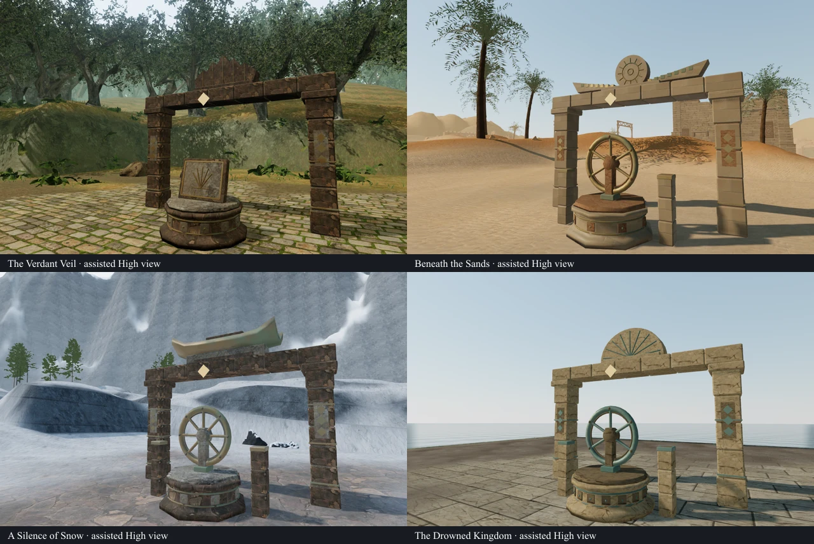
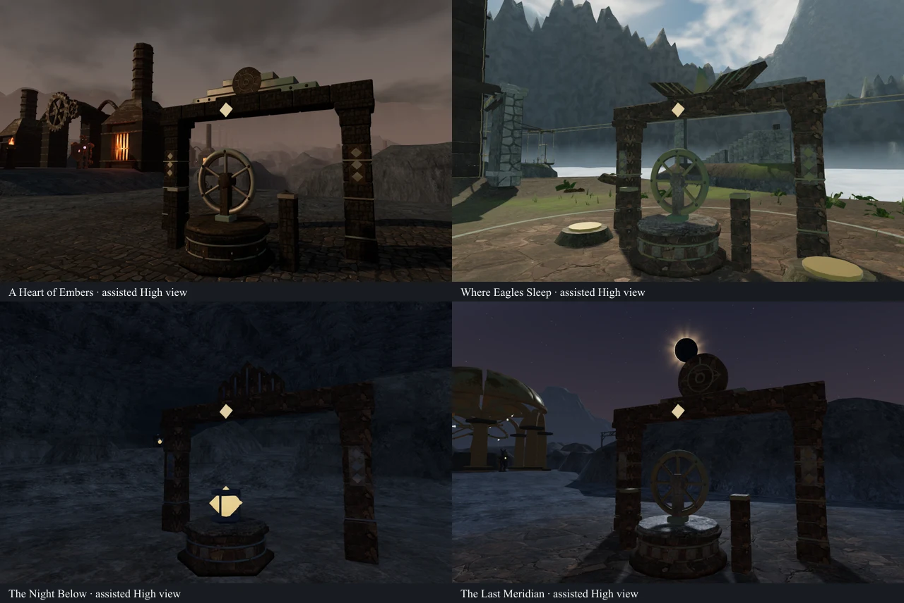
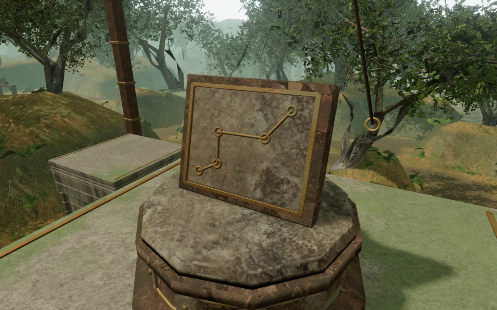
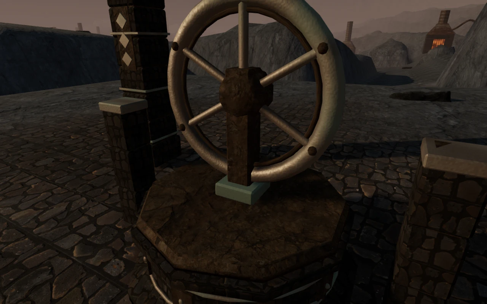

# Regional field stations

The 169 shared field stations now use assembled masonry and regional fittings.
Their molded bases have recessed panels, metal ties and fitted caps; control
wheels have spokes, rim fasteners, hubs, bearings and anchored uprights. Survey
tablets carry regional instrument faces, and climbing tablets show a route
diagram. Carried components have stone cartridges, collars and lifting eyes.
Resonance stations use a faceted core held between collars, and braziers have
an open bowl, an inner wall and a fuel bed.

The ground stations have distinct crowns:

| Chapter | Construction | Shared stations |
| --- | --- | ---: |
| The Verdant Veil | Carved lotus petals and waterworks fittings | 13 |
| Beneath the Sands | Winged solar disks and sandstone courses | 21 |
| A Silence of Snow | Curved monastery roofs and keeper's instruments | 18 |
| The Drowned Kingdom | Tidal fans and oxidized coastal fittings | 21 |
| A Heart of Embers | Stepped iron casings and pressure-wheel reliefs | 21 |
| Where Eagles Sleep | Swept stone wings and wind-surveyor fittings | 27 |
| The Night Below | Faceted registers and caged resonators | 21 |
| The Last Meridian | Meridian dials and archive instruments | 27 |

The 21 controls on climbing landings retain the course's existing cable frame.
The larger ground crowns are omitted there to preserve the walking ring and
mantle approaches. Existing bespoke field installations keep their own builders.

Flat pedestal tops use planar texture coordinates, while the molded sides use
cylindrical coordinates at a consistent scale. Close inspection caught the
radial texture wedges produced by the initial lathe mapping; the corrected
mapping also covers cartridge caps. A regression test checks flat caps across
all five station polygon counts, including their duplicated center vertices.

Materials reuse the project's credited texture maps and filtered bronze shader.
The geometry and relief diagrams are authored in source. Static pieces batch by
material; the moving wheels and collected/installed components retain separate
groups and their saved visibility. The camera captures the individual surfaces
before batching. Crown and bearing bounds participate in the existing physical,
sight, sound-occlusion and projectile systems.

## Verification

All **625 tests** pass, including the cap-texture regression and the established
station movement, support, delivery and save-recovery tests. The production
build passes with its existing large-bundle warning.

The disposable-progress browser helper checks all **169 stations**, now with
**1,680 physical bounds**, and completes all **21 climbing courses**. Each
station has a clear working position, completes through the interaction handler,
stops sustained forward movement outside the base, and recovers an occupied
center save at a clear supported position. Every raised station fits its landing.
The six shared brazier sources remain attached to visible flames and have clear
listening positions at 6, 12 and 18 m with strictly decreasing distance gain.

The final geometry produced **477 reviewed assisted renders**:

- Front and rear views of all 169 stations: 338 images.
- Representative Low graphics views: 16 images.
- Completed control states: 44 images.
- Close control views, including both sides of all 21 climbing controls: 79 images.

All views use clear, supported observer positions. Overview views show the
chapter lighting; close views remove the carried torch so it cannot obscure
the instrument face. The avatar is hidden for these inspection views. All 477
images were reviewed in labeled contact sheets, with selected images also
inspected at full resolution. Shaders linked with no browser errors or warnings.
These views cover the station artwork and nearby visible surroundings. They do
not constitute continuous human playthroughs of every approach and return path.

The final production build also passes **13 native input cases** (six keyboard,
seven touch), covering all eight chapters, both formats at the volcanic valve,
older occupied ground/raised saves and delivery from an occupied empty socket.
All cases retain full health and ordered completion. **26 reloads** preserve the
complete normalized save apart from `lastPlayed`; the initial recovery of an
occupied old save is allowed to correct only position and camera. The checks
confirm the final production bundle names, absence of the development hook,
no viewport overflow and no browser warnings, errors or failed requests.
The 26 production movement screenshots were also reviewed.

The reusable helper is
[inspect-field-stations-browser.js](../scripts/inspect-field-stations-browser.js).
Raw captures, generated save fixtures, browser profiles and logs remain in the
ignored local staging directory. The four images above are intentional public
review artifacts.

## Scope still open

This pass improves the construction portion of VA-12. The repeated station
footprints and sparse paving around many of them still need composition and
landscape work. The larger [playable-world audit](visual-audit.md) remains open,
including approach/return paths, optional areas and the remaining court work.
This milestone does not establish AAA parity, human chapter duration, subjective
audio quality or consumer-device frame rates.
