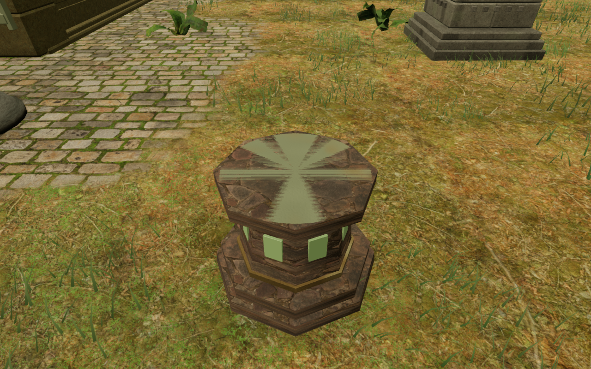
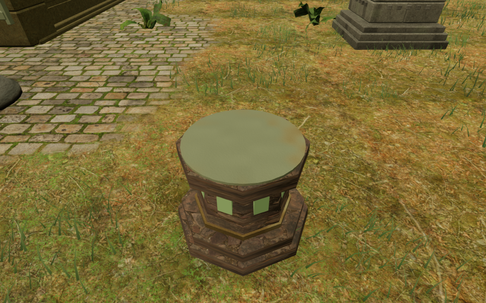
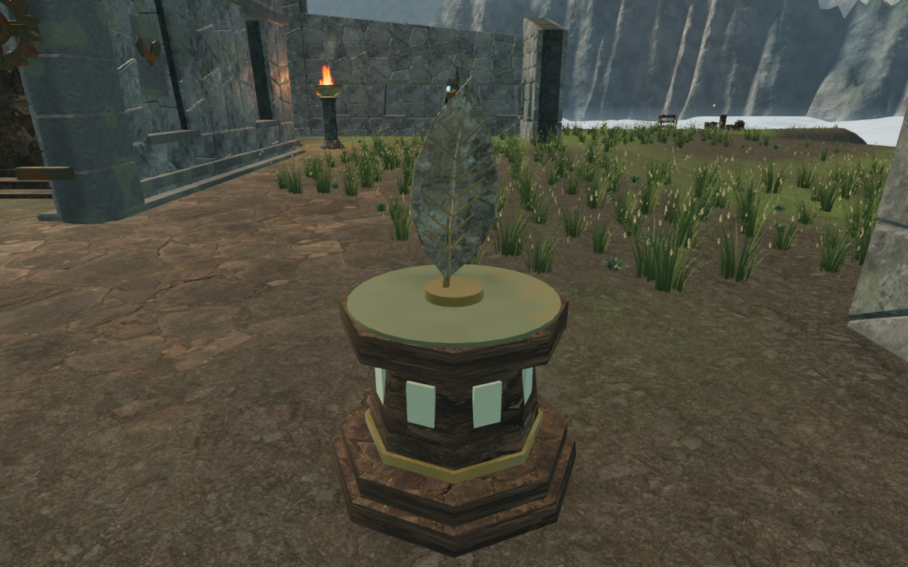

# Relic plate and crown bearings

The new relic stands exposed alternating stone and bronze wedges across their
top plates. Their stone crowns also floated 4.25 cm above the neck collars.
The repair separates the visible top faces and extends each crown into its
support. Artifact sockets, pickup locations, requirements and saved state stay
at their existing positions.

The pair uses the same assigned player position, camera, High quality and
unmodified material. These are close inspection views in the actual jungle
world, rather than earned chapter completions. Historical images in the
[original relic milestone](chapter-relics.md) remain its publication-time
evidence.

## Cause and construction

On the preceding published source, the bronze plate and stone crown both ended
at the same height: 1.169999957 m in the flat diagnostic fixture. They competed
for the same depth samples. Twenty reviewed jungle/sky views, in High and Low,
retained the defect with the original material, with its fine normal variation
removed, and with plain standard, diffuse and normal diagnostic materials.
The cap triangle normals agreed with their faces. The material experiments
and coincident geometry identify depth fighting as the cause.

The bronze plate remains 25 mm thick, with its exposed face and artifact seat
at their original height. Masonry ends immediately below the plate. Its thicker
170 mm crown reaches down into the neck and upper bronze collar, closing the
unsupported join. The stand's support height now follows the plate in
the centre and the 25 mm lower exposed stone rim. The stand's body footprint
and the artifact's separate unlock/collection bounds are retained.

This available-artifact view also uses assigned progress and an inspection
observer. The repair reuses the existing original geometry, credited masonry
maps and worn bronze shader; it adds no external asset or dependency. Positioned
environmental sounds and the themed scores retain their existing implementation.

## Verification

All **18 targeted tests pass**: four relic regressions and fourteen related
field-solid/courtyard specifications. The new regression checks the actual
rendered geometry on each chapter's terrain. It covers 256 bronze/masonry ray
pairs, 264 rays through the crown join and sixteen physical support points on
the plate and exposed rim. The previously published geometry has eight missing
join intersections in the diagnostic sweep and zero separation between its
exposed cap faces. The largest complete relic remains **7,280 triangles**.

The production build passes with the existing large-chunk advisory. The two
changed source/test files pass formatting. The preceding milestone's 735-test
campaign check remains historical evidence; this local repair does not claim
that the whole suite was rerun.

All **68 updated High/Low observer captures** are reviewed: 64 chapter views
covering locked, available, oblique and collected states, plus four matching
jungle/sky close views. Recorded shaders link, camera observers remain clear,
quality flags match their requested settings, and neither completed run reports
browser errors or console warnings.

Four native production cases pass against the rebuilt JavaScript/CSS bundles:
keyboard at 1280 × 800 in High and touch at 540 × 900 in Low, followed by older
completion records in each input mode. The normal cases load the previously
earned final sky approach, collect the Feather of Stone, close the completion
panel, walk away, pause, reload and resume. Walking measures **2.700 m and
2.100 m**. The whole saved store matches across reload apart from `lastPlayed`,
and resumed feet remain within 5 cm of their saved position and floor height.

The compatibility cases remove only the relic ID from completed records.
Repeated Use cannot award that relic again or open a completion panel. The
missing ID stays missing, completion remains true, and reload preserves the
entire saved store apart from `lastPlayed`. These runs retain native guardians
and station hazards; all four end with actual health 100.

All **16 production captures** are reviewed. There is no development hook,
horizontal compact-viewport overflow, failed asset, JavaScript error or console
warning in the completed run. Its loaded bundles match the current build.
An initial attempt encountered a terminated preview server before entering the
game; the final run follows a confirmed server restart. These are functional
checks rather than loading-time or frame-rate benchmarks.

## Remaining review

This closes the reproduced relic-cap depth fighting and unsupported crown join.
It does not finish the eight-chapter audit. Repeated and sparse courts, broad
terrain banks, other chamber interiors, custom carried parts and crowded wind
approaches remain under review. These captures and functional checks do not
establish consumer-device performance or subjective sound/music quality.
