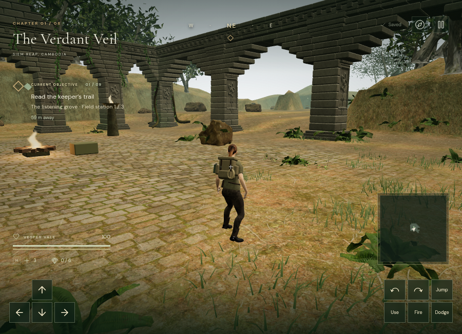

# Vegetation and grass rendering workload

## Grass revision

Grass previously selected entire 32 m patches using player distance. Its vertex shader collapsed blades outside the camera's fade radius, but those invisible clusters still submitted their full geometry. `src/groundcover.js` now selects individual clusters by horizontal camera distance, matching the shader. Nearby blades retain their geometry, positions, colors, and wind coordinates. The lower tiers retain a stable subset of blades with modestly wider profiles; this reduces distant density and is an approximation, not identical distant coverage.

| Cluster | Near triangles | Middle triangles | Far triangles |
| --- | ---: | ---: | ---: |
| Jungle | 180 | 60 | 24 |
| Water ruins / cloud city | 108 | 36 | 18 |

Near / middle / outer thresholds are 24 / 48 / 85 m on High, 18 / 36 / 65 m on Medium, and 12 / 24 / 38 m on Performance. The existing height fade covers the last 16 m. Tier changes use 300 ms complementary dither and 0.75 m hysteresis. Empty patches beyond range skip individual updates; previously visible patches finish their fade before skipping. Per-instance colors now follow matrix packing across all tiers. The contact-occlusion pass excludes these animated blades because its override material cannot reproduce their wind, fading, or coverage.

At a fixed 900 × 650 jungle spawn camera, Performance quality, pixel ratio 1, a controlled comparison reconstructed the old grass in the same paused scene:

| Submitted work | Previous grass | Current grass |
| --- | ---: | ---: |
| Grass triangles | 196,560 | 22,452 |
| Whole-scene triangles | 859,242 | 685,134 |
| Whole-scene draw calls | 229 | 229 |

That is **88.6% less grass geometry and 20.3% less total geometry** in this view. The unchanged draw count and fixed non-grass geometry isolate the comparison. All 25,117 deterministic jungle plant placements remain in the world; the active tiers held 40 near, 196 middle, and 432 far clusters before view-frustum rejection. The camera position was `[52.2936455452, 8.8719855822, 73.7063544548]`, quaternion `[-0.0866015797, -0.3809984795, -0.0358715488, 0.9198116965]`.




A camera offset started 646 tier/range transitions, which settled after the fade interval. An update-only sample averaged 0.22 ms per grass update over 120 calls, with 170 of 183 patches skipping individual work after the camera exercise. These are CPU diagnostics, not frame-rate measurements.

The water and sky chapters rendered on Medium, then switching to the desert cleared grass state. A High jungle view rendered 1,912,476 triangles across 478 calls, with 19 grass draws and none in the contact override. These selected views reported no application shader errors. The first temporary comparison harness imported a second Three.js module and produced a duplicate-module warning; the checked-in helper reuses existing mesh constructors and avoids that extra import.

Three new tests cover geometry bounds, stable random consumption, color retention during packing/crossfades, camera-based culling, quality changes, station clearance, distant-patch skipping, returning after culling, and state clearing. The full suite passes 104 tests; targeted checks and the release build also pass. The existing Three.js chunk-size advisory remains.

The release build accepted native keyboard movement from `(56, 70)` to `(57.0606601718, 68.9393398282)` and restored the exact saved position and elapsed time after pause/reload. It offered Continue expedition and had no development hook. The intro click completed but its automation wait timed out; observation confirmed the game was active, and the subsequent movement check succeeded at a reduced 640 × 420 viewport. The production tab reported no console warnings or errors. Development and preview test saves were cleared afterward and both restored the default High quality. This smoke check verifies input and persistence, not supported-device performance.

### Performance limits

The automation browser reports ANGLE/SwiftShader. Initial shader preparation took about 2.5 seconds; later JavaScript render submissions were often only milliseconds, but synchronous pixel readback exposed multi-second completion waits. Samples varied substantially with system load, and subsequent grass measurements did not establish a frame-rate improvement. These figures must not be reported as supported hardware FPS.

An isolated headless Chrome probe followed the [Chromium GPU guidance](https://chromium.googlesource.com/chromium/src/+/HEAD/docs/gpu/using-gpu-hardware-in-headless-chrome.md) using GPU/Vulkan flags. It selected Mesa llvmpipe software rendering and did not expose WebGL 2. Hardware-accelerated consumer-device benchmarking remains open; the probe does not establish a limitation of the shipped game on those devices.

To repeat the controlled geometry comparison, pause a development expedition, select Performance quality, and run:

```js
(await import('/scripts/profile-render-browser.js')).compareGroundCover(__vesper.game)
```

The helper restores visibility and disposes temporary geometry even if the baseline render fails. It reports submissions, not timing, and is excluded from the production bundle.

## Earlier tree and shrub revision

The jungle profile identified shrubs as the largest geometry contributor in a low-quality spawn view. Five visible shrub batches alone submitted approximately 1.51 million triangles. Each instance used the same 21,598-triangle mesh, and patch-level visibility could retain plants well beyond their intended draw distance.

## Changes

`src/vegetation.js` now builds distance tiers for individual trees and plants. `src/instance-lod.js` packs each selected tier into instanced draws and omits individual instances beyond range. Near plants retain their original geometry. Shrubs have three tiers, ferns two, and trees three; rocks retain their existing mesh with per-instance range culling.

| Asset | Existing detailed tiers | New distant tier |
| --- | ---: | ---: |
| Shrub 01 | 21,598 near; 5,394 middle | 1,310 |
| Fern 02, four variants combined | 4,360 near | 2,428 |
| Island Tree 01 | 114,941 near; 15,646 middle | 3,075 |
| Island Tree 02 | 56,896 near; 8,564 middle | 1,724 |
| Fir Tree 01, three specimens combined | 363,598 near; 46,025 middle | 7,566 |

`scripts/build-vegetation-lods.mjs` derives the new files from the existing optimized local GLBs. It samples complete disconnected foliage components, retains their texture coordinates and normals, and expands their area to compensate for lower sample density. Trunks and branches use geometric simplification. This approximation changes individual distant leaf shapes; it is not a claim of production-quality foliage or exact silhouette preservation.

High tree thresholds are 20 / 60 / 175 m, Medium 12 / 44 / 155 m, and Low 0 / 28 / 115 m. Hysteresis prevents chatter around each threshold. Changing tiers or crossing the draw limit uses a 300 ms complementary screen-space dither. A reversal can settle back to its original tier without exceeding the instance buffer. Draws share immutable source vertex buffers while owning separate matrix and coverage buffers. Depth materials apply the same coverage and canopy wind as the visible material.

Tree placements remain deterministic. Nature patches retain their previous grouping order so random rotations and scales remain assigned to the same props.

## Measurements and limits

At a 900 × 650 viewport and pixel ratio 1, the same jungle spawn and camera submitted **2,761,934 triangles before** and **857,638 after**, approximately **69% fewer**. These low-quality measurements include the initial rendering work reported by Three.js. The final scene was visually inspected against the earlier screenshot.

A selected spawn view, switched from Low to High, submitted approximately 4.61 million triangles across 715 calls with contact occlusion and shadows enabled. Moving the observer 24 m initiated 40 tree transitions; after the fade interval every transition settled. The temporary overlap increased submitted geometry during the fade, as expected.

All eight chapters rendered after the change. The jungle was inspected in Low and High; the other seven used Medium. Their selected spawn submissions ranged from approximately 0.41 million to 1.13 million triangles. These checks and a live profiler invocation produced no console warnings or errors. The profiler restored the renderer's original method after reporting.

The browser reports ANGLE/SwiftShader software rendering. CPU submission timings, shader compilation time, and these geometry counts are not measurements of consumer-GPU frame rate. Supported-device benchmarking remains open. No comparison is made against earlier High screenshots taken at different locations or with different vegetation construction settings.

## Reproduction

```sh
node scripts/build-vegetation-lods.mjs
node --test tests/instance-lod.test.js tests/habitat.test.js
```

With an expedition loaded in the development browser, run:

```js
(await import('/scripts/profile-render-browser.js')).profileRender(__vesper.game)
```

The helper restores the renderer method after inspection. Its output identifies the current chapter, quality, viewport, renderer, submission totals, tree tier counts, and largest contributors. The development hook and helper are not part of the production build.

Automated coverage checks placement preservation within draw range, quality changes, hysteresis, interrupted fades, complementary coverage, independent instance buffers, shader support in shadow materials, distant-asset budgets, finite attributes, valid indices, and source node alignment. The full suite passes 84 tests.
