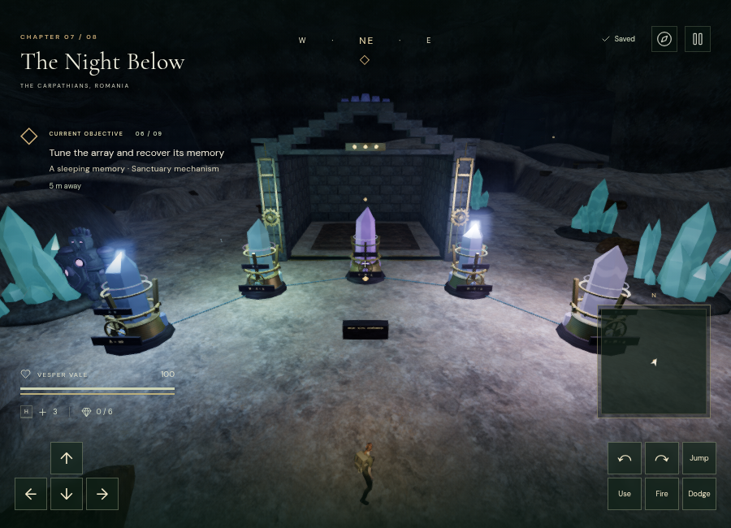
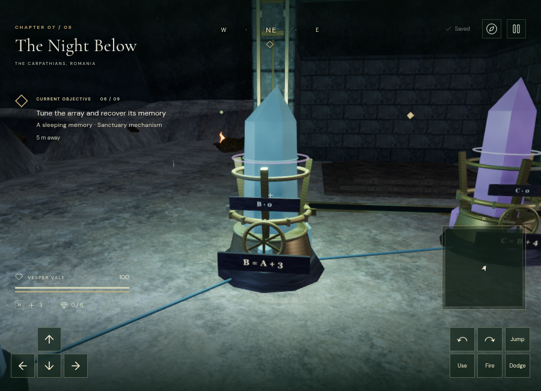
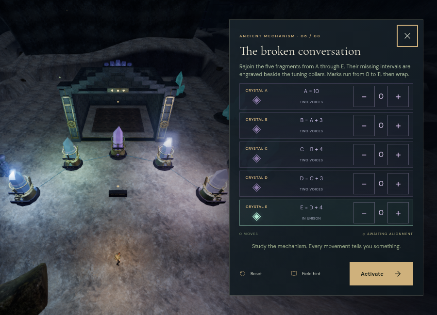

# Resonance arrays

The crystal chapter now places its eight main mechanisms in physical forecourts. Thirty-three mounted crystals have turning collars, handwheels, paired tones and visible wave rings. Each array uses a different arrangement and a set of relational inscriptions. A completed array reveals a memory of the missing expedition and adds it to the field journal. These replace the former three-selector, arithmetic-offset dialogs.

## Eight remembered voices

Marks count from 0 to 11 and wrap in either direction. Letters identify physical crystals. Every clue either fixes a first voice or refers to an earlier named crystal, so the inscriptions have a single grounded solution. Players can infer the marks visually or listen for the stored voice beside each current tuning.

| Array | Layout | Main relationship | Final marks, A onward | Shortest initial tuning |
| --- | --- | --- | --- | --- |
| The three guide lights | Close triangle | Repeat the first voice | 3 / 3 / 3 | 9 turns |
| The descending echo | Broad arc | Descend two marks, then five | 7 / 5 / 0 | 10 |
| The mirrored archive | Opposed banks | Opposite voices add to twelve | 2 / 7 / 10 / 5 | 14 |
| The ascending chamber | Rising diagonal | Advance three at each stone | 1 / 4 / 7 / 10 | 12 |
| The violet counterpoint | Diamond | Offset and reflected voices | 8 / 3 / 4 / 9 | 14 |
| The broken conversation | Five-stone crescent | Rejoin four engraved intervals | 10 / 1 / 5 / 8 / 0 | 12 |
| The heart's two voices | Paired banks and heart stone | Match each bank and transpose the heart | 4 / 4 / 9 / 9 / 2 | 16 |
| The prism's remembered path | Open spiral | Combine intervals with reflected marks | 3 / 7 / 10 / 4 / 1 | 15 |

E or Use advances a collar. Shift+E lowers it, retaining the direction across repeated presses while Shift stays held. The optional focused controls have plus/minus buttons. A command validates the current stage, field stations, first counterweight chamber, actual reach and player height before changing anything. Reset restores the initial marks. Hints recompute a shortest route from the current state.

Every turn commits its mark array, move count and last crystal to local storage. Save normalization rejects malformed marks, rebuilds authored clues and targets, and keeps resonance state only in the crystal chapter. Existing completed stages retain completion and display their target marks. Recovered memories derive from completed stages and remain available in the journal without a second competing save counter.

## Machinery, lighting and camera

The 33 quartz bodies sit in patinated bronze mounts, with twelve marked collar teeth, turning handwheels and engraved relation plates. Thin floor connections trace the named dependencies. Two luminous rings drift apart when a crystal is untuned and settle together at unison. Geometry batching combines each collar's static teeth while retaining its rotating parent and hand anchors.

Collision bodies and captured camera bounds protect each device. New control positions preserve the 36 existing natural mineral clusters and the chapter's earlier feature approaches. Nearby tuning stones join the existing four-slot cavern light selection; no additional point-light slots were added.

The focused view keeps its camera inside the cavern. It uses a widened, shifted inspection lens on desktop and an overhead view in portrait, then restores the normal 58-degree follow lens on exit. The panel was checked at 900 × 650, 390 × 844 and 844 × 390. Its actions fit without scrolling, and portrait controls retain 44-pixel buttons. In short landscape, compact controls and the alignment color remain visible; the full explanation is also available at the record tablet.

[Portrait view](images/resonance-focus-portrait.png) · [Short landscape view](images/resonance-focus-landscape.png)

## Distance and tuning audio

Each crystal has a current voice and a reference voice at its visible front, sharing the soundscape's existing 12-voice budget. The twelve marks map to 196–218 Hz in 2 Hz steps. A quiet harmonic buffer supplies the voices; playback-rate changes glide through the actual spatial update path. An aligned crystal releases its reference voice so equal-frequency loops cannot cancel each other. Locked arrays remain silent; completed crystals retain only a restrained single voice.

Both voices use HRTF panning, linear attenuation from 1.2 to 16 world meters, and obstruction filtering. The crystal chapter retains its original score and objective harmony. Near a tuning control, its melody leaves space for the comparison tones; the sustained pad and bass continue. The visual inscriptions, collar marks and rings support completing every array with sound muted.

The actual Web Audio voice path was measured in Chromium `OfflineAudioContext`, at 48 kHz stereo with a 0.18 measurement bus gain. Four-second paired-tone renders used the same buffer and playback offsets at each distance. RMS was measured over seconds 1–3.

| Distance | Paired-tone RMS | Peak |
| --- | --- | --- |
| 1.2 m | 0.0059149616 | 0.0122431805 |
| 5 m | 0.0043962551 | 0.0090996614 |
| 8.6 m, midpoint | 0.0029574806 | 0.0061215898 |
| 13 m | 0.0011989787 | 0.0024817258 |
| 17 m, outside range | 0 | 0 |

The midpoint ratio was 0.49999996. A separate render suspended at 1.5 seconds, changed the source through `Soundscape.update()`, and resumed. Its measured fundamental changed from 196.000003 Hz to 218.000006 Hz while retaining one voice. A live repeated Shift+E command retained 11 selected environmental voices and the `tuning` score task. These signal checks do not establish subjective loudness, headphone quality or the final listening mix.

## Verification and remaining limits

Ten new tests cover distinct grounded clues and layouts, minimal reversible solutions, invalid commands, save normalization, all physical bodies and approaches, camera obstruction, field/counterweight/reach gates, live source rates, animated collars, muted aligned references, paused presentation, exact restored marks, the four-light budget, focus clearance and normal-lens restoration, chapter cleanup, and the score's tuning arrangement.

Browser inspection found all 41 controls clear at nine nearby samples, all 66 sound fronts unobstructed from their controls, all hand anchors retained and all shaders linked. Assisted routes using actual character physics reached all 41 successive wheel/tablet destinations. Earlier feature approaches remained clear, and all 36 natural mineral clusters remained present.

An assisted completion supplied the field prerequisites and a valid counterweight arrangement, then executed all 102 shortest-route turns through the world interaction handler. The real record buttons activated all eight arrays, displayed each memory, and advanced to the relic stage. The journal contained all eight recovered memories. These are integration checks with assisted positioning, not an unassisted playthrough or evidence of one-hour chapter duration.

Trusted Shift and E events turned a crystal downward twice, preserving mark 10, two moves and last crystal A. Its collar moved through the intermediate position, the current voice changed to 216 Hz, and the reference retained 210 Hz. Focused controls rejected an incorrect activation, provided a current-state hint, saved a downward turn and reset the array.

The full suite passed all 229 tests in 90.93 seconds. After the final inscription enlargement and backing plates, all ten resonance and eleven hydraulic tests passed again. The final release build succeeded with the existing Three.js chunk-size advisory. Its assets are `index-D5tDwg0Q.js`, `game-BwnTR1a-.js` and `three-B7kWB43b.js`.

The final High production build accepted trusted Shift+E and W input. Its saved second-array marks were `7 / 0 / 0`, with five moves and last crystal A. Movement changed the position to `(349.4007065052656, 69.77089145882717)`. Pausing saved stage 1, all three field IDs and 540.0043999999762 accumulated active seconds. A required texture was held until the tab lost focus, so reloading finished paused. Position, time, stage, field IDs and both saved resonance records then matched exactly. Returning to the launcher journal retained the first recovered memory. The build contained no development hook and produced no failed asset requests or console warnings/errors. Temporary development and preview saves were cleared afterward, with High quality restored.

The inspected 900 × 650 High view submitted 1,062 calls and 1,114,189 triangles across its passes. These observations used ANGLE/SwiftShader software rendering and do not establish a supported consumer-GPU frame rate.

The game still needs blind pacing playtests, more encounter and traversal development, broader browser/device coverage and consumer-GPU benchmarks. These procedural arrays and the existing cave environment do not establish AAA visual quality.
