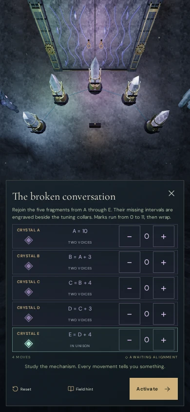
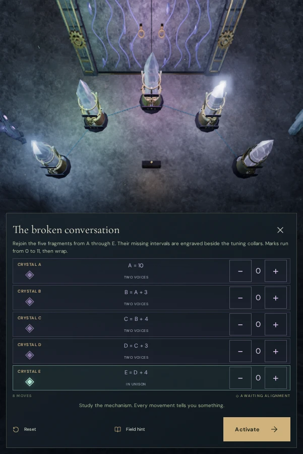
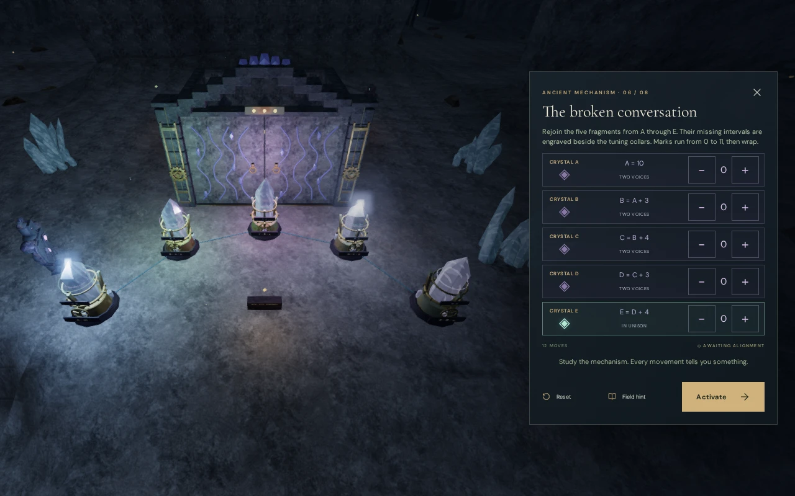
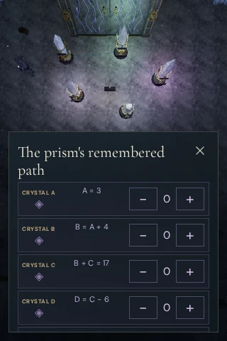

# Complete crystal-array inspection views

The resonance inspection camera now fits the whole array into the space left
by its controls. Crystal tips, bases, tuning wheels and inscriptions retain
at least a 16 px screen margin. The earlier view could keep every node centre
on screen while clipping the outer crystal in
[The broken conversation](images/regional-banks/portrait-array.webp).

The lens uses the built array's bounds and the actual panel rectangle. Phone
and portrait-tablet controls sit below the scene; wider views keep them beside
it. This also removes the narrow scene strip just above the old 600 px phone
breakpoint. Long titles reserve space for the close button. Small screens keep
an independently scrolling control panel.

The inspection eye retains its fitted clearance below the cavern roof. The
normal camera clears the inspection lens shift before resuming movement or
another camera mode.

## Touch interaction repair

Production verification found a separate input defect. At the second array,
tapping Use opened the inscription, then the same gesture's generated click
landed on the newly displayed Reset button. A restored mark of 1 became 0 before
the player entered the tuning view.

Touch controls now consume the generated click belonging to a pointer whose
press they already handled. The action still begins on press, preserving held
controls. A separate tap remains available for intentional actions, including
Reset. The reproduced case now keeps its restored mark through both the
inscription and the focused controls.

## Verification

- The camera regression checks all eight arrays in eleven viewport sizes, from
  320×480 to 1280×800. It projects actual geometry at three collar poses with
  maximum wave-ring expansion, checks the roof and actual near plane, and
  confirms the exact normal follow projection after leaving inspection.
- The browser review covers all eight arrays in eight layouts: 320×480,
  320×568, 390×844, 600×900, 601×900, 768×1024, 1280×800 and 844×390.
  All **64 views** fit their actual panels: **2,159,632 projected vertices**
  remain inside the available area. No title overlaps its close button, and
  no panel has horizontal overflow. All 128 raise/lower commands save and
  reverse correctly; each view returns to the normal lens. Browser errors
  and warnings are empty.
- The reusable [resonance inspection helper](../scripts/verify-resonance-browser.js)
  retains pixel extents, panel bounds, vertex counts and roof clearance.

The final automated suite passes **643/643 tests**, and the production build
passes. Six production cases cover arrays 1, 5, 6 and 7 with keyboard/High and
touch/Low input in desktop, landscape-phone, portrait-phone and tablet layouts.
They perform **93 tuning turns, six intentional resets and six activations**.
All **12 reloads** preserve the complete save except play timestamps. Opening
an inscription and its diagram preserves the saved tuning in every case.
The six return walks cover 3.00–5.40 m each and retain health 100.

A separate production run resizes an open five-crystal view six times, between
390×844, 844×390, 768×1024, 1280×800 and 320×480. Twelve native tuning commands
remain reversible; position and health remain fixed. The 24 production-case
captures and six resize captures were reviewed. Both production runs have no
browser errors or warnings; the main cases check the exact current build assets
and confirm that development hooks are absent.

These checks use disposable progress to isolate the inspection, tuning and
persistence behavior. They do not establish a full chapter playthrough or a
subjective audio assessment. Runtime geometry assets, textures and audio are
unchanged; their existing attribution remains in place.

VA-20 is resolved by this framing repair. The broader
[visual audit](visual-audit.md) remains open for court terraces, jungle tree
placement, repeated court forms and sparse surroundings. The production review
also records VA-22: a transient chapter-narration toast can cover part of the
array or its controls shortly after a reload. The
[small-phone capture](images/resonance-framing/narration-overlap.webp) preserves
that unresolved overlay issue; it is separate from the repaired viewport clipping.
