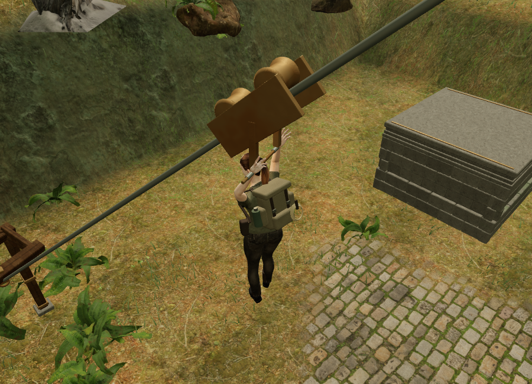
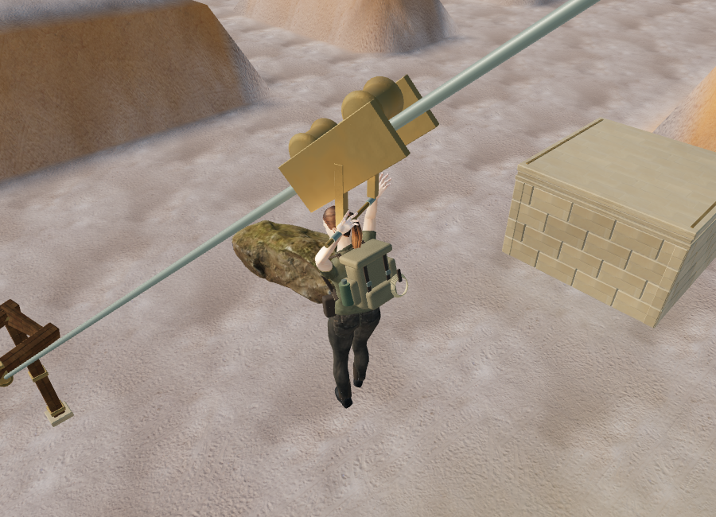

# Return cable terminals and carriage

The subsequent [hand-grip milestone](hand-grips.md) adds finger articulation,
moves the handle struts clear of the hands, and completes all eight chapters'
browser route checks and the audio measurements described as pending below.
The remaining sections record the original return-cable milestone's evidence.

All 22 elevated routes now have departure and arrival frames, terrain-fitted
footplates, crossheads, diagonal stays and bronze cable anchors. A two-sheave
carriage carries a hinged handle with separate left and right grips. Its roller
frame follows the cable slope while the handle hangs vertically. The wheels
rotate with travel; after dismounting, the departure winch turns while the
carriage returns to its starting point over 3.2 simulation seconds.

The 44 terminals use the chapter's existing stone, timber or iron and weathered
bronze materials. Fixed parts and the moving assemblies are batched by material.
This is original code-built geometry using existing local assets. No additional
downloads, external asset licenses or attribution changes are required.

The physical ride keeps its existing route, approach and duration. Completing
the summit's field action unlocks the carriage; the terminal frames remain
visible before that action. A second ride becomes available after the empty
carriage returns. A save made in transit retains the secure summit checkpoint,
so reloading places the explorer safely on the summit with the carriage ready.

The carriage has a moving friction emitter, with linear distance attenuation
from 1.2 to 22 metres. The return winch has a separate fixed mechanical emitter,
fading from 1.2 to 18 metres. Both use the existing HRTF positioning, obstruction
filtering and shared twelve-voice limit. Motion controls their activity; resting
or pausing releases the mechanical voices. Traversal continues to select the
chapter score's quiet climbing arrangement.

## Verification scope

The full suite passed all 284 tests, and the production build passed with the
existing large Three.js chunk advisory. New tests check all 44 terminals,
grounded posts, visible locked frames, finite geometry and 41 body-clearance
probes along each cable. They also cover motion, return, pause silence, source
positions, removal of old chapter references, unlocking, repeat use and secure
save recovery. Existing full climbing-route tests remain in place.

The delivered character's wrist targets were checked at three positions on
each of the 22 cable slopes and headings, over 24 settling frames. All 3,168
hand-joint comparisons stayed within the 1.2 cm test tolerance. This checks wrist
placement; the existing finger pose does not close into an articulated grip.

Assisted full-world browser input completed 16 routes in six chapters: jungle
(1), desert (2), snow (5), flooded palace (2), volcanic forge (1) and cloud city
(5). These checks use the delivered collision and traversal simulation, including
mantles, jumps, rope crossings, summit restoration and the return ride. They
begin at each route's entry and supply known field solutions. They do not measure
unassisted difficulty or playthrough time.

All six Performance-quality rider views linked their shaders. Their recorded
views used 65–117 draw calls and approximately 140,000–534,000 triangles. Both
wrist joints met their handle targets to below 1 mm in those browser poses.
The final jungle and desert views below show the delivered geometry and its
remaining finger-pose limitation.

An early harness race read the previous chapter before the requested chapter
finished loading. That invalid result was discarded; the corrected harness
waited for the selected chapter, completed startup and loaded character. The
six completed checks above reported no console warnings/errors or failed assets.
A later development reload interrupted the cavern check while the inspection
helper was being edited.

The final cavern/observatory retry and the native High production check did not
return completed results before the browser service stopped responding, including
to a tab-list request. Both local web servers continued returning HTTP 200. The
release had reached its first-view preparation with the seeded summit prompt,
but this does **not** establish a successful native ride or release reload.
Final High screenshots, isolated audio amplitude measurements and instrumented
chapter resource disposal also remain unverified for this milestone. The
`inspectCableSound` helper is provided for a future browser measurement; its
offline measurement routine was not executed in this run. The all-chapter
geometry, route, persistence and source lifecycle unit tests passed as stated
above. Browser rendering here uses software acceleration and does not establish
consumer-device performance.

AAA graphics, consumer-device frame rates, subjective listening quality and
approximately hour-long chapter pacing remain unverified or unmet as recorded
in the [production status](production-status.md).
