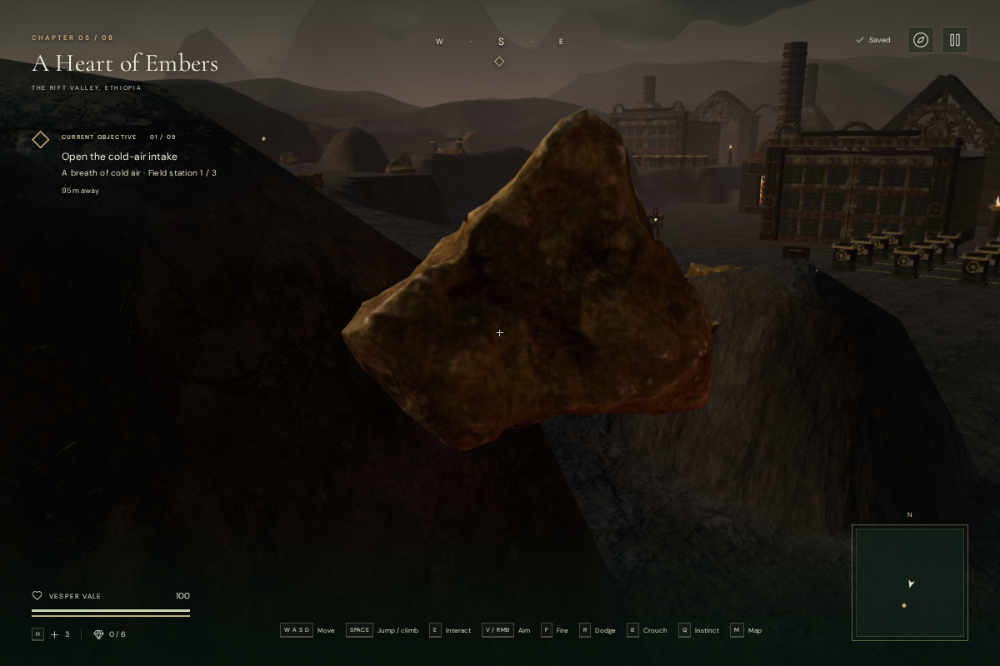
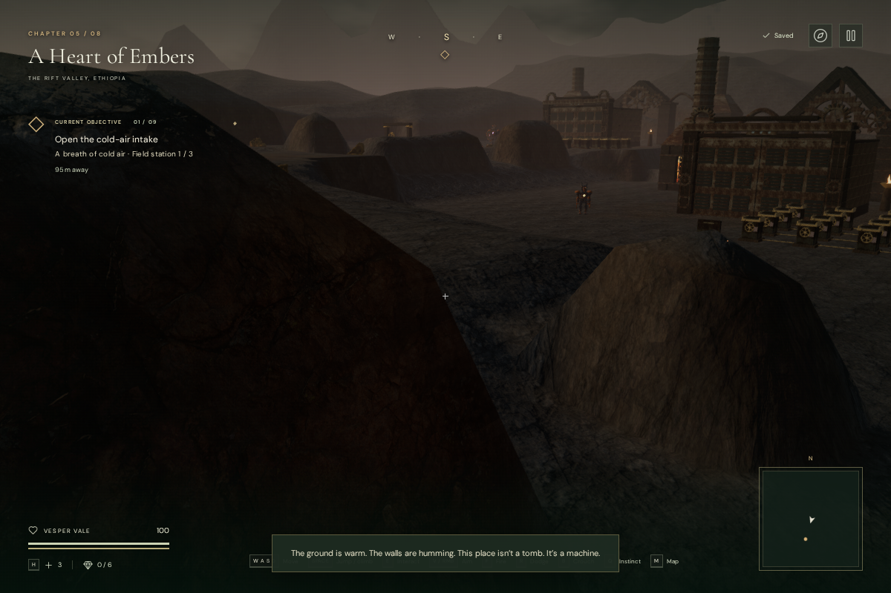
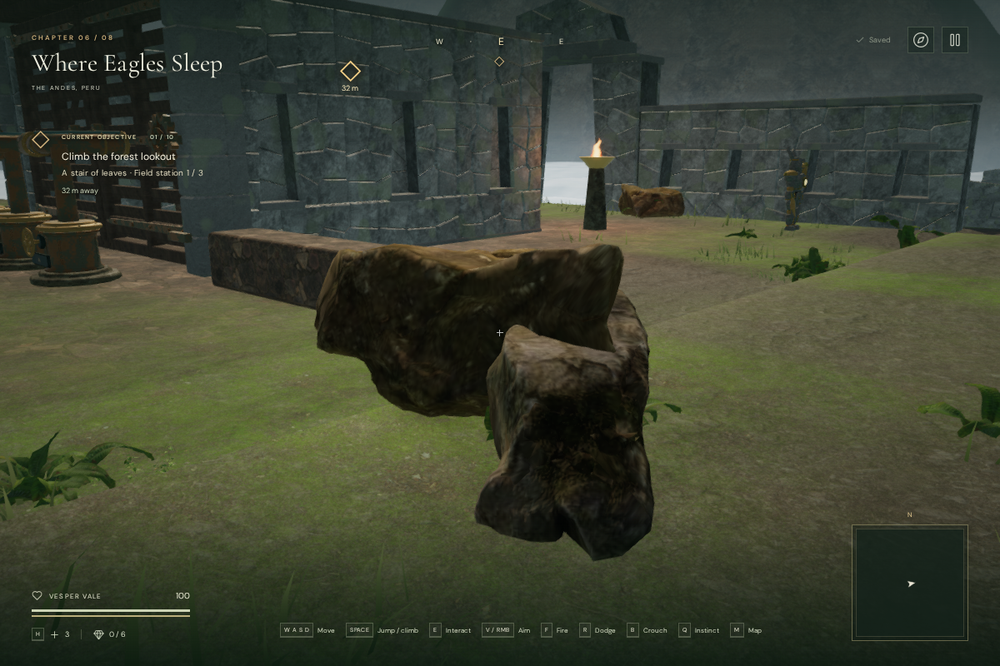
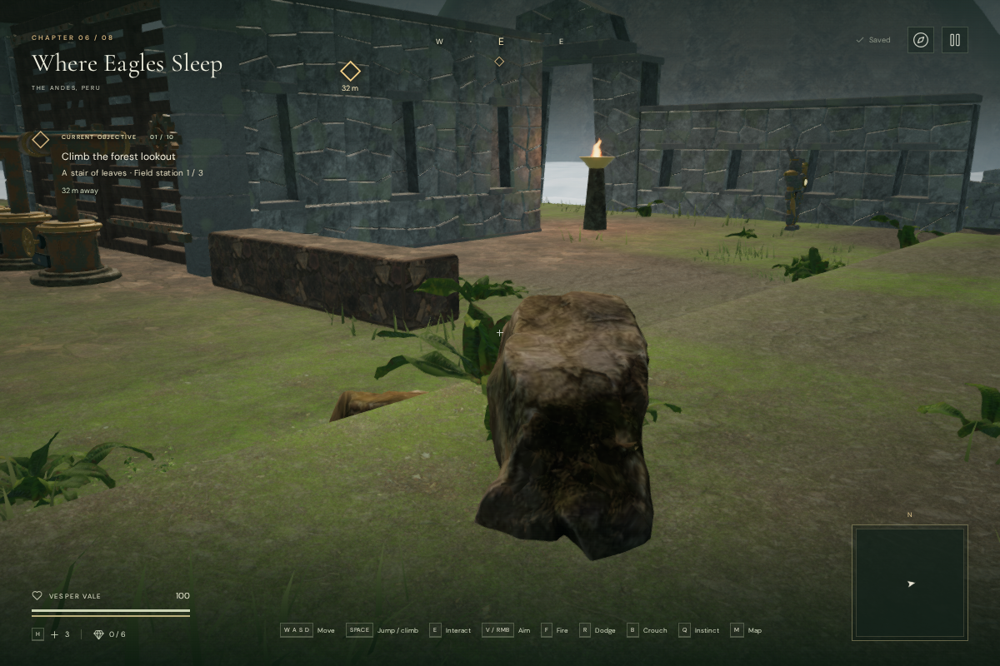

# Scattered rock grounding

Scattered rocks in the jungle, mountain, coast, volcanic, cloud-city, crystal and
eclipse chapters previously used the terrain height at their origin. The same
placement could look acceptable on level ground and leave a large part of the
scan hanging over a nearby bank. Independent underside probes found edge gaps
up to 4.92 m across those seven chapters.

The rocks now use the desert's existing underside-fitting method. Each of the six
delivered scan variants is sampled once, then its rotated and scaled footprint is
fitted into the terrain. The seven updated chapters account for both the movement
height field and the triangles of the rendered ground; this avoids suspended edges
at sharp coastal corners. Candidates spanning a sharp height change, or leaving
too little visible rock after fitting, are rejected. The footprint also reserves
space around objectives, guardian starts, the player start, collision structures,
water and map edges. Accepted rocks keep their original horizontal positions,
rotations, scales, textures and shape; only their vertical placement changes.

The desert continues to use its own scatter layout and materials through the
shared fitting functions. No model or texture files changed. The six moss-rock
scans retain their existing Poly Haven attribution in [asset credits](asset-credits.md).

## Matched views

These assisted 1200 × 800 High-quality cameras inspect the same positions before
and after the change, with the character hidden. The volcanic example shows an
unsupported candidate removed from a sharp bank. The cloud-city example includes
a retained stone fitted lower into its original location.

## Placement and rendering cost

| Chapter    | Original candidates | Fitted rocks | Reserved space | Unsupported |
| ---------- | ------------------: | -----------: | -------------: | ----------: |
| Jungle     |                 350 |          107 |              6 |         237 |
| Mountain   |                 350 |          101 |             13 |         236 |
| Coast      |                 350 |           95 |              0 |         255 |
| Volcano    |                 350 |           94 |             15 |         241 |
| Cloud city |                 253 |          199 |             47 |           7 |
| Crystal    |                 350 |          110 |             11 |         229 |
| Eclipse    |                 350 |          122 |             13 |         215 |

This deliberately reduces rock density on the steepest banks. Empty instance
batches are skipped. Retained rocks use the existing per-instance distance fade,
quality ranges and shadows; the fitting work happens during chapter loading.

At the matched volcanic view, whole-scene High rendering changed from 593 calls
and 640,053 submitted triangles to 565 calls and 532,347 triangles. The cloud-city
view changed from 497 calls and 2,195,016 triangles to 482 calls and 2,149,606
triangles. These are view-specific workload counts, not consumer-GPU frame rates.

## Verification and limits

All 384 automated tests and the production build pass. Four new tests exercise
all six delivered scan shapes, independent world-space underside rays, shallow
slopes and sharp steps, visible terrain triangles, exclusion footprints, unmodified source geometry and
deterministic fitting on all seven affected chapter terrains. The existing desert
asset, layout and resource tests also pass.

The matched browser comparisons retain identical objective positions and obstacle
records in all seven affected chapters. All 828 retained stones keep the exact
horizontal position, rotation and scale from their original instance matrices.
The browser loaded all eight chapters and rendered each selected view in High
and Performance with linked shaders and no console warnings, errors or failed
asset requests. Independent world-space underside rays against the actual terrain
meshes found ground contact for all 1,058 rocks, including the desert’s 230 outcrops.
The largest sampled edge gap in the updated chapters was 0.67 m; curved scan edges
can still overhang locally. The initially missed coastal corner dropped from a
1.51 m gap to 0.37 m after accounting for the rendered triangles.

In the final High-quality production build, native T lit the carried torch and
native E restored a prepared save from 37 to 100 health and from zero to three
medical supplies. Native W then moved Vesper from `(54.2, 56)` to approximately
`(61.3664, 51.4187)`. Pausing and reloading restored the exact position, ground
height, torch, camp checkpoint, all eight chapter records, settings and creation
timestamp, excluding only deliberate `lastPlayed` refreshes. No development hook,
failed asset requests or console warnings/errors were present. The delivered
bundles were `index-B-T9YeHi.js`, `game-DhQPVY18.js` and `three-BO_Srq6n.js`.

The fitting samples a footprint; it does not deform each scanned rock to the
ground. Local lips and curved edges can still overhang. Regional rock materials,
broader environmental composition, AAA visual quality and approximately one hour
of human gameplay per chapter remain work to do. This change does not establish
subjective sound quality or device-performance coverage.
