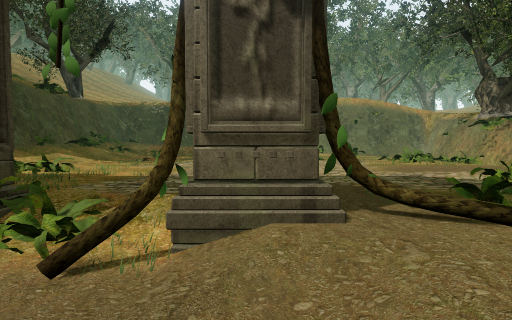
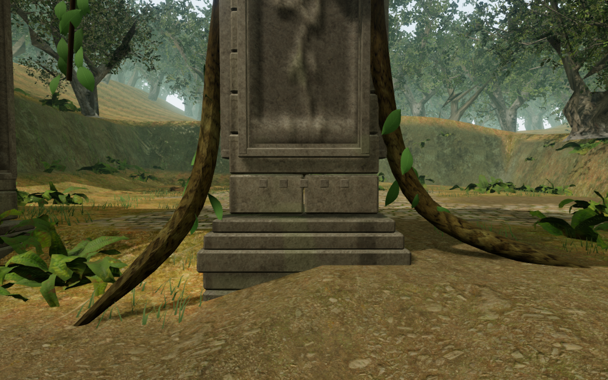
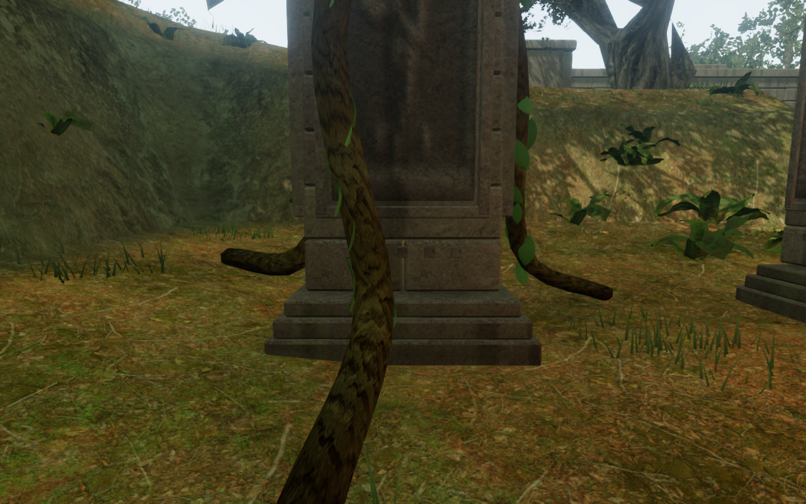
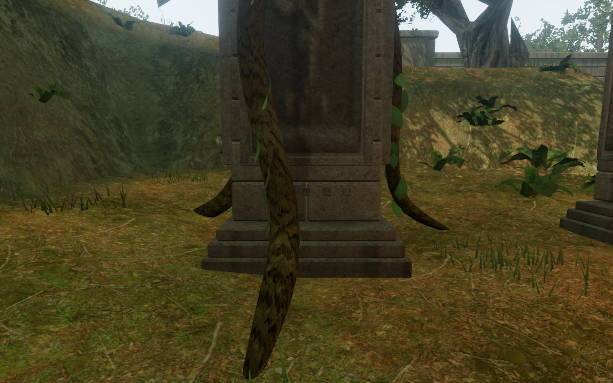

# Roots entering the jungle soil

The 54 large roots climbing the jungle's court piers now taper into the soil.
Their lower ends extend beneath the full terrain footprint, their bends have
rounder geometry, and both ends are closed. Leaves follow the revised curves.
The existing bark material, leaf wind and shared wood batches are retained.

The earlier visual audit described these roots as floating. Measurements against
the rendered terrain refined that diagnosis: every old end ring intersected the
ground along at least one edge, but the exposed part could rise 28 cm above it.
The blunt, partly exposed tube ends made the connection look unfinished. This
repair replaces that visible cut with a tapered entry into the ground.

## Comparison

These are actual High graphics game captures at matching observer positions in
court 1 and court 3. The WebP conversions preserve the source pixels losslessly.

## Construction and verification

The lower control point sits below the lowest terrain-grid vertices touched by
the end's footprint. The radius narrows to a quarter of its full size at that
buried end and grows smoothly along the first part of the root. Geometry uses
32 length segments and 10 radial segments, with closed end faces. Each root has
660 triangles, up from 288, adding 20,088 triangles across the chapter. Wood still
uses one material batch per court. These counts are not frame-rate measurements.

The new tests check closed edges, outward-facing ends, finite nondegenerate faces,
positive volume and the taper on flat and sloping ground. They also build all
nine courts and verify that all 54 buried endpoint rings survive in the merged
wood meshes. The authored upper control points remain fixed.

Browser checks sampled each updated end ring against the actual rendered terrain.
All 54 rings lie entirely below it, with at least 17.3 cm of soil above their
highest vertex relative to the terrain at that vertex. All 22 resulting views
were reviewed: both rooted piers in all nine courts on High, plus Balanced and
Performance views of two selected piers. All shaders linked without browser
errors. These are assisted observer views; they do not establish complete
traversal coverage.

All 602 automated tests passed in 178.27 seconds, and the production build passed
in 4.33 seconds with the existing bundle-size advisory. The production browser
accepted keyboard sprinting near the repaired court 1 pier (2.62 m of travel)
and portrait two-finger movement with crouching (1.24 m). Health remained at 100.
Each paused reload restored the exact saved state apart from its save timestamp,
including position, progress, active time and mix settings. The portrait layout
had no horizontal overflow. These checks used the current built assets without
a development hook and reported no failed requests, browser errors or warnings.
They are local input and persistence checks, not full chapter playthroughs or
new listening tests. This repair changes geometry and attached leaf placement;
it adds no audio assets or sound-source changes.

This addresses VA-08 in the [playable-world visual audit](visual-audit.md). The
broader audit remains open, including waterfall surroundings, mechanism mounts,
repetitive architecture, observatory placement and unreviewed playable areas.
